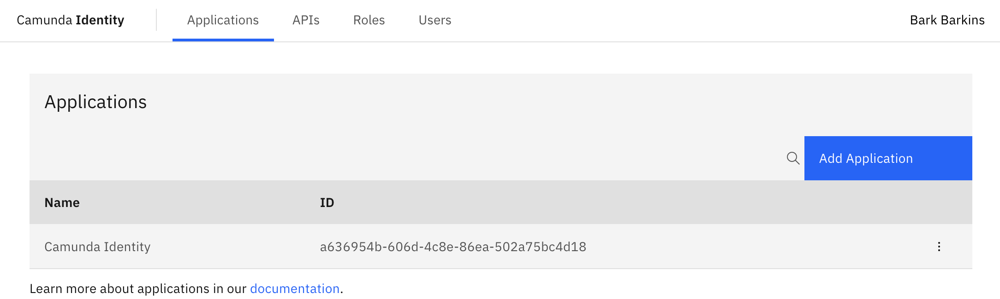

import IdentityLoginImg from './img/identity-login-page.png';

Get started with Identity in Self-Managed by learning how to open and log in to the Identity interface.

:::note
Identity is included in the [Docker-Compose](/versioned_docs/version-8.7/self-managed/setup/deploy/local/docker-compose.md) and [HELM](/versioned_docs/version-8.7/self-managed/setup/install.md) based deployment of Camunda 8 Self-Managed. With the default configuration, Identity uses an included Keycloak container/pod.
:::

## Log in to Identity

Once Identity has successfully started, you can open the **Log in** page and log in to Identity.


If you are running the default configuration, you can access the Identity interface via the following URLs:

- [Docker-Compose](/versioned_docs/version-8.7/self-managed/setup/deploy/local/docker-compose.md): `http://localhost:8084/`
- [HELM](/versioned_docs/version-8.7/self-managed/setup/install.md): Following your [`port-forward` or Ingress configuration](/self-managed/setup/guides/accessing-components-without-ingress.md)

## Default user

In the default configuration, Identity creates a default example user during installation.

You can use this example user account to log in as follows:

```text
Username: demo
Password: demo
```

:::tip Want to create more users?
Identity uses the users managed in Keycloak. To create a user, refer to [Keycloak's documentation on creating a user](https://www.keycloak.org/docs/latest/server_admin/#proc-creating-user_server_administration_guide) for your version of Keycloak.
:::

## Identity home page

You are directed to the home page once you have successfully logged in.



## Next steps

Once you are able to log in to Identity, you can start managing authentication, access, and authorization for your Camunda 8 users, resources, and the Camunda 8 API.

- [Manage users, groups, roles, and applications](application-user-group-role-management/identity-application-user-group-role-management-overview.md)
- [Manage access and permissions](access-management/access-management-overview.md)
- [Manage tenants](managing-tenants.md)

:::note
You can also [configure Identity](configuration/identity-configuration-overview.md) Keycloak and OIDC integration, and learn more about how Identity authentication works.
:::
