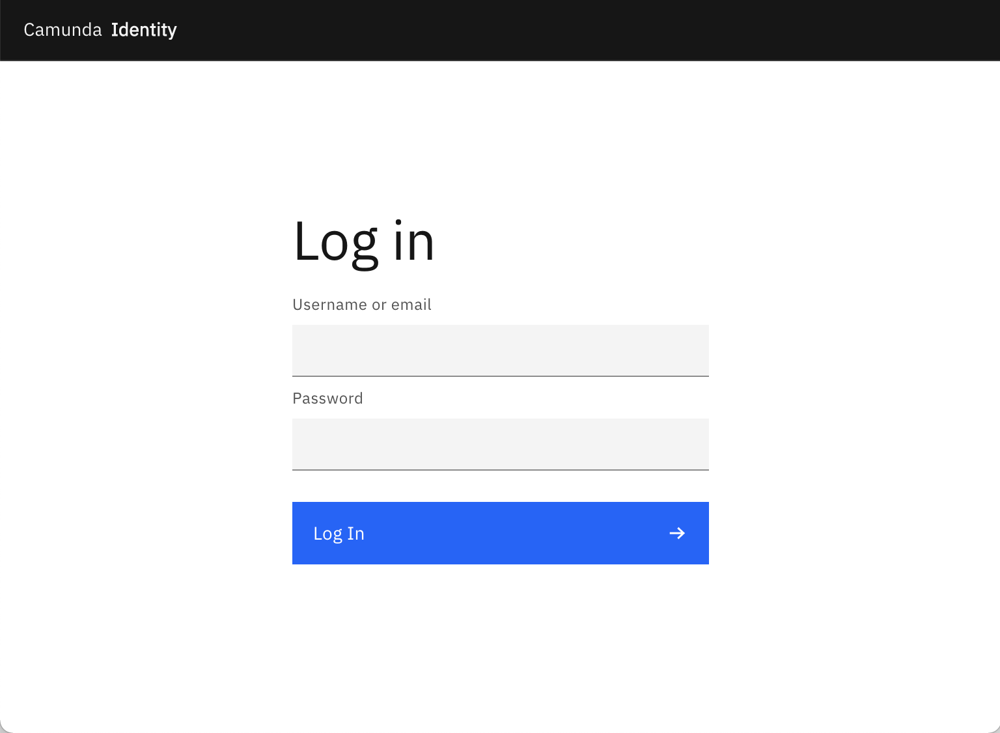

Identity is included in the [Docker-Compose](/versioned_docs/version-8.7/self-managed/setup/deploy/local/docker-compose.md) and [HELM](/versioned_docs/version-8.7/self-managed/setup/install.md) based deployment of Camunda 8 Self-Managed. In these out-of-the-box deployments, Identity is configured to use a packaged Keycloak deployment.

## Accessing the UI

As soon as Identity is started, you can access the login page and log in to the Identity application.



## Default user

The configuration in this guide creates an example user during installation; use this account to log in:

```text
Username: demo
Password: demo
```

:::note Want to create more users?
Identity uses the users managed in Keycloak. To create a user, refer to [Keycloak's documentation on creating a user](https://www.keycloak.org/docs/latest/server_admin/#proc-creating-user_server_administration_guide) for your version of Keycloak.
:::

## Home screen

You are directed to the home page once logged in successfully.


