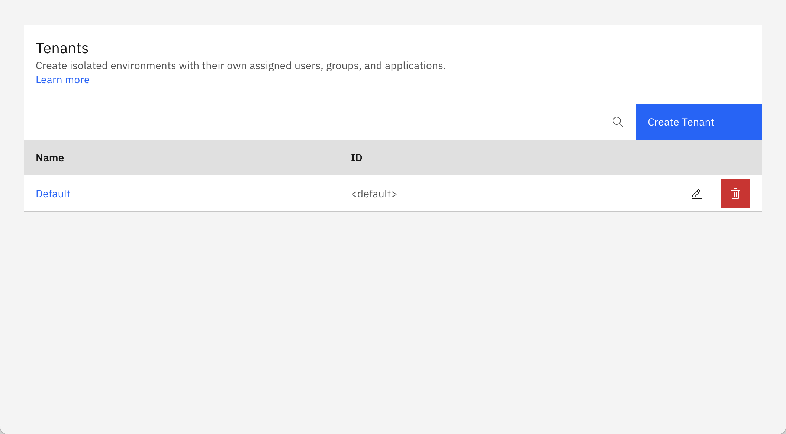
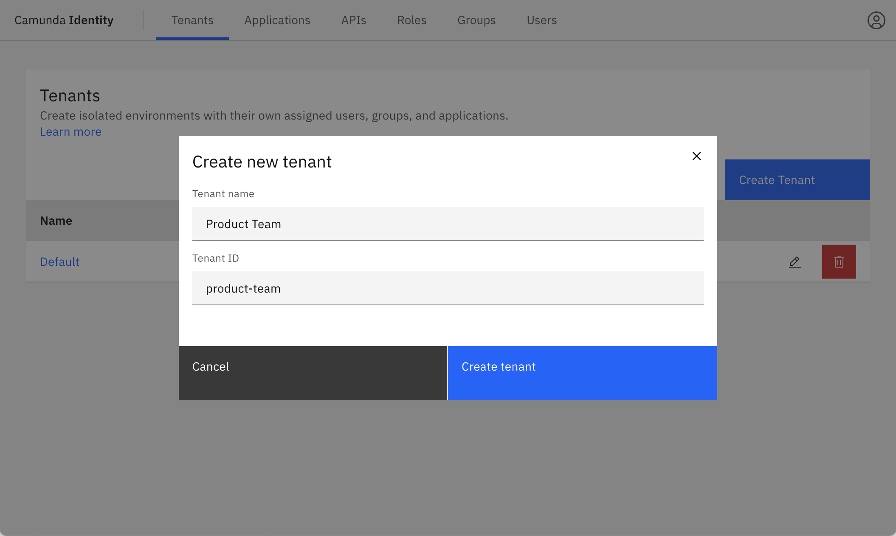
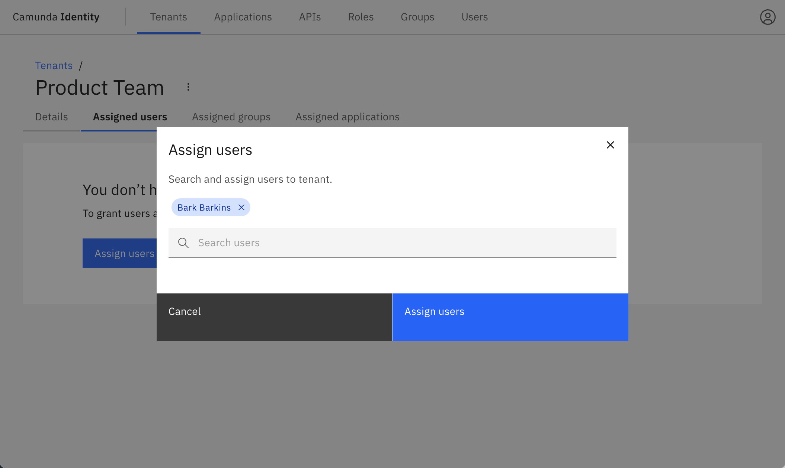
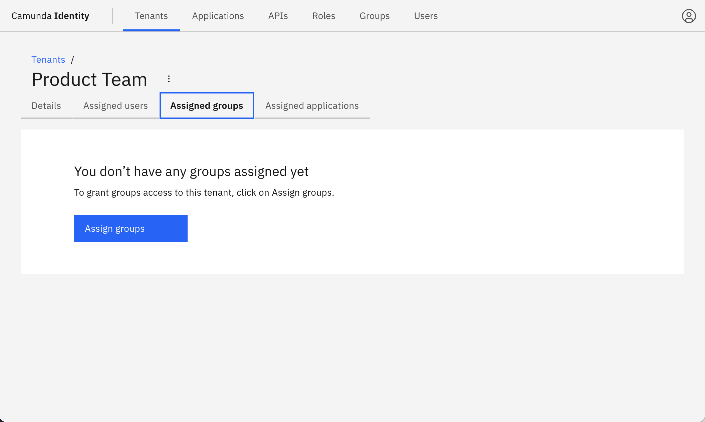
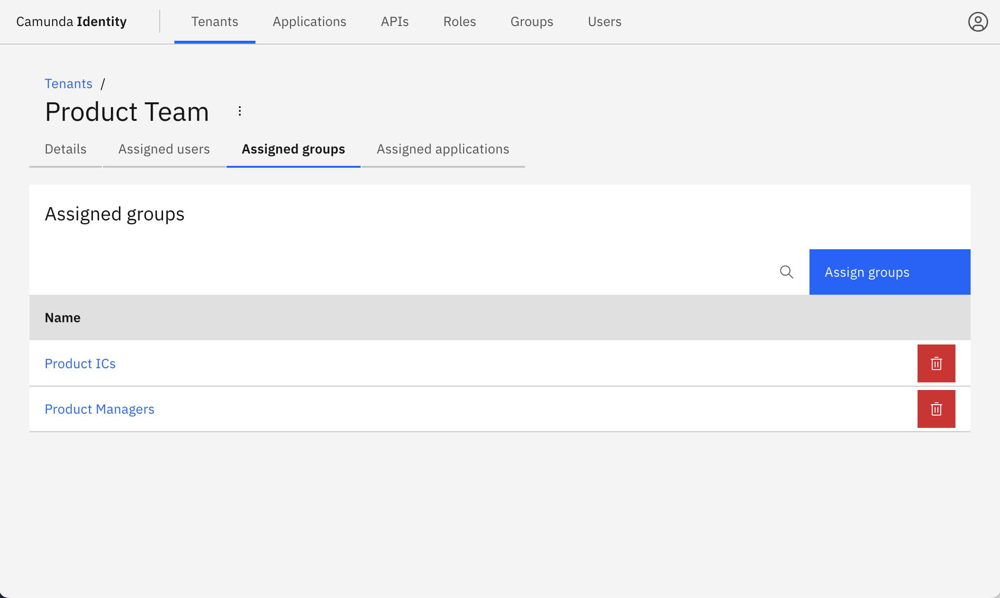
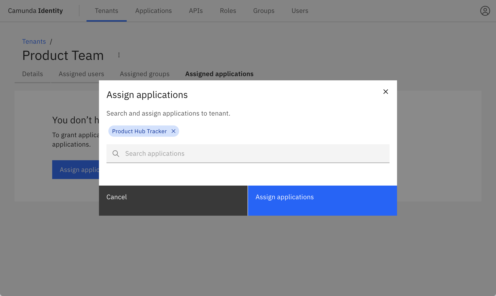
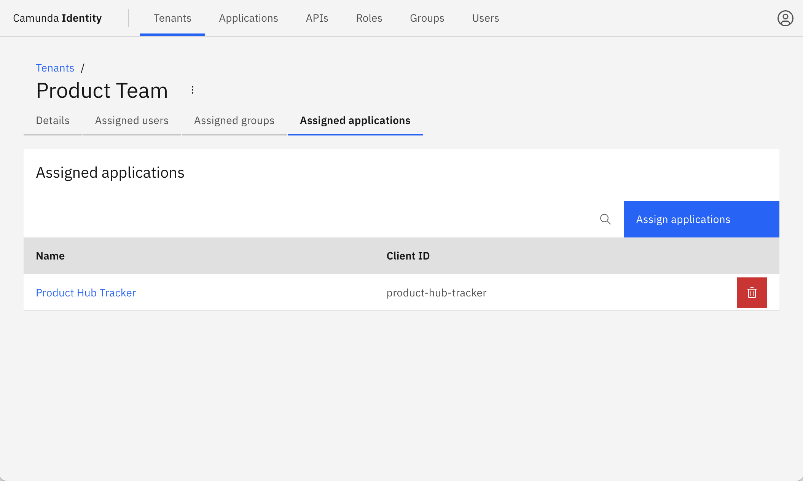

import Tabs from "@theme/Tabs";
import TabItem from "@theme/TabItem";

- Isolate data access for your custom _Applications_ or _Users_ [using _Tenants_](/self-managed/identity/managing-tenants.md)

Multi-tenancy in the context of Camunda 8 refers to the ability of Camunda 8 to serve multiple distinct tenants or clients within a single installation. For details on multi-tenancy, visit our [multi-tenancy documentation](/self-managed/concepts/multi-tenancy.md).

**Precondition**: **Multi-tenancy** is disabled by default. In order to enable this feature, you must:

1. Enable [`MULTITENANCY_ENABLED` feature flag](/self-managed/identity/miscellaneous/configuration-variables.md#feature-flags)
2. [Configure a database](/self-managed/identity/miscellaneous/configuration-variables.md#database-configuration)

## Managing tenants

:::note
The `<default>` tenant is automatically created during Identity startup.
:::

1. Log in to the Identity UI and navigate to the **Tenants** tab.

2. Click **Create Tenant** and a modal will open.

3. Enter a name and ID for the tenant and click **Create tenant**:

On creation, the modal closes and the table updates with your new tenant.

4. Click on your new tenant to view the details:

### Assigning members

Application, groups, and individual users can be assigned to a tenant. Below we show you how to assign members to a tenant for all three:

<Tabs groupId="memberType" defaultValue="users" queryString values={[{label: 'Users', value: 'users', },{label: 'Groups', value: 'groups', },{label: 'Applications', value: 'applications', },]} >
<TabItem value="users">

1. Click **Assigned users** to view the users assigned to the tenant, and click **Assign users**:

2. Search and select the users to assign to the tenant. After selecting the users, click **Assign users**:

On confirmation, the modal closes, the table updates, and the assigned users are shown:

</TabItem>
<TabItem value="groups">

3. Click **Assigned groups** to view the groups assigned to the tenant, and click **Assign groups**:

4. Search and select the groups to assign to the tenant. After selecting the groups, click **Assign groups**:

On confirmation, the modal closes, the table updates, and the assigned groups are shown:

</TabItem>
<TabItem value="applications">

1. Click **Assigned applications** to view the applications assigned to the tenant, and click **Assign applications**:

2. Search and select the applications to assign to the tenant. After selecting the applications, click **Assign applications**:

On confirmation, the modal closes, the table updates, and the assigned applications are shown:

</TabItem>
</Tabs>
