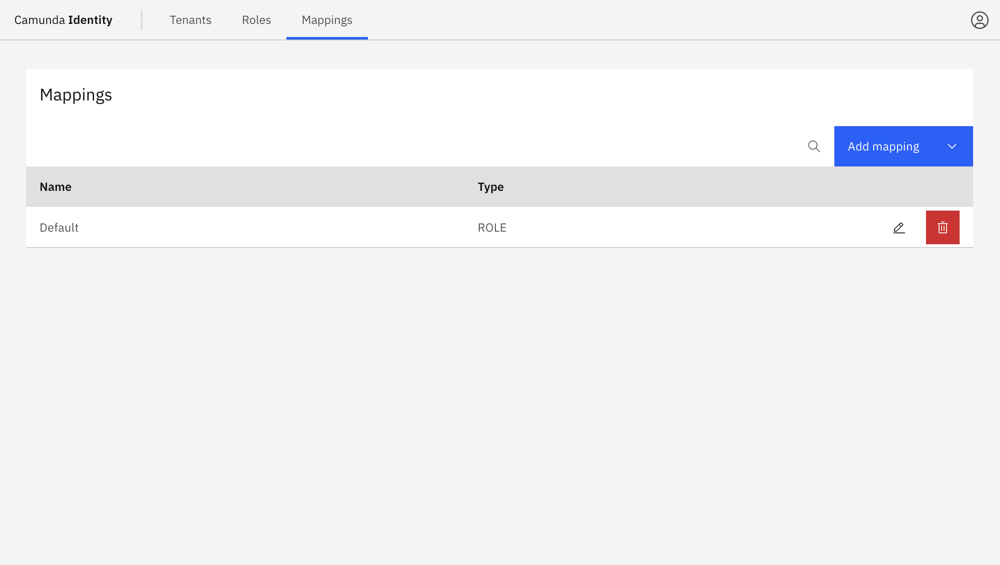
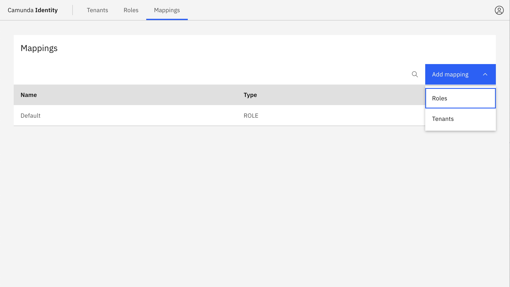
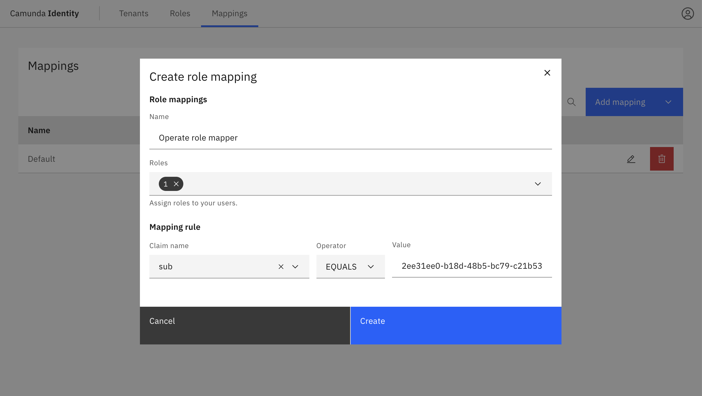
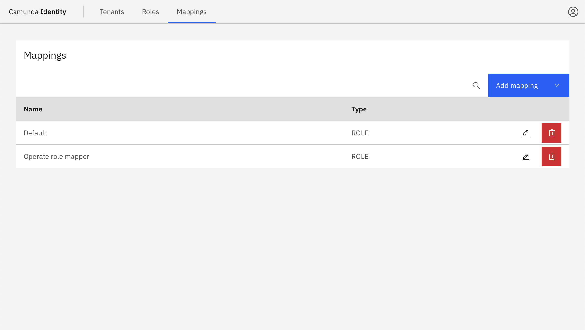
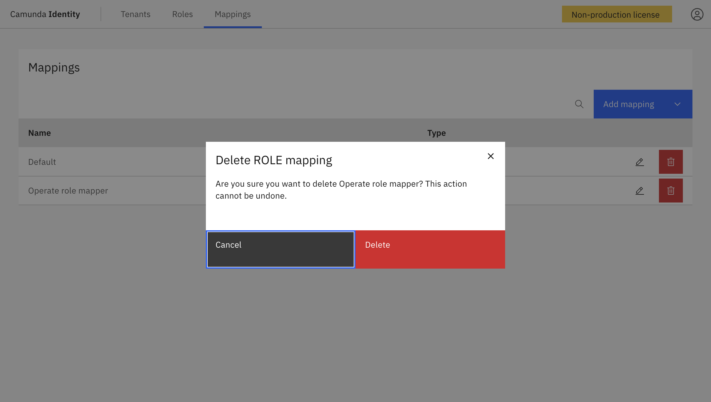

Use mapping rules to dynamically assign Identity entities to your users based on claims in your JWT tokens.

## About mapping rules

You can assign two types of entities with mapping rules:

- Tenants
- Roles

:::note

- Mapping rules are only available for Camunda 8 Self-Managed using [OIDC-based authentication](/self-managed/identity/configuration/connect-to-an-oidc-provider.md).
- A `Default` mapping rule is created during startup using the [IDENTITY_INITIAL_CLAIM_NAME and IDENTITY_INITIAL_CLAIM_VALUE environment variables](/self-managed/identity/miscellaneous/configuration-variables.md#oidc-configuration) to allow an initial user access to the Identity interface. Once you have access to the Identity interface, configure the additional mapping rules to ensure your users have the correct access to the Camunda components.

:::

## Add a mapping rule

1. Log in to the Identity interface and navigate to the **Mappings** tab.

   

1. Click the **Add mapping** button and select the type of mapping to create. You can create a mapping for a role or
   tenant.

   

1. Fill in the fields for the mapping rule and click **Create**.

   

   :::note

   The operator option is used to define how we evaluate the rules against your tokens. The options are:

   - **Contains**: Used for array-based claims, such as a list of roles.
   - **Equals**: Used for string-based claims, such as a string ID.

   :::

   The created mapping rule can be seen in the table.

   

## Edit a mapping rule

1. Click the pencil icon on the row of the mapping rule you want to update.

2. Update the fields for the mapping rule and click **Update**.

:::note
You can only update the entities applied by the mapping rule and the claims used to map the entities. You cannot update the mapping rule type.
:::

## Delete a mapping rule

Click on the **trash can** icon on the row of the mapping rule you want to delete.

After confirming, the mapping rule is deleted and no longer appears in the table.
