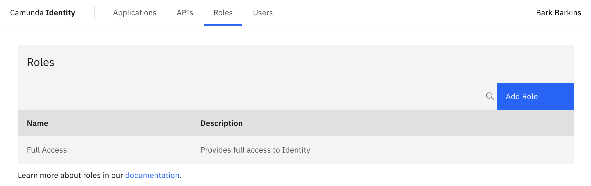
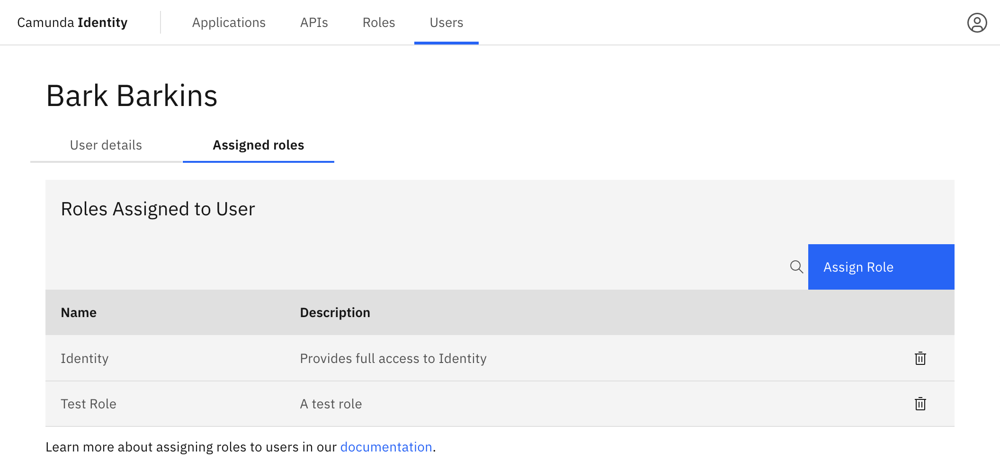

Access to the components within Camunda 8 can be controlled by the roles assigned to a user.

Roles are a way to group sets of [permissions](/self-managed/identity/user-guide/roles/manage-permissions.md) which can be assigned to users using the Identity UI.

:::caution Write access needed
To add and assign a role to a user, you need to have write access to Identity.
Read our [guide on managing user access](/self-managed/identity/user-guide/authorizations/managing-user-access.md) to learn more.
:::

## Add a role

1. Navigate to the **Roles** tab:

2. Click the **Add Role** button located on the top right of the table and a modal will open to fill out the details of the role.

## Assign a role to a user

To assign a role to a user using Identity, take the following steps:

1. Navigate to the **Users** tab.

2. Click on the user you want to assign a role to to view their details.

3. Click on **Assigned Roles** to view the roles currently assigned to the user.

4. Click the **Assign Role** button located on the top right of the table and a modal will open.

5. Select the role you want to assign to the user and click **Add**.

On confirmation, the modal will close, the table will update, and the newly assigned role will be shown:

## Delete a role

To delete a role from a user, take the following steps:

1. Navigate to the **Users** tab.

2. Click on the user you want to remove a role from to view their details.

3. Click on **Assigned Roles** to view the roles currently assigned to the user.

4. Click the trash icon next to the role.

On confirmation, the modal will close, the table will update, and the role will be removed.
