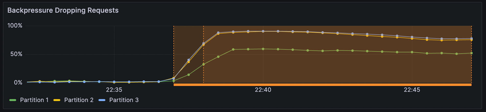
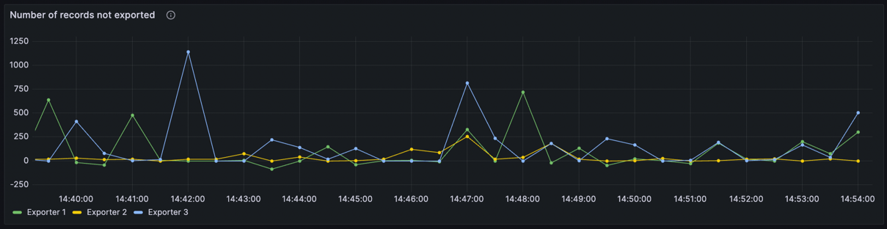
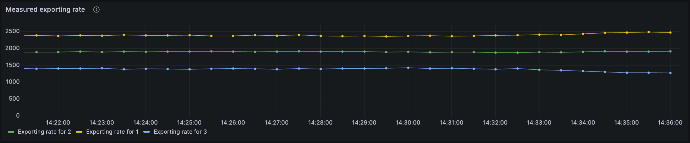
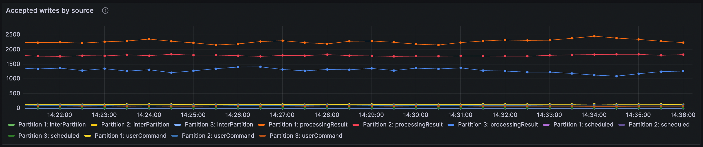
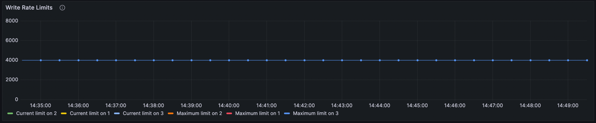

When internal requests are processed faster than the rate at which they are exported, backlogs of unexported records can occur. Flow control slows the write rate of new records through both static write limits and optional dynamic throttling, and prevents the stream from building an excessive backlog of records not yet exported.

For user commands, this will show up as increased [backpressure](/components/zeebe/technical-concepts/internal-processing.md#handling-backpressure), observed latency, and reduced throughput. [Internal processing](/components/zeebe/technical-concepts/internal-processing.md) slows down as the stream processor waits longer for processing results to be written.

Write rate limiting applies to all new records, including processing results, user commands, inter-partition messages, and scheduled tasks.

## Enable flow control

The write rate can be set as a static limit, which defines the upper rate at which records can be written. The dynamic limit, known as **throttling,** adjusts the write rate based on the exporting rate and backlog, and can be applied alongside the static limit.

A static write rate limit can prevent throughput peaks, and write rate throttling can keep the backlog stable by temporarily decreasing the static limit to keep the exporting backlog small. When configuring dynamic throttling, configuring a high static limit can help maintain a high write rate if the exporting can keep up.

:::note
These write limits are enabled by default in SaaS and disabled in Self-Managed. For most use cases, write rate limits can be enabled as needed if an issue arises.
:::

Flow control is configured in your Zeebe Broker's `application.yaml` file. The default values can be found in the `# flowControl` section of the Zeebe Broker [configuration](https://github.com/camunda/camunda/blob/main/dist/src/main/config/broker.yaml.template) and [standalone](https://github.com/camunda/camunda/blob/main/dist/src/main/config/broker.standalone.yaml.template) templates.

```yaml
zeebe:
  broker:
    flowControl:
      write:
        enabled: false
        rampUp: 0
        limit: 1000
        throttling:
          enabled: false
          acceptableBacklog: 100000
          minimumLimit: 100
          resolution: 15s
```

:::note
The limit and in-flight count are calculated per partition.
:::

| Field        | Description                                                                                                                                                                                                                                                                                                                                                                                                                                                                                                                                                                                                                                                                                                                                                                                                                                                                                                                                                                                                                                                                                                                                                                                                                                                                                         | Default Value    |
| ------------ | --------------------------------------------------------------------------------------------------------------------------------------------------------------------------------------------------------------------------------------------------------------------------------------------------------------------------------------------------------------------------------------------------------------------------------------------------------------------------------------------------------------------------------------------------------------------------------------------------------------------------------------------------------------------------------------------------------------------------------------------------------------------------------------------------------------------------------------------------------------------------------------------------------------------------------------------------------------------------------------------------------------------------------------------------------------------------------------------------------------------------------------------------------------------------------------------------------------------------------------------------------------------------------------------------- | ---------------- |
| `rampUp`     | The time from startup during which the write limit is slowly increased until the configured limit. Useful for a warm-up period where a lower write rate is beneficial. This value is given in seconds and cannot be set null nor negative.                                                                                                                                                                                                                                                                                                                                                                                                                                                                                                                                                                                                                                                                                                                                                                                                                                                                                                                                                                                                                                                          | `0`              |
| `limit`      | A static value to use as the write rate. This value cannot be null nor negative.                                                                                                                                                                                                                                                                                                                                                                                                                                                                                                                                                                                                                                                                                                                                                                                                                                                                                                                                                                                                                                                                                                                                                                                                                    | `1000`           |
| `throttling` | If enabled, `throttling` will additionally limit the write rate based on the exporting backlog. The exporting backlog is the quantity of records that were written, but not yet exported. An excessive exporting backlog is usually due to a mismatch of the rate of processed and exported records, or to degraded exporting capability. <br/><br/> The `throttling` algorithm used takes into account the ratio between the acceptable backlog and the actual backlog. If the acceptable backlog is at least twice as long as the real backlog, the current rate is set as the limit. If the ratio between the acceptable backlog and current rate is less than two, the rate is calculated by multiplying the ratio with the current exporting rate, with `minimumLimit` as the floor and `limit` as the ceiling. <br/><br/> The intention is to proportionally increase or decrease the rate according to the ratio of the acceptable backlog and the actual backlog. If the acceptable backlog is larger than the current backlog, the rate is increased, and if the acceptable backlog is smaller than the current backlog, the rate is decreased. If the processing speed continues to outpace the exporting speed, the current backlog should stabilize around the acceptable backlog size. | `enabled: false` |
| `resolution` | The frequency with which `throttling` is adjusted, given in seconds. Adjusting this value sets the speed at which the processing rate can respond to changes.                                                                                                                                                                                                                                                                                                                                                                                                                                                                                                                                                                                                                                                                                                                                                                                                                                                                                                                                                                                                                                                                                                                                       | `15s`            |

The exporting rate is the number of exported records per second, averaged out over the last five minutes.

## Configure temporary write limits

The flow control endpoint can be used to adjust the flow control configuration temporarily, without having to reset your clusters.

:::caution
The flow control endpoint is intended as a temporary solution, and changes should be reverted after the issue is addressed. Permanent configuration changes should be made through the environment variables.

Configuring flow control through the available endpoint does not preserve the configuration in the broker state. If the broker restarts, any leader
partition in this broker will revert to the defined configuration in the environment variables.
:::

### Fetch current configuration

The backup API can be reached via the `/actuator` management port, which is 9600 by default. The configured context path does not apply to the management port.

The following endpoint can be used to fetch the flow control configuration:

```
GET actuator/flowControl
```

#### Response

| Code             | Description                                                             |
| ---------------- | ----------------------------------------------------------------------- |
| 200 Accepted     | The flow configuration was retrieved successfully.                      |
| 400 Bad Request  | Indicates issues with the request.                                      |
| 500 Server Error | All other errors. Refer to the returned error message for more details. |

#### Example request

```
curl -X GET 'localhost:9600/actuator/flowControl'
```

#### Example response

```json
{
  "1": {
    "requestLimiter": {
      "delegate": {
        "limit": 100,
        "minLimit": 1,
        "maxLimit": 1000,
        "backoffRatio": 0.9,
        "expectedRTT": 200000000
      }
    },
    "writeRateLimit": {
      "enabled": true,
      "limit": 4000,
      "rampUp": 0.0,
      "throttling": {
        "enabled": true,
        "acceptableBacklog": 100000,
        "minRate": 100,
        "resolution": 15.0
      }
    }
  }
}
```

:::note
The `writeRateLimit` value can be null if it has not been defined yet.
:::

### Set a new configuration

To set a new flow control configuration, make a `POST` request to the `actuator/flowControl` endpoint.

This request will attempt to configure all partitions. Partitions might differ in configuration if, for example, a broker restarts and the leader partition reverts to the configuration defined in the environment variables.

```
POST actuator/flowControl
```

```json
{
  "write": {
    "rampUp": <rampUp>,
    "enabled": <enabled>,
    "limit": <limit>,
    "throttling": {
      "enabled": <enabled>,
      "acceptableBacklog": <acceptableBacklog>,
      "minimumLimit": <minimumLimit>,
      "resolution": <resolution>
    }
  }
}
```

#### Response

| Code             | Description                                                                                                                                                                                            |
| ---------------- | ------------------------------------------------------------------------------------------------------------------------------------------------------------------------------------------------------ |
| 200 Accepted     | The flow configuration request was processed correctly.                                                                                                                                                |
| 400 Bad Request  | Indicates issues with the request, for example, one of the fields contains an invalid type.                                                                                                            |
| 500 Server Error | All other errors. For example, when the values set do not conform to the imposed restriction (such as `minimumLimit` being higher than `limit`). Refer to the returned error message for more details. |

#### Example request

```bash
curl -X POST 'localhost:9600/actuator/flowControl' -H "Content-Type: application/json" --data
'{
  "write": {
    "rampUp": 0,
    "enabled": true,
    "limit": 2000,
    "throttling": {
      "enabled": true,
      "acceptableBacklog": 100000,
      "minimumLimit": 200,
      "resolution": 15
    }
  }
}'
```

### Example response

```js
{
  "1": {
    "requestLimiter": {
      "delegate": {
        "limit": 100,
        "minLimit": 1,
        "maxLimit": 1000,
        "backoffRatio": 0.9,
        "expectedRTT": 200000000
      }
    },
    "writeRateLimit": {
      "enabled": true,
      "limit": 4000,
      "rampUp": 0.0,
      "throttling": {
        "enabled": true,
        "acceptableBacklog": 100000,
        "minRate": 100,
        "resolution": 15.0
      }
    }
  }
}
```

:::note
The first value in the response (`1` in the example) refers to the partition before the flow configuration is defined.
:::

## View write rate limits in Grafana

### Throttling

Dynamic throttling, when actively acting on the current rate (and not only enabled), displays in Grafana with an underlying yellow bar for the period it was active.



### Exporting backlog

The exporting backlog panel is found under the **Processing** row and displays the number of records not yet exported per partition.



### Exporting and write rate

The **Measured exporting rate** and **Accepted writes by source** panels are found under the **Logstream** row. The first shows the number of records
accepted by flow control per second, organized by partition and write source (for example, processing result, scheduled tasks, etc.). The second displays measured average exporting rate which may be used to throttle write rate.




#### Write rate limit

The **Write rate limits** panel is under the **Logstream** row, and displays the current and maximum permissible write rate limit per partition.


