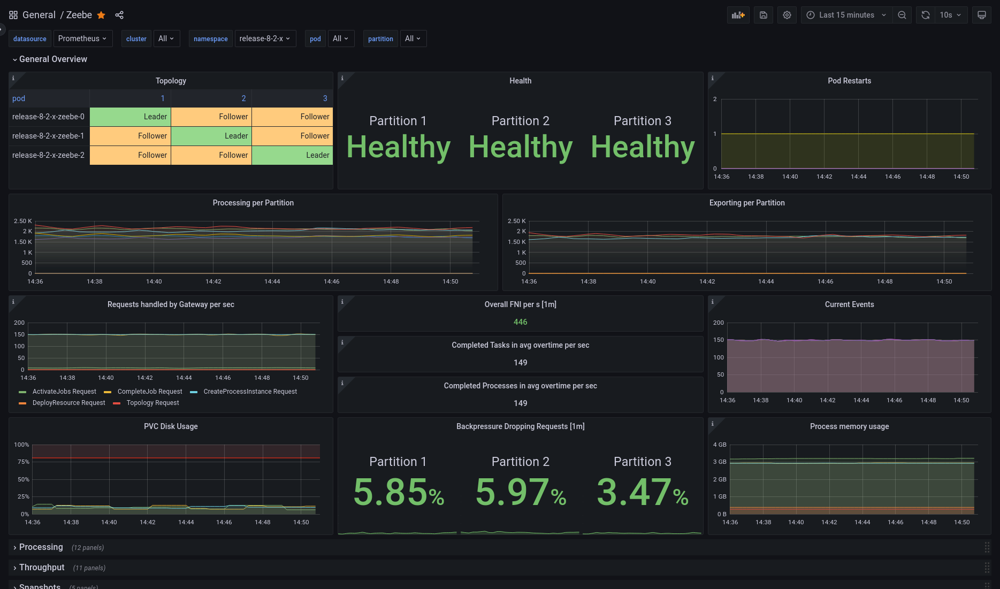

When operating a distributed system like Camunda 8, it is important to put proper monitoring in place. To facilitate this, Camunda leverages [Micrometer](https://micrometer.io/), a library
which provides a convenient facade that allows exporting metrics to [one or more supported implementations](https://docs.micrometer.io/micrometer/reference/implementations.html)
(e.g. Prometheus, OpenTelemetry, Datadog, Dynatrace, etc.).

## Accessing metrics

Metrics are meant to be accessed directly via your chosen monitoring system, where they are aggregated. This is because they are stored purely in-memory in
Camunda. As such, they need to be consumed by your monitoring system before they can be accessed. Broadly speaking, this will happen in one of two ways,
via polling (the default), or pushing.

A **polling** system (such as Prometheus) will poll an endpoint exposed by Camunda at a regular interval. Each request constitute a data point
for each metric. When working with such systems, configure the polling interval to get information fast enough, without overwhelming Camunda
itself (which still has to serve this data) or having to store too much data in your monitoring system itself. Additionally, this means exposing the Camunda
endpoint to your external monitoring system.

When using a **pushing** system (such as OpenTelemetry), Camunda is configured to asynchronously push metric updates to an external endpoint at a regular interval. This implies that the system is accessible to Camunda via the network, so you will most likely want to ensure communication is secured. Similarly to the polling approach, balance how fast you are pushing (and thus getting updates/data points), without overwhelming your external system.

## Configuration

Configuration for metrics is done via the [built-in Spring Boot Micrometer configuration, as documented here](https://docs.spring.io/spring-boot/reference/actuator/metrics.html).

### Defaults

Camunda comes built-in with support for [Prometheus](https://prometheus.io) and [OpenTelemetry](https://opentelemetry.io/). By default, it is configured to export only Prometheus metrics
via [a scraping endpoint](https://docs.spring.io/spring-boot/reference/actuator/metrics.html#actuator.metrics.export.prometheus), and OpenTelemetry is disabled.

#### Prometheus

The scraping endpoint for Prometheus is located under the management context (by default `:9600/actuator/prometheus`). This is configured via the following
properties:

```yaml
management:
  endpoint.prometheus.access: unrestricted
  prometheus.metrics.export.enabled: true
```

In order to collect the metrics, Prometheus needs to be made aware of the new scraping endpoint. To do so, add the following scraping job:

```
- job_name: camunda
  scrape_interval: 30s
  metrics_path: /actuator/prometheus
  scheme: http
  static_configs:
  - targets:
    - localhost: 9600
```

:::warning
If you've configured your management context to be over HTTPS, you will need to also update the scheme above. Same thing if you changed the management port.
:::

:::note
The scraping interval is 30s by default; this means, you will get new data points in Prometheus every 30s. This is a good default to minimize the storage requirements
for Prometheus. If you want to run alerts or auto-scaling based on the provided metrics, then you may wish to configure a shorter interval. This will result in more data
ingested however, so use at your own risk.
:::

#### OpenTelemetry Protocol

Zeebe also comes built-in with support to export metrics via OpenTelemetry (done through the `micrometer-registry-otlp`). To configure it, you would set the following properties:

```yaml
management:
  # Disable Prometheus
  promethus.metrics.export.enabled: false
  # Configure OpenTelemetry Metrics
  otlp:
    metrics:
      export:
        # Enable OTLP
        enabled: true
        # Since metrics are pushed, you will need to configure at least one endpoint
        url: "https://otlp.example.com:4318/v1/metrics"
```

You can find a more extensive list of configuration options for OTLP on the
[Micrometer website](https://docs.micrometer.io/micrometer/reference/implementations/otlp.html#_configuring).

:::warning
When using the OTLP exporter, be sure to check the requirements of your target endpoint, as it may require additional configuration.
For example, you may need to pass a client secret and ID for authentication via the `otlp.metrics.export.headers` options. Or your system
may not support `cumulative` aggregation temporality, but instead require `delta` (e.g. Dynatrace).
:::

**Note that a wide variety of existing monitoring systems also support ingesting OpenTelemetry data (e.g. Dynatrace, Datadog, etc.).
We recommend using it instead of the specific Micrometer implementations.**

### Using a different monitoring system

To use a different monitoring system, refer to the [Spring Boot documentation](https://docs.spring.io/spring-boot/reference/actuator/metrics.html#actuator.metrics.export).
Note that Zeebe only ships with built-in support for the [Prometheus](https://docs.spring.io/spring-boot/reference/actuator/metrics.html#actuator.metrics.export.prometheus)
and [OTLP](https://docs.spring.io/spring-boot/reference/actuator/metrics.html#actuator.metrics.export.otlp) systems.

If you wish to use a different system, you would need to add the required dependencies to your Zeebe installation, specifically to the distribution's `lib/` folder.

:::note
When using the container image, you will need to add it to the following path based on your image:

- `camunda/zeebe`: `/usr/local/zeebe/lib`
- `camunda/camunda`: `/usr/local/camunda/lib`
  :::

For example, if you want to export to Datadog, you would download the `io.micrometer:micrometer-registry-datadog` JAR and place it in the `./lib` folder of the distribution.
Running from the root of the distribution, you can leverage Maven to do this for you:

```shell
mvn dependency:copy -Dartifact=io.micrometer:micrometer-registry-datadog:1.14.4 -Dtransitive=false -DoutputDirectory=./lib
```

:::note
Make sure the version is the same as the Micrometer version used by Camunda. You can find this out by checking the distribution artifact on
[Maven Central](https://central.sonatype.com/artifact/io.camunda/camunda-zeebe/dependencies).

Make sure to select the distribution version you're using, then filter for `micrometer` to get the expected Micrometer version.
:::

### Customizing metrics

You can modify and filter the metrics exposed in Camunda via configuration.

#### Common tags

[Tags provide a convenient way of aggregating metrics over common attributes](https://docs.spring.io/spring-boot/reference/actuator/metrics.html#actuator.metrics.customizing.common-tags).
Via configuration, you can ensure that all metrics for a specific instance of Camunda share common tags. For example, let's say you deploy two different clusters, and want to differentiate them.

The first one could be configured as:

```yaml
management:
  metrics:
    tags:
      cluster: "foo"
```

And the second one as:

```yaml
management:
  metrics:
    tags:
      cluster: "bar"
```

#### Filtering

[You can additionally disable certain metrics](https://docs.spring.io/spring-boot/reference/actuator/metrics.html#actuator.metrics.customizing.per-meter-properties).
This can be useful for high cardinality metrics which you do not care for, but which may end up being expensive to store in your target system.

To filter a metric called `zeebe.foo`, you would configure the following property:

```yaml
management:
  metrics:
    enable:
      zeebe:
        foo: false
```

:::note
Filtering applies not only to direct name matches (e.g. `zeebe.foo`), but as a prefix. Meaning any metric starting with the prefix `zeebe.foo` in the example
above would also be filtered out, and wouldn't be exported.
:::

## Available metrics

[Spring already exposes various metrics](https://docs.spring.io/spring-boot/reference/actuator/metrics.html#actuator.metrics.supported), some of which will be made available
through Camunda:

- [JVM metrics](https://docs.spring.io/spring-boot/reference/actuator/metrics.html#actuator.metrics.supported.jvm)
- [System metrics](https://docs.spring.io/spring-boot/reference/actuator/metrics.html#actuator.metrics.supported.system)
- [Application startup metrics](https://docs.spring.io/spring-boot/reference/actuator/metrics.html#actuator.metrics.supported.application-startup)
- [Logger metrics](https://docs.spring.io/spring-boot/reference/actuator/metrics.html#actuator.metrics.supported.logger)
- [Spring MVC metrics](https://docs.spring.io/spring-boot/reference/actuator/metrics.html#actuator.metrics.supported.spring-mvc)

Additionally, Camunda will expose several custom metrics, most of them under the `zeebe`, `atomix`, `operate`, `tasklist`, or `optimize` prefixes.

:::note
While all nodes in a Camunda cluster expose metrics, they will expose relevant metrics based on their role. For example, brokers will expose processing related metrics,
while gateways will expose REST API relevant metrics.
:::

**Metrics related to process processing:**

- `zeebe_stream_processor_records_total`: The number of events processed by the stream processor.
  The `action` label separates processed, skipped, and written events.
- `zeebe_exporter_events_total`: The number of events processed by the exporter processor.
  The `action` label separates exported and skipped events.
- `zeebe_element_instance_events_total`: The number of occurred process element instance events.
  The `action` label separates the number of activated, completed, and terminated elements.
  The `type` label separates different BPMN element types.
- `zeebe_job_events_total`: The number of job events. The `action` label separates the number of
  created, activated, timed out, completed, failed, and canceled jobs.
- `zeebe_incident_events_total`: The number of incident events. The `action` label separates the number
  of created and resolved incident events.
- `zeebe_pending_incidents_total`: The number of currently pending incident, i.e. not resolved.

**Metrics related to performance:**

Zeebe has a backpressure mechanism by which it rejects requests when it receives more requests than it can handle without incurring high processing latency.

Monitor backpressure and processing latency of the commands using the following metrics:

- `zeebe_dropped_request_count_total`: The number of user requests rejected by the broker due to backpressure.
- `zeebe_backpressure_requests_limit`: The limit for the number of inflight requests used for backpressure.
- `zeebe_stream_processor_latency_bucket`: The processing latency for commands and event.

**Metrics related to health:**

The health of partitions in a broker can be monitored by the metric `zeebe_health`.

## Execution latency metrics

The brokers can export optional execution latency metrics. To enable export of execution metrics, configure set the `ZEEBE_BROKER_EXECUTION_METRICS_EXPORTER_ENABLED` environment variable to `true` in
your Zeebe [configuration file](/versioned_docs/version-8.7/self-managed/zeebe-deployment/configuration/configuration.md).

## Grafana

### Zeebe

Zeebe comes with a pre-built dashboard, available in the repository:
[monitor/grafana/zeebe.json](https://github.com/camunda/camunda/blob/main/monitor/grafana/zeebe.json).

[Import](https://grafana.com/docs/grafana/latest/reference/export_import/#importing-a-dashboard) it into your Grafana instance and select the correct Prometheus data source (important if you have more than one). You will then be greeted with the following dashboard, which displays a healthy cluster topology, general throughput metrics, handled requests, exported events per second, disk and memory usage, and more.



You can also try out an [interactive version](https://snapshots.raintank.io/dashboard/snapshot/Vbu3EHQMTI5Onh5RKuiS5J7QSMd7Sp5V), where you can explore help messages for every panel and get a feel for what data is available.
