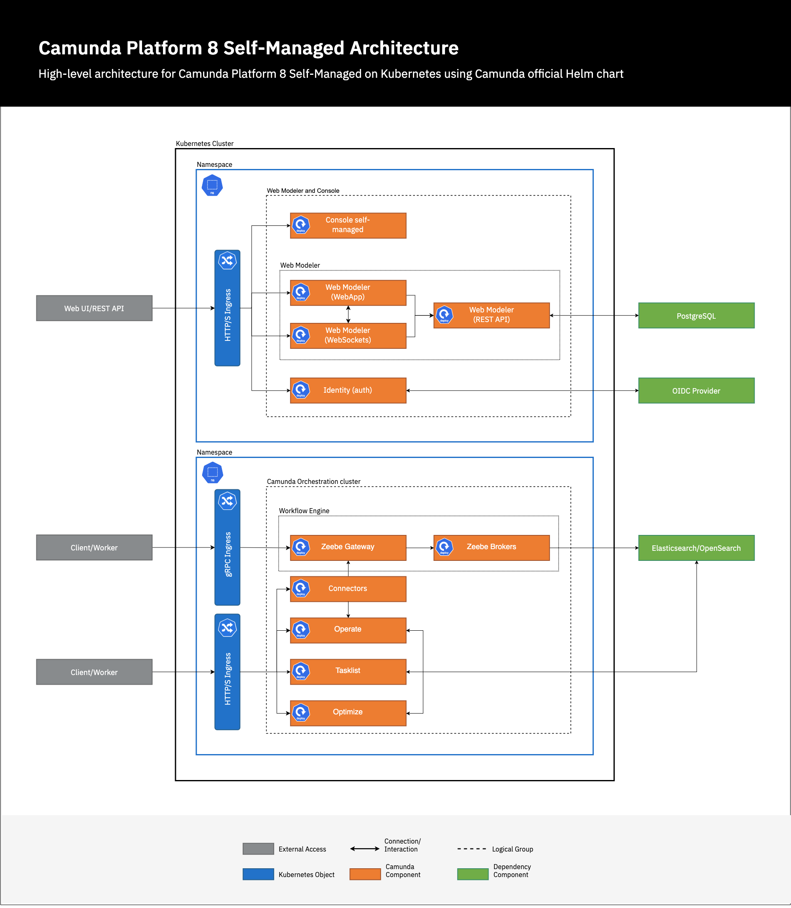

The following is a **scenario-based, production focused, step-by-step guide** for setting up the [Camunda Helm chart](https://artifacthub.io/packages/helm/camunda/camunda-platform). It provides a resilient, production-ready architecture for Camunda 8, and minimizes complexity while offering a reliable foundation for most production use cases.

While this guide uses AWS as a reference, the steps are applicable to other [supported Kubernetes distributions](/reference/supported-environments.md#deployment-options) and their comparable services. Upon completion, you will be familiar with all of the necessary requirements for having a production ready Camunda Helm chart.

## Prerequisites

Before proceeding with the setup, ensure the following requirements are met:

- **Kubernetes Cluster**: A functioning Kubernetes cluster with kubectl access and block storage persistent volumes for stateful components. This guide will use an AWS EKS cluster for reference. Step-by-step documentation is available to deploy an EKS cluster with [Terraform](/self-managed/setup/deploy/amazon/amazon-eks/terraform-setup.md), and [install Camunda 8](/self-managed/setup/deploy/amazon/amazon-eks/eks-helm.md).
- **Helm**: Make sure the [Helm CLI](/reference/supported-environments.md#clients) is installed.
- **DNS Configuration**: You must have access to configure DNS for your domain in order to point to the Kubernetes cluster Ingress.
- **TLS Certificates**: Obtain valid X.509 certificates for your domain from a trusted Certificate Authority.
- **External Dependencies**: Provision the following external dependencies:
  - **Amazon Aurora PostgreSQL**: For persistent data storage required for the Web Modeler component. For step-by-step instructions, see the [Aurora PostgreSQL module setup](/self-managed/setup/deploy/amazon/amazon-eks/terraform-setup.md#postgresql-module-setup) guide.
  - **Amazon OpenSearch**: The secondary datastore for Zeebe, the Camunda 8 process orchestration engine. For step-by-step instructions, see the [OpenSearch](/self-managed/setup/deploy/amazon/amazon-eks/eksctl.md#4-opensearch-domain) guide.
  - **AWS Simple Active Directory**: For simple OIDC authentication. See the [AWS Simple Active Directory](https://docs.aws.amazon.com/directoryservice/latest/admin-guide/directory_simple_ad.html) documentation for more information.
- **Ingress NGINX**: Ensure the [ingress-nginx](https://github.com/kubernetes/ingress-nginx) controller is set up in the cluster.
- **AWS OpenSearch Snapshot Repository** - To store the backups of the Camunda web applications. This repository must be configured with OpenSearch to take backups which are stored in Amazon S3. See the [official AWS guide](https://docs.aws.amazon.com/opensearch-service/latest/developerguide/managedomains-snapshot-registerdirectory.html) for detailed steps.
- **Amazon S3** - An additional bucket to store backup files of the Zeebe brokers.
- **Resource Planning**: Make sure you have understood the considerations for [sizing Camunda Clusters](/components/best-practices/architecture/sizing-your-environment.md#camunda-8-self-managed), and have evaluated sufficient CPU, memory, and storage necessary for the deployment.

Ensure all prerequisites are in place to avoid issues during installation or when upgrading in a production environment.

## Architecture overview

For more information about the Camunda 8 architecture, refer to the [Self-Managed overview](/self-managed/about-self-managed.md#architecture) and Camunda 8 [reference architectures](/self-managed/reference-architecture/reference-architecture.md#orchestration-cluster-vs-web-modeler-and-console).

Below is the high-level architecture diagram for the base production setup:



## Installation and configuration

After following the [prerequisites](#prerequisites), you should have an EKS cluster ready with `kubectl` and the `helm` CLI installed.

### Namespace setup

To get started, create two namespaces:

```bash
kubectl create namespace management
kubectl create namespace orchestration
```

- **Namespace `management`:** We will install [Identity](/self-managed/identity/what-is-identity.md), [Console](/self-managed/console-deployment/overview.md), and all the [Web Modeler](/self-managed/modeler/web-modeler/installation.md) components.

- **Namespace `orchestration`**: We will install [Zeebe](/self-managed/zeebe-deployment/zeebe-installation.md), the Camunda web applications ([Operate](/self-managed/operate-deployment/install-and-start.md), [Tasklist](/self-managed/tasklist-deployment/install-and-start.md), and [Optimize](/self-managed/optimize-deployment/install-and-start.md)), along with [Connectors](/self-managed/connectors-deployment/install-and-start.md).

Each component is installed by the Helm chart automatically, and does not need to be installed separately.

:::note
For more information on the difference between the Orchestration cluster and the Web Modeler and Console cluster, see the Camunda 8 [reference architecture](/self-managed/reference-architecture/reference-architecture.md#orchestration-cluster-vs-web-modeler-and-console).
:::

### Install the Helm chart

As there will be a Helm deployment in each namespace, create your own `management-values.yaml` and `orchestration-values.yaml`, or modify an existing setup by applying the production recommendations in the next section. Example values files can be found at the [end of this guide](#create-a-production-valuesyaml).

The Camunda Helm chart can be installed in each namespace using the following command:

```bash
# This will add our chart repository so you can pull from it
helm repo add camunda https://helm.camunda.io
# This will update the chart repository. Please make sure to run this command before every install or upgrade
helm repo update
# This will install the latest Camunda Helm chart in the management namespace with the latest applications/dependencies.
helm install camunda camunda/camunda-platform --version $HELM_CHART_VERSION -n management \
    --values management-values.yaml
# This will install the latest Camunda Helm chart in the Orchestration namespace with the latest applications/dependencies.
helm install camunda camunda/camunda-platform --version $HELM_CHART_VERSION -n orchestration \
    --values orchestration-values.yaml
```

### Ingress TLS setup

In order to access the Camunda Platform through HTTPS with Ingress, TLS must be enabled. Enabling TLS requires the following:

1. **Domain name**: A public registered domain that has configurable DNS records. This guide will use `camunda.example.com` as the domain.
2. **TLS certificate**: A TLS certificate created for your domain. The certificate must be an X.509 certificate, issued by a trusted Certificate Authority. The certificate must include the correct domain names (Common Name or Subject Alternative Names) to secure Ingress resources. Reach out to your DNS provider if you are unsure on how to create a TLS certificate. It is not recommended to use self-signed certificates.
3. **TLS secret**: A TLS secret created from your TLS certificate. This guide will use a secret called `camunda-platform`. For more information, see the Kubernetes documentation on how to create a [TLS secret](https://kubernetes.io/docs/concepts/configuration/secret/#tls-secrets).

The following is an example `values.yaml` configuration using the example Ingress domain and TLS secret:

```yaml
global:
  ingress:
    enabled: true
    className: nginx
    host: camunda.example.com
    tls:
      enabled: true
      secretName: camunda-platform
```

Optionally, you can configure Ingress for the Zeebe [gRPC API](/apis-tools/zeebe-api/grpc.md):

```yaml
zeebe:
  ingress:
    grpc:
      enabled: true
      className: nginx
      host: zeebe-grpc.camunda.example.com
      tls:
        enabled: true
        secretName: camunda-platform-zeebe-grpc
```

More information can be found in the [Ingress setup](/self-managed/setup/guides/ingress-setup.md) guide.

### Identity provider integration

Once secure HTTPS connections are enabled and correctly configured via Ingress, the next stage to consider is configuring authentication.

This example uses AWS Simple Active Directory, which provides a subset implementation of a Microsoft Active Directory, and is compatible with our [Microsoft Entra ID](/self-managed/identity/configuration/connect-to-an-oidc-provider.md) guide.

The following is an example configuration to add to your `values.yaml` files:

:::note
You must create a Kubernetes secret for all client secrets that exist in each app registration of your Active Directory.
:::

```yaml
  identity:
    auth:
      issuer: https://login.microsoftonline.com/00000000-0000-0000-0000-000000000000/v2.0
      issuerBackendUrl: https://login.microsoftonline.com/00000000-0000-0000-0000-000000000000/v2.0
      tokenUrl: https://login.microsoftonline.com/00000000-0000-0000-0000-000000000000/oauth2/v2.0/token
      jwksUrl: https://login.microsoftonline.com/00000000-0000-0000-0000-000000000000/discovery/v2.0/keys
      publicIssuerUrl: https://login.microsoftonline.com/00000000-0000-0000-0000-000000000000/v2.0
      type: MICROSOFT
      identity:
        clientId: "00000000-0000-0000-0000-000000000000" #This is the application ID
        existingSecret:
          name: oidc-certificate-identity  #secret from the certificate that was created in the Active Directory
        existingSecretKey: certificate-secret-data
        audience: "00000000-0000-0000-0000-000000000000" #same as client ID
        redirectUrl: https://management-host.com/identity
        initialClaimValue: "00000000-0000-0000-0000-000000000000" #object ID of your user
      operate:
        clientId: "00000000-0000-0000-0000-000000000000"
        existingSecret:
          name: oidc-certificate-operate
        existingSecretKey: certificate-secret-data
        audience: "00000000-0000-0000-0000-000000000000"
        redirectUrl: https://orchestration-host.com/operate
      optimize:
        clientId: "00000000-0000-0000-0000-000000000000"
        existingSecret:
          name: oidc-certificate-optimize
        existingSecretKey: certificate-secret-data
        audience: "00000000-0000-0000-0000-000000000000"
        redirectUrl: https://orchestration-host.com/optimize
      tasklist:
        clientId: "00000000-0000-0000-0000-000000000000"
        existingSecret:
          name: oidc-certificate-tasklist
        existingSecretKey: certificate-secret-data
        audience: "00000000-0000-0000-0000-000000000000"
        redirectUrl: https://orchestration-host.com/tasklist
      zeebe:
        clientId: "00000000-0000-0000-0000-000000000000"
        existingSecret:
          name: oidc-certificate-zeebe
        existingSecretKey: certificate-secret-data
        audience: "00000000-0000-0000-0000-000000000000"
      connectors:
        clientId: "00000000-0000-0000-0000-000000000000"
        existingSecret:
          name: oidc-certificate-connectors
        existingSecretKey: certificate-secret-data
        audience: "00000000-0000-0000-0000-000000000000"
        clientApiAudience: "00000000-0000-0000-0000-000000000000"
        tokenScope: "00000000-0000-0000-0000-000000000000/.default" # same as appplication ID
      console:
        clientId: "00000000-0000-0000-0000-000000000000"
        wellKnown: https://login.microsoftonline.com/00000000-0000-0000-0000-000000000000/v2.0/.well-known/openid-configuration
        audience: "00000000-0000-0000-0000-000000000000"
        existingSecret:
          name: oidc-certificate-console
        existingSecretKey: certificate-secret-data
        redirectUrl: https://management-host.com
        existingSecret:
          name: camunda-credentials
        existingSecretKey: identity-console-client-password
      webModeler:
        clientId: "00000000-0000-0000-0000-000000000000"
        audience: "00000000-0000-0000-0000-000000000000"
        clientApiAudience: "00000000-0000-0000-0000-000000000000"
        publicApiAudience: "00000000-0000-0000-0000-000000000000"
        redirectUrl: https://modeler.management-host.com
```

For more information, see how to [connect to an OpenID Connect provider](/self-managed/identity/configuration/connect-to-an-oidc-provider.md#configuration).

### Connect external databases

:::note
To allow for easier testing, the Camunda Helm chart provides databases as an external dependency, such as [Bitnami Elasticsearch Helm chart](https://artifacthub.io/packages/helm/bitnami/elasticsearch) and the [Bitnami PostgreSQL Helm chart](https://artifacthub.io/packages/helm/bitnami/postgresql). These dependency charts should be disabled in a production setting, and production databases should be used instead.

This guide disables the Bitnami Elasticsearch dependency chart and uses Amazon OpenSearch. It also disables the Bitnami PostgreSQL dependency chart and uses Amazon Aurora PostgreSQL instead.
:::

You should have one Amazon OpenSearch instance and one Amazon Aurora PostgreSQL instance (with two databases) ready to use, complete with a username, password, and URL for each datastore. If these have not been configured, see the [prerequisites](#prerequisites) for requirements.

#### Connecting to Amazon OpenSearch

The following example `values.yaml` enables OpenSearch with the required configuration. This example also globally disables all internal component configuration for Elasticsearch through `global.elasticsearch.enabled: false`, and disables internal Elasticsearch through `elasticsearch.enabled: false`:

```yaml
global:
  elasticsearch:
    enabled: false
  opensearch:
    enabled: true
    auth:
      username: user
      password: pass
    url:
      protocol: https
      host: opensearch.example.com
      port: 443

elasticsearch:
  enabled: false
```

#### Connect to an external database for Identity

The following example `values.yaml` configures Identity with an external Amazon Aurora PostgreSQL database:

```yaml
identity:
  externalDatabase:
    enabled: true
    host: external-postgres-host
    port: 5432
    username: identity_user
    database: identity_db
    existingSecret: identity-db-secret
    existingSecretPasswordKey: database-password
```

:::note
Make sure the host and port are correctly defined.
:::

#### Connect to an external database for Web Modeler

The following example `values.yaml` configures Web Modeler with an external Amazon Aurora PostgreSQL database:

```yaml
webModeler:
  externalDatabase:
    url: jdbc:postgresql://external-postgres-host:5432/camunda_db
    user: web_modeler_user
    existingSecret: webm-odeler-db-secret
    existingSecretPasswordKey: database-password
```

Use the `existingSecret` parameter to specify a pre-existing Kubernetes secret containing the password. This approach allows the Camunda Helm chart to reference credentials stored securely in your cluster, rather than hardcoding sensitive data in values files or templates.

For more information on connecting to external databases, the following guides are available for the Camunda Helm chart:

- Using an [existing Elasticsearch instance](/self-managed/setup/guides/using-existing-elasticsearch.md)
- Using [Amazon OpenSearch service](/self-managed/setup/guides/using-existing-opensearch.md)
  - Using Amazon OpenSearch service [through IRSA](/self-managed/setup/deploy/amazon/amazon-eks/terraform-setup.md#opensearch-module-setup) (only applicable if you are using EKS)
- Running Web Modeler on [Amazon Aurora PostgreSQL](/self-managed/modeler/web-modeler/configuration/database.md#running-web-modeler-on-amazon-aurora-postgresql)

## Camunda Zeebe configuration

:::note
At this point, you should be able connect to your platform through HTTPS, correctly authenticate users using AWS Simple Active Directory, and have connected to external databases such as Amazon OpenSearch and Amazon PostgreSQL.
:::

The next steps focus on the Camunda application-specific configurations suitable for a production environment. The following sections continue to add to the `management-values.yaml` and `orchestration-values.yaml` at the Camunda component-level.

### Elasticsearch/OpenSearch index retention

An index lifecycle management (ILM) policy in OpenSearch is crucial for efficient management and operation of large-scale search and analytics workloads. ILM policies provide a framework for automating the management of index lifecycles, which directly impacts performance, cost efficiency, and data retention compliance.

The following example configures an ILM policy for Zeebe, and can be added to your `orchestration-values.yaml`:

```yaml
zeebe:
  retention:
    enabled: true
    minimumAge: 30d
    policyName: zeebe-record-retention-policy
```

For more information on configuring ILM policy, refer to the configuration guide on the [OpenSearch exporter](/self-managed/zeebe-deployment/exporters//opensearch-exporter.md#configuration).

### Configure backups

In order to configure backups, refer to the [backup guide](/self-managed/operational-guides/backup-restore/backup-and-restore.md) for Self-Managed installations.

## Operational configuration options

After following the above steps, you should already have a solid base for running your platform in a production setting. The rest of this guide provides general Kubernetes-based guidance on configuration of the Camunda Helm chart for long-term maintenance.

### Scaling and performance

The following resources and configuration options are important to keep in mind regarding scaling:

- To scale Zeebe, the following values can be modified:

  ```yaml
  zeebe:
    clusterSize: "3"
    partitionCount: "3"
    replicationFactor: "3"
  ```

  - `zeebe.clusterSize`: to the amount of brokers to configure
  - `zeebe.partitionCount`: how many [Zeebe partitions](/components/zeebe/technical-concepts/partitions.md) are configured for each cluster
  - `zeebe.replicationFactor`: the [number of replicas](/components/zeebe/technical-concepts/partitions.md#replication) that each partition replicates to

  :::note
  `zeebe.partitionCount` does not yet support dynamic scaling. You will not be able to modify this property. It is better to over-provision the partitions to allow potential growth as dynamic partitioning isn't possible yet.
  :::

- Ensure the resources (CPU and memory) are appropriate for your workload size. For example, the resource limits can be changed for Zeebe by modifying the following values:

  ```yaml
  zeebe:
    resources:
      requests:
        cpu: 800m
        memory: 1200Mi
      limits:
        cpu: 2000m
        memory: 1920Mi
  ```

- It is possible to set a LimitRange on the namespace. Please refer to the [Kubernetes documentation](https://kubernetes.io/docs/tasks/administer-cluster/manage-resources/memory-default-namespace/) on setting a LimitRange.

### Reliability

The following resources and configuration options are important to keep in mind regarding reliability:

- Check node affinity and tolerations. Refer to the [Kubernetes documentation](https://kubernetes.io/docs/concepts/scheduling-eviction/taint-and-toleration/) to modify the node affinity and tolerations.

  For example, this is the default affinity configuration for the zeebe Pod in the Camunda Helm chart:

  ```yaml
  affinity:
    podAntiAffinity:
      requiredDuringSchedulingIgnoredDuringExecution:
        - labelSelector:
            matchExpressions:
              - key: app.kubernetes.io/component
                operator: In
                values:
                  - zeebe
          topologyKey: kubernetes.io/hostname
  ```

  This configuration ensures that Zeebe Pods with the default label `app.kubernetes.io/component=zeebe` are not scheduled on the same node. The primary benefits include:

  - High availability: If one node fails, other nodes running the same component remain unaffected.
  - Load distribution: Balances the workload across nodes.
  - Fault tolerance: Reduces the impact of a node-level failure.

- It is possible to set a `podDisruptionBudget`, as in the following example for the Zeebe:

  ```yaml
  zeebe:
    podDisruptionBudget:
      enabled: false
      minAvailable: 0
      maxUnavailable: 1
  ```

- Version management: Stay on a stable Camunda and Kubernetes version. Follow Camunda’s [release notes](/reference/announcements-release-notes/870/870-release-notes.md) for security patches or critical updates.
- Secrets should be created prior to installing the Helm chart so they can be referenced as existing secrets when installing the Helm chart. In this scenario, the secrets are auto-generated. The following can be added to both Helm values files:

  ```yaml
  global:
  secrets:
    autoGenerated: true
    name: camunda-credentials
  ```

  This generates a secret called `camunda-credentials`. It will include all the needed secret values for the Camunda Helm chart. The `camunda-credentials` generated secret will not be deleted if the Helm chart is uninstalled.

  When upgrading the Helm chart, set `global.secrets.autoGenerated` to `false` when upgrading the chart. This prevents overwriting access credentials with the auto-generation script. The same secrets data will be required on upgrade.

  :::note
  It best to store this secret in an external secret manager such as [Vault by HashiCorp](https://www.vaultproject.io/) in case of a total outage.
  :::

  For more information, refer to the Kubernetes documentation on how to [create a secret](https://kubernetes.io/docs/concepts/configuration/secret/).

- When updating the Camunda Helm chart, make sure to read the [update guide](/self-managed/operational-guides/update-guide/introduction.md) and corresponding new version release notes before updating. Perform the update on a test environment first before attempting in production.

  The following is an example configuration for Zeebe to create persistent storage:

  ```yaml
  zeebe:
    extraVolumes:
      extraVolumes:
        - name: persistent-state
          emptyDir: {}
      extraVolumeMounts:
        - name: persistent-state
          mountPath: /mount
  ```

<!-- This seems very specific to the application. I might remove this: -->
<!-- - Mount Secrets as volumes, not environment variables -->

- It is recommended to set a memory and resource quota for your namespace. Please refer to the [Kubernetes documentation](https://kubernetes.io/docs/tasks/administer-cluster/manage-resources/quota-memory-cpu-namespace/) to do so. Namespace-Level Quotas apply limits to all workloads within a namespace. It ensures aggregate resource consumption by all pods in the namespace do not exceed your desired resource limits.

### Security

The following resources and configuration options are important to keep in mind regarding security:

- To limit unnecessary permissions, and reduce risk of token exploitations, it is recommended to disable auto-mounting of the default Service Account. It is possible to do so by adding the following to both of your values files:

  ```yaml
  identity:
    serviceAccount:
      enabled: false
  console:
    serviceAccount:
      enabled: false
  webModeler:
    serviceAccount:
      enabled: false
  connectors:
    serviceAccount:
      enabled: false
  zeebe:
    serviceAccount:
      enabled: false
  optimize:
    serviceAccount:
      enabled: false
  ```

  :::note
  You should only enable the auto-mounting of a service account token when the application explicitly needs access to the Kubernetes API server, or you have created a service account with the exact permissions required for the application and bound it to the pod.
  :::

- [Network Policies](https://kubernetes.io/docs/concepts/services-networking/network-policies/) can be enabled with Camunda Helm charts if needed by your infrastructure requirements.
<!--Maybe link this to customer: https://github.com/ahmetb/kubernetes-network-policy-recipes-->
- It is possible to have a pod security standard that is suited to your security constraints. This is enabled by modifying the Pod Security Admission. See the [Pod Security Admission](https://kubernetes.io/docs/concepts/security/pod-security-admission/) guide in the official Kubernetes documentation for more information.
- By default, the Camunda Helm chart is configured to use a read-only root file system for the pod. It is advisable to retain this default setting, and no modifications are required in your Helm values files.
- Disable privileged containers. This can be achieved by implementing a pod security policy. For more information, see the official [Kubernetes documentation](https://kubernetes.io/docs/concepts/security/pod-security-admission/).
- It is possible to modify either the `containerSecurityContext` or the `podSecurityContext`. The following example show the default configuration for Zeebe:

  ```yaml
  podSecurityContext:
    runAsNonRoot: true
    fsGroup: 1001
    seccompProfile:
      type: RuntimeDefault

  containerSecurityContext:
    allowPrivilegeEscalation: false
    privileged: false
    readOnlyRootFilesystem: true
    runAsNonRoot: true
    runAsUser: 1001
    seccompProfile:
      type: RuntimeDefault
  ```

  To add any other security constraints to your Helm values files, refer to the official [Kubernetes documentation](https://kubernetes.io/docs/tasks/configure-pod-container/security-context/).

- It is recommended to pull images exclusively from a private registry, such as [Amazon ECR](https://aws.amazon.com/ecr/), rather than directly from Docker Hub. Doing so enhances control over the images, avoids rate limits, and improves performance and reliability. Additionally, you can configure your cluster to pull images only from trusted registries. Tools like [Open Policy Agent](https://blog.openpolicyagent.org/securing-the-kubernetes-api-with-open-policy-agent-ce93af0552c3#3c6e) can be used to enforce this restriction.

- Please refer to our [installing in an air-gapped environment guide](../../setup/guides/air-gapped-installation.md) when deploying Camunda in Air-gapped environments

- Open Policy Agent can also be used to [allowlist Ingress hostnames](https://www.openpolicyagent.org/docs/latest/kubernetes-tutorial/#4-define-a-policy-and-load-it-into-opa-via-kubernetes).

### Observability and monitoring

The following resources and configuration options are important to keep in mind regarding observability and monitoring:

- It is possible to enable integration with Prometheus, a popular monitoring solution, in the Camunda Helm chart. This can be configured by adding the following configuration below to your preferred Helm values file:

  ```yaml
  prometheusServiceMonitor:
    enabled: true
  ```

- A tool such as [Loki](https://grafana.com/oss/loki/) can be used for the retention and archival of logs. It can also be used to aggregate logs.

## Create a production `values.yaml`

The following is a complete configuration example, taking all the above sections into consideration.

### Example management configuration

The following example `management-values.yaml` is provided to the `management` [namespace](#namespace-setup):

```yaml
global:
  secrets:
    autoGenerated: true
    name: camunda-test-credentials
  Ingress:
    enabled: true
    className: nginx
    host: management-host.com
    tls:
      enabled: true
      secretName: camunda-platform
  identity:
    auth:
      issuer: https://login.microsoftonline.com/00000000-0000-0000-0000-000000000000/v2.0
      issuerBackendUrl: https://login.microsoftonline.com/00000000-0000-0000-0000-000000000000/v2.0
      tokenUrl: https://login.microsoftonline.com/00000000-0000-0000-0000-000000000000/oauth2/v2.0/token
      jwksUrl: https://login.microsoftonline.com/00000000-0000-0000-0000-000000000000/discovery/v2.0/keys
      publicIssuerUrl: https://login.microsoftonline.com/00000000-0000-0000-0000-000000000000/v2.0
      type: MICROSOFT
      identity:
        clientId: "00000000-0000-0000-0000-000000000000"
        existingSecret:
          name: oidc-certificate-identity
        existingSecretKey: certificate-secret-data
        audience: "00000000-0000-0000-0000-000000000000"
        redirectUrl: https://management-host.com/identity
        initialClaimValue: "00000000-0000-0000-0000-000000000000"
      operate:
        clientId: "00000000-0000-0000-0000-000000000000"
        existingSecret:
          name: oidc-certificate-operate
        existingSecretKey: certificate-secret-data
        audience: "00000000-0000-0000-0000-000000000000"
        redirectUrl: https://orchestration-host.com/operate
      optimize:
        clientId: "00000000-0000-0000-0000-000000000000"
        existingSecret:
          name: oidc-certificate-optimize
        existingSecretKey: certificate-secret-data
        audience: "00000000-0000-0000-0000-000000000000"
        redirectUrl: https://orchestration-host.com/optimize
      tasklist:
        clientId: "00000000-0000-0000-0000-000000000000"
        existingSecret:
          name: oidc-certificate-tasklist
        existingSecretKey: certificate-secret-data
        audience: "00000000-0000-0000-0000-000000000000"
        redirectUrl: https://orchestration-host.com/tasklist
      zeebe:
        clientId: "00000000-0000-0000-0000-000000000000"
        existingSecret:
          name: oidc-certificate-zeebe
        existingSecretKey: certificate-secret-data
        audience: "00000000-0000-0000-0000-000000000000"
      connectors:
        clientId: "00000000-0000-0000-0000-000000000000"
        existingSecret:
          name: oidc-certificate-connectors
        existingSecretKey: certificate-secret-data
        audience: "00000000-0000-0000-0000-000000000000"
        clientApiAudience: "00000000-0000-0000-0000-000000000000"
        tokenScope: "00000000-0000-0000-0000-000000000000/.default"
      console:
        clientId: "00000000-0000-0000-0000-000000000000"
        wellKnown: https://login.microsoftonline.com/00000000-0000-0000-0000-000000000000/v2.0/.well-known/openid-configuration
        audience: "00000000-0000-0000-0000-000000000000"
        existingSecret:
          name: oidc-certificate-console
        existingSecretKey: certificate-secret-data
        redirectUrl: https://management-host.com
        existingSecret:
          name: camunda-credentials
        existingSecretKey: identity-console-client-password
      webModeler:
        clientId: "00000000-0000-0000-0000-000000000000"
        audience: "00000000-0000-0000-0000-000000000000"
        clientApiAudience: "00000000-0000-0000-0000-000000000000"
        publicApiAudience: "00000000-0000-0000-0000-000000000000"
        redirectUrl: https://modeler.management-host.com
identity:
  contextPath: /identity
  firstUser:
    existingSecret: camunda-credentials
    existingSecretKey: identity-user-password
  externalDatabase:
    enabled: true
    host: external-postgres-host
    port: 5432
    username: identity_user
    database: identity_db
    existingSecret: identity-db-secret
    existingSecretPasswordKey: database-password


webModeler:
  enabled: true
  contextPath: /modeler
  restapi:
    mail:
      # This value is required, otherwise the restapi pod wouldn't start.
      fromAddress: noreply@example.com
  externalDatabase:
    url: jdbc:postgresql://external-postgres-host:5432/camunda_db
    user: camunda_user
    existingSecret: camunda-db-secret
    existingSecretPasswordKey: database-password

prometheusServiceMonitor:
  enabled: true
  labels:
    release: kube-prometheus-stack
zeebe:
  enabled: false
optimize:
  enabled: false
connectors:
  enabled: false
elasticsearch:
  enabled: false
console:
  configuration: |
    camunda:
      console:
        oAuth:
          audience: "console-api"
          clientId: "console"
          issuer: https://login.microsoftonline.com/00000000-0000-0000-0000-000000000000/v2.0
          jwksUri: "https://login.microsoftonline.com/00000000-0000-0000-0000-000000000000/discovery/v2.0/keys"
          type: "MICROSOFT"
          wellKnown: https://login.microsoftonline.com/00000000-0000-0000-0000-000000000000/v2.0/.well-known/openid-configuration
        managed:
          method: plain
          releases:
            - name: camunda
              namespace: management
              version: 12.x.x
              components:
                - name: Console
                  id: console
                  version: 8.7.x
                  url: https://management-host.com/
                  readiness: http://camunda-console.oidc:9100/health/readiness
                  metrics: http://camunda-console.oidc:9100/prometheus
                - name: Identity
                  id: identity
                  version: 8.7.x
                  url: https://management-host.com/identity
                  readiness: http://camunda-identity.oidc:82/actuator/health
                  metrics: http://camunda-identity.oidc:82/actuator/prometheus
                - name: WebModeler WebApp
                  id: webModelerWebApp
                  version: 8.7.x
                  url: https://management-host.com/modeler
                  readiness: http://camunda-web-modeler-webapp.oidc:8071/health/readiness
                  metrics: http://camunda-web-modeler-webapp.oidc:8071/metrics
            - name: camudna
              namespace: orchestration
              version: 12.x
              components:
                - name: Operate
                  id: operate
                  version: 8.7.x
                  url: https://orchestration-host.com/operate
                  readiness: http://camunda-operate.orchestration:9600/operate/actuator/health/readiness
                  metrics: http://camunda-operate.orchestration:9600/operate/actuator/prometheus
                - name: Optimize
                  id: optimize
                  version: 8.7.x
                  url: https://orchestration-host.com/optimize
                  readiness: http://camunda-optimize.orchestration:80/optimize/api/readyz
                  metrics: http://camunda-optimize.orchestration:8092/actuator/prometheus
                - name: Tasklist
                  id: tasklist
                  version: 8.7.x
                  url: https://orchestration-host.com/tasklist
                  readiness: http://camunda-tasklist.orchestration:9600/tasklist/actuator/health/readiness
                  metrics: http://camunda-tasklist.orchestration:9600/tasklist/actuator/prometheus
                - name: Zeebe Gateway
                  id: zeebeGateway
                  version: 8.7.x
                  urls:
                    grpc: https://zeebe-orchestration-host.com
                    http: https://orchestration-host.com/zeebe
                  readiness: http://camunda-zeebe-gateway.orchestration:9600/zeebe/actuator/health/readiness
                  metrics: http://camunda-zeebe-gateway.orchestration:9600/zeebe/actuator/prometheus
                - name: Zeebe
                  id: zeebe
                  version: 8.7.x
                  readiness: http://camunda-zeebe.orchestration:9600/actuator/health/readiness
                  metrics: http://camunda-zeebe.orchestration:9600/actuator/prometheus

```

### Example orchestration configuration

The following example `orchestration-values.yaml` is provided to the `orchestration` [namespace](#namespace-setup):

```yaml
global:
  secrets:
    autoGenerated: true
    name: camunda-test-credentials
  Ingress:
    enabled: true
    className: nginx
    host: orchestration-host.com
    tls:
      enabled: true
      secretName: camunda-platform
  elasticsearch:
    enabled: false
  opensearch:
    enabled: true
    auth:
      username: user
      password: pass
    url:
      protocol: https
      host: opensearch.example.com
      port: 443
  identity:
    service:
      url: "http://management-identity.management.svc.cluster.local:80/identity"
    auth:
      type: MICROSOFT
      issuer: https://login.microsoftonline.com/00000000-0000-0000-0000-000000000000/v2.0
      publicIssuerUrl: "https://orchestration-host.com/auth/realms/camunda-platform"
      issuerBackendUrl: https://login.microsoftonline.com/00000000-0000-0000-0000-000000000000/v2.0
      tokenUrl: https://login.microsoftonline.com/00000000-0000-0000-0000-000000000000/oauth2/v2.0/token
      jwksUrl: https://login.microsoftonline.com/00000000-0000-0000-0000-000000000000/discovery/v2.0/keys
      operate:
        clientId: "00000000-0000-0000-0000-000000000000"
        existingSecret:
          name: oidc-certificate-operate
        existingSecretKey: certificate-secret-data
        audience: "00000000-0000-0000-0000-000000000000"
        redirectUrl: https://orchestration-host.com/operate
      optimize:
        clientId: "00000000-0000-0000-0000-000000000000"
        existingSecret:
          name: oidc-certificate-optimize
        existingSecretKey: certificate-secret-data
        audience: "00000000-0000-0000-0000-000000000000"
        redirectUrl: https://orchestration-host.com/optimize
      tasklist:
        clientId: "00000000-0000-0000-0000-000000000000"
        existingSecret:
          name: oidc-certificate-tasklist
        existingSecretKey: certificate-secret-data
        audience: "00000000-0000-0000-0000-000000000000"
        redirectUrl: https://orchestration-host.com/tasklist
      zeebe:
        clientId: "00000000-0000-0000-0000-000000000000"
        existingSecret:
          name: oidc-certificate-zeebe
        existingSecretKey: certificate-secret-data
        audience: "00000000-0000-0000-0000-000000000000"
      connectors:
        clientId: "00000000-0000-0000-0000-000000000000"
        existingSecret:
          name: oidc-certificate-connectors
        existingSecretKey: certificate-secret-data
        audience: "00000000-0000-0000-0000-000000000000"
        clientApiAudience: "00000000-0000-0000-0000-000000000000"
        tokenScope: "00000000-0000-0000-0000-000000000000/.default"
zeebe:
  contextPath: /zeebe
  ingress:
    grpc:
      enabled: true
      className: nginx
      host: grpc-{{ .Values.global.ingress.host }}
      tls:
        enabled: true
        secretName: camunda-platform-zeebe-grpc
  retention:
    enabled: true
    minimumAge: 30d
    policyName: zeebe-record-retention-policy

optimize:
  contextPath: /optimize

connectors:
  contextPath: /connectors

identity:
  enabled: false
identityKeycloak:
  enabled: false
webModeler:
  enabled: false
postgresql:
  enabled: false
elasticsearch:
  enabled: false
```

## Next steps

### Upgrade and maintenance

- Make sure to follow our [upgrade guide](/self-managed/setup/update.md) when performing the upgrade on your Helm chart.
- Secrets are not auto-generated by default in the Camunda Helm chart. It is important to not override this default behavior on upgrade.

### Adding more Orchestration clusters

To configure multiple Camunda Orchestration clusters in multiple namespaces, we recommend you to follow our guide for [multi-namespace deployments](/self-managed/setup/guides/multi-namespace-deployment.md). This is the most recommended approach to allow you to set up various environments using the Camunda Orchestration cluster.

### Running benchmarks

If you would like to run benchmarks on the platform, refer to the Camunda 8 benchmark [community project](https://github.com/camunda-community-hub/camunda-8-benchmark).

### Reference architectures

You can lean more about Camunda production deployment and available deployment architectures in [Camunda Deployment Reference Architecture](/self-managed/reference-architecture/reference-architecture.md) section of our documentation.
