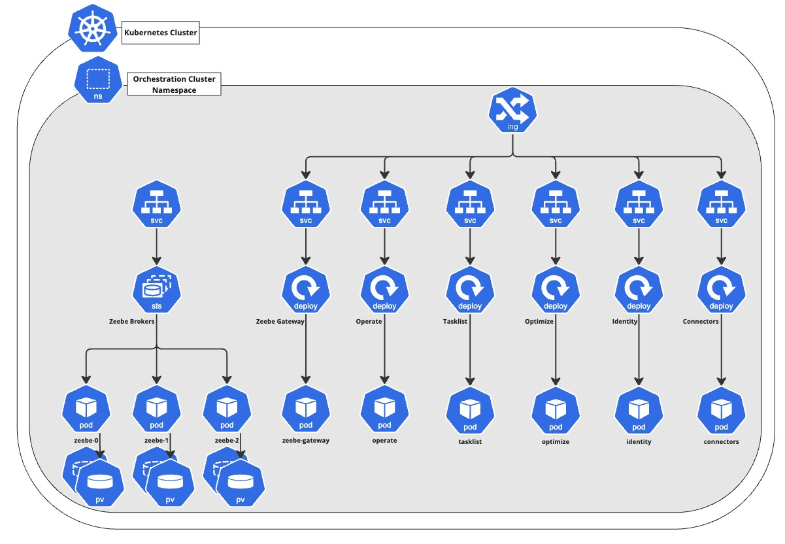
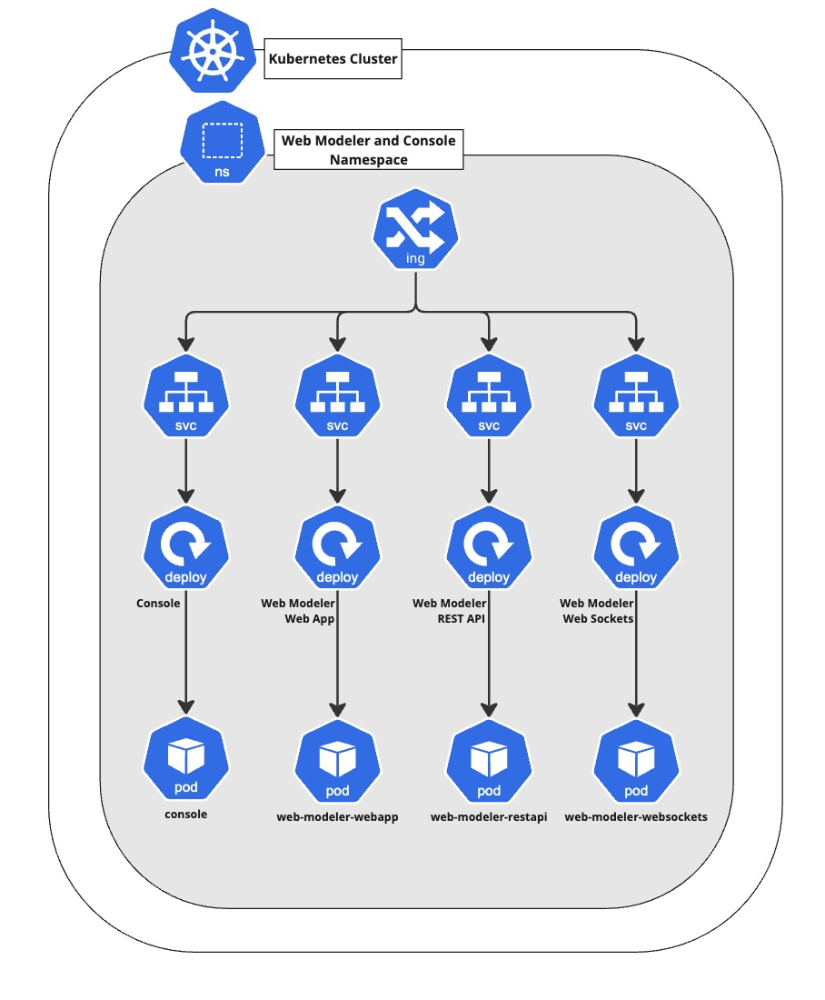

This reference architecture provides guidance on deploying Camunda 8 Self-Managed within a Kubernetes cluster. This deployment method is ideal for users who are looking to leverage the benefits of containerization and self-healing capabilities. It is suited for quick scalability, and can provide additional resilience by utilizing multi-zone deployments.

## Key features

- **Scalability & High Availability**: Camunda 8 can scale up and down depending on your demand, and makes use of a highly available setup.
- **Fault Tolerance & Resilience**: Scale Camunda 8 across zones or across regions to provide greater fault tolerance and uptime for your workflows.

Although Kubernetes has a steeper learning curve, once properly configured, it provides significant advantages, including self-healing capabilities that ensure application resilience by automatically restarting failed containers and rescheduling workloads.

Additionally, Kubernetes benefits from a vast ecosystem of **[Cloud Native Computing Foundation (CNCF) projects](https://www.cncf.io/)**, offering seamless integration with monitoring, observability, logging, and security solutions. Tools like Prometheus and Grafana allow for comprehensive monitoring, while service meshes such as Istio enhance traffic management and security.

By leveraging this ecosystem, organizations can extend Kubernetes functionality to meet their specific operational needs, enabling greater automation, scalability, and visibility across their infrastructure.

## Reference implementations

This section includes deployment reference architectures for manual setups:

- [Amazon EKS single-region](/self-managed/setup/deploy/amazon/amazon-eks/terraform-setup.md): a standard production setup.
- [Amazon EKS dual-region](/self-managed/setup/deploy/amazon/amazon-eks/dual-region.md): an advanced use case utilizing two regions.

For general deployment pitfalls, visit the [deployment troubleshooting guide](/self-managed/operational-guides/troubleshooting/troubleshooting.md).

## Architecture

_Infrastructure diagram for a single region setup (click on the image to open the PDF version):_
[](./img/k8s-single.pdf)

This Kubernetes architecture diagram illustrates a high-availability setup spanning multiple availability zones (A, B, and C) with key networking components to ensure scalability, security, and reliability. Whenever possible, we recommend leveraging multiple availability zones to enhance fault tolerance and eliminate single points of failure.

For controlled access, we suggest deploying Camunda 8 within a private subnet while managing incoming traffic through an Ingress and Load Balancer.

The database is not depicted in the diagram, as we recommend handling it externally from the Kubernetes cluster. The implementation depends on organizational requirements, often residing within the same private network or even the same private subnets. Many companies maintain dedicated database setups, granting access only as needed.

### Kubernetes

:::note
The reference architecture overview describes the difference between the [Orchestration cluster and Web Modeler and Console](/docs/self-managed/reference-architecture/reference-architecture.md#orchestration-cluster-vs-web-modeler-and-console), and provides additional information on application communication.
:::

A [multi-namespace deployment](/self-managed/setup/guides/multi-namespace-deployment.md) is recommended. For more information, see the [components](#components) section.

The following depictions provide a simplified view of the deployed namespaces using the [Camunda 8 Helm chart](/self-managed/setup/install.md). To keep the diagram clear, ConfigMaps, Secrets, RBAC, and ReplicaSets have been omitted.

#### Orchestration cluster



By default, the Helm chart suggests using a single Ingress for Camunda resources, enabling a unified domain with each application accessible via a different path.

Most applications are stateless and deployed as **Deployments**. However, Zeebe Brokers are an exception, requiring a **StatefulSet** to ensure that volumes are consistently mounted, as pod order and identifiers are crucial.

Zeebe Brokers also have a service but are not directly exposed externally; all requests must pass through the Zeebe Gateway, which is typically used for internal communication as well.

#### Web Modeler and Console



Web Modeler, Console, and Identity are deployed as **Deployments** since they are stateless, with data stored externally in a SQL database. This allows them to be easily scaled as needed.

The namespace has its own Ingress resource, as those are namespace-bound and not cluster-wide resources. This means you will have to use a different subdomain for each Ingress resource. For more details, refer to the [multi-namespace deployment guide](/self-managed/setup/guides/multi-namespace-deployment.md).

### High availability (HA)

:::caution Non-HA importer / archiver
The following concerns **Operate**, **Tasklist**, and **Optimize**:

When scaling from a single pod to multiple, ensure that the `importer / archiver` is enabled on only one pod and disabled on others. Enabling it on multiple pods will cause data inconsistencies. This limitation is known and will be addressed in future updates.

Example configuration options are available for [Operate](/self-managed/operate-deployment/importer-and-archiver.md#configuration), [Optimize]($optimize$/self-managed/optimize-deployment/configuration/system-configuration-platform-8#general-settings), and [Tasklist](/self-managed/tasklist-deployment/importer-and-archiver.md#configuration).
:::

For high availability, a minimum of four Kubernetes nodes are recommended to ensure fault tolerance and support leader election in case of failures. To learn more about the Raft protocol and clustering concepts, refer to the [clustering documentation](/components/zeebe/technical-concepts/clustering.md).

In Kubernetes, Deployments and StatefulSets can be scaled independently of physical machines. Four Kubernetes nodes are recommended based on the default setup of a three-broker Zeebe deployment and all available Camunda 8 components, and the resources this setup requires. Your setup may differ from this default, and may require you to scale more horizontally or vertically to ensure enough capacity depending on your Camunda 8 usage.

The default node affinity settings prevent Zeebe brokers from being scheduled on the same node, requiring a minimum three-node setup. For more details on Kubernetes affinity rules, see the [official documentation](https://kubernetes.io/docs/concepts/scheduling-eviction/assign-pod-node/).

To further enhance fault tolerance, it is recommended to distribute Zeebe brokers and other scaled applications across multiple availability zones using additional affinity rules, ensuring resilience in case of a zone failure.

### Components

A typical Camunda 8 deployment distinguishes between the **Orchestration cluster** and the **Web Modeler and Console**. These clusters should be separated by utilizing [Kubernetes namespaces](https://kubernetes.io/docs/concepts/overview/working-with-objects/namespaces/), though running within a single namespace is possible.

A multi-namespace setup allows you to duplicate and run multiple Orchestration clusters based on different use cases and requirements, while Web Modeler and Console remains independent, and does not need to be scaled the same way. The same applies to Identity as a central entity coordinating access management.

The **Orchestration cluster** namespace, as outlined in the [architecture diagram](#orchestration-cluster), consists of the following components:

- [Zeebe Brokers](/components/zeebe/technical-concepts/architecture.md#brokers)
- [Zeebe Gateway](/self-managed/zeebe-deployment/zeebe-gateway/zeebe-gateway-overview.md)
- [Operate](/components/operate/operate-introduction.md)
- [Tasklist](/components/tasklist/introduction-to-tasklist.md)
- [Optimize]($optimize$/components/what-is-optimize)
- [Connectors](/components/connectors/introduction.md)

The **Web Modeler and Console** namespace, as outlined in the [architecture diagram](#web-modeler-and-console), consists of the following components:

- Web Modeler
- [Console](/self-managed/console-deployment/overview.md)
- [Identity](/self-managed/identity/what-is-identity.md)
  - Keycloak, an external dependency of Identity

The **Orchestration cluster** should be configured to use the central Identity of the **Web Modeler and Console** namespace.

## Requirements

This guide focuses on a single-region application, but can be adapted for a multi-region setup once you understand the basics of a single region.

For more details on multi-region configurations, especially dual-region setups, refer to the [dedicated guide](/self-managed/concepts/multi-region/dual-region.md).

### Infrastructure

We recommend using an officially [certified Kubernetes](https://www.cncf.io/training/certification/software-conformance/#benefits) distribution.

Camunda 8 is not tied to a specific Kubernetes version. To simplify deployment, we provide a [Helm chart](/self-managed/setup/install.md) for easy installation on Kubernetes. The latest Helm chart is typically compatible with Kubernetes' [official support cycle](https://kubernetes.io/releases/).

#### Minimum cluster requirements

The following are suggested minimum requirements. Sizing depends heavily on your specific use cases and workload. See [sizing your environment](/components/best-practices/architecture/sizing-your-environment.md) and [Zeebe resource planning](/self-managed/zeebe-deployment/operations/resource-planning.md) for additional resources, conduct benchmarking to determine your exact requirements.

- 4 Kubernetes Nodes
  - Modern CPU: 4 Cores
  - Memory: 16 GiB
- Persistent Volumes
  - 1,000 IOPS
  - 32 GiB size
  - _avoid burstable disk types_

#### Networking

Networking is largely managed through services and Load Balancers. The following describes networking requirements, including port usage, which may be necessary if explicit whitelisting is required within a private network.

- Stable, high-speed network connection
- Configured firewall rules to allow necessary traffic:
  - **80**: Web UI (Console, Identity, Keycloak, Operate, Optimize, Tasklist, Web Modeler)
  - **82**: Metrics endpoint (Identity)
  - **8080**: REST endpoint (Connectors, Keycloak, Zeebe Gateway)
  - **8071 / 8091**: Management endpoint (Web Modeler)
  - **8092**: Management endpoint (Optimize)
  - **9100**: Management endpoint (Console)
  - **9600**: Management endpoint (Operate, Tasklist, Zeebe Brokers, Zeebe Gateway)
  - **26500**: gRPC endpoint.
  - **26501**: Gateway-to-broker communication.
  - **26502**: Inter-broker communication.
- Load Balancer for distributing traffic and exposing Camunda 8 to users (if required)

The exposed Kubernetes service port does not always match the target port of the components. The correct target ports can be found in the rendered Helm chart, or in the configuration pages for each component.

:::note Databases

Database ports are not included, as databases should be maintained outside Camunda, and ports may differ from the upstream defaults.

The defaults for the databases are:

- **5432**: PostgreSQL
- **9200 / 9300**: Elasticsearch/OpenSearch

:::

##### Load Balancer

The Zeebe Gateway requires gRPC, which itself requires HTTP/2 to be used. It is recommended to secure the endpoint with a TLS certificate.

By default, the Camunda 8 Helm chart is compatible with the [Ingress-nginx controller](https://github.com/kubernetes/ingress-nginx), which supports gRPC and HTTP/2. This solution is applicable independent of the cloud provider.

`Ingress-nginx` deploys a Network Load Balancer (layer 4).

The following annotation is added by the Helm chart to enable gRPC:

```yaml
annotations:
  nginx.ingress.kubernetes.io/backend-protocol: "GRPC"
```

### Application

The Helm chart required for deploying on Kubernetes is [publicly available](https://helm.camunda.io/).

Camunda maintains the required Docker images consumed by the Helm chart. These images are available on [DockerHub](https://hub.docker.com/u/camunda). The `Dockerfile` and and its default configuration are available as part of the [Camunda repository](https://github.com/camunda/camunda/blob/stable/8.7/Dockerfile).

### Database

The following databases are required:

- Elasticsearch/OpenSearch
  - required by Operate, Optimize, Tasklist, and Zeebe
- PostgreSQL
  - required by Identity, Keycloak, and Web Modeler

For more information, see the [reference architecture overview](/self-managed/reference-architecture/reference-architecture.md#architecture).

Sizing is use case dependent. It is crucial to conduct thorough load testing and benchmark tests to determine the appropriate size specific to your environment and use case.

Once deployed, the included [Grafana dashboard](/self-managed/zeebe-deployment/operations/metrics.md#grafana) can be used with [Prometheus](https://prometheus.io/) to address bottlenecks when exporting data from Zeebe to your database.

## Cloud specifics

### Amazon EKS

#### Minimum cluster requirements

- Instance type: m6i.xlarge (4 vCPUs, 16 GiB Memory)
- Number of Kubernetes nodes: 4
- Volume type: SSD gp3
  - 3,000 IOPS baseline
  - Requires [Amazon EBS CSI driver](https://docs.aws.amazon.com/eks/latest/userguide/ebs-csi.html) to be installed and a gp3 `StorageClass` [to be configured](https://docs.aws.amazon.com/eks/latest/userguide/create-storage-class.html).
- Volume alternative: gp2
  - Only if gp3 isn't available
  - IOPS performance [varies based on volume size](https://docs.aws.amazon.com/AWSEC2/latest/UserGuide/general-purpose.html#gp2-performance)
  - Minimum 34 GiB for > 1,000 IOPS

#### Load Balancer

The following AWS Load Balancers are supported by Camunda 8:

- Application Load Balancer (ALB)
- Network Load Balancer (NLB)

The Classic Load Balancer (CLB) is the previous generation, and is unsupported by Camunda 8.

##### Application Load Balancer (ALB)

AWS offers an [Application Load Balancer](https://docs.aws.amazon.com/elasticloadbalancing/latest/application/introduction.html) (ALB), which requires TLS termination in the Load Balancer and supports the AWS Certificate Manager (ACM).

Using an Application Load Balancer requires the following:

- A deployed [AWS Load Balancer Controller](https://kubernetes-sigs.github.io/aws-load-balancer-controller/).
- A [certificate set up](https://docs.aws.amazon.com/acm/latest/userguide/gs-acm-request-public.html) in the AWS Certificate Manager (ACM).
- A configured Ingress for Camunda. Follow the [example by AWS](https://github.com/kubernetes-sigs/aws-load-balancer-controller/blob/main/docs/examples/grpc_server.md), which should result in the following following annotations to the Camunda Ingress:
  ```yaml
  alb.ingress.kubernetes.io/ssl-redirect: "443"
  alb.ingress.kubernetes.io/backend-protocol-version: GRPC
  alb.ingress.kubernetes.io/listen-ports: '[{"HTTP": 80}, {"HTTPS":443}]'
  alb.ingress.kubernetes.io/scheme: internet-facing
  alb.ingress.kubernetes.io/target-type: ip
  ```

The setup does not require the configuration of the [TLS on the Ingress](https://kubernetes.io/docs/concepts/services-networking/ingress/#tls). If the AWS Load Balancer Controller is correctly set up, it automatically pulls the correct certificate from ACM based on the host name.

##### Network Load Balancer (NLB)

Camunda 8 is compatible with [Ingress-nginx](https://github.com/kubernetes/ingress-nginx), which deploys a Network Load Balancer. In this setup, TLS must be terminated within the Ingress, and AWS Certificate Manager (ACM) cannot be used. ACM does not allow exporting the private key required for TLS termination within the Ingress.

### Microsoft AKS

#### Minimum cluster requirements

- Instance type: Standard_D4as_v4 (4 vCPUs, 16 GiB Memory)
- Number of Kubernetes nodes: 4
- Volume type: Premium SSD v2
  - 3,000 IOPS baseline
  - several [known limitations](https://learn.microsoft.com/en-us/azure/virtual-machines/disks-types#premium-ssd-v2-limitations)
    - e.g. lack of [Azure Backup support](https://learn.microsoft.com/en-us/azure/backup/disk-backup-support-matrix#limitations)
- Volume alternative: Premium SSD
  - IOPS performance [varies based on volume size](https://learn.microsoft.com/en-us/azure/virtual-machines/disks-types#premium-ssds)
  - Minimum 256 GiB (P15) for > 1,000 IOPS

#### Load Balancer

Azure offers the **Application Gateway for Containers (AGC)**, which supports gRPC and HTTP/2 via the `GRPCRoute` resource in the [Kubernetes Gateway API](https://kubernetes.io/docs/concepts/services-networking/gateway/). Configuration details can be found in [official Azure documentation](https://learn.microsoft.com/en-us/azure/application-gateway/for-containers/grpc).

### Google GKE

#### Minimum cluster requirements

- Instance type: n(1|2)-standard-4 (4 vCPUs, 15 / 16 GB Memory)
- Number of Kubernetes nodes: 4
- Volume type: Performance (SSD) persistent disks
  - IOPS performance [varies based on volume size](https://cloud.google.com/compute/docs/disks/performance#performance_factors)
  - Minimum 34 GiB for > 1,000 IOPS

#### Load Balancer

If you are using the [GKE Ingress](https://cloud.google.com/kubernetes-engine/docs/concepts/ingress) (Ingress-gce), you may need to use `cloud.google.com/app-protocols` annotations in the **Zeebe Gateway** service. For more details, visit the GKE guide [using HTTP/2 for load balancing with Ingress](https://cloud.google.com/kubernetes-engine/docs/how-to/ingress-http2).
