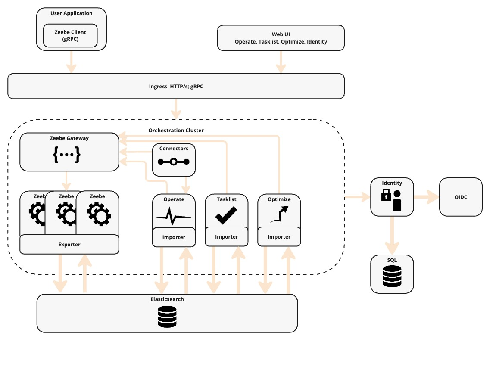
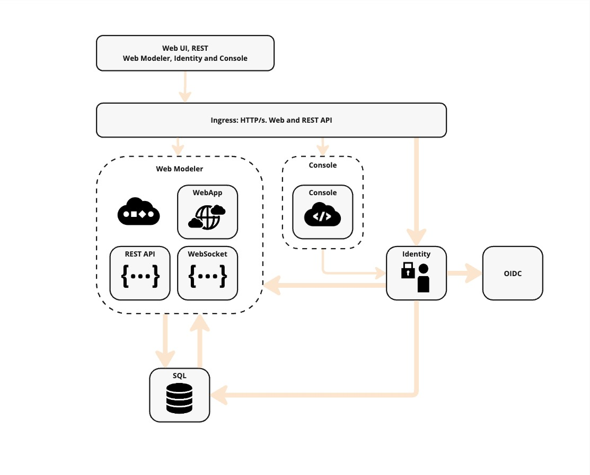

Reference architectures provide a comprehensive blueprint for designing and implementing scalable, robust, and adaptable systems. The reference architectures published here offer guidance to help enterprise architects, developers, and IT managers streamline deployments and improve system reliability.

## Overview

Reference architectures are not a one-size-fits-all solution, and each organization has unique requirements and constraints that may necessitate modifications to the provided blueprints.

While these reference architectures offer a solid foundation and best practices, they should be adapted to fit the specific needs of your project. Use them as a starting point to start your Camunda 8 implementation process, but be prepared to make adjustments to ensure they align with your goals and infrastructure.

### Target users

- **Enterprise architects**: To design and plan the overall system structure.
- **Developers**: To understand the components and their interactions.
- **IT managers**: To ensure the system meets business requirements and is maintainable.

### Key benefits

- **Accelerated deployment**: Predefined best practices and guidelines simplify the deployment process, reducing the time and effort required to set up a reliable workflow automation solution.
- **Consistency**: Ensures consistency across deployments by standardizing system components and their configurations, which helps reduce the risk of errors and simplifies maintenance.
- **Enhanced security**: Reference architectures incorporate best practices for securing Camunda 8 deployments, ensuring that sensitive data and processes are protected through standard security measures like encryption, authentication, and access controls.

### Support considerations

Deviations from the reference architecture are unavoidable. However, such changes will introduce additional complexity, making troubleshooting more difficult. When modifications are required, ensure they are well-documented to facilitate future maintenance and troubleshooting more quickly. Camunda publishes [supported environment](/reference/supported-environments.md) information to help you navigate supported configurations.

## Architecture

### Orchestration cluster vs Web Modeler and Console

When designing a reference architecture, it's essential to understand the differences between an orchestration cluster and Web Modeler and Console Self-Managed. These components play crucial roles in the deployment and operation of processes, but they serve different purposes and include distinct components.

#### Orchestration Cluster

The orchestration cluster is the core of Camunda.

The included components are:

- [Zeebe](/components/zeebe/zeebe-overview.md): A workflow engine for orchestrating microservices and managing stateful, long-running business processes.
- [Operate](/components/operate/operate-introduction.md): A monitoring tool for visualizing and troubleshooting workflows running in Zeebe.
- [Tasklist](/components/tasklist/introduction-to-tasklist.md): A user interface for managing and completing human tasks within workflows.
- [Optimize]($optimize$/components/what-is-optimize/): An analytics tool for generating reports and insights based on workflow data.
- [Identity](/self-managed/identity/what-is-identity.md): A service for managing user authentication and authorization.
- [Connectors](/components/connectors/introduction.md): Pre-built integrations for connecting Zeebe with external systems and services.

Each component within the orchestration cluster is part of an integrated system that works together to provide end-to-end process orchestration. These components form a unified cluster that is tightly integrated to ensure seamless communication and data flow.

This design ensures that all components are in sync, working collectively to maintain consistent state management, data integrity, and smooth process orchestration across the entire cluster. This architecture ensures reliable process execution with clear boundaries between each workflow engine's operation.

#### Web Modeler and Console

Web Modeler and Console are designed to interact with multiple orchestration clusters. Console offers tools and interfaces for administrators to monitor clusters, and Web Modeler allows developers to create and deploy BPMN models.

- [Console](/components/console/introduction-to-console.md): A central management interface for monitoring and managing multiple orchestration clusters.
- [Web Modeler](/self-managed/modeler/web-modeler/installation.md): A web-based tool for designing and deploying workflow models to any available orchestration cluster.

Additionally, Web Modeler and Console require the following:

- [Identity](/self-managed/identity/what-is-identity.md): A service for managing user authentication and authorization.

The Identity deployment is typically a shared entity between the orchestration cluster and Web Modeler and Console. For production environments, using an external [identity provider](/self-managed/setup/guides/connect-to-an-oidc-provider.md) is recommended.

### Databases

Databases can be deployed as part of the Camunda clusters, but using external databases or managed services offers several advantages:

- **Flexibility**: Allows you to choose the database technology that best fits your needs and existing infrastructure while choosing one of the [supported environments](/reference/supported-environments.md#component-requirements).
- **Scalability**: External databases can be scaled independently of the Camunda components, providing better performance and resource management.
- **Maintenance**: Simplifies the maintenance and upgrade processes, as database management can be handled separately.
- **Compliance**: Ensures that you can adhere to specific data governance and compliance requirements.

While some guides go into detail on how to deploy databases together with Camunda, the recommendation is to maintain this outside of Camunda.

By decoupling databases from Camunda, you gain greater control and customization over your data storage and management strategies.

### High availability (HA)

High availability (HA) ensures that a system remains operational and accessible even in the event of component failures. While all components are equipped to be run in a highly available manner, some components need extra considerations when run in HA mode.

For Operate, Optimize, and Tasklist, which include an importer and an archiver module, it's important to note that these modules are not highly available. When scaling, ensure that these modules are disabled for each additional instance, effectively allowing only the Web UI to be scaled.

While high availability is one part of the increased fault tolerance and resilience, you should also consider regional or zonal placement of your workloads.

If you run infrastructure on cloud providers, you are often met with different regions and zones. For ideal high availability you should consider a minimum setup of 3 zones within a region as this will guarantee that in case of a zonal failure that the remaining two workloads can still process data. For more information on how Zeebe handles fault tolerance, have a look at the [raft consensus chapter](/components/zeebe/technical-concepts/clustering.md#raft-consensus-and-replication-protocol).

If running a single instance is preferred, make sure to implement [regular backups](/self-managed/operational-guides/backup-restore/backup-and-restore.md) since resilience will be limited.

## Available reference architectures

:::note Documentation Update in Progress
This is a work in progress as the existing documentation is updated to provide better general guidance on the topic. The Kubernetes and Docker documentation may point to older guides.
:::

Choosing the right reference architecture depends on various factors such as the organization's goals, existing infrastructure, and specific requirements. The following guides are available to help choose and guide deployments:

### Kubernetes

Kubernetes is a powerful orchestration platform for containerized applications. Using a reference architecture for Kubernetes can help organizations deploy and manage their applications more effectively. It provides guidelines for setting up clusters, managing workloads, and ensuring high availability and scalability. This approach is ideal for organizations looking to leverage the benefits of containerization and self-healing capabilities.

- Ideal for organizations adopting containerization and microservices (see [Cloud Native computing foundation](https://www.cncf.io/)).
- Suitable for dynamic scaling and high availability.
- Best for teams with experience in managing containerized environments.
- A steeper learning curve but offers scalable and highly resilient platform.

For more information and guides, see the reference for [Kubernetes](/self-managed/setup/install.md).

<!-- TODO add link or card for AWS ref arch -->

### Containers

Containers, such as Docker, offer a middle ground between the manual JAR and Kubernetes approaches. They provide a lightweight, portable, and consistent runtime environment, making it easier to develop, test, and deploy applications across different environments. Containers encapsulate an application and its dependencies, ensuring that it runs reliably regardless of where it is deployed.

- Advisable as a middle ground between manual JAR and Kubernetes. Profit from containerization while not having the whole overhead of Kubernetes.
- Containers can run on any system that supports the container runtime, ensuring consistency across development, testing, and production environments.
- Each container runs in its own isolated environment, which helps prevent conflicts between applications and improves security.
- Containers can be easily scaled up or down to handle varying workloads, providing flexibility in resource management.

For more information and guides, see the reference for [containers](/self-managed/setup/deploy/other/docker.md).

### Manual JAR (bare metal/virtual machines)

For organizations that prefer traditional infrastructure, reference architectures for bare metal or virtual machines (VMs) offer a structured approach to system deployment. These architectures provide best practices for setting up physical servers or VMs, configuring networks, and managing storage using Infrastructure as Service cloud providers. They are suitable for environments where containerization or use of Kubernetes services may not be feasible.

- Suitable for organizations requiring use of IaaS, bare metal, and other traditional infrastructures.
- Ideal for traditional setups needing highly customized security, strict data residency, or industry-specific regulatory compliance.
- Applicable for high availability but requires more detailed planning.
- Best for teams with expertise in managing physical servers or virtual machines.

:::info

This is being revised for the 8.8 release and will incorporate the new rearchitecture.

:::

### Local development

While the above options are suitable for trying out Camunda 8 locally, [Camunda 8 Run](/self-managed/setup/deploy/local/c8run.md) provides a simplified, developer-focused experience.
