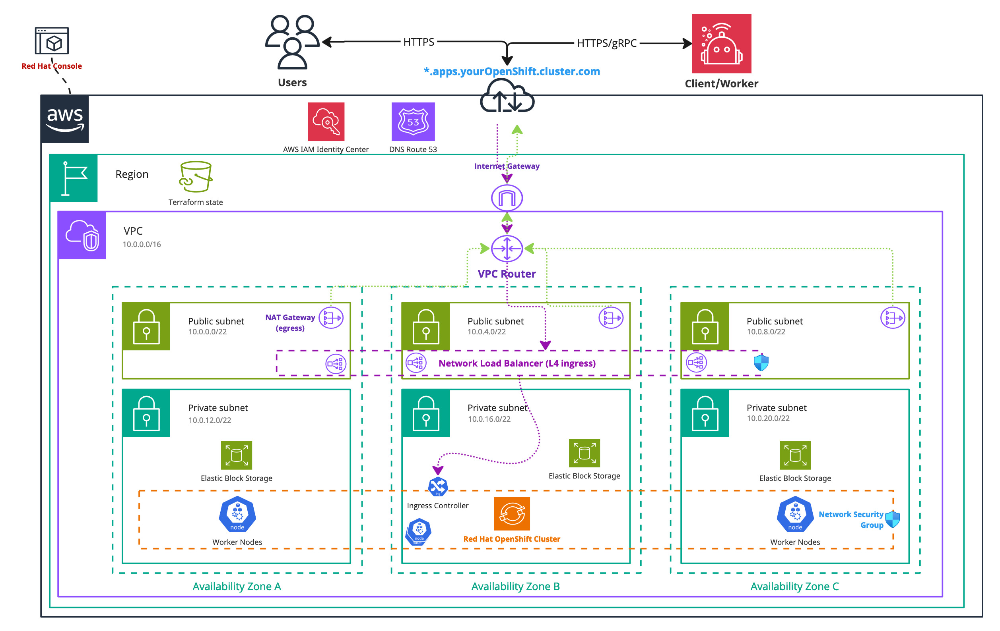
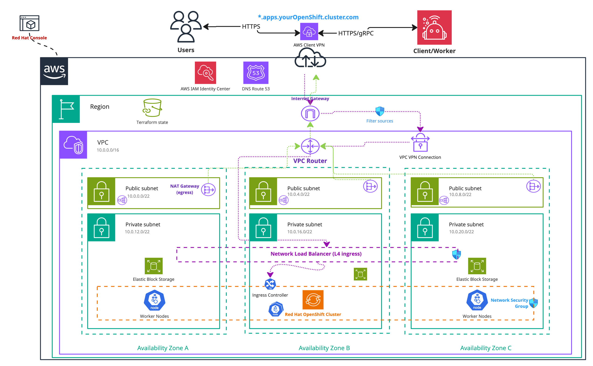

<!-- (!) Note: Please ensure that this guide maintains a consistent structure and presentation style throughout, as with ../amazon-eks/terraform-setup.md. The user should have a similar experience when reading both guides. -->

import Tabs from "@theme/Tabs";
import TabItem from "@theme/TabItem";

This guide provides a detailed tutorial for deploying a [Red Hat OpenShift on AWS (ROSA) cluster with Hosted Control Plane (HCP)](https://docs.redhat.com/en/documentation/red_hat_openshift_service_on_aws_classic_architecture/4/html/architecture/index.html) capabilities. It is specifically tailored for deploying Camunda 8 using Terraform, a widely-used Infrastructure as Code (IaC) tool.

We recommend this guide for building a robust and sustainable infrastructure. However, if you are looking for a quicker trial or proof of concept, or if your needs aren't fully met by our module, consider following the official [ROSA Quickstart Guide](https://docs.redhat.com/en/documentation/red_hat_openshift_service_on_aws_classic_architecture/4/html/getting_started/rosa-quickstart-guide-ui.html).

This guide aims to help you leverage IaC to streamline and reproduce your cloud infrastructure setup. While it covers the essentials for deploying an ROSA HCP cluster, for more advanced use cases, please refer to the official [Red Hat OpenShift on AWS Documentation](https://docs.redhat.com/en/documentation/red_hat_openshift_service_on_aws/4).

:::tip

If you are completely new to Terraform and the idea of IaC, read through the [Terraform IaC documentation](https://developer.hashicorp.com/terraform/tutorials/aws-get-started/infrastructure-as-code) and give their [interactive quick start](https://developer.hashicorp.com/terraform/tutorials/aws-get-started/infrastructure-as-code#quick-start) a try for a basic understanding.

:::

## Requirements

- A [Red Hat Account](https://www.redhat.com/) to create the Red Hat OpenShift cluster.
- An [AWS account](https://docs.aws.amazon.com/accounts/latest/reference/accounts-welcome.html) to create any resources within AWS.
- [AWS CLI](https://docs.aws.amazon.com/cli/latest/userguide/getting-started-install.html), a CLI tool for creating AWS resources.
- [Terraform](https://developer.hashicorp.com/terraform/downloads)
- [kubectl](https://kubernetes.io/docs/tasks/tools/#kubectl) to interact with the cluster.
- [ROSA CLI](https://docs.redhat.com/en/documentation/red_hat_openshift_service_on_aws_classic_architecture/4/html/getting_started/rosa-quickstart-guide-ui.html) to interact with the cluster.
- [jq](https://jqlang.github.io/jq/download/) to interact with some Terraform variables.
- This guide uses GNU/Bash for all the shell commands listed.

For the tool versions used, check the [.tool-versions](https://github.com/camunda/camunda-deployment-references/blob/stable/8.7/.tool-versions) file in the repository. It contains an up-to-date list of versions that we also use for testing.

### Considerations

This setup provides a foundational starting point for working with Camunda 8, though it is not optimized for peak performance. It serves as a solid initial step in preparing a production environment by leveraging [Infrastructure as Code (IaC) tools](https://developer.hashicorp.com/terraform/tutorials/aws-get-started/infrastructure-as-code).

Terraform can initially appear complex. If you're new to it, you might want to start by considering trying out the [Red Hat OpenShift on AWS UI-based tutorial](https://docs.redhat.com/en/documentation/red_hat_openshift_service_on_aws_classic_architecture/4/html/getting_started/rosa-getting-started.html). This guide will show you what resources are created and how they interact with each other.

If you require managed services for PostgreSQL Aurora or OpenSearch, you can refer to the definitions provided in the [EKS setup with Terraform](../amazon-eks/terraform-setup.md) guide. However, please note that these configurations may need adjustments to fit your specific requirements and have not been tested. By default, this guide assumes that the database services (PostgreSQL and Elasticsearch) integrated into the default chart will be used.

For testing Camunda 8 or developing against it, you might consider signing up for our [SaaS offering](https://camunda.com/platform/). If you already have a Red Hat OpenShift cluster on AWS, you can skip ahead to the [Helm setup guide](/self-managed/setup/deploy/openshift/redhat-openshift.md).

To keep this guide concise, we provide links to additional documentation covering best practices, allowing you to explore each topic in greater depth.

:::danger Cost management

Following this guide will incur costs on your cloud provider account and your Red Hat account, specifically for the managed OpenShift service, OpenShift worker nodes running in EC2, the hosted control plane, Elastic Block Storage (EBS), and Route 53. For more details, refer to [ROSA AWS pricing](https://aws.amazon.com/rosa/pricing/) and the [AWS Pricing Calculator](https://calculator.aws/#/) as total costs vary by region.

:::

### Variants

Unlike the [EKS Terraform setup](../amazon-eks/terraform-setup.md), we currently support only one main variant of this setup:

- The **standard installation** uses a username and password connection for Camunda components (or relies solely on network isolation for certain components). This option is straightforward and easier to implement, making it ideal for environments where simplicity and rapid deployment are priorities, or where network isolation provides adequate security.

- The second variant, **IRSA** (IAM Roles for Service Accounts), may work but has not been tested. If you’re interested in setting it up, please refer to the EKS guide as a foundational resource.

### Outcome

<!-- TODO: before merge, replace  => stable/8.7 >

<!-- The following diagram should be exported as an image and as a PDF from the sources https://miro.com/app/board/uXjVL-6SrPc=/ --->
<!-- To export: click on the frame > "Export Image" > as PDF and as JPG (low res), then save it in the ./assets/ folder --->

_Infrastructure diagram for a single region ROSA setup (click on the image to open the PDF version)_
[](./assets/rosa-single-region.pdf)

Following this tutorial and steps will result in:

- A [Red Hat OpenShift with Hosted Control Plane](https://www.redhat.com/en/topics/containers/what-are-hosted-control-planes#rosa-with-hcp) cluster running the latest ROSA version with six nodes ready for Camunda 8 installation.
- The [EBS CSI driver](https://docs.aws.amazon.com/eks/latest/userguide/ebs-csi.html) is installed and configured, which is used by the Camunda 8 Helm chart to create [persistent volumes](https://kubernetes.io/docs/concepts/storage/persistent-volumes/).

## 1. Configure AWS and initialize Terraform

### Obtain a copy of the reference architecture

The first step is to download a copy of the reference architecture from the [GitHub repository](https://github.com/camunda/camunda-deployment-references/blob/stable/8.7/aws/openshift/rosa-hcp-single-region/). This material will be used throughout the rest of this documentation, the reference architecture is versioned using the same Camunda versions (`stable/8.x`).

```bash reference
https://github.com/camunda/camunda-deployment-references/blob/stable/8.7/aws/openshift/rosa-hcp-single-region/procedure/get-your-copy.sh
```

With the reference architecture copied, you can proceed with the remaining steps outlined in this documentation. Ensure that you are in the correct directory before continuing with further instructions.

### Terraform prerequisites

To manage the infrastructure for Camunda 8 on AWS using Terraform, we need to set up Terraform's backend to store the state file remotely in an S3 bucket. This ensures secure and persistent storage of the state file.

:::note
Advanced users may want to handle this part differently and use a different backend. The backend setup provided is an example for new users.
:::

#### Set up AWS authentication

The [AWS Terraform provider](https://registry.terraform.io/providers/hashicorp/aws/latest/docs) is required to create resources in AWS. Before you can use the provider, you must authenticate it using your AWS credentials.

:::caution Ownership of the created resources

A user who creates resources in AWS will always retain administrative access to those resources, including any Kubernetes clusters created. It is recommended to create a dedicated [AWS IAM user](https://docs.aws.amazon.com/IAM/latest/UserGuide/id_users.html) for Terraform purposes, ensuring that the resources are managed and owned by that user.

:::

You can further change the region and other preferences and explore different [authentication](https://registry.terraform.io/providers/hashicorp/aws/latest/docs#authentication-and-configuration) methods:

- For development or testing purposes you can use the [AWS CLI](https://docs.aws.amazon.com/cli/latest/userguide/cli-chap-getting-started.html). If you have configured your AWS CLI, Terraform will automatically detect and use those credentials.
  To configure the AWS CLI:

  ```bash
  aws configure
  ```

  Enter your `AWS_ACCESS_KEY_ID`, `AWS_SECRET_ACCESS_KEY`, region, and output format. These can be retrieved from the [AWS Console](https://docs.aws.amazon.com/IAM/latest/UserGuide/id_credentials_access-keys.html).

- For production environments, we recommend the use of a dedicated IAM user. Create [access keys](https://docs.aws.amazon.com/IAM/latest/UserGuide/id_credentials_access-keys.html) for the new IAM user via the console, and export them as `AWS_ACCESS_KEY_ID` and `AWS_SECRET_ACCESS_KEY`.

#### Create an S3 bucket for Terraform state management

Before setting up Terraform, you need to create an S3 bucket that will store the state file. This is important for collaboration and to prevent issues like state file corruption.

To start, set the region as an environment variable upfront to avoid repeating it in each command:

```bash
export AWS_REGION=<your-region>
```

Replace `<your-region>` with your chosen AWS region (for example, `eu-central-1`).

Now, follow these steps to create the S3 bucket with versioning enabled:

1. Open your terminal and ensure the AWS CLI is installed and configured.

2. Run the following command to create an S3 bucket for storing your Terraform state. Make sure to use a unique bucket name and set the `AWS_REGION` environment variable beforehand:

   ```bash
   # Replace "my-rosa-tf-state" with your unique bucket name
   export S3_TF_BUCKET_NAME="my-rosa-tf-state"
   export S3_TF_BUCKET_REGION="<your-region>"

   aws s3api create-bucket --bucket "$S3_TF_BUCKET_NAME" --region "$S3_TF_BUCKET_REGION" \
     --create-bucket-configuration LocationConstraint="$S3_TF_BUCKET_REGION"
   ```

Replace `<your-region>` with the AWS region where you want to create the S3 bucket (e.g., `us-east-2`).

:::note Region of the bucket's state

This region can be different from the regions used for other resources, but it requires to be set explicitly in the backend configuration using the flag: `-backend-config="region=<your-region>"`.

For clarity, this guide explicitly sets the bucket region in all relevant commands.
:::

Steps to create the S3 bucket with versioning enabled:

1. Enable versioning on the S3 bucket to track changes and protect the state file from accidental deletions or overwrites:

   ```bash
   aws s3api put-bucket-versioning --bucket "$S3_TF_BUCKET_NAME" --versioning-configuration Status=Enabled --region "$S3_TF_BUCKET_REGION"
   ```

2. Secure the bucket by blocking public access:

   ```bash
   aws s3api put-public-access-block --bucket "$S3_TF_BUCKET_NAME" --public-access-block-configuration \
     "BlockPublicAcls=true,IgnorePublicAcls=true,BlockPublicPolicy=true,RestrictPublicBuckets=true" --region "$S3_TF_BUCKET_REGION"
   ```

3. Verify versioning is enabled on the bucket:

   ```bash
   aws s3api get-bucket-versioning --bucket "$S3_TF_BUCKET_NAME" --region "$S3_TF_BUCKET_REGION"
   ```

This S3 bucket will now securely store your Terraform state files with versioning enabled.

### OpenShift cluster module setup

This module sets up the foundational configuration for ROSA HCP and Terraform usage.

We will leverage [Terraform modules](https://developer.hashicorp.com/terraform/language/modules), which allow us to abstract resources into reusable components, simplifying infrastructure management.

The [Camunda-provided module](https://github.com/camunda/camunda-deployment-references/tree/stable/8.7/aws/openshift/rosa-hcp-single-region/terraform/cluster/) is publicly available and serves as a robust starting point for deploying a Red Hat OpenShift cluster on AWS using a Hosted Control Plane. It is highly recommended to review this module before implementation to understand its structure and capabilities.

:::note
This module is based on the official [ROSA HCP Terraform module documentation](https://docs.openshift.com/rosa/rosa_hcp/terraform/rosa-hcp-creating-a-cluster-quickly-terraform.html). It is presented as an example for running Camunda 8 in ROSA.

**For production or advanced use cases or custom setups, we encourage you to use the [official module](https://docs.openshift.com/rosa/rosa_hcp/terraform/rosa-hcp-creating-a-cluster-quickly-terraform.html)**, which includes vendor-supported features.
:::

#### Set up ROSA authentication

To set up a ROSA cluster, certain prerequisites must be configured on your AWS account. Below is an excerpt from the [official ROSA planning prerequisites checklist](https://docs.openshift.com/rosa/rosa_planning/rosa-cloud-expert-prereq-checklist.html):

1. Verify that your AWS account is correctly configured:

   ```bash
   aws sts get-caller-identity
   ```

2. Check if the ELB service role exists, as if you have never created a load balancer in your AWS account, the role for Elastic Load Balancing (ELB) might not exist yet:

   ```bash
   aws iam get-role --role-name "AWSServiceRoleForElasticLoadBalancing"
   ```

   If it doesn't exist, create it:

   ```bash
   aws iam create-service-linked-role --aws-service-name "elasticloadbalancing.amazonaws.com"
   ```

3. Create a Red Hat Hybrid Cloud Console account if you don’t already have one: [Red Hat Hybrid Cloud Console](https://console.redhat.com/).

4. Enable ROSA on your AWS account via the [AWS Console](https://console.aws.amazon.com/rosa/).

5. Enable HCP ROSA on [AWS Marketplace](https://docs.openshift.com/rosa/cloud_experts_tutorials/cloud-experts-rosa-hcp-activation-and-account-linking-tutorial.html):
   - Navigate to the ROSA console: [AWS ROSA Console](https://console.aws.amazon.com/rosa).
   - Choose **Get started**.
   - On the **Verify ROSA prerequisites** page, select **I agree to share my contact information with Red Hat**.
   - Choose **Enable ROSA**.

   **Note**: Only a single AWS account can be associated with a Red Hat account for service billing.

6. Install the ROSA CLI from the [OpenShift AWS Console](https://console.redhat.com/openshift/downloads#tool-rosa).

7. Get an API token, go to the [OpenShift Cluster Management API Token](https://console.redhat.com/openshift/token/rosa), click **Load token**, and save it. Use the token to log in with ROSA CLI:

   ```bash
   export RHCS_TOKEN="<yourToken>"
   rosa login --token="$RHCS_TOKEN"

   # Verify the login
   rosa whoami
   ```

8. Verify your AWS quotas:

   ```bash
   rosa verify quota --region="$AWS_REGION"
   ```

   **Note**: This may fail due to organizational policies.

9. Create the required account roles:

   ```bash
   rosa create account-roles --mode auto
   ```

10. Verify your AWS quotas, and if quotas are insufficient, consult the following:

- [Provisioned AWS Infrastructure](https://docs.openshift.com/rosa/rosa_planning/rosa-sts-aws-prereqs.html#rosa-aws-policy-provisioned_rosa-sts-aws-prereqs)
- [Required AWS Service Quotas](https://docs.openshift.com/rosa/rosa_planning/rosa-sts-required-aws-service-quotas.html#rosa-sts-required-aws-service-quotas)

11. Ensure the `oc` CLI is installed. If it’s not already installed, follow the [official ROSA oc installation guide](https://docs.openshift.com/rosa/cli_reference/openshift_cli/getting-started-cli.html#cli-getting-started):

```bash
rosa verify openshift-client
```

#### Set up the ROSA cluster module

1. Ensure you are in the [reference architecture directory of the cloned repository](#obtain-a-copy-of-the-reference-architecture): `./aws/openshift/rosa-hcp-single-region/terraform/`. Then, navigate into the `cluster` module:

   ```bash
   ls
   # Example output:
   # cluster  vpn

   cd cluster
   ```

2. Review the module configuration file `config.tf`.
   This configuration will use the previously created S3 bucket for storing the Terraform state file:

   ```hcl reference
   https://github.com/camunda/camunda-deployment-references/blob/stable/8.7/aws/openshift/rosa-hcp-single-region/terraform/cluster/config.tf
   ```

3. Edit the `cluster.tf` file in the same directory as your `config.tf` file:

   :::note Configure your cluster

   Customize the cluster name, availability zones, with the values you previously retrieved from the Red Hat Console.
   Additionally, provide a secure username and password for the cluster administrator.

   Ensure that you have set the environment variable `RHCS_TOKEN` with your [OpenShift Cluster Management API Token](https://console.redhat.com/openshift/token/rosa).
   :::

   :::note Private cluster

   By default, this cluster is accessible from the internet.
   If you prefer to restrict access, set `locals.rosa_private_cluster = true`. This will create a [private cluster](https://cloud.redhat.com/experts/rosa/private-link/) that is only accessible through the [private subnets](https://docs.aws.amazon.com/vpc/latest/userguide/configure-subnets.html) of your VPC. Optionally, you can still expose a public ingress: [learn more](https://cloud.redhat.com/experts/rosa/private-link/public-ingress/).

   ⚠️ Since private subnets are not reachable from the internet, you'll need to establish a connection between your network and the cluster. This can be done using a [bastion host](https://docs.aws.amazon.com/mwaa/latest/userguide/tutorials-private-network-bastion.html) or a Client VPN.

The [VPN module setup section](#vpn-module-setup) will guide you through setting up an [AWS VPN Endpoint](https://docs.aws.amazon.com/vpn/latest/clientvpn-admin/cvpn-getting-started.html), which allows secure access to the private cluster.

:::

```hcl reference
https://github.com/camunda/camunda-deployment-references/blob/stable/8.7/aws/openshift/rosa-hcp-single-region/terraform/cluster/cluster.tf
```

:::caution Camunda Terraform module

This ROSA module is based on the [official Red Hat Terraform module for ROSA HCP](https://registry.terraform.io/modules/terraform-redhat/rosa-hcp/rhcs/latest). Please be aware of potential differences and choices in implementation between this module and the official one.

We invite you to consult the [Camunda ROSA module documentation](https://github.com/camunda/camunda-deployment-references/tree/stable/8.7/aws/modules/rosa-hcp/README.md) for more information.

:::

4. After setting up the terraform files and ensuring your AWS authentication is configured, initialize your Terraform project, then, initialize Terraform to [configure the backend](#create-an-s3-bucket-for-terraform-state-management) and download necessary provider plugins:

   ```bash
   export S3_TF_BUCKET_KEY_CLUSTER="camunda-terraform/cluster.tfstate"

   echo "Storing cluster terraform state in s3://$S3_TF_BUCKET_NAME/$S3_TF_BUCKET_KEY_CLUSTER"

   terraform init -backend-config="bucket=$S3_TF_BUCKET_NAME" -backend-config="key=$S3_TF_BUCKET_KEY_CLUSTER" -backend-config="region=$S3_TF_BUCKET_REGION"
   ```

   Terraform will connect to the S3 bucket to manage the state file, ensuring remote and persistent storage.

5. Configure user access to the cluster. By default, the user who creates the OpenShift cluster has administrative access. If you want to grant access to other users, follow the [Red Hat documentation for granting admin rights to users](https://docs.openshift.com/rosa/cloud_experts_tutorials/cloud-experts-getting-started/cloud-experts-getting-started-admin-rights.html) when the cluster is created.

6. Customize the cluster setup. The module offers various input options that allow you to further customize the cluster configuration. For a comprehensive list of available options and detailed usage instructions, refer to the [ROSA module documentation](https://github.com/camunda/camunda-deployment-references/blob/stable/8.7/aws/modules/rosa-hcp/README.md).

#### Define outputs

**Terraform** allows you to define outputs, which make it easier to retrieve important values generated during execution, such as cluster endpoints and other necessary configurations for Helm setup.

Each module that you have previously set up contains an output definition at the end of the file. You can adjust them to your needs.

#### Execution

:::note Secret management

We strongly recommend managing sensitive information (for example, the administrator username and password) using a secure secrets management solution like HashiCorp Vault. For details on how to inject secrets directly into Terraform via Vault, see the [Terraform Vault Secrets Injection Guide](https://developer.hashicorp.com/terraform/tutorials/secrets/secrets-vault).

:::

1. Plan the configuration files:

   ```bash
   terraform plan -out cluster.plan # describe what will be created
   ```

2. After reviewing the plan, you can confirm and apply the changes.

   ```bash
   terraform apply cluster.plan     # creates the resources
   ```

Terraform will now create the OpenShift cluster with all the necessary configurations. The completion of this process may require approximately 20-30 minutes for each component.

### VPN module setup

This section guides you through setting up an AWS VPN Endpoint to access a private cluster.

This step is **optional** and only necessary if you have configured a **private cluster**.

Using a VPN offers a flexible and secure way to connect to the private subnets within your VPC. It can be used either by a user to access cluster resources or to enable cross-site communications via [PrivateLink](https://docs.aws.amazon.com/vpc/latest/privatelink/what-is-privatelink.html). This module focuses on user access.

<!-- The following diagram should be exported as an image and as a PDF from the sources https://miro.com/app/board/uXjVL-6SrPc=/ --->
<!-- To export: click on the frame > "Export Image" > as PDF and as JPG (low res), then save it in the ./assets/ folder --->

_Infrastructure diagram for a single region ROSA setup with VPN (click on the image to open the PDF version)_
[](./assets/rosa-single-region-vpn.pdf)

AWS VPN technology is compatible with OpenVPN clients. It uses [x509 certificates](https://docs.aws.amazon.com/vpn/latest/clientvpn-admin/mutual.html) for mutual authentication and source verification.
The encryption provided by these certificates ensures that traffic can securely transit over the internet to the AWS VPN endpoint, which performs NAT and routes the traffic directly into the private subnets. This VPN endpoint thus becomes the sole access point to the private cluster.

#### Retrieve the VPC cluster ID

To create the VPN Endpoint in your cluster’s VPC, you need to retrieve the VPC ID using [Terraform outputs](https://developer.hashicorp.com/terraform/language/values/outputs) from the [OpenShift cluster module](#openshift-cluster-module-setup). Follow these steps:

1. Ensure you are in the [reference architecture directory of the cloned repository](#obtain-a-copy-of-the-reference-architecture): `./aws/openshift/rosa-hcp-single-region/terraform/`.
   Navigate to the `cluster` module directory inside your reference architecture repository, for example:

   ```bash
   ls
   # Example output:
   # cluster vpn

   cd cluster
   ```

2. Export the [VPC ID](https://registry.terraform.io/providers/hashicorp/aws/latest/docs/data-sources/vpc) to an environment variable:

   ```bash
   export CLUSTER_VPC_ID="$(terraform output -raw vpc_id)"
   echo "CLUSTER_VPC_ID=$CLUSTER_VPC_ID"
   ```

#### Set up the VPN module

From the parent directory containing your cluster module, go to the `vpn` directory which holds the VPN endpoint configuration.

This setup creates a Certificate Authority (CA) for AWS VPN to perform encryption and mutual client authentication. For simplicity, the CA and generated certificates are stored in the project’s Terraform state (`tfstate`). You may customize this as needed.

Start by reviewing the `config.tf` file that configures the S3 backend for Terraform state management:

```hcl reference
https://github.com/camunda/camunda-deployment-references/blob/stable/8.7/aws/openshift/rosa-hcp-single-region/terraform/vpn/config.tf
```

Then, review `vpn.tf`, which describes the VPC Client Endpoint configuration:

```hcl reference
https://github.com/camunda/camunda-deployment-references/blob/stable/8.7/aws/openshift/rosa-hcp-single-region/terraform/vpn/vpn.tf
```

This VPN Client Endpoint follows [AWS best practices and constraints](https://docs.aws.amazon.com/vpn/latest/clientvpn-admin/what-is-best-practices.html):

- Uses a client CIDR range that does not overlap with the VPC CIDR or any manually added VPN route table routes.
- Implements [split-tunnel routing](https://docs.aws.amazon.com/vpn/latest/clientvpn-admin/split-tunnel-vpn.html), so only traffic destined for the VPC goes through the VPN, minimizing bandwidth use.
- Supports IPv4 only and is bound to the VPC’s private subnets.

1. Set your Terraform state key and initialize Terraform with the S3 [backend](#create-an-s3-bucket-for-terraform-state-management) and download necessary provider plugins:

   ```bash
   export S3_TF_BUCKET_KEY_VPN="camunda-terraform/vpn.tfstate"

   echo "Storing cluster terraform state in s3://$S3_TF_BUCKET_NAME/$S3_TF_BUCKET_KEY_VPN"

   terraform init -backend-config="bucket=$S3_TF_BUCKET_NAME" -backend-config="key=$S3_TF_BUCKET_KEY_VPN" -backend-config="region=$S3_TF_BUCKET_REGION"
   ```

   Terraform will connect to the S3 bucket to manage the state file, ensuring remote and persistent storage.

2. For each client connecting to the cluster, assign a unique name in `client_key_names` to simplify certificate revocation.

3. By default, VPN access is allowed from any IP address. You may restrict access by adjusting the `vpn_allowed_cidr_blocks` variable.

4. Network designs vary; review and adjust the configuration to fit your topology.

5. Customize the VPN module by referring to the [VPN module documentation](https://github.com/camunda/camunda-deployment-references/blob/stable/8.7/aws/modules/vpn/README.md).

#### Outputs

The module stores certificates and VPN client configurations in the Terraform state. The next section explains how to retrieve and use client configurations.

#### Execution

1. Generate a Terraform plan for the VPN Client Endpoint configuration.
   This will use the private subnets of the designated VPC:

   ```bash
   # describe what will be created
   terraform plan -out vpn.plan \
    -var vpc_id="$CLUSTER_VPC_ID"
   ```

2. Review and apply the plan to create the resources:

   ```bash
   terraform apply vpn.plan     # creates the resources
   ```

Creation of the VPN Client Endpoint typically takes about 10 minutes. After completion, the client configurations will be available in the Terraform output `vpn_client_configs`.

### Reference files

Depending on the installation path you have chosen, you can find the reference files used on this page:

- **Standard installation:** [Reference Files](https://github.com/camunda/camunda-deployment-references/tree/stable/8.7/aws/openshift/rosa-hcp-single-region/)

## 2. Preparation for Camunda 8 installation

### Access to the private network using the VPN

This section applies if you have previously created a private cluster and want to access it using the [VPN module configured earlier](#vpn-module-setup).

1. Navigate to the VPN module directory (`vpn`):

   ```bash
   pwd

   # Example output:
   # ./camunda-deployment-references/aws/openshift/rosa-hcp-single-region/terraform/vpn/
   ```

2. Generate your client’s VPN configuration file. This file is compatible with [OpenVPN (ovpn)](https://openvpn.net/) format:

   ```bash reference
   https://github.com/camunda/camunda-deployment-references/blob/stable/8.7/aws/openshift/rosa-hcp-single-region/procedure/gather-vpn-config.sh
   ```

3. Import the generated configuration file (`my-client.ovpn`) into an OpenVPN client:
   - _(preferred)_ [Official AWS VPN Client](https://docs.aws.amazon.com/vpn/latest/clientvpn-user/connect-aws-client-vpn-connect.html)
   - [Other OpenVPN Clients](https://docs.aws.amazon.com/vpn/latest/clientvpn-user/connect.html)

4. Once the VPN client is connected, you will have secure access to the VPC’s private network.

### Access the created OpenShift cluster

You can access the created OpenShift cluster using the following steps:

1. Verify that you are in the [OpenShift clusters module](#openshift-clusters-module-setup) directory `clusters`:

   ```bash
   pwd

   # Example output:
   # ./camunda-deployment-references/aws/openshift/rosa-hcp-single-region/terraform/cluster/
   ```

2. Set up the required environment variables from the OpenShift terraform module:

   ```bash reference
   https://github.com/camunda/camunda-deployment-references/blob/stable/8.7/aws/openshift/rosa-hcp-single-region/procedure/gather-cluster-login-id.sh
   ```

3. If you want to give cluster administrator access to the created user, this is not required for a standard installation but can be useful for debugging:

   ```shell
   rosa grant user cluster-admin --cluster="$CLUSTER_NAME" --user="$CLUSTER_ADMIN_USERNAME"
   ```

4. Log in to the OpenShift cluster:

   ```shell
   oc login -u "$CLUSTER_ADMIN_USERNAME" "$CLUSTER_API_URL" -p "$CLUSTER_ADMIN_PASSWORD"
   ```

   Clean up and configure the kubeconfig context:

   ```shell
   oc config rename-context $(oc config current-context) "$CLUSTER_NAME"
   oc config use-context "$CLUSTER_NAME"
   ```

5. Verify your connection to the cluster with `oc`:

   ```shell
   oc get nodes
   ```

6. Create a project for Camunda using `oc`:

   ```shell
   oc new-project camunda
   ```

   In the remainder of the guide, the `camunda` namespace part of the Camunda project will be referenced to create the required resources in the Kubernetes cluster, such as secrets or one-time setup jobs.

## 3. Install Camunda 8 using the Helm chart

Now that you've exported the necessary values, you can proceed with installing Camunda 8 using Helm charts. Follow the guide [Camunda 8 on OpenShift](/self-managed/setup/deploy/openshift/redhat-openshift.md) for detailed instructions on deploying the platform to your OpenShift cluster.
