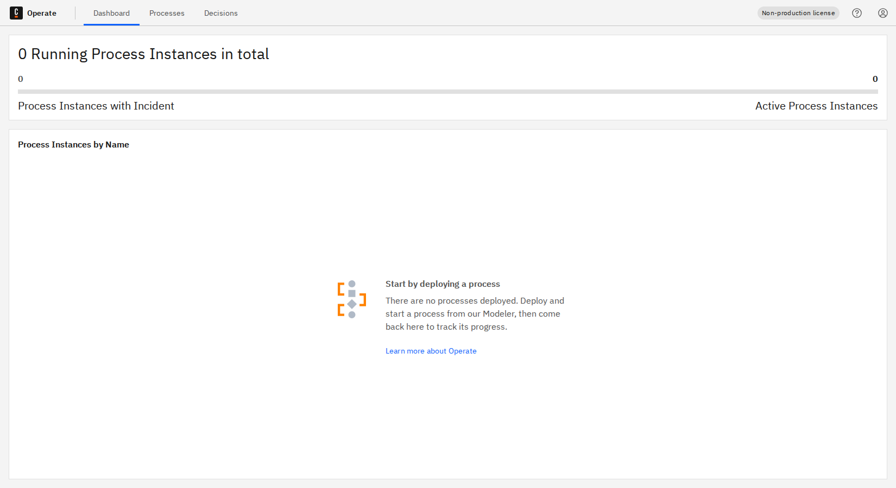
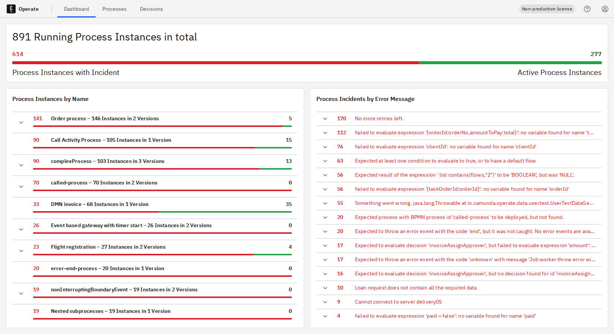
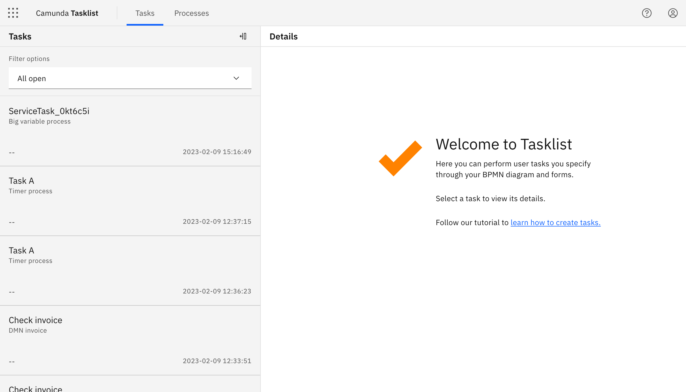

This page guides you through the manual installation of the Camunda 8 on a local or virtual machine.

## Prerequisites

- Operating system:
  - Linux
  - Windows/macOS (development only, not supported for production)
- Java Virtual Machine, see [supported environments](/reference/supported-environments.md) for version details
- Elasticsearch, see [supported environments](/reference/supported-environments.md) for version details

Make sure to configure the web applications to use a port that is available. By default the web applications like Operate and Tasklist listen both to port 8080.

## Download a compatible set of Camunda 8 components

Tasklist, Operate and Zeebe distributions are available for download on the [release page](https://github.com/camunda/camunda-platform/releases). Every release contains a set of compatible versions of the various components, ensure you download and use compatible versions.

All Connector-related resources are available on [Maven Central](https://search.maven.org/search?q=g:io.camunda.connector). Make sure to download `*-jar-with-dependencies.jar` files in order to run Connectors locally including their necessary dependencies.
Note that some out-of-the-box Connectors are licensed under the [Camunda Self-Managed Free Edition license](https://camunda.com/legal/terms/cloud-terms-and-conditions/camunda-cloud-self-managed-free-edition-terms/).
Find an overview in the [Connectors Bundle project](https://github.com/camunda/connectors-bundle).

## Download and run Elasticsearch

Operate, Tasklist, and Optimize use Elasticsearch as its underlying data store. Therefore you have to download and run Elasticsearch.

:::note
Please ensure to check compatability of [supported environments](/reference/supported-environments.md) for your self-managed installation.
:::

To run Elasticsearch, execute the following commands:

```shell
cd elasticsearch-*
bin/elasticearch
```

You’ll know Elasticsearch has started successfully when you see a message similar to the following:

```log
[INFO ][o.e.l.LicenseService     ] [-IbqP-o] license [72038058-e8ae-4c71-81a1-e9727f2b81c7] mode [basic] - valid
```

## Optional: configure license key

import Licensing from '../../../../self-managed/react-components/licensing.md'

<Licensing/>

## Run Zeebe

Once you've downloaded a Zeebe distribution, extract it into a folder of your choice.

To extract the Zeebe distribution and start the broker, **Linux users** can type the following:

```shell
tar -xzf zeebe-distribution-X.Y.Z.tar.gz -C zeebe/
./bin/broker
```

For **Windows users**, take the following steps:

1. Download the `.zip` package.
2. Extract the package using your preferred unzip tool.
3. Open the extracted folder.
4. Navigate to the `bin` folder.
5. Start the broker by double-clicking on the `broker.bat` file.

Once the Zeebe Broker has started, it should produce the following output:

```log
23:39:13.246 [] [main] INFO  io.camunda.zeebe.broker.system - Scheduler configuration: Threads{cpu-bound: 2, io-bound: 2}.
23:39:13.270 [] [main] INFO  io.camunda.zeebe.broker.system - Version: X.Y.Z
23:39:13.273 [] [main] INFO  io.camunda.zeebe.broker.system - Starting broker with configuration {
```

To run Zeebe with the Elasticsearch Exporter that is needed for Operate, Tasklist and Optimize to work, execute the following commands:

```shell
cd camunda-cloud-zeebe-*
ZEEBE_BROKER_EXPORTERS_ELASTICSEARCH_CLASSNAME=io.camunda.zeebe.exporter.ElasticsearchExporter ./bin/broker
```

You’ll know Zeebe has started successfully when you see a message similar to the following:

```log
[partition-0] [0.0.0.0:26501-zb-actors-0] INFO  io.camunda.zeebe.raft - Joined raft in term 0
[exporter] [0.0.0.0:26501-zb-actors-1] INFO  io.camunda.zeebe.broker.exporter.elasticsearch - Exporter opened
```

You can test the Zeebe Gateway by asking for the cluster topology with [zbtcl](/apis-tools/community-clients/cli-client/index.md#usage):

```shell
./bin/zbctl --insecure status
```

`zbctl status` should produce an output like this:

```
Cluster size: 1
Partitions count: 1
Replication factor: 1
Gateway version: 8.1.6
Brokers:
  Broker 0 - 0.0.0.0:26501
    Version: 8.1.6
    Partition 1 : Leader, Healthy
```

## Run Operate

To run Operate, execute the following command:

```shell
cd camunda-cloud-operate-*
bin/operate
```

You’ll know Operate has started successfully when you see messages similar to the following:

```log
DEBUG 1416 --- [       Thread-6] o.c.o.e.w.BatchOperationWriter           : 0 operations locked
DEBUG 1416 --- [       Thread-4] o.c.o.z.ZeebeESImporter                  : Latest loaded position for alias [zeebe-record-deployment] and partitionId [0]: 0
INFO 1416 --- [       Thread-4] o.c.o.z.ZeebeESImporter                  : Elasticsearch index for ValueType DEPLOYMENT was not found, alias zeebe-record-deployment. Skipping.
```

Now the Operate web interface is available at [http://localhost:8080](http://localhost:8080).

The first screen you'll see is a sign-in page. Use the credentials `demo` / `demo` to sign in.

After you sign in, you'll see an empty dashboard if you haven't yet deployed any processes:



If you _have_ deployed processes or created process instances, you'll see them on your dashboard:



To update Operate versions, visit the [guide to update guide](/self-managed/operational-guides/update-guide/introduction.md).

## Run Tasklist

To run Tasklist, execute the following commands:

```shell
cd camunda-cloud-tasklist-*
./bin/tasklist
```

You’ll know Tasklist has started successfully when you see messages similar to the following:

```log
2020-12-09 13:31:41.437  INFO 45899 --- [           main] i.z.t.ImportModuleConfiguration          : Starting module: importer
2020-12-09 13:31:41.438  INFO 45899 --- [           main] i.z.t.ArchiverModuleConfiguration        : Starting module: archiver
2020-12-09 13:31:41.555  INFO 45899 --- [           main] i.z.t.w.StartupBean                      : Tasklist Version: 1.0.0
```

The Tasklist web interface is available at [http://localhost:8080](http://localhost:8080). Note, that this is the same default port as Operate, so you might have to configure Tasklist (or Operate) to use another port:

```shell
cd camunda-cloud-tasklist-*
SERVER_PORT=8081 ./bin/tasklist
```

The first screen you'll see is a sign-in page. Use the credentials `demo` / `demo` to sign in.

If you've already developed user tasks in Zeebe, you can see these on the left panel on the start screen:



## Run Connectors

### Bundle

Bundle includes runtime with all available Camunda Connectors.

The [Connector runtime bundle](https://repo1.maven.org/maven2/io/camunda/connector/connector-runtime-bundle/) picks up
outbound Connectors available on the `classpath` automatically.
It uses the default configuration specified by a Connector through its `@OutboundConnector` and `@InboundConnector` annotations.

Consider the following file structure:

```shell
/home/user/bundle-with-connector $
├── connector-runtime-bundle-VERSION-with-dependencies.jar
└── my-custom-connector-0.1.0-SNAPSHOT-with-dependencies.jar
```

To start Connectors bundle with all custom Connectors locally, run:

```shell
java -cp "/home/user/bundle-with-connector/*" "io.camunda.connector.runtime.app.ConnectorRuntimeApplication"
```

This starts a Zeebe client, registering the defined Connector as a job worker. By default, it connects to a local Zeebe instance at port `26500`.

### Runtime-only

Runtime-only variant is useful when you wish to run only specific Connectors.

The [Connector runtime bundle](https://repo1.maven.org/maven2/io/camunda/connector/connector-runtime-application/) picks up
outbound Connectors available on the `classpath` automatically.
It uses the default configuration specified by a Connector through its `@OutboundConnector` and `@InboundConnector` annotations.

Consider the following file structure:

```shell
/home/user/runtime-only-with-connector $
├── connector-runtime-application-VERSION-with-dependencies.jar
└── my-custom-connector-0.1.0-SNAPSHOT-with-dependencies.jar
```

To start Connector runtime with all custom Connectors locally, run:

```shell
java -cp "/home/user/runtime-only-with-connector/*" "io.camunda.connector.runtime.app.ConnectorRuntimeApplication"
```

This starts a Zeebe client, registering the defined Connector as a job worker. By default, it connects to a local Zeebe instance at port `26500`.

### Configuring runtime

Visit the [Camunda Connector Runtime GitHub page](https://github.com/camunda/connectors/tree/main/connector-runtime#configuration-options)
to find up-to-date runtime configuration options.

## Run Identity

A local setup of Identity in Camunda 8 is not yet supported out-of-the-box, use [Docker](/self-managed/setup/deploy/other/docker.md) instead.

## Run Optimize

The installation of Optimize is described in [Optimize Setup]($optimize$/self-managed/optimize-deployment/install-and-start). A local setup in Camunda 8 is not yet supported out-of-the-box, use [Docker](/self-managed/setup/deploy/other/docker.md#optimize) instead.

## Run Web Modeler

A local setup of Web Modeler in Camunda 8 is not yet supported out-of-the-box, use [Docker](/self-managed/setup/deploy/other/docker.md#web-modeler) instead.
