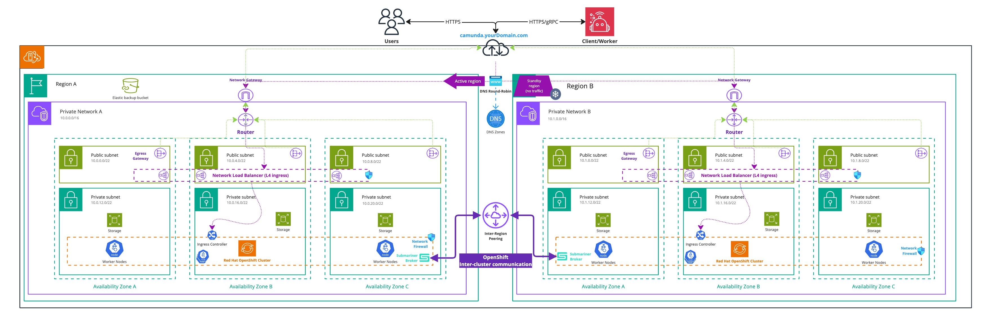
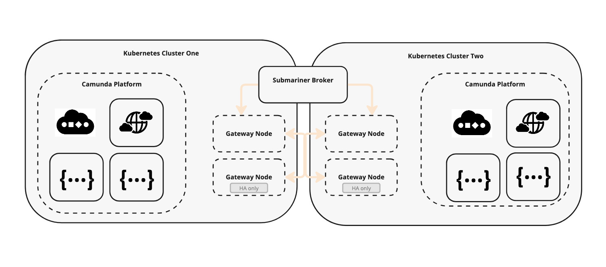

import Tabs from '@theme/Tabs';
import TabItem from '@theme/TabItem';

This guide is designed to assist users aiming to deploy Camunda 8 in a dual-region setup on Red Hat OpenShift.

The primary goal is to configure and integrate **two OpenShift clusters** for use in the dual-region reference architecture. This setup leverages specific components to address key challenges, and users are encouraged to exercise discretion regarding their use, learn more about [Advanced Cluster Management](https://www.redhat.com/en/resources/advanced-cluster-management-kubernetes-datasheet).
While this guide does not cover exhaustive configurations, it aims to provide the key steps needed to achieve the desired outcome.

To enable intercommunication between regions, we will utilize [ACM Advanced Cluster Management](https://www.redhat.com/en/technologies/management/advanced-cluster-management) and [Submariner](https://docs.redhat.com/en/documentation/red_hat_advanced_cluster_management_for_kubernetes/2.2/html/manage_cluster/submariner). Failover will be managed through DNS configurations, while access to the platform will be ensured via OpenShift Routes.

Additionally, depending on whether your OpenShift clusters are managed on a cloud provider or deployed on-premises, certain aspects of the configuration might require adaptation.

:::caution Dual-region limits and constraints

Please review our [dual-region concept documentation](./../../../concepts/multi-region/dual-region.md) to understand the limitations and constraints of this blueprint before proceeding.

:::

## High Level Design

<!-- The following diagram should be exported as an image and as a PDF from the sources https://miro.com/app/board/uXjVL-6SrPc=/ --->
<!-- To export: click on the frame > "Export Image" > as PDF and as JPG (low res), then save it in the ./assets/ folder --->

_Infrastructure diagram for a OpenShift dual-region setup (click on the image to open the PDF version)_
[](./assets/openshift-dual-region.pdf)

This High-Level Design describes how the following critical components interact to achieve a Camunda 8 deployment across two regions:

- An S3-compatible solution is used for taking snapshots of the Elasticsearch database.
- A DNS entry with an associated domain is used to enable Camunda 8 failover and reroute traffic from one cluster to the other.
- Firewall and networking components are configured to allow unrestricted communication between the two clusters.
- Local storage is provided on each OpenShift cluster for persistent data requirements.
- A non-overlapping network configuration is implemented on the OpenShift clusters. This is a mandatory requirement, as outlined in the [Submariner overlapping guide](https://submariner.io/0.8/getting-started/architecture/globalnet/).
- [Red Hat OpenShift Advanced Cluster Management](https://www.redhat.com/en/technologies/management/advanced-cluster-management) is used to manage the two clusters and configure Submariner.
- [Submariner](https://docs.redhat.com/en/documentation/red_hat_advanced_cluster_management_for_kubernetes/2.2/html/manage_cluster/submariner) is configured on the two clusters to enable cross-namespace and cross-cluster network communication.

## Requirements

- You need access to the [Advanced Cluster Management operator](https://www.redhat.com/en/technologies/management/advanced-cluster-management) and the [Submariner operator](https://catalog.redhat.com/software/container-stacks/detail/5f0c67b7ce85fb9e399f3a12).
- The clusters must be separated by a reasonable latency as outlined in the [installation environment guidelines](/self-managed/concepts/multi-region/dual-region.md#installation-environment).
- Each of your OpenShift clusters must meet at least the minimum capacity requirements for a cluster. Refer to the [cluster specification guide](./redhat-openshift.md#cluster-specification) for details on resource allocation and infrastructure needs.
- Administrative privileges are required for both clusters to perform configurations and operator deployments.
- A reliable means of communication between the two clusters is necessary. Ensure that each cluster can establish network connections with the other.
- The version of your OpenShift clusters must be included in the [supported versions list](./redhat-openshift.md#supported-versions).
- Review the [requirements of OpenShift Advanced Cluster Management](https://docs.redhat.com/en/documentation/red_hat_advanced_cluster_management_for_kubernetes/2.12/html/install/installing#installing) if it's not already configured.
- Review the [requirements of OpenShift Submariner](https://docs.redhat.com/en/documentation/red_hat_advanced_cluster_management_for_kubernetes/2.12/html/networking/networking#submariner) if it's not already configured.
- Review the [requirements of Submariner](https://submariner.io/getting-started/#prerequisites) if it's not already configured, especially the flows to open.

### CLI Requirements

In addition to the general prerequisites outlined above, the following CLI tools are required for interacting with the clusters and deploying Camunda 8, these are the same CLI tools required as mentioned in the [OpenShift Guide](redhat-openshift.md#requirements):

- [subctl](https://github.com/submariner-io/subctl) a CLI tool used to interact with [Submariner](https://submariner.io/).

### OpenShift clusters

The architecture of your OpenShift clusters may vary depending on your specific configuration.
This guide assumes a generic deployment on OpenShift. If you are interested in a tested topology, follow the [ROSA Dual-Region Guide](/self-managed/setup/deploy/amazon/openshift/terraform-setup-dual-region.md).

#### Cluster requirements

To deploy infrastructure components successfully, it’s essential that the OpenShift clusters you use have a `cluster-admin` role, which grants full privileges within the cluster. This level of access is necessary for the proper setup and configuration of the infrastructure components.

However, **Camunda 8 deployment does not require cluster-admin access**. For the best security practice and to follow the principle of least privilege, it is recommended to deploy Camunda 8 with a **standard, limited user**. This approach helps minimize security risks by restricting unnecessary administrative privileges.

## Setup Advanced Cluster Management and Submariner

In order to achieve cross-cluster communication, we use the recommanded [Submariner](https://docs.redhat.com/en/documentation/red_hat_advanced_cluster_management_for_kubernetes/2.2/html/manage_cluster/submariner) solution that is designed to securely connect workloads across multiple Kubernetes clusters.

The installation of Submariner on OpenShift differs from the standard installation as it requires the usage of [Red Hat Advanced Cluster Management for Kubernetes](https://www.redhat.com/en/technologies/management/advanced-cluster-management).

:::note Alternative installations

You may achieve the same installation without the usage of Red Hat Advanced Cluster Management for Kubernetes, however, this guide will focus on the official supported deployment of Submariner.

:::

### Advanced Cluster Management

If Red Hat Advanced Cluster Management is not enabled on your cluster, you need to enable it. The following steps are an extract from the [official instructions](https://docs.redhat.com/en/documentation/red_hat_advanced_cluster_management_for_kubernetes/2.12/html/install/installing), which you may want to refer for details of the implementation and associated customizations.

:::caution Non-production use only

The following installation instructions for Advanced Cluster Management are intended for non-production environments.  
For a production setup, please consult the [official Red Hat Advanced Cluster Management guide](https://docs.redhat.com/en/documentation/red_hat_advanced_cluster_management_for_kubernetes/2.12/html/install/installing).

:::

:::note Designation of the clusters in ACM

The cluster of the region 1 is referred to as `local-cluster` in **ACM**. This designation cannot be changed, as it is a constant name used to reference the [managed hub cluster](https://open-cluster-management.io/docs/concepts/cluster-inventory/managedcluster/).

Later in this guide, we will refer to it as **first cluster**.

:::

1. Reference each cluster context name and ensure that each cluster's context name matches the corresponding cluster name. If the context name does not match, you will need to rename it to follow this guide.

   ```bash
   export CLUSTER_1_NAME="cluster-region-1"  # Replace with your actual context name
   export CLUSTER_2_NAME="cluster-region-2"  # Replace with your actual context name
   ```

2. The following manifest will create a namespace for the management cluster, enable the [open-cluster-management operator](https://open-cluster-management.io/) and the [associated subscription](https://docs.openshift.com/container-platform/4.17/operators/admin/olm-adding-operators-to-cluster.html#olm-installing-operator-from-operatorhub-using-cli_olm-adding-operators-to-a-cluster).

   ```yaml reference
   https://github.com/camunda/camunda-deployment-references/blob/main/aws/rosa-hcp-dual-region/procedure/acm/install-manifest.yml
   ```

   Apply the manifests to enable ACM:

   ```bash
   oc --context $CLUSTER_1_NAME apply -f https://raw.githubusercontent.com/camunda/camunda-deployment-references/refs/heads/main/aws/rosa-hcp-dual-region/procedure/acm/install-manifest.yml
   ```

   Verify that the installation succeeded:

   ```bash
   oc --context $CLUSTER_1_NAME --namespace open-cluster-management get csv --watch

   # Example output:
   # NAME                                  DISPLAY                                      VERSION   REPLACES                              PHASE
   # advanced-cluster-management.v2.12.2   Advanced Cluster Management for Kubernetes   2.12.2    advanced-cluster-management.v2.12.1   Succeeded
   ```

3. With the ACM operator now enabled on the first cluster, the next step is to create the [Multicluster Global Hub](https://docs.redhat.com/en/documentation/red_hat_advanced_cluster_management_for_kubernetes/2.12/html-single/install/index#installing-from-the-cli). This feature allows you to import and manage one or more hub clusters from a single central hub cluster.
   In this setup, the first cluster will act as the central hub, managing the second cluster. This capability enables the deployment and management of components on the second cluster directly from the first cluster.

   ```yaml reference
   https://github.com/camunda/camunda-deployment-references/blob/main/aws/rosa-hcp-dual-region/procedure/acm/multi-cluster-hub.yml
   ```

   :::caution Known issue: may not work correctly with the manifest

   The creation of the MultiClusterHub using the manifest can sometimes remain stuck in the installation phase when created this way.

   To avoid this issue, you can follow the [official instructions in the OpenShift UI Console](https://docs.redhat.com/en/documentation/red_hat_advanced_cluster_management_for_kubernetes/2.12/html/install/installing#installing-from-the-operatorhub).

   :::

   Apply the manifest:

   ```bash
   oc --context $CLUSTER_1_NAME apply -f https://raw.githubusercontent.com/camunda/camunda-deployment-references/refs/heads/main/aws/rosa-hcp-dual-region/procedure/acm/multi-cluster-hub.yml
   ```

   Wait until the status shows as "Running." This process can take up to 10 minutes:

   ```bash
   oc --context $CLUSTER_1_NAME get mch -n open-cluster-management multiclusterhub --watch
   ```

   :::caution Security consideration

   - A ServiceAccount with a ClusterRoleBinding automatically gives cluster administrator privileges to Red Hat Advanced Cluster Management and to any user credentials with access to the namespace where you install Red Hat Advanced Cluster Management (`open-cluster-management` here), [learn more about this on the official documentation](https://docs.redhat.com/en/documentation/red_hat_advanced_cluster_management_for_kubernetes/2.12/html/install/installing#installing-from-the-operatorhub).

   - A namespace called `local-cluster` is reserved for the Red Hat Advanced Cluster Management hub cluster when it is self-managed.
     This is the only local-cluster namespace that can exist.

   - :warning: For security reasons, do not give access to the `local-cluster` namespace to any user that is not a cluster-administrator.

   :::

4. With the MultiClusterHub created, the last step is to create a `ManagedClusterSet` which is a group of managed clusters. With a `ManagedClusterSet`, you can manage access to all of the managed clusters in the group together

   ```yaml reference
   https://github.com/camunda/camunda-deployment-references/blob/main/aws/rosa-hcp-dual-region/procedure/acm/managed-cluster-set.yml
   ```

   Apply the manifest:

   ```bash
   oc --context $CLUSTER_1_NAME get mch -A

   oc --context $CLUSTER_1_NAME apply -f https://raw.githubusercontent.com/camunda/camunda-deployment-references/refs/heads/main/aws/rosa-hcp-dual-region/procedure/acm/managed-cluster-set.yml
   ```

5. After creating the Managed Cluster Set, the next step is to import clusters into the set.

   - To import a cluster, you need to template the manifest for each cluster.

     Save the following file as `managed-cluster.yml.tpl`:

     ```yaml reference
     https://github.com/camunda/camunda-deployment-references/blob/main/aws/rosa-hcp-dual-region/procedure/acm/managed-cluster.yml.tpl
     ```

   - The cluster’s associated addon configuration will be managed using the following manifest.

     Save it as `klusterlet-config.yml.tpl`:

     ```yaml reference
     https://github.com/camunda/camunda-deployment-references/blob/main/aws/rosa-hcp-dual-region/procedure/acm/klusterlet-config.yml.tpl
     ```

   - To import a cluster, you must store the associated authentication token.

     Save the following file as `auto-import-cluster-secret.yml.tpl`:

     ```yaml reference
     https://github.com/camunda/camunda-deployment-references/blob/main/aws/rosa-hcp-dual-region/procedure/acm/auto-import-cluster-secret.yml.tpl
     ```

   - Finally, import each cluster into the Managed Cluster Set and verify that they can be reached and managed successfully:

     ```bash reference
     https://github.com/camunda/camunda-deployment-references/blob/main/aws/rosa-hcp-dual-region/procedure/acm/initiate_cluster_set.sh
     ```

### Submariner

The [architecture of Submariner](https://submariner.io/getting-started/architecture/) comprises several components working together to enable direct networking between Pods and Services across different Kubernetes clusters.

The following diagram illustrates the interaction between the two clusters:

_Infrastructure diagram of Submariner setup_


- Traffic sent from one broker to another cluster can be encrypted by the [Gateway Engine](https://submariner.io/getting-started/architecture/gateway-engine/). In OpenShift, the IPSec protocol is used on port `4500/UDP`, utilizing the [Libreswan](https://libreswan.org/) implementation.
- A dedicated node in each cluster assumes the [Broker Role](https://submariner.io/getting-started/architecture/broker/), facilitating the exchange of metadata between Gateway Engines in participating clusters. This component is **not responsible for transmitting data**, unlike the Gateway Engine, which handles data transmission between internal networks of different clusters. High availability can be achieved by adding a second dedicated node.
- Service discovery is managed internally by the [Lighthouse project](https://submariner.io/getting-started/architecture/service-discovery/).
- The [Route Agent component](https://submariner.io/getting-started/architecture/route-agent/) runs on every node in each participating cluster. It sets up the necessary host network elements on top of the existing Kubernetes CNI plugin.

:::note Handling overlapping CIDRs

This guide does not cover handling overlapping CIDRs. However, this can be achieved using the [Globalnet Controller](https://submariner.io/getting-started/architecture/globalnet/).

:::

Installing Submariner in OpenShift **requires** [Advanced Cluster Management](#advanced-cluster-management) to be configured, with each cluster added to the management cluster.

1. Ensure cluster context names match:
   _(Skip this step if already completed as part of [Advanced Cluster Management](#advanced-cluster-management).)_  
   Verify that each cluster's context name matches its corresponding cluster name. If the context name does not match, rename it to align with this guide.

   ```bash
   export CLUSTER_1_NAME="cluster-region-1"  # Replace with your actual context name
   export CLUSTER_2_NAME="cluster-region-2"  # Replace with your actual context name
   ```

2. Verify dedicated broker nodes:
   Confirm that each cluster has nodes labeled for Submariner gateway functionality:

   ```bash
   oc --context "$CLUSTER_1_NAME" get nodes -l submariner.io/gateway=true
   oc --context "$CLUSTER_2_NAME" get nodes -l submariner.io/gateway=true
   ```

   If no nodes are labeled, you need to label at least one node in each cluster. For better reliability, consider dedicating a node as the broker.

   **Assigning broker node labels:**  
   Select the first node and apply the required label:

   ```bash reference
   https://github.com/camunda/camunda-deployment-references/blob/main/aws/rosa-hcp-dual-region/procedure/submariner/label_nodes_brokers.sh
   ```

3. Deployment of Submariner on the clusters:

   - Save the following file as `submariner.yml.tpl`:

     ```yaml reference
     https://github.com/camunda/camunda-deployment-references/blob/main/aws/rosa-hcp-dual-region/procedure/submariner/submariner.yml.tpl
     ```

     :::note Cluster naming

     In this example, the first cluster is referenced as `local-cluster`. This is because the first cluster is used as the management cluster in this minimal setup.

     If your cluster is named differently, you may need to adapt this file to match your actual cluster name.

     :::

   - Then apply it on the management cluster:

     ```bash
     envsubst < submariner.yml.tpl | oc --context "$CLUSTER_1_NAME" apply -f -
     ```

   - Wait for the brokers to become ready. This may take up to 10 minutes. You can check the broker status using the following command:

     ```bash
     oc --context "$CLUSTER_1_NAME" -n "oc-clusters-broker" describe Broker

     oc --context "$CLUSTER_1_NAME" get managedclusteraddon -A --watch | grep -E 'NAME|submariner'

     # Example output:
     # NAMESPACE          NAME                          AVAILABLE   DEGRADED   PROGRESSING
     # cluster-region-2   submariner                    True                   False
     # local-cluster      submariner                    True                   False
     ```

4. After deploying Submariner, check that the clusters can communicate with each other by using the `subctl` utility. Keep in mind that it might take several minutes before all status indicators turn green.
   If you don’t have the `subctl` CLI installed, you can follow the [installation instructions here](https://submariner.io/operations/deployment/).

   To verify this, run the following command:

   ```bash
   subctl show all --contexts "$CLUSTER_1_NAME,$CLUSTER_2_NAME"
   ```

   If everything is set up correctly, you should observe in the output of each cluster context the following statuses:

   - Gateway's status: `All connections (1) are established`
   - Connection's status: `connected   10.406614ms (RTT)`

<details>
   <summary>Example Submariner check successfull output</summary>

```text reference
https://github.com/camunda/camunda-deployment-references/blob/main/aws/rosa-hcp-dual-region/procedure/submariner/output.txt
```

</details>

For more comprehensive details regarding the verification tests for Submariner using subctl, please refer to the [official documentation](https://submariner.io/operations/deployment/subctl/#verify).

**Debugging the Submariner setup:**

If you are experiencing connectivity issues, we recommend spawning a pod in the `default` namespace that contains networking debugging tools. You can find an [example here](https://github.com/camunda/camunda-deployment-references/blob/main/aws/rosa-hcp-dual-region/procedure/submariner/debug-utils-submariner.yml).  
With this pod, you will be able to check flow openings, service resolution, and other network-related aspects.  
Troubleshooting requires examining all the underlying mechanisms of Submariner. Therefore, we also encourage you to read the [Submariner troubleshooting guide](https://submariner.io/operations/troubleshooting/).

## Deploying Camunda 8 via Helm charts in a dual-region setup

The installation of Camunda 8 in OpenShift across dual regions requires a functioning Submariner setup connecting two OpenShift clusters.

### Verify the pre-requisites

Before proceeding with the installation, ensure the required information is available and configured in your terminal for later use.
Review and adjust the following environment script to match your specific configuration:

```bash reference
https://github.com/camunda/camunda-deployment-references/blob/main/aws/rosa-hcp-dual-region/procedure/camunda/8.7/export_environment_prerequisites.sh
```

_If you are unsure about the values of the backup bucket, please refer to the [S3 backup bucket module setup](/self-managed/setup/deploy/amazon/openshift/terraform-setup-dual-region.md#s3-backup-bucket-module-setup) as a reference for implementation._

Save the file as `export_environment_prerequisites.sh`, replace the placeholders with your values, and then source the file:

```bash
source export_environment_prerequisites.sh
```

### Reference the elastic backup bucket in the clusters

Elasticsearch will need an S3 bucket for data backup and restore procedure, required during a regional failback. For this, you will need to configure a Kubernetes secret to not expose those in cleartext.

If you don’t have access to an S3 bucket, you can adapt the backup method to use an [alternative Elasticsearch backup solution](https://www.elastic.co/guide/en/elasticsearch/reference/current/snapshot-restore.html). However, this guide focuses solely on S3 snapshots.

:::caution Bucket vulnerable to region outages

The Elasticsearch backup [bucket is tied to a specific region](https://docs.aws.amazon.com/AmazonS3/latest/userguide/UsingBucket.html). If that region becomes unavailable and you want to restore to a different region or S3 services remain disrupted, you must create a new bucket in another region and reconfigure your Elasticsearch cluster to use the new bucket.

:::

The following script will create the required namespaces and secrets used to reference the bucket access.

```bash reference
https://github.com/camunda/camunda-deployment-references/blob/main/aws/rosa-hcp-dual-region/procedure/camunda/8.7/setup_ns_secrets.sh
```

Save it as `setup_ns_secrets.sh` and execute it:

```bash
chmod +x setup_ns_secrets.sh
./setup_ns_secrets.sh
```

### Configure your deployment for each region

Start by creating `values-region-1.yml` and `values-region-2.yml` files to store each region's configuration. These files will contain key-value pairs that will be substituted using `envsubst`.
Throughout this guide, you will add and merge values into these files to configure your deployment according to your requirements.

- Save the following file as both `values-region-1.yml` and `values-region-2.yml` to serve as the base configuration:
  ```yaml reference
  https://github.com/camunda/camunda-deployment-references/blob/main/aws/rosa-hcp-dual-region/procedure/camunda/8.7/helm-values/values-base.yml
  ```

:::warning Merging YAML files

This guide references multiple configuration files that need to be merged into a single YAML file. Be cautious to avoid duplicate keys when merging the files.  
Additionally, pay close attention when copying and pasting YAML content. Ensure that the separator notation `---` does not inadvertently split the configuration into multiple documents.

We strongly recommend double-checking your YAML file before applying it. You can use tools like [yamllint.com](https://www.yamllint.com/) or the [YAML Lint CLI](https://github.com/adrienverge/yamllint) if you prefer not to share your information online.

:::

Set up the region ID using a unique integer for each region:

- Add the following YAML configuration to your `values-region-1.yml`:
  ```yaml reference
  https://github.com/camunda/camunda-deployment-references/blob/main/aws/rosa-hcp-dual-region/procedure/camunda/8.7/helm-values/values-region-1.yml
  ```
- Add the following YAML configuration to your `values-region-2.yml`:

  ```yaml reference
  https://github.com/camunda/camunda-deployment-references/blob/main/aws/rosa-hcp-dual-region/procedure/camunda/8.7/helm-values/values-region-2.yml
  ```

**Security Context Constraints (SCCs)**

The process of deploying applications in an OpenShift cluster can be influenced by its Security Context Constraints (SCCs) configuration.
By default, OpenShift comes with more restrictive SCCs. For the purposes of this guide, which focuses on multi-region deployment, we assume this to be the standard setup.

For custom configurations or specific requirements, please refer to the [installation guide for OpenShift](redhat-openshift.md#security-context-constraints-sccs) which details the various available SCC options.

#### Fill your deployment with actual values

Before deploying, some values in the value files need to be updated. To assist with generating these values, save the following Bash script as `generate_zeebe_helm_values.sh`:

```bash reference
https://github.com/camunda/camunda-deployment-references/blob/main/aws/rosa-hcp-dual-region/procedure/camunda/8.7/generate_zeebe_helm_values.sh
```

Then, source the output of the script. By doing so, we can reuse the values later for substitution, instead of manually adjusting the values files. You will be prompted to specify the number of Zeebe brokers (total number of Zeebe brokers in both Kubernetes clusters), for a dual-region setup we recommend `8`, resulting in four brokers per region:

```
chmod +x generate_zeebe_helm_values.sh
CLUSTER_1_NAME='local-cluster' source ./generate_zeebe_helm_values.sh
```

:::note Submariner service naming

For those unfamiliar with the Submariner DNS convention, please consult the [official documentation](https://submariner.io/operations/usage/#service-discovery-for-services-deployed-to-multiple-clusters).
In this deployment, we are utilizing the service discovery to have Elasticsearch and Zeebe brokers accessible from one cluster to another. Consequently, the values generated by the previous script will not be local services but use `svc.clusterset.local`.

Make sure that the variable `CLUSTER_1_NAME` is set to the name of your first cluster. In this example, the value `local-cluster` is used to maintain consistency with the previous [Advanced Cluster Management step](#advanced-cluster-management).

:::

Once you've prepared each region's value file (`values-region-1.yml` and `values-region-2.yml`) file, run the following `envsubst` command to substitute the environment variables with their actual values:

```bash reference
https://github.com/camunda/camunda-deployment-references/blob/main/aws/rosa-hcp-dual-region/procedure/camunda/8.7/generate_helm_values.sh
```

### Install Camunda 8 using Helm

With the value files for each region configured, you can now install Camunda 8 using Helm. Execute the following commands:

```bash reference
https://github.com/camunda/camunda-deployment-references/blob/main/aws/rosa-hcp-dual-region/procedure/camunda/8.7/install_chart.sh
```

This command:

- Installs (or upgrades) the Camunda platform using the Helm chart on each cluster.
- Substitutes the appropriate version using the `$CAMUNDA_HELM_CHART_VERSION` environment variable.
- Applies the configuration from the value file.

:warning: **Installation is not complete yet:** at this stage, the two Camunda 8 deployments cannot communicate. You need to follow the next step to complete the installation.

:::note

This guide uses `helm upgrade --install` as it runs install on initial deployment and upgrades future usage. This may make it easier for future [Camunda 8 Helm upgrades](/self-managed/setup/upgrade.md) or any other component upgrades.

:::

#### Export Camunda 8 services using Submariner

Once Camunda is deployed across the two clusters, the next step is to expose each service to Submariner so it can be resolved by the other cluster:

```bash reference
https://github.com/camunda/camunda-deployment-references/blob/main/aws/rosa-hcp-dual-region/procedure/camunda/8.7/export_services_submariner.sh
```

Alternatively, you can manage each service individually using the `ServiceExport` Custom Resource Definition (CRD).

<details>
   <summary>Example of the ServiceExport manifest</summary>

```yaml
apiVersion: multicluster.x-k8s.io/v1alpha1
kind: ServiceExport
metadata:
  name: camunda-elasticsearch # name of the service to export
  namespace: camunda-cluster-region-2 #
```

</details>

For each cluster, verify the status of the exported services with this script:

```bash reference
https://github.com/camunda/camunda-deployment-references/blob/main/aws/rosa-hcp-dual-region/procedure/camunda/8.7/verify_exported_services.sh
```

To monitor the progress of the installation, save and execute the following script:

```bash reference
https://github.com/camunda/camunda-deployment-references/blob/main/aws/rosa-hcp-dual-region/procedure/camunda/8.7/verify_installation_completed.sh
```

Save it as `verify_installation_completed.sh`, make it executable, and run it:

```bash
chmod +x verify_installation_completed.sh
./verify_installation_completed.sh
```

## Verify connectivity to Camunda 8

1. Open a terminal and port-forward the Zeebe Gateway via `oc` from one of your clusters. Zeebe is stretching over both clusters and is `active-active`, meaning it doesn't matter which Zeebe Gateway to use to interact with your Zeebe cluster.

<Tabs groupId="c8-connectivity">
  <TabItem value="rest-api" label="REST API">

```shell
oc --context "$CLUSTER_1_NAME" -n "$CAMUNDA_NAMESPACE_1" port-forward "services/$HELM_RELEASE_NAME-zeebe-gateway" 8080:8080
```

2. Open another terminal and use e.g. `cURL` to print the Zeebe cluster topology:

   ```
   curl -L -X GET 'http://localhost:8080/v2/topology' -H 'Accept: application/json' | jq
   ```

3. Make sure that your output contains all eight brokers from the two regions:

   <details>
      <summary>Example output</summary>

   ```text reference
   https://github.com/camunda/camunda-deployment-references/blob/main/aws/rosa-hcp-dual-region/procedure/camunda/8.7/zeebe-http-output.txt
   ```

   </details>

</TabItem>
<TabItem value="zbctl" label="zbctl">

```shell
oc --context "$CLUSTER_1_NAME" -n "$CAMUNDA_NAMESPACE_1" port-forward "services/$HELM_RELEASE_NAME-zeebe-gateway" 26500:26500
```

1. Open another terminal and use [zbctl](/apis-tools/community-clients/cli-client/index.md) to print the Zeebe cluster status:

   ```shell
   zbctl status --insecure --address localhost:26500
   ```

2. Make sure that your output contains all eight brokers from the two regions:

   <details>
      <summary>Example output</summary>

   ```text reference
   https://github.com/camunda/camunda-deployment-references/blob/main/aws/rosa-hcp-dual-region/procedure/camunda/8.7/zbctl-output.txt
   ```

   </details>

</TabItem>
</Tabs>

## Failover

Consult the generic [dual-region failover procedure](/self-managed/operational-guides/multi-region/dual-region-ops.md).

## Pitfalls to avoid

For general deployment pitfalls, visit the [deployment troubleshooting guide](/self-managed/operational-guides/troubleshooting/troubleshooting.md).
