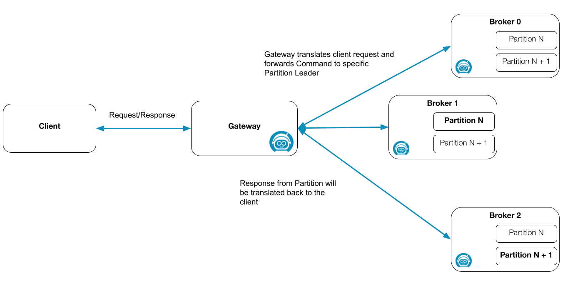

import Tabs from "@theme/Tabs";
import TabItem from "@theme/TabItem";

The Zeebe Gateway is a component of the Zeebe cluster; it can be considered the contact point for the Zeebe cluster which allows Zeebe clients to communicate with Zeebe brokers inside a Zeebe cluster. For more information about the Zeebe Broker, visit our [additional documentation](../../../components/zeebe/technical-concepts/architecture.md#brokers).

To summarize, the Zeebe Broker is the main part of the Zeebe cluster, which does all the heavy work like processing, replicating, exporting, and everything based on partitions. The Zeebe Gateway acts as a load balancer and router between Zeebe’s processing partitions.

To interact with the Zeebe cluster, the Zeebe client sends a command to the gateway either as a gRPC message (to port `26500` by default), or a plain HTTP request to its REST API (to port `8080` by default). Given the gateway supports gRPC as well as an OpenAPI spec, the user can use several clients in different languages to interact with the Zeebe cluster. For more information, read our [overview](../../../apis-tools/working-with-apis-tools.md).

:::note
Be aware Zeebe brokers divide data into partitions (shards), and use RAFT for replication. Read more on RAFT [here](../../../components/zeebe/technical-concepts/clustering.md#raft-consensus-and-replication-protocol).
:::

When the Zeebe Gateway receives a valid message, it is translated to an internal binary format and forwarded to one of the partition leaders inside the Zeebe cluster. The command type and values can determine to which partition the command is forwarded.

For example, creating a new process instance is sent in a round-robin fashion to the different partitions. If the command relates to an existing process instance, the command must be sent to the same partition where it was first created (determined by the key).

To determine the current leader for the corresponding partition, the gateway must maintain the topology of the Zeebe cluster. The gateway(s) and broker(s) form a cluster using gossip protocol to distribute information.

## Why do we have the Zeebe Gateway and what problems does it solve?

The Zeebe Gateway protects the brokers from external sources. It allows the creation of a demilitarized zone ([DMZ](<https://en.wikipedia.org/wiki/DMZ_(computing)>)) and the Zeebe Gateway is the only contact point.

The Zeebe Gateway also allows you to easily create clients in your language of choice while keeping the client implementation as thin as possible. The clients can be kept thin, since the gateway takes care of the cluster topology and forwards the requests to the right partitions. There are already several client implementations available, officially-supported, and community-maintained. Check the list [here](../../../apis-tools/working-with-apis-tools.md).

The gateway can be run and scaled independently of the brokers, which means it translates the messages, distributes them to the correct partition leaders, and separates the concerns of the applications. For example, if your system encounters a spike of incoming requests, and you have set up enough partitions on the broker side up front, but not enough gateways to handle the load, you can easily scale them up.

## Embedded versus standalone

The Zeebe Gateway can be run in two different ways: embedded and standalone.

<Tabs groupId="embeddedstandalone" defaultValue="embedded" queryString values={[{label: 'Embedded', value: 'embedded' },{label: 'Standalone', value: 'standalone' }]} >

<TabItem value="embedded">

Running the gateway in embedded mode means it will run as part of the Zeebe Broker. The broker will accept gRPC client messages via the embedded gateway and distribute the translated requests inside the cluster. This means the request accepted by the embedded gateway does not necessarily go to the same broker, where the embedded gateway is running.

The embedded gateway is useful for development and testing purposes, and to reduce the burden of deploying and running multiple applications. For example, in [zeebe-process-test](https://github.com/camunda/zeebe-process-test) an embedded gateway is used to accept the client commands and write directly to the engine.

:::note Be aware
If the gateway is running in the embedded mode, it will consume resources from the broker, which might impact the performance of the system.
:::

</TabItem>

<TabItem value="standalone">

Running the gateway in standalone mode means the gateway will be executed as its own application. This is the recommended way for production use cases, and it is the default (and only option) in the Helm charts. As mentioned, this allows separation of concerns, especially as the gateway can be scaled independently of the broker based on the current workload.

</TabItem>
</Tabs>
