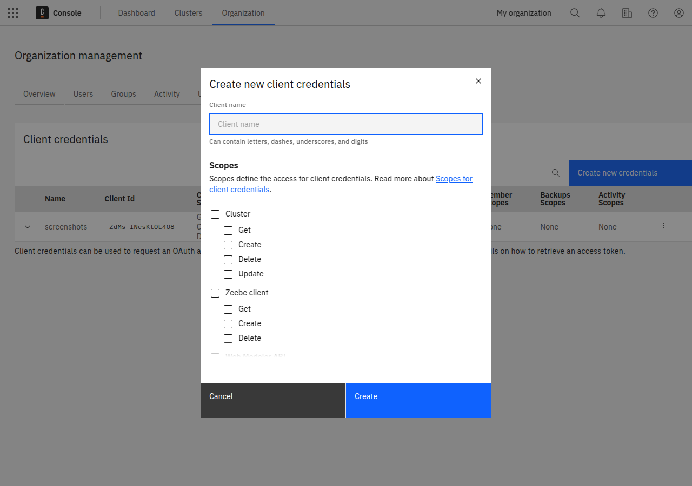

All Administration API requests require authentication. To authenticate, generate a [JSON Web Token (JWT)](https://jwt.io/introduction/) and include it in each request.

## Generate a token

1. Create client credentials by clicking **Console > Organization > Administration API > Create new credentials**.
2. Add permissions to this client for [the needed scopes](#client-credentials-and-scopes).
3. Once you have created the client, capture the following values required to generate a token:
   <!-- this comment convinces the markdown processor to still treat the table as a table, but without adding surrounding paragraphs. 🤷 -->
   | Name                     | Environment variable name        | Default value                                |
   | ------------------------ | -------------------------------- | -------------------------------------------- |
   | Client ID                | `CAMUNDA_CONSOLE_CLIENT_ID`      | -                                            |
   | Client Secret            | `CAMUNDA_CONSOLE_CLIENT_SECRET`  | -                                            |
   | Authorization Server URL | `CAMUNDA_OAUTH_URL`              | `https://login.cloud.camunda.io/oauth/token` |
   | Audience                 | `CAMUNDA_CONSOLE_OAUTH_AUDIENCE` | `api.cloud.camunda.io`                       |
   <!-- this comment convinces the markdown processor to still treat the table as a table, but without adding surrounding paragraphs. 🤷 -->
   :::caution
   When client credentials are created, the `Client Secret` is only shown once. Save this `Client Secret` somewhere safe.
   :::
4. Execute an authentication request to the token issuer:
   ```bash
   curl --request POST ${CAMUNDA_OAUTH_URL} \
       --header 'Content-Type: application/x-www-form-urlencoded' \
       --data-urlencode 'grant_type=client_credentials' \
       --data-urlencode "audience=${CAMUNDA_CONSOLE_OAUTH_AUDIENCE}" \
       --data-urlencode "client_id=${CAMUNDA_CONSOLE_CLIENT_ID}" \
       --data-urlencode "client_secret=${CAMUNDA_CONSOLE_CLIENT_SECRET}"
   ```
   A successful authentication response looks like the following:
   ```json
   {
     "access_token": "<TOKEN>",
     "expires_in": 300,
     "refresh_expires_in": 0,
     "token_type": "Bearer",
     "not-before-policy": 0
   }
   ```
5. Capture the value of the `access_token` property and store it as your token.

## Use a token

Include the previously captured token as an authorization header in each request: `Authorization: Bearer <TOKEN>`.

For example, to send a request to the Administration API's `/members` endpoint:

```shell
curl --header "Authorization: Bearer ${TOKEN}" \
     https://api.cloud.camunda.io/members
```

A successful response includes [a list of organization members](https://console.cloud.camunda.io/customer-api/openapi/docs/#/default/GetMembers). For example:

```json
[
  {
    "name": "User Userton",
    "email": "user@example.com",
    "roles": ["admin"],
    "invitePending": false
  }
]
```

## Token expiration

Access tokens expire according to the `expires_in` property of a successful authentication response. After this duration, in seconds, you must request a new access token.

## Client credentials and scopes

To interact with Camunda 8 programmatically without using the Camunda 8 Console, create client credentials in the organization settings under the **Administration API** tab.

Client credentials are created for an organization, and therefore can access all Camunda 8 clusters of this organization.

Scopes define the access for client credentials. A client can have one or multiple of the following permissions:



A client can have one or multiple permissions from the following groups:

- **Cluster**: [Manage your clusters](/components/console/manage-clusters/create-cluster.md).
- **Zeebe Client**: [Manage API clients](/components/console/manage-clusters/manage-api-clients.md) for your cluster.
- **Web Modeler API**: Interact with the [Web Modeler API](/apis-tools/web-modeler-api/index.md).
- **IP allowlist**: Configure [IP allowlist](/components/console/manage-clusters/manage-ip-allowlists.md) rules.
- **Connector Secrets**: [Manage secrets](/components/console/manage-clusters/manage-secrets.md) of your clusters.
- **Members**: [Manage members](/components/console/manage-organization/manage-users.md) of your organization.
- **Backups**: Manage [backups](/components/concepts/backups.md) of your Camunda 8 clusters (only available to Enterprise customers).

The full API description can be found [here](https://console.cloud.camunda.io/customer-api/openapi/docs/#/).

## Rate limiting

The OAuth service rate limits about one request per second for all clients with the same source IP address.

:::note
All token requests count toward the rate limit, whether they are successful or not. If any client is running with an expired or invalid API key, that client will continually make token requests. That client will therefore exceed the rate limit for that IP address, and may block valid token requests from completing.
:::

The officially offered [client libraries](/apis-tools/working-with-apis-tools.md) (as well as the Node.js and Spring clients) have already integrated with the auth routine, handle obtaining and refreshing an access token, and make use of a local cache.

If too many token requests are executed from the same source IP address in a short time, all token requests from that source IP address are blocked for a certain time. Since the access tokens have a 24-hour validity period, they must be cached on the client side, reused while still valid, and refreshed via a new token request once the validity period has expired.

When the rate limit is triggered, the client will receive an HTTP 429 response. Note the following workarounds:

- Cache the token as it is still valid for 24 hours. The official SDKs already do this by default.
- Keep the SDK up to date. We have noted issues in older versions of the Java SDK which did not correctly cache the token.
- Given the rate limit applies to clients with the same source IP address, be mindful of:
  - Unexpected clients running within your infrastructure.
  - Updating all clients to use a current API key if you delete an API key and create a new one.
