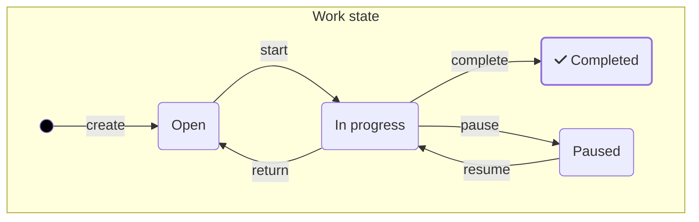
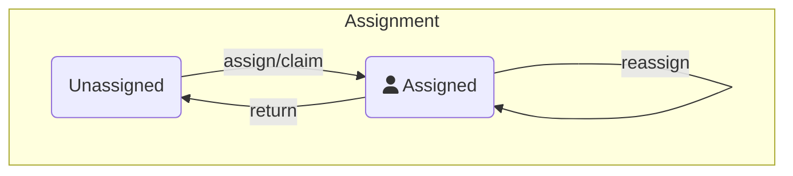

import GHIcon from "@site/src/mdx/GitHubInlineIcon";
import TaskLifecycleUI from "./img/task-lifecycle-ui.png";

The task life cycle defines how users can interact with tasks and how work on these tasks is performed. It defines the core actions of your task application, so you should define it before implementing your logic and user interface.

## Decide on your task life cycle

The task life cycle ultimately depends on the use case you want to cover with your task application, the personas who interact with it, the content you want to track in reports and audit logs, and the flexibility your users need.

Refer to the Camunda best practice task life cycle below as a starting point.

## Camunda best practice task life cycle

The Camunda [Tasklist](/components/tasklist/introduction-to-tasklist.md) component implements a task life cycle optimized to track actual work on individual tasks via [forms](../03-forms/01-introduction-to-forms.md) on a desktop. It separates task assignment from task state to support collaborative ways of working and promote use cases for managers.

On the happy path, task agents can:

- `start` a task to indicate that they are working on it.
- `complete` the task when the work is done.
- When they cannot continue the work now, for example to gather more information on larger tasks, they can `pause` the work and `resume` it at a later time.
- The data entered up to this point is preserved. If they are unable to continue, they can `return` a task to the queue for someone else to pick it up, which resets the task data.

:::note
The state of the task is derived via a CQRS pattern. [Zeebe](/components/zeebe/zeebe-overview.md), Camunda's process execution engine, manages a stream of events. There is no single status attribute in tasks. Instead, tasks derive their status from these events.
:::



:::tip
To benefit from [out-of-the-box task performance reporting in Optimize](#task-lifecycle-reporting-in-optimize), your task life cycle should cover the outlined work state actions `start` and `complete`, and optionally `pause`, `resume`, and `return`.
:::

### Task assignment

The assignment logic runs parallel to the work state. This ensures maximum flexibility. For example, a task may be assigned but be open for a while (lying in the inbox), indicating that the assigned user is not available to work on this task promptly and offering optimization potential for assignment rules for this task. Another example is the change of task assignee while working on a task, such as in collaborative environments.

In the Tasklist user interface, a task can be claimed by the logged-in user, which assigns the task to that user. Managers can assign unassigned tasks to team members and reassign them as needed.



The execution engine does not validate whether a user is authorized to execute a task. Instead, this is a matter for the application that is built on top. For example, Tasklist checks that only the assigned user or an admin/manager is able to update and complete a task, but you are free to use different logic in your task application. This way, maximum flexibility is guaranteed when you create a custom application based on Camunda. For example, you can implement a substitute logic that allows a user to complete a task on behalf of another user.

Our best practices, as implemented in Tasklist, are as follows:

- `update` and `complete` operations can only be performed by the assigned user or an admin/manager.
- Users can only see tasks to which they are assigned and tasks to which a user group of which they are a member is assigned as a candidate.
- When a task is returned to the queue (i.e. the assignee is cleared), its data and status are reset to "open".
- Only admins/managers can reassign tasks.
- Task agents can return tasks, but must provide a comment as to why they are doing so.
- Task agents can mark tasks with a follow-up date. These then disappear from their individual task list until the follow-up date is reached. The `open` status is preserved, or the task is moved to the `paused` status if it has already been processed. The task remains assigned to the user.

Make sure that you create your own validation logic that matches your use case.

## Implement task life cycle with the Camunda 8 API

Use the Camunda 8 REST API to implement task life cycle operations. You can find the API specifications [here](/apis-tools/camunda-api-rest/camunda-api-rest-overview.md).

Task life cycle events can be tracked via the following API endpoints:

- [`POST /user-tasks/:userTaskKey/assignment`](/apis-tools/camunda-api-rest/specifications/assign-user-task.api.mdx) or [`DELETE /user-tasks/:userTaskKey/assignee`](/apis-tools/camunda-api-rest/specifications/unassign-user-task.api.mdx) to change task assignment.
- [`PATCH /user-tasks/:userTaskKey`](/apis-tools/camunda-api-rest/specifications/update-user-task.api.mdx) to update a task.
- [`POST /user-tasks/:userTaskKey/completion`](/apis-tools/camunda-api-rest/specifications/complete-user-task.api.mdx) to complete a task.

- Assign user task:
  - [`POST /user-tasks/:userTaskKey/assignment`](/apis-tools/camunda-api-rest/specifications/assign-user-task.api.mdx)
  - [`DELETE /user-tasks/:userTaskKey/assignee`](/apis-tools/camunda-api-rest/specifications/unassign-user-task.api.mdx) is used to unassing a user task.
- Update user task:
  - [`PATCH /user-tasks/:taskKey`](/apis-tools/camunda-api-rest/specifications/update-user-task.api.mdx)
- Complete user task:
  - [`POST /user-tasks/:taskKey/completion`](/apis-tools/camunda-api-rest/specifications/complete-user-task.api.mdx)

#### [`POST /user-tasks/:userTaskKey/assignment`](/apis-tools/camunda-api-rest/specifications/assign-user-task.api.mdx)

Use the `assignment` endpoint to change the task assignment. Use the `action` attribute to indicate the cause of the change, including `claim`, `reassign`, or `assign`.

#### [`PATCH /user-tasks/:userTaskKey`](/apis-tools/camunda-api-rest/specifications/update-user-task.api.mdx)

Use the `update` endpoint to change candidate users, groups, the due date, or the follow-up date by defining the `changeset`. You can also send it with an empty `changeset` and just pass an `action`. Use it to send `start`, `pause`, and `resume` actions. Additionally, you can send anything of interest or relevant for the audit log such as `escalate`, `requestFurtherInformation`, `uploadDocument`, or `openExternalApp`.

An example request payload could look like this:

```js
{
  "changeset": {
    "dueDate": "2024-03-18T20:47:20.340Z"
  }
  "action": "escalate"
}
```

#### [`POST /user-tasks/:userTaskKey/completion`](/apis-tools/camunda-api-rest/specifications/complete-user-task.api.mdx)

Use the `completion` endpoint to complete a task. Pass along with it the outcome of the task via the `action` attribute, such as `approve` or `reject`.

### Listen to life cycle events

To keep the life cycle customizable and flexible, there are four generic parent events that align with the API endpoints. These events contain an `action` attribute (except the `create` event) that contains the life cycle action that triggered this event.

You can listen to these events by implementing a [custom exporter](/self-managed/concepts/exporters.md). Run your custom logic based on the `action` attribute and the payload in the events. To get started, use a pre-built exporter from the [Camunda community](https://github.com/orgs/camunda-community-hub/repositories?q=exporter) <GHIcon />.

#### `create`

The `create` event is emitted when a task instance is successfully created by the engine. In case the `create` event does contain an assignee, no additional `assignment` event is fired.

#### `assignment`

The `assignment` event is emitted when task assignment changes. This includes actions such as `claim`, `assign`, `return`, or `unassign`.

#### `update`

The `update` event is emitted every time anything on the task changed except assignment, including candidate groups, candidate users, the due date, or the follow-up date. It is also emitted on custom life cycle actions that do not contain a payload, such as `start`, `pause`, or any other action of interest.

#### `complete`

The `complete` event is emitted on task completion. It can contain a custom action as well to indicate the outcome, such as `approved` or `rejected`.

## Task life cycle reporting

You can use the stream of task life cycle events to populate an audit log or to build productivity reports.

### Task life cycle reporting in Optimize

Optimize supports task productivity reports. However, it is currently limited to reports that measure assigned vs. unassigned time. In future versions, it is planned to calculate the net work and idle time of a task based on the following actions:

- **Idle time:** Time a task was open, for example, time to `start`.
- **Net working time:** Time during which a task was actually processed, for example, time from `start` to `complete`, minus the time during which it was paused (action `pause` until the next `resume` action).

### Export task life cycle events to external systems

You can implement a [custom exporter](/self-managed/concepts/exporters.md) or use any from the [Camunda community](https://github.com/orgs/camunda-community-hub/repositories?q=exporter) <GHIcon /> to export task life cycle events to any external system. Use it to stream task events to BI or dashboarding tools, or use real-time stream processing frameworks like [Apache Spark](https://spark.apache.org/) for high-volume use cases.
