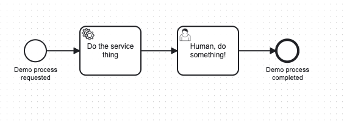

As of 8.5.0, the official [Camunda 8 JavaScript SDK for Node.js](https://github.com/camunda/camunda-8-js-sdk) is available via [npm](https://www.npmjs.com/package/@camunda8/sdk).

This SDK is written in TypeScript and has full type support for IDEs and editors that support IntelliSense. It can be used in JavaScript or TypeScript projects.

## Prerequisites

This SDK requires Node.js as a runtime environment. It cannot be used in a web browser for a number of [technical reasons](https://github.com/camunda/camunda-8-js-sdk/issues/79).

## Quick start

A complete working version of the quick start code is available on [GitHub](https://github.com/camunda-community-hub/c8-sdk-demo).

1. Create a new Node.js project that uses TypeScript:

```bash
npm init -y
npm install -D typescript
npx tsc --init
```

2. Install the SDK as a dependency:

```bash
npm i @camunda8/sdk
```

## Connection configuration

You have two choices:

- Explicit configuration in code
- Zero-configuration constructor with environment variables

The best way to do the configuration is via the zero-configuration constructor in code, and all values for configuration supplied via environment variables. This allows you to test the same code against different environments with no code changes.

The environment variables you need to set are outlined below. Replace these with your secrets and URLs.

To configure a client, and to capture these values when creating the client, review our documentation on [setting up client connection credentials](/guides/setup-client-connection-credentials.md).

### Self-Managed configuration

```bash
# Self-Managed
export ZEEBE_ADDRESS='localhost:26500'
export ZEEBE_CLIENT_ID='zeebe'
export ZEEBE_CLIENT_SECRET='zecret'
export CAMUNDA_OAUTH_URL='http://localhost:18080/auth/realms/camunda-platform/protocol/openid-connect/token'
export CAMUNDA_TASKLIST_BASE_URL='http://localhost:8082'
export CAMUNDA_OPERATE_BASE_URL='http://localhost:8081'
export CAMUNDA_OPTIMIZE_BASE_URL='http://localhost:8083'
export CAMUNDA_MODELER_BASE_URL='http://localhost:8070/api'
```

If you are running with multi-tenancy enabled:

```
export CAMUNDA_TENANT_ID='<default>'
```

If your installation does not have TLS on Zeebe:

```
export CAMUNDA_SECURE_CONNECTION=false
```

If you are using the components without Identity, disable OAuth:

```
export CAMUNDA_AUTH_STRATEGY='NONE'
```

### Camunda SaaS configuration

```bash
export ZEEBE_ADDRESS='5c34c0a7-...-125615f7a9b9.syd-1.zeebe.camunda.io:443'
export ZEEBE_CLIENT_ID='yvvURO...'
export ZEEBE_CLIENT_SECRET='iJJu-SHg...'
export CAMUNDA_TASKLIST_BASE_URL='https://syd-1.tasklist.camunda.io/5c34c0a7-...-125615f7a9b9'
export CAMUNDA_OPTIMIZE_BASE_URL='https://syd-1.optimize.camunda.io/5c34c0a7-...-125615f7a9b9'
export CAMUNDA_OPERATE_BASE_URL='https://syd-1.operate.camunda.io/5c34c0a7-...-125615f7a9b9'
export CAMUNDA_OAUTH_URL='https://login.cloud.camunda.io/oauth/token'
export CAMUNDA_SECURE_CONNECTION=true
```

To set these explicitly in code, the `Camunda8` constructor takes these values, with the same key names, in the constructor.

### Using the SDK

1. Create a file `index.ts` in your IDE.
2. Import the SDK:

```typescript
import { Camunda8 } from "@camunda8/sdk";
import path from "path"; // we'll use this later

const camunda = new Camunda8();
```

3. Get a Zeebe gRPC API client. This is used to deploy process models and start process instances:

```typescript
const zeebe = camunda.getZeebeGrpcApiClient();
```

4. Get an Operate client. This is used to interact with completed processes and deployed process models:

```typescript
const operate = camunda.getOperateApiClient();
```

5. Get a Tasklist client. This is used to interact programmatically with user tasks:

```typescript
const tasklist = camunda.getTasklistApiClient();
```

### Deploy a process model

Now, you'll deploy a process model. Network operations are asynchronous and methods that operate over the network return promises, so we will wrap the main function of the program in an `async` function:

```typescript
async function main() {
  const deploy = await zeebe.deployResource({
    processFilename: path.join(process.cwd(), "process.bpmn"),
  });
  console.log(
    `[Zeebe] Deployed process ${deploy.deployments[0].process.bpmnProcessId}`
  );
}

main(); // remember to invoke the function
```

Paste the process model XML below into a file called `process.bpmn`:

```xml
<?xml version="1.0" encoding="UTF-8"?>
<bpmn:definitions xmlns:bpmn="http://www.omg.org/spec/BPMN/20100524/MODEL" xmlns:bpmndi="http://www.omg.org/spec/BPMN/20100524/DI" xmlns:dc="http://www.omg.org/spec/DD/20100524/DC" xmlns:zeebe="http://camunda.org/schema/zeebe/1.0" xmlns:di="http://www.omg.org/spec/DD/20100524/DI" xmlns:modeler="http://camunda.org/schema/modeler/1.0" id="Definitions_14f3xb6" targetNamespace="http://bpmn.io/schema/bpmn" exporter="Camunda Modeler" exporterVersion="5.8.0" modeler:executionPlatform="Camunda Cloud" modeler:executionPlatformVersion="8.1.0">
  <bpmn:process id="c8-sdk-demo" name="C8 SDK Demo" isExecutable="true">
    <bpmn:startEvent id="StartEvent_1">
      <bpmn:outgoing>Flow_0yqo0wz</bpmn:outgoing>
    </bpmn:startEvent>
    <bpmn:sequenceFlow id="Flow_0yqo0wz" sourceRef="StartEvent_1" targetRef="Activity_1gwbbuy" />
    <bpmn:sequenceFlow id="Flow_0qugen1" sourceRef="Activity_1gwbbuy" targetRef="Activity_0tp91ve" />
    <bpmn:endEvent id="Event_0j28rou">
      <bpmn:incoming>Flow_03qgl0x</bpmn:incoming>
    </bpmn:endEvent>
    <bpmn:sequenceFlow id="Flow_03qgl0x" sourceRef="Activity_0tp91ve" targetRef="Event_0j28rou" />
    <bpmn:serviceTask id="Activity_1gwbbuy" name="Do the service thing">
      <bpmn:extensionElements>
        <zeebe:taskDefinition type="service-task" />
      </bpmn:extensionElements>
      <bpmn:incoming>Flow_0yqo0wz</bpmn:incoming>
      <bpmn:outgoing>Flow_0qugen1</bpmn:outgoing>
    </bpmn:serviceTask>
    <bpmn:userTask id="Activity_0tp91ve" name="Human, do something!">
      <bpmn:incoming>Flow_0qugen1</bpmn:incoming>
      <bpmn:outgoing>Flow_03qgl0x</bpmn:outgoing>
    </bpmn:userTask>
  </bpmn:process>
  <bpmndi:BPMNDiagram id="BPMNDiagram_1">
    <bpmndi:BPMNPlane id="BPMNPlane_1" bpmnElement="c8-sdk-demo">
      <bpmndi:BPMNShape id="_BPMNShape_StartEvent_2" bpmnElement="StartEvent_1">
        <dc:Bounds x="179" y="99" width="36" height="36" />
      </bpmndi:BPMNShape>
      <bpmndi:BPMNShape id="Event_0j28rou_di" bpmnElement="Event_0j28rou">
        <dc:Bounds x="592" y="99" width="36" height="36" />
      </bpmndi:BPMNShape>
      <bpmndi:BPMNShape id="Activity_1rvlo9s_di" bpmnElement="Activity_1gwbbuy">
        <dc:Bounds x="270" y="77" width="100" height="80" />
        <bpmndi:BPMNLabel />
      </bpmndi:BPMNShape>
      <bpmndi:BPMNShape id="Activity_1wxn0pq_di" bpmnElement="Activity_0tp91ve">
        <dc:Bounds x="430" y="77" width="100" height="80" />
        <bpmndi:BPMNLabel />
      </bpmndi:BPMNShape>
      <bpmndi:BPMNEdge id="Flow_0yqo0wz_di" bpmnElement="Flow_0yqo0wz">
        <di:waypoint x="215" y="117" />
        <di:waypoint x="270" y="117" />
      </bpmndi:BPMNEdge>
      <bpmndi:BPMNEdge id="Flow_0qugen1_di" bpmnElement="Flow_0qugen1">
        <di:waypoint x="370" y="117" />
        <di:waypoint x="430" y="117" />
      </bpmndi:BPMNEdge>
      <bpmndi:BPMNEdge id="Flow_03qgl0x_di" bpmnElement="Flow_03qgl0x">
        <di:waypoint x="530" y="117" />
        <di:waypoint x="592" y="117" />
      </bpmndi:BPMNEdge>
    </bpmndi:BPMNPlane>
  </bpmndi:BPMNDiagram>
</bpmn:definitions>
```

For reference, this is the model we are using:



You can run the program now, and see the process model deploy to Camunda:

```bash
npx ts-node index.ts
```

If your configuration is correct, you will see the following:

```
Deployed process c8-sdk-demo
```

### Create a service worker

Outside the main function, add the following code:

```typescript
console.log("Starting worker...");
zeebe.createWorker({
  taskType: "service-task",
  taskHandler: (job) => {
    console.log(`[Zeebe Worker] handling job of type ${job.type}`);
    return job.complete({
      serviceTaskOutcome: "We did it!",
    });
  },
});
```

This will start a service task worker that runs in an asynchronous loop, invoking the `taskHandler` function whenever a job for the service task type `service-task` is available.

The handler must return a job completion function - `fail`, `complete`, or `forward`. This is enforced by the type system and ensures you do not write code that does not have code paths that do not respond to Zeebe after taking a job. The `job.complete` function can take an object that represents variables to update.

### Create a programmatic user task worker

Our process has a [user task](/guides/getting-started-orchestrate-human-tasks.md) after the [service task](/guides/getting-started-orchestrate-microservices.md). The service task worker will complete the service task job, and we will complete the user task using the Tasklist API client.

Add the following code beneath the service worker code:

```typescript
console.log(`Starting user task poller...`);
setInterval(async () => {
  const res = await tasklist.searchTasks({
    state: "CREATED",
  });
  if (res.length > 0) {
    console.log(`[Tasklist] fetched ${res.length} user tasks`);
    res.forEach(async (task) => {
      console.log(
        `[Tasklist] claiming task ${task.id} from process ${task.processInstanceKey}`
      );
      const t = await tasklist.assignTask({
        taskId: task.id,
        assignee: "demobot",
        allowOverrideAssignment: true,
      });
      console.log(
        `[Tasklist] servicing user task ${t.id} from process ${t.processInstanceKey}`
      );
      await tasklist.completeTask(t.id, {
        userTaskStatus: "Got done",
      });
    });
  } else {
    console.log("No user tasks found");
  }
}, 3000);
```

We now have an asynchronously polling service worker and an asynchronously polling user task worker.

The last step is to create a process instance.

### Create a process instance

There are two options for creating a process instance:

- For long-running processes, use `createProcessInstance`, which returns as soon as the process instance is created with the process instance ID.
- For the shorter-running process we are using, use `createProcessInstanceWithResult`, which awaits the completion of the process and returns with the final variable values.

1. Locate the following line in the `main` function:

```typescript
console.log(
  `[Zeebe] Deployed process ${res.deployments[0].process.bpmnProcessId}`
);
```

2. Inside the `main` function, add the following:

```typescript
const p = await zeebe.createProcessInstanceWithResult({
  bpmnProcessId: `c8-sdk-demo`,
  variables: {
    userTaskStatus: "Needs doing",
  },
});
console.log(`[Zeebe] Finished Process Instance ${p.processInstanceKey}`);
console.log(`[Zeebe] userTaskStatus is "${p.variables.userTaskStatus}"`);
console.log(
  `[Zeebe] serviceTaskOutcome is "${p.variables.serviceTaskOutcome}"`
);
```

3. Run the program with the following command:

```bash
npx ts-node index.ts
```

You should see a output similar to the following:

```
Creating worker...
Starting user task poller...
[Zeebe] Deployed process c8-sdk-demo
[Zeebe Worker] handling job of type service-task
[Tasklist] fetched 1 user tasks
[Tasklist] claiming task 2251799814895765 from process 2251799814900881
[Tasklist] servicing user task 2251799814895765 from process 2251799814900881
[Zeebe] Finished Process Instance 2251799814900881
[Zeebe] userTaskStatus is "Got done"
[Zeebe] serviceTaskOutcome is "We did it!"
```

The program will continue running until you hit `Ctrl+C`. This is because both the service worker and the task poller we wrote are running in continuous loops.

To explore the functionality of the SDK, there are a few more things you can do, outlined below.

### Retrieve a process instance

When you create a process instance that runs for some time, many times you will do this by creating a process with `createProcessInstance` and getting back the process instance key of the running process, rather than waiting for it to complete.

To examine the process instance status, use the process instance key to query the Operate API. You can also examine process instances after they complete in the same way. We'll do this with the process instance that we created after it completes.

1. Locate the following line in the `main` function:

```typescript
console.log(
  `[Zeebe] serviceTaskOutcome is "${p.variables.serviceTaskOutcome}"`
);
```

2. After that line, inside the `main` function, add the following:

```typescript
const historicalProcessInstance = await operate.getProcessInstance(
  p.processInstanceKey
);
console.log("[Operate]", historicalProcessInstance);
```

When you run the program now, you will see an additional output similar to the following:

```
{
  key: 2251799814905817,
  processVersion: 1,
  bpmnProcessId: 'c8-sdk-demo',
  startDate: '2024-04-08T09:11:06.157+0000',
  endDate: '2024-04-08T09:11:12.403+0000',
  state: 'COMPLETED',
  processDefinitionKey: 2251799814900879,
}
```

The state may be `ACTIVE` rather than `COMPLETED`. This occurs because the data read over the Operate API is historical data from the Zeebe exporter, and lags behind the actual state of the system. It is _eventually consistent_.

## Further steps

Consult the [complete API documentation for the SDK](https://camunda.github.io/camunda-8-js-sdk/).
