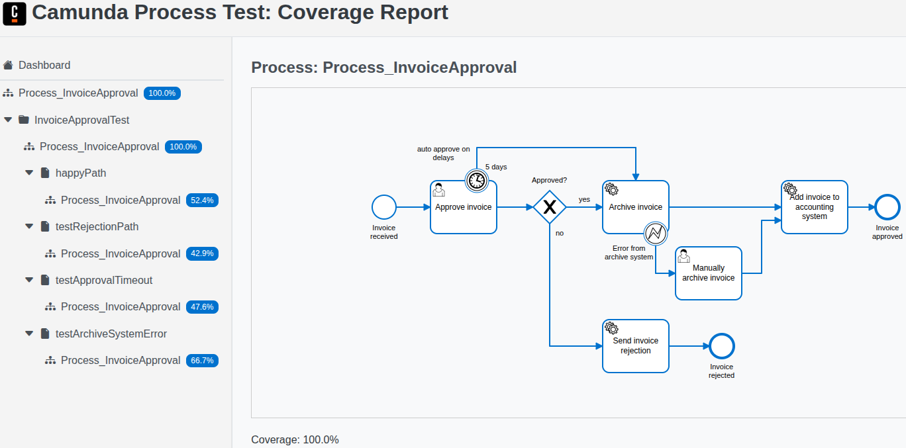

import Tabs from "@theme/Tabs";
import TabItem from "@theme/TabItem";

Use the [Camunda Process Test](https://github.com/camunda/camunda/tree/main/testing/camunda-process-test-java) (CPT) Java library to test your BPMN processes and your process application.

## About

CPT provides different runtimes to execute your process tests:

- [Testcontainers runtime](configuration.md#testcontainers-runtime) (default) - A managed runtime based on [Testcontainers](https://java.testcontainers.org/) and Docker.
- [Remote runtime](configuration.md#remote-runtime) - Your own runtime, such as, [Camunda 8 Run](/self-managed/quickstart/developer-quickstart/c8run.md)

:::info Public API
CPT is part of the Camunda 8 [public API](/reference/public-api.md) and is covered by our SemVer stability guarantees (except for alpha features). Breaking changes will not be introduced in minor or patch releases.
:::

:::note
CPT is the successor to [Zeebe Process Test](/apis-tools/testing/zeebe-process-test.md). Our previous testing library is deprecated and will be removed with version 8.10. See the [migration guide](/apis-tools/migration-manuals/migrate-to-camunda-process-test.md) to learn how to migrate your process tests.
:::

## Prerequisites

- Java:
  - For the Camunda Java client: 8+
  - For the Camunda Spring Boot Starter: 17+
- [JUnit 5](https://junit.org/junit5/)

For the default [Testcontainers runtime](configuration.md#testcontainers-runtime):

- A Docker-API compatible container runtime, such as Docker on Linux or Docker Desktop on Mac and Windows.

## Install

CPT has two variants:

- For the [Camunda Spring Boot Starter](/apis-tools/camunda-spring-boot-starter/getting-started.md)
- For the [Camunda Java client](/apis-tools/java-client/getting-started.md)

Choose the one depending on which library you use in your process application.

<Tabs groupId="client" defaultValue="spring-sdk" queryString values={[
{label: 'Camunda Spring Boot Starter', value: 'spring-sdk' },
{label: 'Java client', value: 'java-client' }
]}>

<TabItem value='spring-sdk'>

Add the following dependency to your Maven project:

```xml
<dependency>
  <groupId>io.camunda</groupId>
  <artifactId>camunda-process-test-spring</artifactId>
  <version>${camunda.version}</version>
  <scope>test</scope>
</dependency>
```

### Spring Boot 4.0 support

If you use the [dedicated Spring Boot 4.0 starter available with 8.8.9](../camunda-spring-boot-starter/getting-started.md#spring-boot-40-support),
you must also use the dedicated Spring Boot 4.0 test artifact:

```xml
<dependency>
  <groupId>io.camunda</groupId>
  <artifactId>camunda-process-test-spring-4</artifactId>
  <version>${camunda.version}</version>
  <scope>test</scope>
</dependency>
```

The 8.8.9 release of `camunda-process-test-spring-4` still contained `camunda-spring-boot-starter` as a dependency, potentially causing runtime issues.

As a workaround until this is fixed with 8.8.10, you must exclude it:

```xml
<dependency>
  <groupId>io.camunda</groupId>
  <artifactId>camunda-process-test-spring-4</artifactId>
  <version>${camunda.version}</version>
  <scope>test</scope>
  <exclusions>
    <exclusion>
      <groupId>io.camunda</groupId>
      <artifactId>camunda-spring-boot-starter</artifactId>
    </exclusion>
  </exclusions>
</dependency>
```

</TabItem>

<TabItem value='java-client'>

Add the following dependency to your Maven project:

```xml
<dependency>
  <groupId>io.camunda</groupId>
  <artifactId>camunda-process-test-java</artifactId>
  <version>${camunda.version}</version>
  <scope>test</scope>
</dependency>
```

</TabItem>

</Tabs>

## Write a test

Create a new Java class with the following structure:

<Tabs groupId="client" defaultValue="spring-sdk" queryString values={[
{label: 'Camunda Spring Boot Starter', value: 'spring-sdk' },
{label: 'Java client', value: 'java-client' }
]}>

<TabItem value='spring-sdk'>

```java
package com.example;

import io.camunda.client.CamundaClient;
import io.camunda.client.api.response.ProcessInstanceEvent;
import io.camunda.process.test.api.CamundaAssert;
import io.camunda.process.test.api.CamundaProcessTestContext;
import io.camunda.process.test.api.CamundaSpringProcessTest;
import org.junit.jupiter.api.Test;
import org.springframework.beans.factory.annotation.Autowired;
import org.springframework.boot.test.context.SpringBootTest;

@SpringBootTest
@CamundaSpringProcessTest
public class MyProcessTest {

    @Autowired private CamundaClient client;
    @Autowired private CamundaProcessTestContext processTestContext;

    @Test
    void shouldCreateProcessInstance() {
        // given process definition is deployed

        // when
        final ProcessInstanceEvent processInstance =
            client
                .newCreateInstanceCommand()
                .bpmnProcessId("my-process")
                .latestVersion()
                .send()
                .join();

        // then
        CamundaAssert.assertThat(processInstance).isActive();
    }
}
```

- `@SpringBootTest` is the standard Spring annotation for tests.
- `@CamundaSpringProcessTest` registers the Camunda test execution listener that starts and stops the test runtime.
- `@Test` is the standard JUnit 5 annotation for a test case.
- (_optional_) Inject a preconfigured `CamundaClient` to interact with the Camunda runtime.
- (_optional_) Inject a `CamundaProcessTestContext` to interact with the test runtime.
- (_optional_) Use `CamundaAssert` to verify the process instance state.

The Spring test requires a Spring Boot process application in the same package. Usually, the process
application [deploys the process resources](/apis-tools/camunda-spring-boot-starter/getting-started.md#deploy-process-models)
using the annotation `@Deployment`.

If you have no process application yet, you can add a minimal one inside the test class as follows:

```java
@SpringBootApplication
@Deployment(resources = "classpath*:/bpmn/**/*.bpmn")
static class TestProcessApplication {}
```

</TabItem>

<TabItem value='java-client'>

```java
package com.example;

import io.camunda.client.CamundaClient;
import io.camunda.client.api.response.ProcessInstanceEvent;
import io.camunda.process.test.api.CamundaAssert;
import io.camunda.process.test.api.CamundaProcessTest;
import io.camunda.process.test.api.CamundaProcessTestContext;
import org.junit.jupiter.api.Test;

@CamundaProcessTest
public class MyProcessTest {

    // to be injected
    private CamundaClient client;
    private CamundaProcessTestContext processTestContext;

    @Test
    void shouldCreateProcessInstance() {
        // given
        client
            .newDeployResourceCommand()
            .addResourceFromClasspath("my-process.bpmn")
            .send()
            .join();

        // when
        final ProcessInstanceEvent processInstance =
            client
                .newCreateInstanceCommand()
                .bpmnProcessId("my-process")
                .latestVersion()
                .send()
                .join();

        // then
        CamundaAssert.assertThat(processInstance).isActive();
    }
}
```

- `@CamundaProcessTest` registers the Camunda JUnit extension that starts and stops the test runtime.
- `@Test` is the standard JUnit 5 annotation for a test case.
- (_optional_) Get a preconfigured `CamundaClient` injected to interact with the Camunda runtime.
- (_optional_) Get a `CamundaProcessTestContext` injected to interact with the test runtime.
- (_optional_) Use `CamundaAssert` to verify the process instance state.

</TabItem>

</Tabs>

## Test lifecycle

CPT performs the following actions during the JUnit 5 lifecycle when running a test class:

<Tabs groupId="client" defaultValue="spring-sdk" queryString values={[
{label: 'Camunda Spring Boot Starter', value: 'spring-sdk' },
{label: 'Java client', value: 'java-client' }
]}>

<TabItem value='spring-sdk'>

- `beforeAll` (test methods)
  - Start the test runtime
- `beforeEach` (test method)
  - Inject the `CamundaClient` and the `CamundaProcessTestContext`
  - Publish the client created event for the Spring Boot process application to trigger the deployment and start job
    workers
- `afterEach` (test method)
  - Collect the data for the coverage report
  - Print the created process instances if the test failed
  - Close the client connections
  - Publish the client closed event for the Spring Boot process application to stop job workers
  - Reset the Camunda runtime clock
  - Delete all data in the Camunda runtime
- `afterAll` (test methods)
  - Generate the coverage report
  - Stop the test runtime

### Limitations

CPT doesn't support Spring Boot process applications with `@PostConstruct` methods or a `CommandLineRunner`
implementation. These methods are executed when the test class is initialized, but not before each test method.

We recommend to use a minimal configuration for the test instead of the Spring Boot process application and invoke the
`@PostConstruct` or `run()` methods manually before each test method.

```java
@SpringBootTest(classes = {TestProcessApplication.class})
@CamundaSpringProcessTest
public class ProcessTest {

  @Autowired private CamundaClient client;

  @BeforeEach
  void invokeProcessApplication() throws Exception {
    final Application springBootApplication = new Application();
    springBootApplication.setCamundaClient(client);
    // call the @PostConstruct methods
    springBootApplication.afterStarted();
    // call the CommandLineRunner method
    springBootApplication.run();
  }

}
```

Minimal test configuration:

```java
// must be in a different package than the Spring Boot application
package org.example.test;

@SpringBootApplication(
  // list all required packages for the process test, such as job workers
  scanBasePackages = {"org.example.services", "org.example.workers"}
)
@Deployment(resources = "classpath*:/bpmn/**/*.bpmn")
public class TestProcessApplication {}
```

</TabItem>

<TabItem value='java-client'>

- `beforeAll` (test methods)
  - Start the test runtime
- `beforeEach` (test method)
  - Inject the `CamundaClient` and the `CamundaProcessTestContext`
- `afterEach` (test method)
  - Collect the data for the coverage report
  - Print the created process instances if the test failed
  - Close the client connections
  - Reset the Camunda runtime clock
  - Delete all data in the Camunda runtime
- `afterAll` (test methods)
  - Generate the coverage report
  - Stop the test runtime

</TabItem>

</Tabs>

## Next steps

You can dive deeper into the library and read more about:

- `CamundaAssert` and [assertions](assertions.md)
- `CamundaProcessTestContext` and [utilities](utilities.md)
- How to [configure the runtime](configuration.md)
- Best practices for [writing process tests](/components/best-practices/development/testing-process-definitions.md)

## Examples

Take a look at the example project on [GitHub](https://github.com/camunda/camunda/tree/main/testing/camunda-process-test-example). This demonstrates the usage of the library for a demo Spring Boot process application.

## Process Test Coverage

After a test run, CPT prints the coverage of your BPMN processes to the log and generates a detailed HTML and JSON
report. You can use the report to identify untested paths in your processes and to increase your test coverage.

A link to the HTML report is printed in the log:

```
Process coverage: io.camunda.InvoiceApprovalTest
========================
- Process_InvoiceApproval: 100%

 Coverage report: file:///my/home/projects/my-process-application/target/coverage-report/report.html
```


