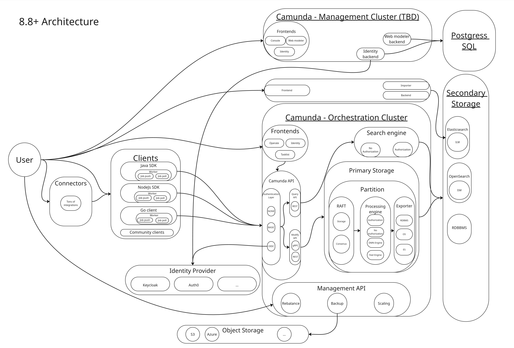
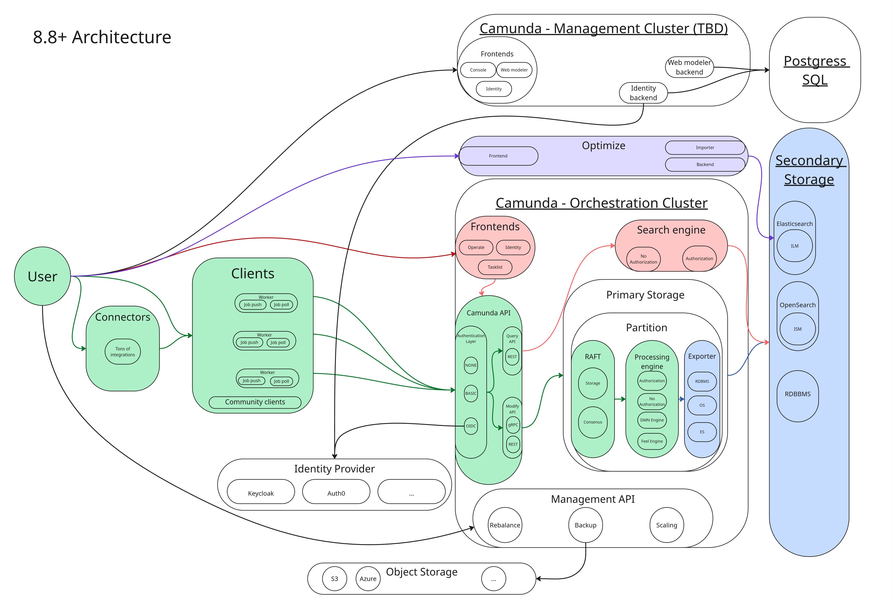

Camunda 8.8 introduced a consolidated [Orchestration Cluster](/components/orchestration-cluster.md). For a component-topology overview, see the [reference architecture](/self-managed/reference-architecture/). This page goes one level deeper: it traces how data moves through those components — and why that flow drives the sizing recommendations in the pages that follow.

<!-- Source: Miro board https://miro.com/app/board/uXjVGiNnJBc=/ -->

## A tale of two storages

Every record in Camunda passes through two distinct storage layers, and understanding the difference between them is the key to understanding sizing.

**[Primary storage](/reference/glossary/#primary-storage)** is the multi Raft cluster in Camunda, with partitions as the scaling unit. Each Partition has a Raft append-only log, RocksDB to store internal state, and snapshots for compaction. All writes land here first. It is durable and strongly consistent, but it is not directly queryable from outside the cluster. Each partition has exactly one leader that is responsible for both processing commands and exporting records.

**[Secondary storage](/reference/glossary/#secondary-storage)** is an external data storage where events are written to, like: Elasticsearch or OpenSearch. It is eventually consistent — populated asynchronously by the export pipeline. Everything that Operate, Tasklist, and the REST Query API reads comes exclusively from secondary storage.

## Command processing path

A command travels from the client to the primary storage to the engine and only after processing a response comes back.

The command processing path (Command lifecycle) looks like this (showed in green in the diagram above):

**Client (REST or gRPC) → Camunda API (Gateway) → Broker (Command API) → Raft partition (log) → Raft replication → Processing Engine → event on log → RocksDB state update → Client response**

Client responses are not sent until the command is fully processed by the engine, the engine is only able to process the command when it is commited on the log (as part of the Raft consensus protocol). The engine reads commands sequentially per partition — only one command per partition is processed at a time, and only the Raft partition leader runs the engine.

This means command response latency is bounded below by Raft commit time, engine processing time and processing queue length. In a healthy and stable cluster, this typically means sub-second response latency for simple commands.

If the engine cannot process commands fast enough; for example, because disk I/O is saturated, network latency is high or the backlog is large, the Command API applies backpressure to the client.

You can read more about this internal processing [here](../../zeebe/technical-concepts/internal-processing.md).

## Export pipeline

After the engine processes a command, it confirms its state change by an event on the log. Exporters asynchronously read such events from the log (only committed events) and write them to secondary storage in _batches_. Can be seen in blue in the diagram above.

**The exporters run on the same leader as the engine.** They are partition-bounded and cannot scale independently of partition count.

There are two built-in exporters in play:

- **[Camunda Exporter](../../../self-managed/components/orchestration-cluster/zeebe/exporters/camunda-exporter.md)**: aggregates and writes enriched data to secondary storage (ES/OS) for Operate, Tasklist, and the REST Query API.
- **[Elasticsearch Exporter](../../../self-managed/components/orchestration-cluster/zeebe/exporters/elasticsearch-exporter.md)**: writes raw engine events into specific Elasticsearch/OpenSearch indices, consumed by Optimize.

The Elasticsearch exporter is independent and can be enabled alongside the Camunda Exporter.

**Important to note:** read events are applied to the registered exporters one by one, in the same order as they appear on the log, and one event is first applied to ALL exporters before moving to the next event.

The exporters track their position in the Exporter state (backed by RocksDB). If the exporting backlog grows over a certain threshold, Camunda reduces the record write rate via a corresponding [flow control](/self-managed/operational-guides/configure-flow-control/configure-flow-control.md) mechanics to keep the exporting backlog manageable. In extreme cases, client commands are rejected via the standard backpressure mechanism.

Exporter behavior and performance is important for the system, because:

- _If an exporter falls behind, it holds up all exporters for that partition._
- _A slow secondary storage therefore directly reduces process execution throughput._
- _Custom exporters can have a high impact on overall throughput if they are not performant enough._

## Query path

Operate, Tasklist, and the REST Query API (`GET /v2/...`) read exclusively from the configured secondary storage. They never read directly from the engine. Can be seen in red in the diagram above.

This means query results are depending on the performance of the primary (processing path) and secondary storage (exporting pipeline). They are **eventually consistent**: there is always some lag between a command completing in the engine and the result being visible in search results or the UI. This is measured as the `data availability latency`.

Data availability latency is bounded below by export pipeline lag; if the exporter is behind, data availability is behind. This can be caused by a slow or overloaded secondary storage.

## Optimize data flow

Optimize sits on top of the export pipeline as a second-tier consumer (can be seen in violet in the diagram above).

1. The Elasticsearch exporter writes raw engine events into per-partition Elasticsearch/OpenSearch indices.
2. Optimize's **importer** reads from those indices and transforms the data into its own analytics indices.
3. Optimize writes the analytics indices **back into the same or another Elasticsearch cluster**.

This means Optimize has an additional hop in the data flow compared to Operate and Tasklist, and it writes to secondary storage twice: once for the raw events and once for the analytics indices. As result data availability latency for Optimize is higher than for Operate and Tasklist, and the overall write load on Elasticsearch is significantly higher when Optimize is enabled.

:::note
This was exactly the reason to change the architecture in 8.8 to have the Camunda Exporter to aggregate the data for Operate and Tasklist as before both had a similar Exporter-Importer architecture as Optimize. See related [Blog post](https://camunda.com/blog/2025/02/one-exporter-to-rule-them-all-exploring-camunda-exporter/).
:::

Details on the impact of running Optimize can be found in the [sizing guide](sizing-your-environment.md#impact-of-optimize).

**Mitigation options:** Run Optimize on a separate Elasticsearch instance to isolate its load from the core export pipeline; use variable filtering to reduce export volume; tune retention periods; disable variable import if variables are not needed in Optimize reports.

## Sizing bridge

The paths above map directly to the factors documented in [Size your environment](sizing-your-environment.md):

- **Partition count** bounds both command path throughput and export pipeline parallelism. More partitions means more parallel processing and exporting, up to the available hardware.
- **Elasticsearch resources** is the most common cause of operational delay and degradation. Monitor and scale storage before hitting performance bottlenecks.
- **Optimize** significantly increases secondary storage write load. Size Elasticsearch respectively — or use a dedicated Elasticsearch instance — if Optimize is enabled.

For hardware recommendations based on these factors, see [Size your environment](sizing-your-environment.md).
