When integrating systems and services, you can choose between various modeling possibilities in BPMN. This practice will give you an overview and advice on how to decide between alternatives.

You will note that service tasks in general are a good choice, but there are also situations where you might want to switch to send and receive tasks or events.

## Understanding communication patterns

Let's briefly examine the three typical communication patterns to integrate systems:

- **Request/response using synchronous communication styles**: You use a synchronous protocol, like HTTP, and block for the result.
- **Request/response using asynchronous communication styles**: You use asynchronous communication, for example, by sending messages via a message broker, but wait for a response message right after. Technically, these are two independent asynchronous messages, but the sender blocks until the response is received, hence logically making it a request/response.
- **Asynchronous messages or events:** If a peer service needs a long time to process a request, the response is much later than the request, say hours instead of milliseconds. In this case, the response is typically handled as a separate message. Additionally, some of your services might also wait for messages or events that are not connected to a concrete request, especially in event-driven architectures.

The following table gives a summary of the three options:

|                                   | Synchronous request/response | Asynchronous request/response | Asynchronous messages or events |
| --------------------------------- | :--------------------------- | :---------------------------- | :------------------------------ |
| **Business level**                | Synchronous                  | Synchronous                   | Asynchronous                    |
| **Technical communication style** | Synchronous                  | Asynchronous                  | Asynchronous                    |
| **Example**                       | HTTP                         | AMQP, JMS                     | AMQP, Apache Kafka              |

You can dive more into communication styles in the webinar [Communication Between Loosely Coupled Microservices](https://page.camunda.com/wb-communication-between-microservices) ([slides](https://www.slideshare.net/BerndRuecker/webinar-communication-between-loosely-coupled-microservices), [recording](https://page.camunda.com/wb-communication-between-microservices) and [FAQ](https://blog.bernd-ruecker.com/communication-between-loosely-coupled-microservices-webinar-faq-a02708b3c8b5)).

## Integrating services with BPMN tasks

Let’s look at using BPMN tasks to handle these communication patterns before diving into BPMN events later.

### Service task

The [service task](/components/modeler/bpmn/service-tasks/service-tasks.md) is the typical element to implement synchronous request/response calls, such as REST, gRPC or SOAP. You should **always use service tasks for synchronous request/response**.

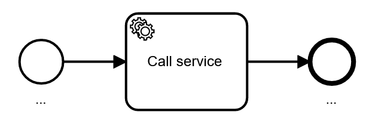

### Send task

Technically, **send tasks behave exactly like service tasks**. However, the alternative symbol makes the meaning of sending a message easier to understand for some stakeholders.

You **should use send tasks for sending asynchronous messages**, like AMQP messages or Kafka records.

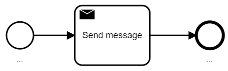

There is some gray area whenever you call a synchronous service that then sends an asynchronous message. A good example is email. Assume your process does a synchronous request/response call to a service that then sends an email to inform the customer. The call itself is synchronous because it gives you a confirmation (acknowledgement, or ACK for short) that the email has been sent. Now is the "inform customer" task in your process a service, or a send task?

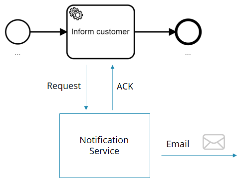

This question is not easy to answer and **depends on what your stakeholders understand more intuitively**. The more technical people are, the more you might tend towards a service task, as this is technically correct. The more you move towards the business side, the more you might tend to use a send task, as business people will consider sending an email an asynchronous message.

In general, we tend to **let the business win** as it is vital that business stakeholders understand business processes.

However, if you follow a microservice (or service-oriented architecture) mindset, you might argue that you don’t need to know exactly how customers are informed within the process. Hiding the information if the notification is synchronous or asynchronous is good to keep your process model independent of such choices, making it more robust whenever the implementation of the notification service changes. This is a very valid concern too, and might motivate for a service task.

:::note
In case you can’t easily reach a conclusion, save discussion time and just use a service task.
:::

You could also argue to use send tasks to invoke synchronous request/response calls when you are not interested in the response. However, this is typically confusing, and we do not recommend this.

### Receive task

A [receive task](/components/modeler/bpmn/receive-tasks/receive-tasks.md) waits for an asynchronous message. Receive tasks **should be used for incoming asynchronous messages or events**, like AMQP messages or Kafka records.

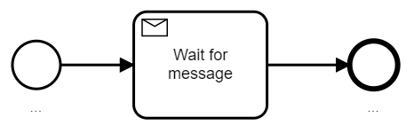

Receive tasks can be used to receive the response in asynchronous request/response scenarios, which is discussed next.

### Service task vs. send/receive task combo

For asynchronous request/response calls, you can use a send task for the request, and a following receive task to wait for the response:

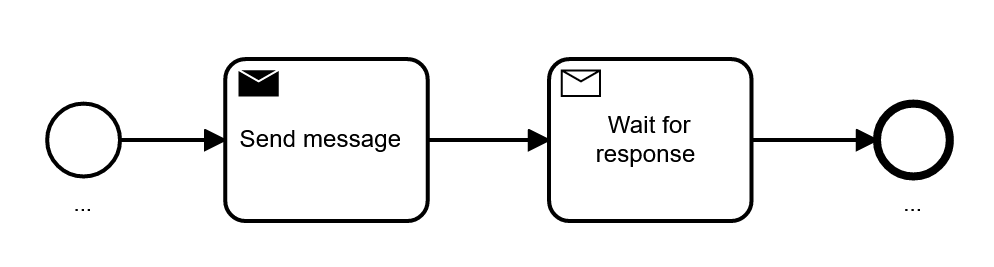

You can also use a service task, which is sometimes unknown even to advanced users. A service task can technically wait for a response that happens at any time, a process instance will wait in the service task, as it would in the receive task.

Deciding between these options is not completely straightforward. You can find a table listing the decision criteria below.

As a general rule-of-thumb, we recommend using **the service task as the default option for synchronous _and_ asynchronous request/response** calls. The beauty of service tasks is that you remove visual clutter from the diagram, which makes it easier to read for most stakeholders.

This is ideal if the business problem requires a logically synchronous service invocation. It allows you to ignore the technical details about the protocol on the process model level.

The typical counter-argument is that asynchronous technical protocols might lead to different failure scenarios that you have to care about. For example, when using a separate receive task, readers of the diagram almost immediately start to think about what happens if the response will not be received. But this also has the drawback that now business people might start discussing technical concerns, which is not necessarily good.

Furthermore, this is a questionable argument, as synchronous REST service calls could also timeout. This is exactly the same situation, just hidden deeper in network abstraction layers, as every form of remote communication uses asynchronous messaging somewhere down in the network stack. On a technical level, you should always think about these failure scenarios. The talk [3 common pitfalls in microservice integration and how to avoid them](https://berndruecker.io/3-pitfalls-in-microservice-integration/) goes into more detail on this.

On a business level, you should be aware of the business implications of technical failures, but not discuss or model all the nuts and bolts around it.

However, there are also technical implications of this design choice that need to be considered.

**Technical implications of using service tasks**

You can keep a service task open and just complete it later when the response arrives, but in **to complete the service task, you need the _job instance key_** from Zeebe. This is an internal ID from the workflow engine. You can either:

- Pass it around to the third party service which sends it back as part of the response message.
- Build some kind of lookup table, where you map your own correlation information to the right job key.

:::note
Later versions of Zeebe might provide query possibilities for this job key based on user controlled data, which might open up more possibilities.
:::

Using workflow engine internal IDs can lead to problems. For example, you might cancel and restart a process instance because of operational failures, which can lead to a new ID. Outstanding responses cannot be correlated anymore in such instances.

Or, you might run multiple workflow engines which can lead to internal IDs only being unique within one workflow engine. All of this might not happen, but the nature of an internal ID is that it is internal and you have no control over it — which bears some risk.

In practice, however, using the internal job instance key is not a big problem if you get responses in very short time frames (milliseconds). Whenever you have more long-running interactions, you should consider using send and receive tasks, or build your own lookup table that can also address the problems mentioned above.

This is also balanced by the fact that service tasks are simply very handy. The concept is by far the easiest way to implement asynchronous request/response communication. The job instance key is generated for you and unique for every message interchange. You don’t have to think about race conditions or idempotency constraints yourself. [Timeout handling and retry logic](/components/concepts/job-workers.md#timeouts) is built into the service task implementation of Zeebe. There is also [a clear API to let the workflow engine know of technical or business errors](/components/concepts/job-workers.md#completing-or-failing-jobs).

**Technical implications of using send and receive tasks**

Using send and receive tasks means to use [the message concept built into Zeebe](/components/concepts/messages.md). This is a powerful concept to solve a lot of problems around cardinalities of subscriptions, correlation of the message to the right process instances, and verification of uniqueness of the message (idempotency).

When using messages, you need to provide the correlation ID yourself. This means that the correlation ID is fully under your control, but it also means that you need to generate it yourself and make sure it is unique. You will most likely end up with generated UUIDs.

You can leverage [message buffering](/components/concepts/messages.md#message-buffering) capabilities, which means that the process does not yet need to be ready to receive the message. You could, for example, do other things in between, but this also means that you will not get an exception right away if a message cannot be correlated, as it is simply buffered. This leaves you in charge of dealing with messages that can never be delivered.

Retries are not built-in, so if you need to model a loop to retry the initial service call if no response is received. And (at least in the current Zeebe version), there is no possibility to trigger error events for a receive task, which means you need to model error messages as response payload or separate message types — both are discussed later in this post.

A final note for high-performance environments: These powerful messaging capabilities do not come for free and require some overhead within the engine. For pure request/response calls that return within milliseconds, none of the features are truly required. If you are looking to build a high-performance scenario, using service tasks instead of message correlation for request/response calls, you can tune your overall performance or throughput. However, as with everything performance related, the devil is in the detail, so [reach out to us](/reference/contact.md) to discuss such a scenario in more depth.

**Summary And recommendations**

The following table summarizes the possibilities and recommendations.

| Case                   | Synchronous request/response                                                                                                | Synchronous request/response                                                                                          | Asynchronous request/response                                                                                                                                                                        | Asynchronous request/response                                                                                                                                                                     |
| :--------------------- | :-------------------------------------------------------------------------------------------------------------------------- | :-------------------------------------------------------------------------------------------------------------------- | :--------------------------------------------------------------------------------------------------------------------------------------------------------------------------------------------------- | :------------------------------------------------------------------------------------------------------------------------------------------------------------------------------------------------ |
| BPMN element           | Service task                                                                                                                | Send task                                                                                                             | Service task                                                                                                                                                                                         | Send + receive task                                                                                                                                                                               |
|                        |                                                                         |                                                                         |                                                                                                                                                  |                                                                                                                             |
| Technical implications |                                                                                                                             | Behaves like a service task                                                                                           | A unique correlation ID is generated for you. You don’t have to think about race conditions or idempotency. Timeout handling and retry logic are built-in. API to flag business or technical errors. | Correlation ID needs to be generated yourself, but is fully under control. Message buffering is possible but also necessary. Timeouts and retries need to be modeled. BPMN errors cannot be used. |
| Assessment             | Very intuitive.                                                                                                             | Might be more intuitive for fire and forget semantics, but can also lead to discussions.                              | Removes visual noise which helps stakeholders to concentrate on core business logic, but requires use of internal job instance keys.                                                                 | More visual clutter, but also more powerful options around correlation and modeling patterns.                                                                                                     |
| Recommendation         | Default option, use unless it is confusing for business stakeholders (e.g. because of fire and forget semantics of a task). | Use for fire and forget semantics, unless it leads to unnecessary discussions, in this case use service task instead. | Use when response is within milliseconds and you can pass the Zeebe-internal job instance key around.                                                                                                | Use when the response will take time (> some seconds), or you need a correlation ID you can control.                                                                                              |

## Integrating services with BPMN events

Instead of using send or receive **tasks**, you can also use send or receive **events** in BPMN.

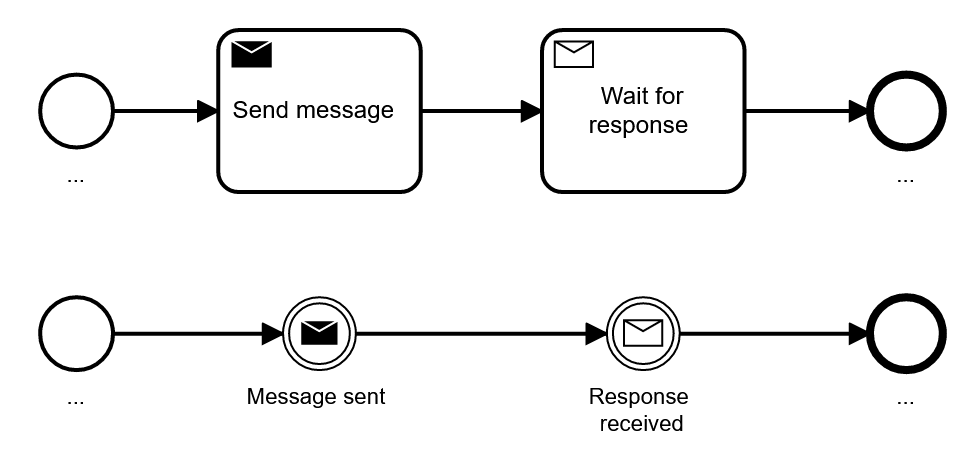

Let's first explore when you want to do that, and afterwards look into some more advanced patterns that become possible with events.

### Tasks vs. events

The **execution semantics of send and receive events is identical with send and receive tasks**, so you can express the very same thing with tasks or events.

However, there is one small difference that might be relevant: **only tasks can have boundary events**, which allows to easily model when you want to cancel waiting for a message:

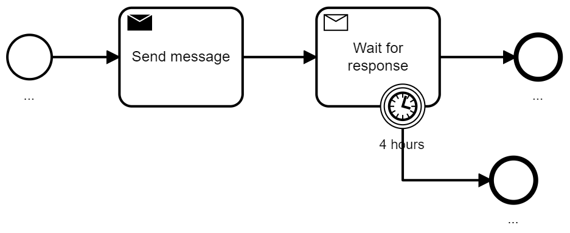

Despite this, the whole visual representation is of course different. In general, tasks are easier understood by most stakeholders, as they are used very often in BPMN models.

However, in certain contexts, such as event-driven architectures, events might be better suited as the concept of events is very common. Especially, if you apply domain-driven design (DDD) and discuss domain events all day long, it might be intuitive that events are clearly visible in your BPMN models.

Another situation better suited for events is if you send events to your internal reporting system besides doing “the real” business logic. Our experience shows that the smaller event symbols are often unconsciously treated as less important by readers of the model, leading to models that are easier to understand.

|                | Send task                | Receive task             | Send event                                                                                                              | Receive event                                                                                                           |
| :------------- | :----------------------- | :----------------------- | :---------------------------------------------------------------------------------------------------------------------- | :---------------------------------------------------------------------------------------------------------------------- |
| Recommendation | Prefer tasks over events | Prefer tasks over events | Use only if you consistently use events over tasks and have a good reason for doing so (e.g. event-driven architecture) | Use only if you consistently use events over tasks and have a good reason for doing so (e.g. event-driven architecture) |

:::note
The choice about events vs. commands also [needs to be reflected in the naming of the element](../../modeling/naming-bpmn-elements), as a task emphasizes the action (e.g. "wait for response") and the event reflects what happened (e.g. "response received").
:::

### Handling different response messages

Very often the response payload of the message will be examined to determine how to move on in the process.

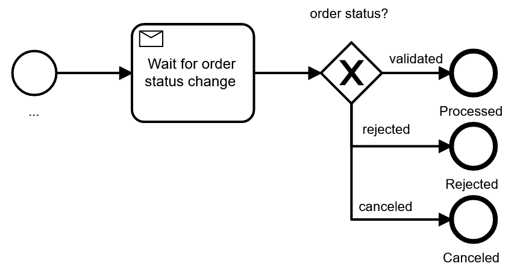

In this case, you receive exactly one type of message for the response. As an alternative, you could also use different message types, to which the process can react differently. For example, you might wait for the validation message, but also accept a cancellation or rejection message instead:

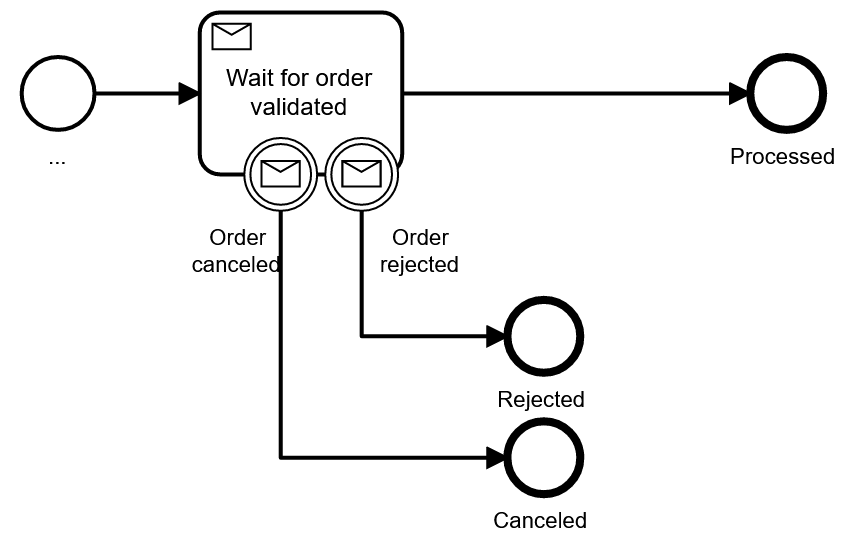

This modeling has the advantage that it is much easier to note the expected flow of the process (also called the happy path), with exceptions deviating from it. On the other hand, this pattern mixes receive tasks and events in one model, which can confuse readers. Keep in mind that it only works for a limited number of non-happy messages.

To avoid the task/event mixture you could use a so-called event-based gateway instead, this gateway waits for one of a list of possible message types to be received:

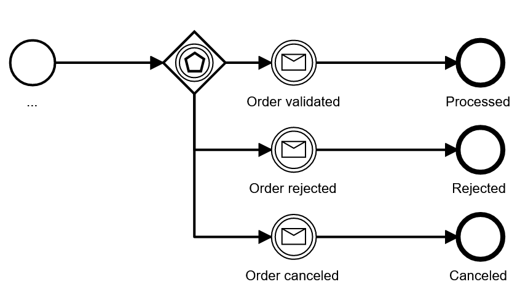

We typically try to avoid the event-based gateway, as it is hard to understand for non-BPMN professionals. At the same time, it shares the downside of the first pattern with the decision gateway after the receive task: the happy path cannot be easily spotted.

As a fourth possibility, you can add event subprocesses, which get activated whenever some event is received while the process is still active in some other area. In the above example, you could model the happy path and model all deviations as event subprocesses.

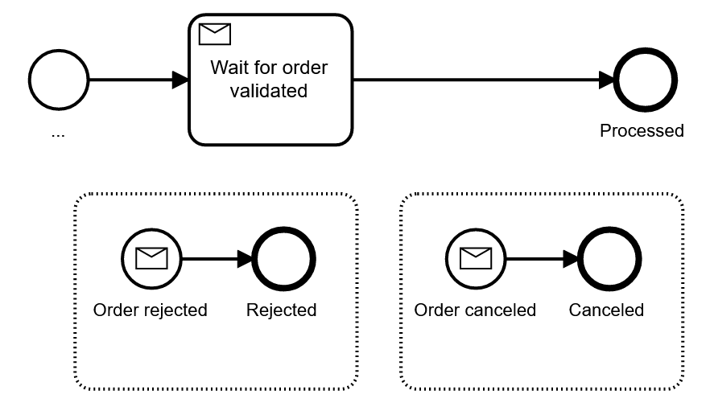

This pattern is pretty handy, but also needs some explanation to people new to BPMN. It has one downside you need to know: once your process instance moves to the subprocess, you can’t easily go back to the typical flow. To some extent this problem can be solved by advanced modeling patterns like shown in the [allow for order cancellation anytime](../../modeling/building-flexibility-into-bpmn-models/#allow-for-order-cancellation-any-time) example.

At the same time, the event subprocess has a superpower worth mentioning: you can now wait for cancellation messages in whole chunks of your process — it could arrive anytime.

|                   | Receive task with boundary events                                                                     | Payload and XOR-gateway                                                                   | Event-based gateway                                                                          | Event subprocess                                                                       |
| ----------------- | ----------------------------------------------------------------------------------------------------- | ----------------------------------------------------------------------------------------- | -------------------------------------------------------------------------------------------- | -------------------------------------------------------------------------------------- |
|                   |           |                   |  |  |
| Understandability | Easy                                                                                                  | Very easy                                                                                 | Hard                                                                                         | Medium                                                                                 |
| Assessment        | Limitation on how many message types are possible                                                     | Happy path not easily visible                                                             |                                                                                              | Might need some explanation for readers of the model                                   |
| Recommendation    | Use when it is important to observe message types in the visual, limit to two boundary message events | Use when there are more response types or if the response type can be treated as a result | Try to avoid                                                                                 | Use if you need bigger scopes where you can react to events                            |

### Message type on the wire != BPMN message type

There is one important detail worth mentioning in the context of message response patterns: The message type used in BPMN models does not have to be exactly the message type you get on the wire. When you correlate technical messages, e.g. from AMQP, you typically write a piece of glue code that receives the message and calls the workflow engine API. This is described in [connecting the workflow engine with your world](../connecting-the-workflow-engine-with-your-world/), including a code example. In this glue code you can do various transformations, for example:

- Messages on different message queues could lead to the same BPMN message type, probably having some additional parameter in the payload indicating the origin.
- Some message header or payload attributes could be used to select between different BPMN message types being used.

It is probably not best practice to be as inconsistent as possible between technical message types and BPMN message types. Still, the flexibility of a custom mapping might be beneficial in some cases.

## Hiding technical complexity behind call activities

Whenever technical details of one service integration become complicated, you can think of creating a separate process model for the technicalities of the call and use a [call activity](/components/modeler/bpmn/call-activities/call-activities.md) in the main process.

An example is given in chapter 7 of [Practical Process Automation](https://processautomationbook.com/):

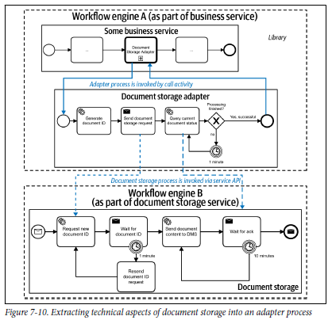

In the customer scenario, a document storage service was long-running, but could not do a real callback or response message for technical reasons (in short, firewall limitations). As a result, the document storage service needed to be regularly polled for the response. In the customer scenario, this was done by a "document storage adapter" process that leveraged workflow engine features to implement the polling every minute, and especially the persistent waiting in between. In the main business process, this technical adapter process was simply invoked via a call activity, meaning no technicalities bloated that diagram.
