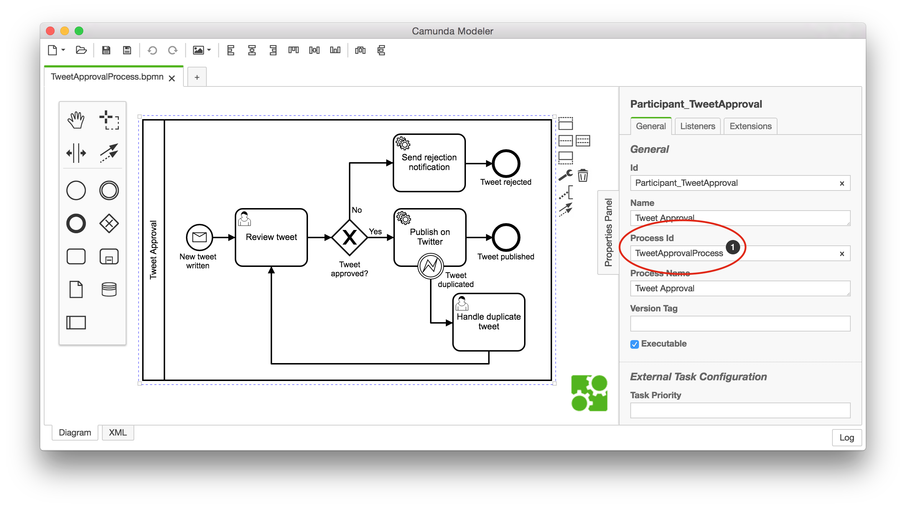
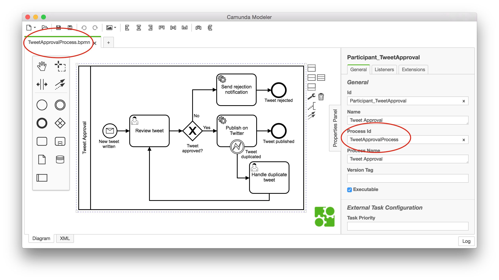

For executable flows, properly name all relevant technical element IDs in your BPMN diagrams.

Focus on process, activity, message, and error IDs, but also consider events as well as gateways and their sequence flows that carry conditional expressions. Those elements can show up regularly (e.g. in your logs) and it makes things easier if you can interpret their meaning.

## Using naming conventions for BPMN IDs

Define developer-friendly and business-relevant IDs for the process itself, as well as all activities, messages, and errors. Also consider events, gateways, and the sequence flows that carry conditional expressions. Even though IDs are just identifiers, keep in mind that they will show up regularly on the technical level. Meaningful IDs will help a lot.

Examine the IDs shown in the following example:

<div bpmn="best-practices/naming-technically-relevant-ids-assets/TweetApprovalProcess.bpmn" callouts="Participant_TweetApproval,StartEvent_NewTweetWritten,Task_ReviewTweet,Gateway_TweetApproved,SequenceFlow_ApprovedNo,BoundaryEvent_TweetDuplicated,EndEvent_TweetPublished" />

The following table provides you with a guideline that we would use in a context where developers are comfortable with _Java_ and _PascalCase_ naming style. You may adapt these suggestions to typical naming conventions used in your programming context.

|       |                   | XML Attribute        | Prefix or Suffix | Resulting ID                  |
| ----- | ----------------- | -------------------- | ---------------- | ----------------------------- |
| **1** | Tweet Approval    | process/@id          | Process          | TweetApprovalProcess          |
| **2** | New tweet written | startEvent/@id       | StartEvent\_     | StartEvent_NewTweetWritten    |
|       |                   | message/@id          | Message\_        | Message_NewTweetWritten       |
|       |                   | message/@name        | Msg\_            | Msg_NewTweetWritten           |
| **3** | Review tweet      | userTask/@id         | Task\_           | Task_ReviewTweet              |
| **4** | Tweet approved?   | exclusiveGateway/@id | Gateway\_        | Gateway_TweetApproved         |
| **5** | No                | sequenceFlow/@id     | SequenceFlow\_   | SequenceFlow_TweetApprovedNo  |
| **6** | Tweet duplicated  | boundaryEvent/@id    | BoundaryEvent\_  | BoundaryEvent_TweetDuplicated |
|       |                   | error/@id            | Error\_          | Error_TweetDuplicated         |
|       |                   | error/@errorCode     | Err\_            | Err_TweetDuplicated           |
| **7** | Tweet published   | EndEvent\_/@id       | EndEvent\_       | EndEvent_TweetPublished       |

### Editing IDs with Camunda Modeler

We recommend using Camunda Modeler's properties panel on the right side of the screen to edit technical identifiers and change them according to your naming conventions, like it is shown here for the process ID:



We especially do not recommend editing identifiers in the XML directly, as it might accidentally corrupt your BPMN file. You have to keep the identifiers in the section about the graphical layout (so called "DI" for diagram interchange) further down in sync with the execution semantics at the top of the XML.

However, we include an XML example of all those identifiers mentioned for illustration:

```xml
<process id="TweetApprovalProcess" name="Tweet Approval"> <!--1-->
  <StartEvent_ id="StartEvent_NewTweetWritten" name="New tweet written"> <!--2-->
    <Message_EventDefinition Message_Ref="Message_NewTweetWritten" />
  </StartEvent_>
  <UserTask_ id="UserTask_ReviewTweet" name="Review tweet"></UserTask_> <!--3-->
  <Gateway_ id="Gateway_TweetApproved" name="Tweet approved?"> <!--4-->
  </Gateway_>
  <SequenceFlow_ id="SequenceFlow_TweetApprovedNo" name="No"> <!--5-->
  </SequenceFlow_>
  <BoundaryEvent_ id="BoundaryEvent_TweetDuplicated" name="Tweet duplicated"> <!--6-->
    <Error_EventDefinition Error_Ref="Error_TweetDuplicated" />
  </BoundaryEvent_>
  <EndEvent_ id="EndEvent_TweetPublished" name="Tweet published"> <!--7-->
  </EndEvent_>
</process>

<Message_ id="Message_NewTweetWritten" name="Msg_NewTweetWritten" /> <!--2-->
<Error_ id="Error_TweetDuplicated" name="Tweet duplicated" Error_Code="Err_TweetDuplicated" /> <!--6-->
...
 <bpmndi:BPMNDiagram id="BPMNDiagram_1">
    <bpmndi:BPMNPlane id="BPMNPlane_1" bpmnElement="TweetApprovalProcess">
      <bpmndi:BPMNShape id="_BPMNShape_StartEvent__1" bpmnElement="StartEvent_NewTweetWritten"> <!--8-->
        <dc:Bounds x="100" y="50" width="36" height="36" />
      </bpmndi:BPMNShape>
```

<span className="callout">8</span>

Elements in the diagram interchange section (DI) reference identifiers from above; you have to adjust them accordingly! Camunda Modeler takes care of this automatically.

Changing IDs can potentially break your tests or even process logic if done at a late stage of development. Therefore, consider using meaningful IDs right from the beginning and perform the renaming as part of the modeling.

### Aligning the BPMN file name with the process ID

It is a good practice to _align_ the _file name_ of your BPMN models with the _process id_ of the executable process that is inside the file.



## Generating ID constants classes

If you have lots of process, case, and decision definitions with lots of IDs, consider generating constant classes (e.g. via XSLT) directly from your BPMN or DMN XML files. For example, this can be used for testing.

## Using a Camunda Modeler plugin to generate meaningful ids

You can use [this modeler plugin community extension](https://github.com/camunda-community-hub/camunda-modeler-plugin-rename-technical-ids) to automatically convert your IDs to comply with our best practices. Of course, you could also use this as a basis to create your own modeler plugin to generate IDs that follow your custom naming conventions. Or, you could implement a similar plugin to implement checks if all relavant IDs follow your naming conventions.
