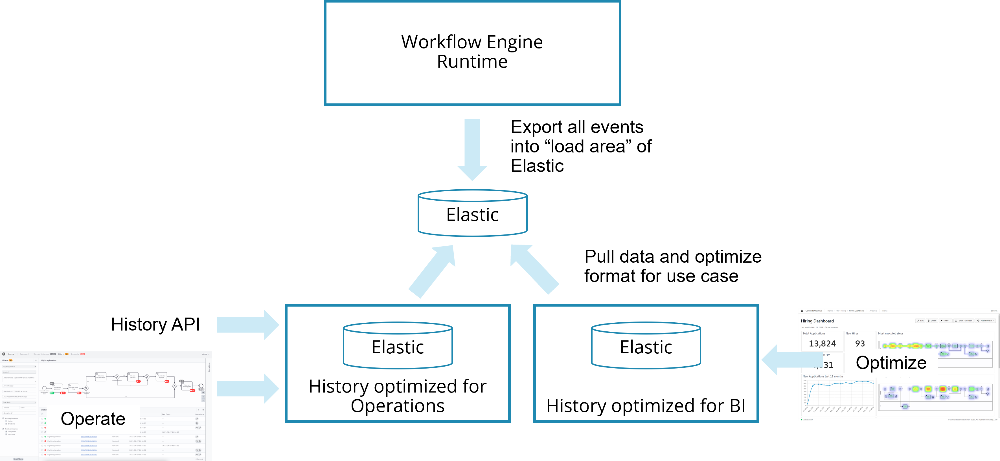

The Camunda engine automatically collects audit information about historical process or decision instances. Leverage this data by generating and displaying business relevant reports. Add business relevant phases and milestones to your process models serving as a basis for key performance indicators (KPIs).

## Modeling key performance indicators (KPIs)

When modeling a process, you always add information about important key performance indicators implicitly; for example, by introducing **start and end events**.

Additionally, you can explicitly add the following:

- Meaningful additional business **milestones** by modeling **intermediate events**, for example. This might not have any execution semantics other than leaving a trace in the history of the workflow engine. The milestone is met as soon as the process has passed the event. Its status can therefore be **passed** or **not passed**.

- Meaningful business **phases** by modeling things like (embedded) **subprocesses**. In contrast to a milestone, a phase's state can be **not entered**, currently **active**, or **passed**.

Consider the following example - a "Tweet Approval Process" shows start and end events as well as **milestones**:

"

3

After one business day, the reviewer is reminded to speed up - and such reviews are internally _marked_ by passing the end event 'Review done slowly'.

4

**Approved tweets** will pass the additional **intermediate event**. The **cycle time** up until that point is automatically captured too.

5

Furthermore, when tweets are successfully published, we are interested in the **ratio** of those tweets...

6

...when compared to tweets that do not get published. Therefore, we model _two different end events_ representing those two business end states of the process.

:::note
Duplicate tweets will _not be published_ even though they have been _approved_ before. The more precisely we describe and _name_ the business semantics of events, the better our KPI's will reflect the reality we want to measure!
:::

When you do not (only) want to concentrate on milestones, but _phases_ in your process, model the phases as subprocesses:

1

The phase _Review_—modeled with a subprocess—will be active, while the human reviewer will need to find time to complete the task...

2

...whereas the phase _Publication_ will be completed automatically - hence process instances "remaining" there for longer than a few seconds will probably indicate ongoing problems with the uptime and reachability of the used services.

## History architecture

It is useful to understand the architecture around history data in Camunda 8.

:::caution Camunda 7
Note that the history architecture is very different in Camunda 7.x, refer to [Camunda 7 User Guide](https://docs.camunda.org/manual/latest/user-guide/process-engine/history/).
:::

Camunda saves historical data not just when a process instance finishes, but on the go, while a process instance is active. By doing this, Camunda separates runtime data from history data. A growing history will not influence the runtime behavior, and you should never need to access runtime data for reporting purposes.

Historical data can be leveraged via three possible mechanisms:

- **Camunda tools**: Leverage Camunda Operate or Camunda Optimize. This is a very simple approach that works out-of-the-box and should satisfy many requirements already. Camunda Operate focuses on operational use cases ("Where is my process? Why did this fail?") whereas Camunda Optimize provides business intelligence about your processes. Optimize allows you to build reports and dashboards including setting alerts for thresholds.

- **Query API**: Using the public API (currently under development), this has the advantage that you can make use of the history data within your own applications.

- Pushing **events**: Pushing Camunda events by using [exporters](/components/zeebe/technical-concepts/architecture.md#exporters). Note that you can only add own exporters in a Self-Managed setting, not in Camunda 8 SaaS. Exporters have the advantage that you can push the data into any infrastructure you have, and possibly even filter or enrich the data in that step.

## Connecting custom business intelligence systems (BI), data warehouses (DWH), or monitoring solutions

You might move data from the Camunda History to a decoupled system like a Business Intelligence (BI) solution, a Data Warehouse (DWH), some Data Lake, or an own monitoring solution, for example based on Prometheus.

Leveraging typical BI system's **ETL** (extract, transform, and load) features allows you to optimize data structure for your reporting purposes (to _speed up_ report generation) or to combine generic process engine data with business entities (to allow for _more in-depth analysis_).

To get the data into the BI system, leverage one of the mechanisms described above. Our recommendation generally is:

- In SaaS, leverage the history API to regularly pull data, as custom exporters are not supported there.
