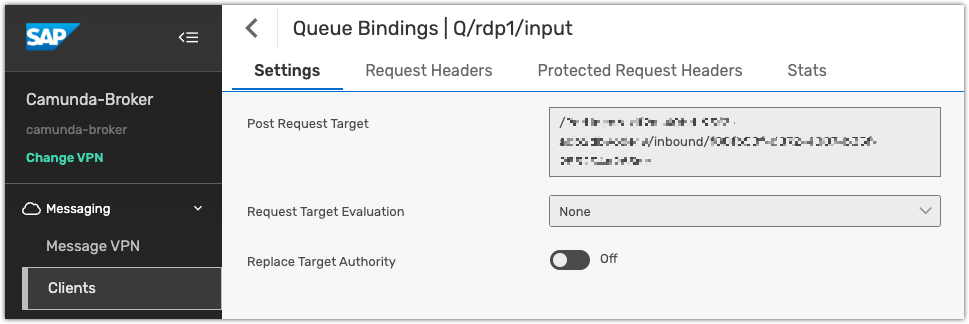

Receive [CloudEvents](https://cloudevents.io/) from SAP Advanced Event Mesh (AEM) and send CloudEvents to AEM.

## About SAP eventing

SAP eventing uses three connectors that enable bidirectional communication between Camunda and AEM.

<!-- add links of Element Template from marketplace! -->

| Connector                                                                                                                                  | Description                                                                                                                                                                                                                               |
| :----------------------------------------------------------------------------------------------------------------------------------------- | :---------------------------------------------------------------------------------------------------------------------------------------------------------------------------------------------------------------------------------------- |
| [SAP Eventing Outbound Connector](https://marketplace.camunda.com/en-US/apps/632606/sap-eventing-outbound-connector)                       | Sends CloudEvents from Camunda to an AEM topic or queue endpoint.                                                                                                                                                                         |
| [SAP Eventing Message Start Event Connector](https://marketplace.camunda.com/en-US/apps/632607/sap-eventing-message-start-event-connector) | Translates an incoming CloudEvent from AEM into a [BPMN Message Start Event](/components/modeler/bpmn/message-events/message-events.md#message-start-events) to trigger a new process instance.                                           |
| [SAP Eventing Intermediate Event Connector](https://marketplace.camunda.com/en-US/apps/632751/sap-eventing-intermediate-event-connector)   | Translates an incoming CloudEvent from AEM into a [BPMN Intermediate Catch Event](/components/modeler/bpmn/message-events/message-events.md#intermediate-message-catch-events) to allow an active process to continue based on the event. |

The integration uses **HTTP** as the transport protocol:

- Incoming connectors act as webhooks, receiving CloudEvent payloads and delivering them into process instances.
- The outbound connector sends `HTTP POST` requests to an AEM [topic](https://docs.solace.com/Messaging/Guaranteed-Msg/Topic-Endpoints.htm) or [queue](https://docs.solace.com/Messaging/Guaranteed-Msg/Queues.htm) endpoint.

:::info
SAP Advanced Event Mesh uses [Solace Event Broker](https://solace.com/products/event-broker/) as its core event broker.  
The terms **AEM** and **Solace Event Broker** can be used interchangeably when referring to eventing functionality.
:::

## Prerequisites

Because **HTTP** is used as the transport protocol, AEM must be configured to use [REST messaging](https://docs.solace.com/API/REST/REST-get-start.htm). This enables publishers and subscribers to communicate over HTTP.

The configuration examples below build on the Solace tutorial [Publish/Subscribe REST Messaging](https://tutorials.solace.dev/rest-messaging/publish-subscribe/), which provides detailed steps for setting up REST-based publish/subscribe messaging.

## Installation

Install the SAP Eventing connectors directly from the [Camunda Marketplace](https://marketplace.camunda.com/).

## Configuration overview

- [SAP Eventing Message Start Event Connector](#sap-eventing-message-start-event-connector)
- [SAP Eventing Intermediate Event Connector](#sap-eventing-intermediate-event-connector)
- [SAP Eventing Outbound Connector](#sap-eventing-outbound-connector)

## SAP Eventing Message Start Event Connector

Inbound CloudEvents → BPMN message.

Applying the **SAP Eventing Message Start Event Connector** generates a unique **webhook URL** that starts a new BPMN process instance when invoked.


:::info
The webhook URL is generated **only after the initial deployment** of the process.
:::

This URL must be registered as a target in **SAP Advanced Event Mesh (AEM)**.  
The host portion of the URL (`https://<region>.connectors.camunda.io`) is used when configuring the **REST consumer** in AEM.


### Authentication

In the REST consumer configuration, set up authentication from AEM to the Camunda webhook endpoint.  
The credentials configured in the **Authorization** section of the Camunda connector must match the **authentication scheme** used in AEM.


### Queue binding

The path component of the Camunda webhook URL must be used as the **POST request target** in the **Queue Binding** of the REST consumer.



### Other configuration options

The remaining configuration options are identical to those of the [HTTP Webhook Connector](/components/connectors/protocol/http-webhook.md), except for one key difference:

> The default webhook response explicitly returns a `200` status code and an `"OK"` message body, confirming that the CloudEvent was successfully received and acknowledged by Camunda.


### Event flow

When a CloudEvent is received from AEM, all **header properties** and the **body payload** are relayed to the target process instance, either:

- At process creation (Message Start Event), or
- During event correlation (Intermediate Event).

This ensures that message attributes and payload data from AEM are preserved end-to-end within the Camunda process.

## SAP Eventing Intermediate Event Connector

### Correlate CloudEvents as BPMN messages

The **SAP Eventing Intermediate Event Connector** injects a CloudEvent from AEM into an active Camunda process instance using [message correlation](/components/connectors/protocol/http-webhook.md#correlation).

Any CloudEvent property can be used as a **correlation key** to match incoming event data to the correct process instance.

### Correlation via CloudEvent body

The configuration options of the **Message Start** and **Intermediate Event** connectors are identical, except that the intermediate event requires an additional **Correlation** section.


- In the example above, the process variable `ENCOMGridID` must exist within the process instance.
- Its value is compared against the CloudEvent payload (`request.body.FlynnLocationID`).
- If both values match, the CloudEvent is correlated to that process instance.

### Correlation via CloudEvent metadata

Since **HTTP** is used as the transport protocol, the [CloudEvents specification](https://github.com/cloudevents/spec/blob/v1.0.2/cloudevents/bindings/http-protocol-binding.md) requires all CloudEvent metadata to be passed as **HTTP headers**.

AEM prepends all user properties with the prefix `Solace-User-Property-`.  
For example, the CloudEvent property `ce-id` is represented as the HTTP header `Solace-User-Property-ce-id`.

To correlate on metadata, reference the header name including this prefix.

#### Example: CloudEvent HTTP message

```json
{
  "request": {
    "body": { "FlynnLocationID": "34.0522,-118.2437" },
    "headers": {
      "host": "<region>.connectors.camunda.io",
      "authorization": "Basic CaMUnDakZW1v",
      "content-type": "application/json",
      "solace-user-property-ce-specversion": "1.0",
      "solace-user-property-ce-type": "sap.s4.beh.encom.grid.program.v1",
      "solace-user-property-ce-source": "/alan/pager/buzz",
      "solace-user-property-ce-subject": "CLU-2.0",
      "solace-user-property-ce-id": "Argon-T-01",
      "solace-user-property-ce-time": "2018-04-05T03:56:24Z",
      "solace-user-property-ce-datacontenttype": "application/json"
    }
  }
}
```

To correlate on the `ce-id` property, use `request.headers.solace-user-property-ce-id`.


:::tip
Use backticks to escape dashes in the header name, for example:  
`` request.headers.`solace-user-property-ce-id` ``.
:::

## SAP Eventing Outbound Connector

The **SAP Eventing Outbound Connector** allows you to send CloudEvents to AEM using its REST messaging capability. It publishes the event using an `HTTP POST` request.


### Endpoint

The **Endpoint** field specifies the URL of your AEM event broker.

You can find this URL in AEM’s web interface:

> **Cluster Manager → Your Cluster → (Service Details) → Connect → Connect with Java → Solace REST Messaging API**

The **FQDN** (fully qualified domain name) is shown on the right-hand side.


### Topic / queue

Specify the target **topic** or **queue** path where the CloudEvent will be published.  
Do not begin the path with `/` — the connector includes a validation check to prevent this.

### Authorization

Supported authorization methods:

- `None`
- `API Key`
- `Basic`
- `OAuth 2.0`
- `Bearer Token`

### CloudEvent

CloudEvent metadata (e.g., `ce-id`, `ce-subject`) is automatically handled by the AEM broker, including the required `Solace-User-Property-` prefix.  
Configure only the standard CloudEvent attributes in the connector.

The CloudEvent data is serialized into a **JSON body**, and both metadata and data fields support [FEEL expressions](/components/modeler/feel/what-is-feel.md) for dynamic values.


### Other configuration options

All remaining options are identical to those of the [REST Connector](/components/connectors/protocol/rest.md), including:

- [Connection timeout](/components/connectors/protocol/rest.md#network-communication-timeouts)
- [Output mapping](/components/connectors/protocol/rest.md#output-mapping)

These settings control network behavior and define how response data is mapped to process variables.
