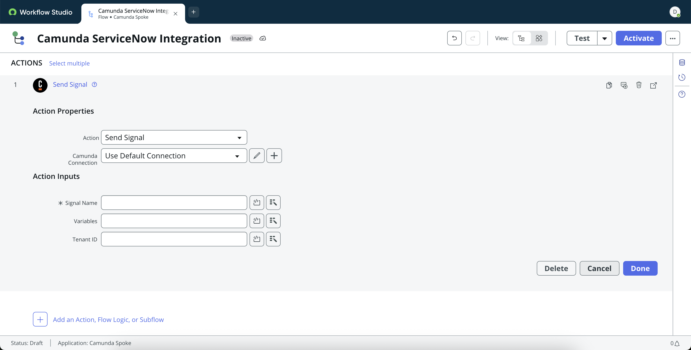
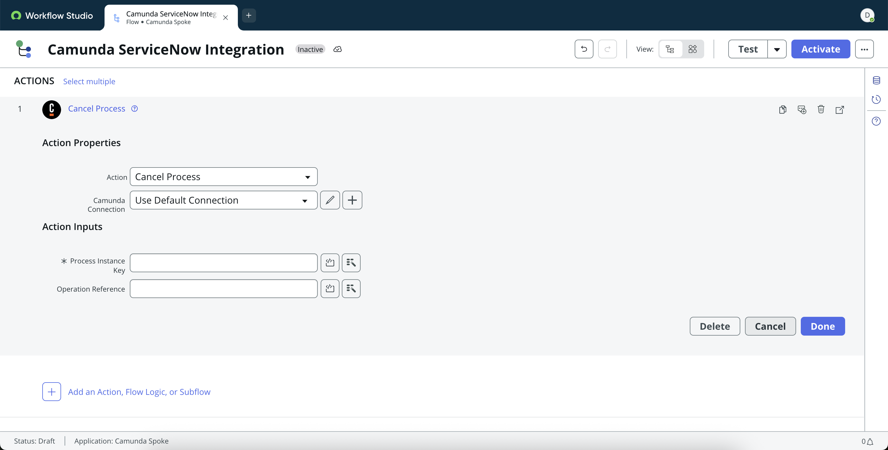
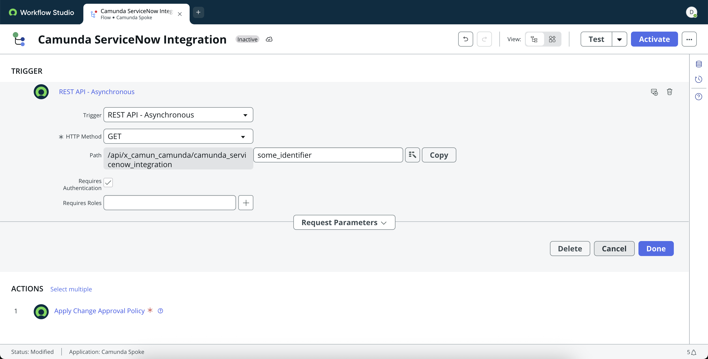

The **Camunda Spoke for ServiceNow** enables seamless orchestration between Camunda and ServiceNow, empowering your organization to automate cross-system workflows end to end.

With the Spoke installed on the ServiceNow side, you can initiate, signal, correlate or cancel Camunda process instances directly from the Flow Designer.

# Spoke actions in detail

## Start Process

Start a Camunda process from ServiceNow.


**Supported Inputs**

**Process ID:** Enter the process ID of a deployed Camunda BPMN process to start.  
 Example: `handle_incident`

**Process Version:** (Optional) Specify a process version to start. Leave blank to use the latest deployed version.  
 Example: `5`

**Variables:** (Optional) Define key-value pairs to pass as process variables in JSON format.  
 Example: `{ "invoiceId": "12345", "amount": 250 }`

Code Example:

```
const returnObject = {
    "request_item_number": fd_data.trigger.request_item.number.toString() || "",
    "request_sys_id": fd_data.trigger.request_item.sys_id.toString() || ""
};
return JSON.stringify(returnObject);
```

:::tip
When adding the JSON payload as code snippet, make sure to properly convert ServiceNow types into a JSON compatible format. In the example above, `sys_id` is a ServiceNow GUID, but needs to be a string for the JSON payload - thus the explicit conversion via `fd_data.trigger.request_item.sys_id.toString()`
:::

**Tenant ID:** (Optional) Provide the tenant identifier if your Camunda setup uses multi-tenancy. Leave blank for single-tenant setups.  
 Example: `hr-emea`

**Operation Reference:** (Optional) A reference key chosen by the user that will be available in Camunda as a reference.
Example: `camID`

**Wait for completion?:** (Optional) Enable this if you want the flow to pause until the Camunda process completes.

## Send Signal

Broadcast BPMN signals to one or many Camunda process instances


**Supported Inputs**

**Signal Name:** The name of the Camunda signal to send. Must match the signal name defined in your BPMN process.  
 Example: `sla_limit_exceeded`

**Variables:** (Optional) Define key-value pairs to pass as process variables in JSON format.  
 Example: `{ "invoiceId": "12345", "amount": 250 }`

**Tenant ID:** (Optional) Provide the tenant identifier if your Camunda setup uses multi-tenancy. Leave blank for single-tenant setups.  
 Example: `hr-emea`

## Correlate Message

Correlate a running Camunda process instance from ServiceNow.


**Supported Inputs**

**Message Name:** The name of the BPMN message element to correlate with. Must match the message name defined in your process model.  
 Example: `managerApprovalDone`

**Correlation Key:** The process variable value used to match the message to the correct process instance.  
 Example: `approvalID`

## Cancel Process

Cancel a Camunda process instance from ServiceNow when needed.


**Supported Inputs**

**Process Instance Key:** The unique key identifying a running Camunda process instance to cancel.  
 Example: `2251799813685252`

**Operation Reference:** (Optional) A reference key chosen by the user that will be available in Camunda as a reference.
Example: `camID`

## Starting a ServiceNow process from Camunda

Camunda can trigger a ServiceNow flow by calling a REST API as the trigger endpoint in ServiceNow.



**Supported Inputs**

**HTTP Method:** Select the HTTP method that the flow will accept.  
 Example: `POST`

**Path**: A custom URL path suffix for your trigger endpoint. REST API trigger path To be used in the ServiceNow Flow Starter Connector.  
 Example: `/api/camun/my_flow_name`

**Requires Authentication:** Choose whether incoming requests require a valid ServiceNow authentication header. Enable when securing production integrations.

**Roles:** (Optional) Specify which ServiceNow roles are authorized to access this endpoint. If left blank, access depends entirely on the authentication settings.
