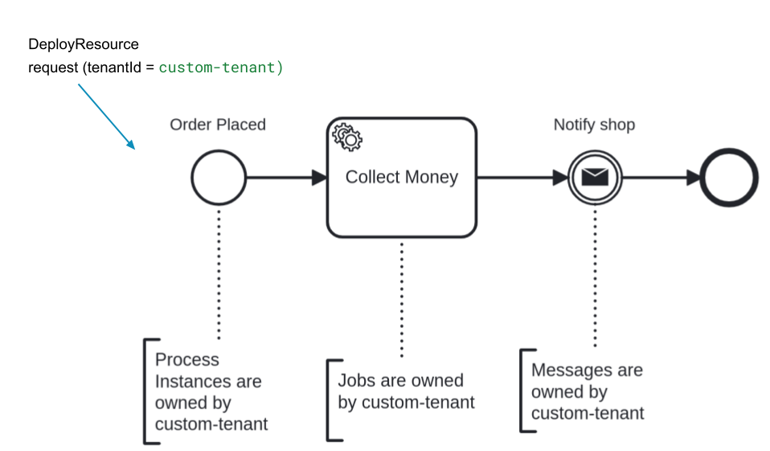

:::info
Multi-tenancy is only supported in Camunda 8 Self-Managed. It is not available in Camunda 8 SaaS.
:::

Multi-tenancy in Camunda 8 enables a single installation to serve multiple tenants—such as departments, teams, or external clients—while keeping each tenant's data and processes logically isolated.

The following sections explain how multi-tenancy works in Camunda 8.

## Isolation of data and processes

Each tenant's data and processes are logically isolated from others.
This ensures that one tenant's workflows, data models, and configurations do not interfere with or affect other tenants. Each tenant operates in a secure, independent space within the same Camunda 8 instance.

## Resource sharing

Multi-tenancy provides cost efficiency by allowing multiple tenants to share the same Camunda 8 installation and infrastructure. This reduces operational overhead while maintaining logical isolation between tenants.

## Efficient administration

Administrators can manage all tenants centrally using [Identity](../identity/tenant.md).
This unified management interface simplifies monitoring, configuration, and maintenance tasks across tenant environments.

## Security

Strong access control mechanisms prevent tenants from accessing each other's data or processes.
These controls ensure tenant-level security and maintain data integrity across all environments.

## Example: tenant membership in action

When a user deploys a process model or starts a process instance, the system validates the user's tenant assignments.

For example, assume a user belongs to `Tenant A` but not `Tenant B`:

1. **Deploying a process model**
   - If the user deploys to `Tenant A`, the Orchestration Cluster verifies the assignment. If valid, the model is deployed and all related process instances belong to `Tenant A`.
   - If the user deploys to `Tenant B`, the deployment fails because the user lacks access to that tenant.

2. **Running process instances**
   - When querying process instances, the user only sees instances belonging to `Tenant A`.

This mechanism ensures proper isolation and access control across tenants.

## How multi-tenancy works

Camunda 8 implements multi-tenancy using tenant identifiers within a single installation.
All tenant data is stored in the same database, with isolation enforced by appending a tenant identifier to each data object (e.g., process definitions, process instances, jobs).

### Tenant identifier

The tenant identifier is added to all data created in Camunda 8.
By default, all data is assigned to the `<default>` tenant identifier.

:::note
The `<default>` tenant identifier is reserved and cannot be changed by users.
:::

Organizations can create additional tenants. Tenant identifiers must meet the following requirements:

- Use only alphanumeric characters, dashes (`-`), underscores (`_`), or dots (`.`).
- Be no longer than 31 characters.

### Multi-tenancy checks

Multi-tenancy checks enforce tenant-based access control.

By default, multi-tenancy checks are **disabled**. This means that although tenants can be created and assigned, the system does not restrict access based on those assignments. All data is associated with the `<default>` tenant.

When **enabled**, the system verifies that users can only access resources associated with their assigned tenants.

### Inherited tenant ownership

Tenant ownership in Camunda 8 is hierarchical.
A user can only deploy resources to authorized tenants. Any data created by those resources inherits the same tenant identifier.

The following diagram illustrates tenant ownership inheritance:

