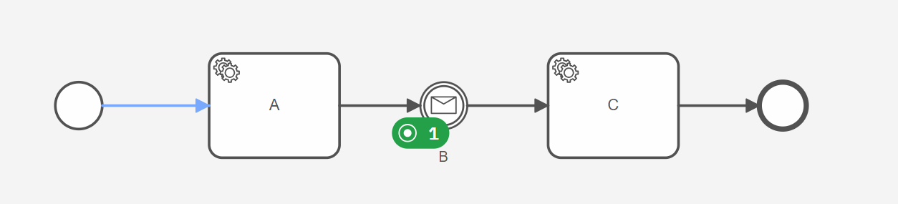
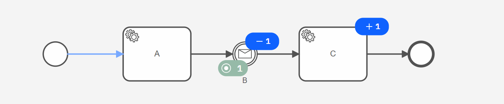
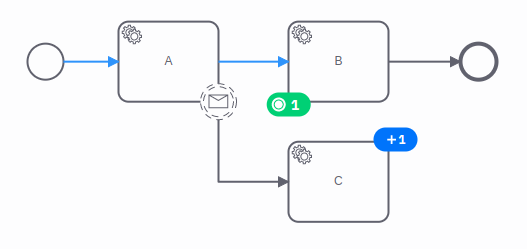
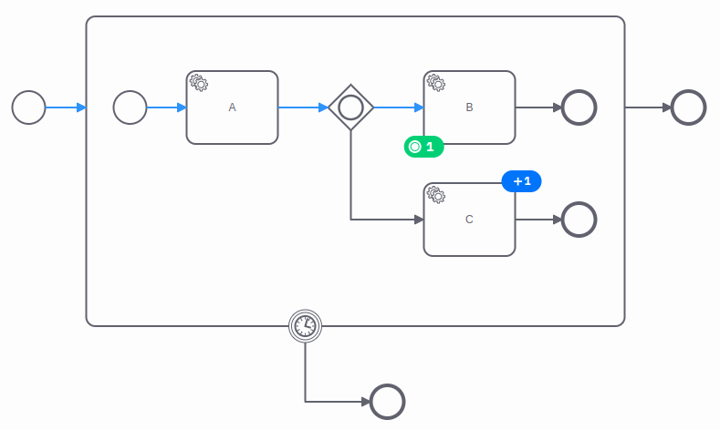
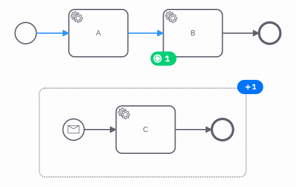
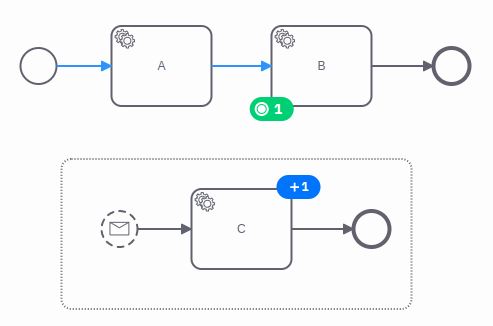
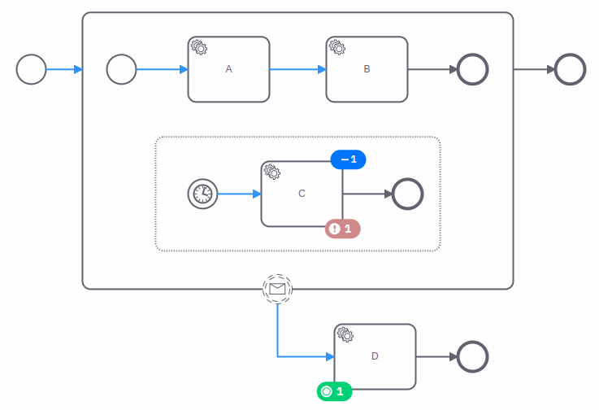
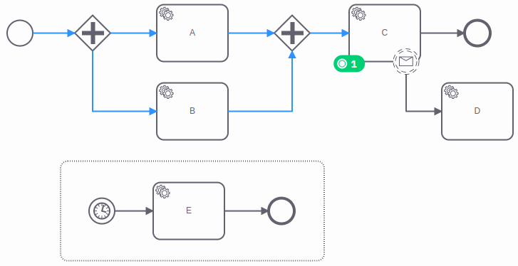

Process instance modification is a powerful feature to repair a running process instance. The process instance may be
stuck on an element, waiting for an event, or taking an unintended path because an external system is not
available or doesn't respond as expected, for example.

Use the [modification command](/apis-tools/zeebe-api/gateway-service.md#modifyprocessinstance-rpc) to skip or repeat a step in the
process. Consider the following example:

The process contains two service tasks and a message catch event in between. The process instance completed the first
task `A` and waits on the message catch event `B`. An external system will publish the message, but the external
system is not available and can't continue the process. The process instance is stuck.

We use the modification to repair the process instance. We "move the token" from the catch event `B` to the next
task `C`. This operation is presented by two instructions in the modification command:

- Terminate the instance of the catch event `B`.
- Activate the element `C`.

As a result of the command, the process instances terminated the instance of catch event `B` and activated the task `C`.
Now, the process instance is not stuck anymore and can continue in the process.

Generally, the process instance modification command can contain multiple instructions:

- To activate an element of the process.
- To terminate an active instance of an element.

Read more about the behavior of the instructions in the following sections.

:::note
Use the process instance modification only in exceptional cases to repair the process instance. It is not
recommended using it as a part of the regular flow of the process; find additional details [here](#use-at-your-own-risk).
Instead, model all possible cases
explicitly in your process.
:::

## Activate an element

We can use the modification command to activate an element of the process. Consider the following example:

The process instance completed the first task `A` and waits on task `B`. Task `C` is connected to task `A` by a
non-interrupting message catch event. An external system will publish the message, but it is not available.

To correct the state of the process instance, we modify it and activate task `C`. As a result, task `C` is active, and a
job worker can pick it up.

The process instance activates the element in the same way as the regular flow; for example, if the incoming sequence
flow of the element would be taken. The activation of the element can include the following steps:

- Apply the input variable mappings.
- Create the event subscriptions; for example, of boundary events.
- Apply additional logic depending on the element; for example, create a job for a service task.

## Activate a nested element

We can use the modification command to activate an element of the process nested inside an embedded or an event
subprocess. This is a special case of [activating an element](#activate-an-element). Consider the following example:

The process instance completed the first task `A` in the embedded subprocess. It passed the inclusive gateway and waited
on task `B`. Task `C` is also connected to the inclusive gateway, but the condition didn't match. The condition should
match, but the job worker for task `A` provided unexpected variables.

To correct the state of the process instance, we modify it and activate task `C`. As a result, task `C` is active in the
same instance of the subprocess as the other task `B`.

The process instance activates the element always in an existing instance of its subprocess.

If the subprocess doesn't have an active instance, the process instance creates a new instance of the subprocess
first. The creation of the subprocess can include the creation of the event subscriptions; for example, of boundary
events. In contrast to a regular activation of the subprocess, the process instance doesn't activate the start event
of the subprocess or apply any input variable mappings.

If the subprocess itself is nested in another subprocess, the same procedure is applied to this subprocess.

:::note
The process instance can't activate the element if the subprocess has more than one active instance. It can't decide in
which instance of the subprocess to activate the element. As a result, the process instance doesn't apply the activation
instruction and rejects the command.
:::

## Activate an interrupting event subprocess

We can use the modification command to activate an interrupting event subprocess of the process. Consider the following
example:

The process instance completed the first task `A` and waits on task `B`. Task `C` is embedded in an interrupting message
event subprocess. An external system will publish the message and interrupt the process, but it is not available.

To correct the state of the process instance, we modify it and activate the interrupting event subprocess. As a result,
the event subprocess is active and enters the start event. But the activation doesn't interrupt the process instance
and terminate task `B`. So, both tasks `B` and `C` are active.

If we want to simulate the interrupting behavior of the event subprocess, we need to add a modification instruction
to [terminate the instance](#terminate-an-element-instance) of the task `B`.

If the start event of the event subprocess has output variable mappings, we may need to
[set the variables](#set-variables) with the activation instruction.

## Set variables

We can use the modification command to set one or more variables together by activating an element of the process.
Consider the following example:

The process instance completed the first task `A` and waited on task `B`. Task `C` is embedded in a non-interrupting
message event subprocess. An external system will publish the message, but it is not available.

To correct the state of the process instance, we modify it and activate the task `C` inside the non-interrupting message
event subprocess. Additionally, we add variable instructions to the modification to set variables that should be
provided by the message.

The process instance sets the variables before activating the given element. As a result, the variables are available
when applying the input variable mappings and creating the event subscriptions of the element.

A variable instruction can define the [scope](variables.md#variable-scopes) of the variables. If a scope is defined, the process instance sets the variables as **local** variables in the given scope. For example, set the message variables
as local variables of the event subprocess. The scope must be a flow scope of the activating element.

If no scope is defined, the process instance sets the variables **globally** in the root scope of the process instance.

## Terminate an element instance

We can use the modification command to terminate an active element instance of the process instance. Consider the
following example:

The process instance completed the first task `A` in the embedded subprocess. It triggered the interrupting timer event
subprocess and terminated task `B` inside the embedded subprocess. An external system published a message and triggered
the non-interrupting message boundary event on the subprocess. The process instance waits on task `C` inside the event
subprocess and on task `D` connected to the boundary event.

The job worker for task `C` failed to complete the job successfully. To skip the task and continue the process instance,
we modify it and terminate the element instance of the event subprocess.

As a result, the process instance terminates the event subprocess and the element instance of the task `C` that is
inside the event subprocess. Additionally, the process instance terminates the embedded subprocess because it doesn't
contain active element instances anymore.

Generally, the modification applies the following rules:

- If the terminating element instance is a subprocess, it terminates all active instances in the subprocess.
- If the terminating element instance is a call activity, it terminates the child process instance.
- If the terminating element instance was the last active instance inside a subprocess, it terminates the subprocess.
- If the terminating element instance was the last active instance of the process instance, it terminates the
  process instance.

If a terminating element instance is not active, the process instance doesn't apply the termination instruction
and rejects the command.

:::note
The process instance can't terminate the last active element instance of a child process instance. As a result, the
process instance doesn't apply the termination instruction and rejects the command.

Instead, we can terminate the call activity that created the child process instance.
:::

## Execute the modification instructions

A modification command can contain multiple activation and termination instructions. The process instance applies these
instructions in a specific order:

1. Apply all activation instructions.
2. Apply all termination instructions.

The order of the instructions matters if the modification terminates the last active instances of the process instance
or inside a subprocess, and activates an element in the process instance or the subprocess. Since the process instance
applies the activation instructions first, the process instance or the subprocess still has an active instance and is
not terminated.

If the process instance can't apply one of the modification instructions, it rejects the modification command. For
example, if one of the terminating element instances is not active. As a result, the process instance is not modified
and is in the same state as before. It applies the instructions of a modification command in a **transactional** way (i.e.
apply all or nothing).

## Limitations

Currently, we can't modify the process instance in all possible ways. In the following cases, the process instance can't
apply the modification instructions and rejects the modification command.

- If the activating element is a BPMN element of the type:
  - A start event of a process or a subprocess
  - A boundary event
  - An event that belongs to an event-based gateway
  - An element inside a multi-instance subprocess
  - A sequence flow
- If the activating element is [a nested element](#activate-a-nested-element) and the subprocess has more than one
  active instance.
- If the modification terminates all active instances of a child process instance.

## Use at your own risk

Process instance modification is a powerful tool to repair a process instance. However, use it with care. You
can modify the process instance to create situations that are not reachable by the regular execution. Consider the
following example:

The process instance completed the first tasks `A` and `B` and waits on task `C`.

We could apply the following modifications, but the process instance may end up in an unintended situation:

- If we activate task `A` again, the process instance is stuck on the parallel gateway.
- If we activate task `D` and don't set all variables that would be provided by the message, the task `D` could be
  processed with the wrong input.
- If we activate task `E` inside the interrupting event subprocess, the process instance doesn't interrupt task `C`
  and the processing of the tasks could override variables.

The process instance doesn't detect these situations. It is up to you to apply suitable modifications.

When in doubt, we recommend testing your modification on a non-production cluster or using [Zeebe process test](../../apis-tools/java-client/zeebe-process-test.md).
