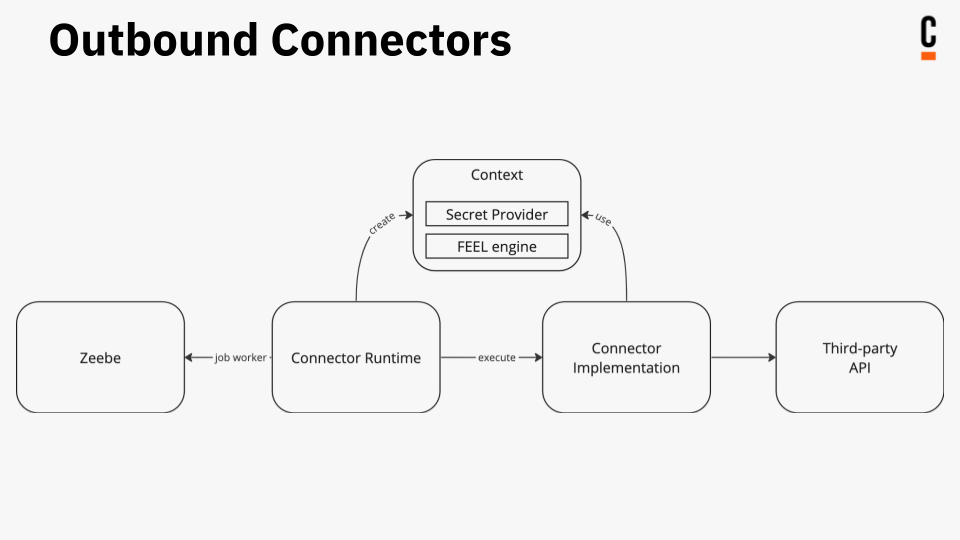
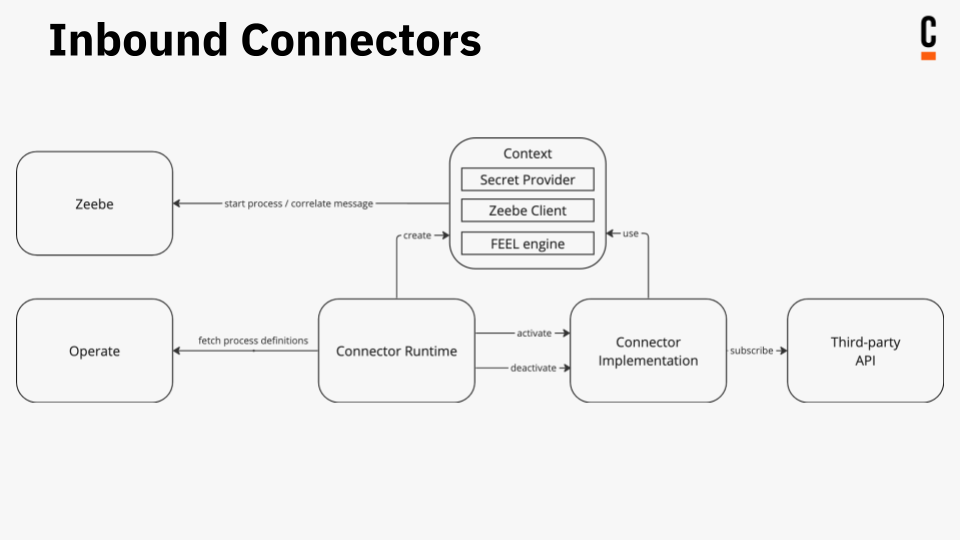

Connectors are categorized by the direction data flows into or out of Camunda 8.

## Outbound Connectors

Outbound Connectors allow workflows to trigger external systems or services, making it possible to integrate workflows with other parts of a business process or system architecture.

The Java code to connect to the external system is executed when the workflow reaches the service task.

Use outbound Connectors if something needs to happen in the third-party system if a process reaches a service task. For example, calling a REST endpoint or publishing a message to Slack.

## Inbound Connectors

Inbound Connectors enable workflows to receive data or messages from external systems or services, making it possible to integrate workflows into a wider business process or system architecture.
Inbound Connectors can be used to create a new process instance, or to send a message to a running process instance.

The Java code of the inbound Connector has a lifecycle suitable for long-running operations, such as listening for messages on a queue or waiting for a webhook to be called.
The Connector code is **activated** as soon as the Connector Runtime detects an element in a process definition that references an inbound Connector. It gets `deactivated` in case of an updated or deleted process definition.

Inbound Connector instances are linked to process definitions and not to specific process instances. If a process definition contains an element referencing an inbound Connector, the Connector code will be first executed when the process definition is deployed and the deployment has been detected by the Connector Runtime.
The Connector object created during deployment will be kept active as long as the process is deployed, and it is reused to serve all instances of the process.
When the process definition is deleted or replaced with a newer version, the Connector object will be removed or updated as well.

:::note
Inbound Connectors currently rely on [Operate](../../operate/operate-introduction) API to retrieve the information about deployed process definitions.

If your Camunda 8 installation doesn't include Operate, you can only use outbound Connectors.
:::

Use inbound Connectors if something needs to happen within the workflow engine because of an external event in the third-party system. For example, because a Slack message was published, or a REST endpoint is called.

There are three types of inbound Connectors:

1. **Webhook Connector**: An inbound Connector which creates a webhook for a Camunda workflow.
2. **Subscription Connector**: An inbound Connector that subscribes to a message queue.
3. **Polling Connector**: An inbound Connector that periodically polls an external system or service for new data using HTTP polling.

## Protocol Connectors

Protocol Connectors can serve as either inbound or outbound Connectors, supporting a variety of technical protocols. These connectors are highly generic, designed to provide a flexible and customizable means of integrating with external systems and services.

Protocol Connectors can be customized to meet the needs of specific use cases using configurable [Connector Templates](manage-connector-templates.md), with no additional coding or deployment required. Examples of protocol Connectors include HTTP REST, GraphQL, as well as message queue connectors.

## Next steps

Review the current list of [available Connectors](/components/connectors/out-of-the-box-connectors/available-connectors-overview.md).
