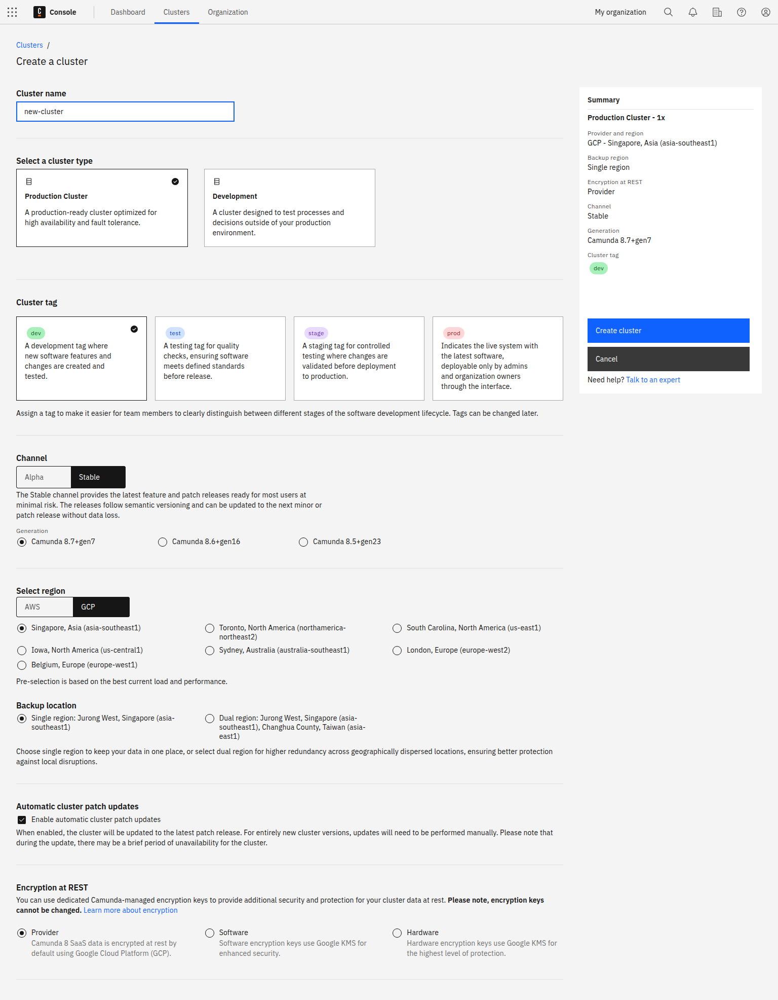
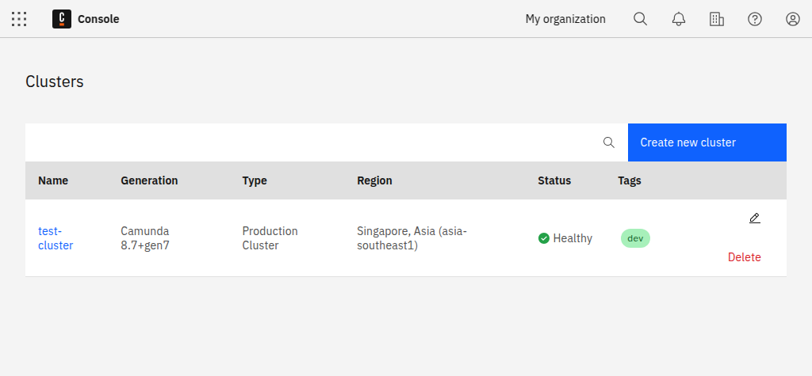

---
---

To deploy and run your process, you must create a [cluster](/components/concepts/clusters.md) in Camunda 8.

1. To create a cluster, navigate to **Console**, click the **Clusters** tab, and click **Create new cluster**.
1. Name your cluster.
1. Select a [cluster type](/components/concepts/clusters.md#cluster-type) and [cluster size](/components/concepts/clusters.md#cluster-size).
1. Assign a cluster tag to indicate what type of cluster it is.
1. Select your [region](/reference/regions.md).
1. Select your [encryption at rest protection level](/components/concepts/encryption-at-rest.md) (enterprise only).
1. Select a channel and release. For the purpose of this guide, we recommend using the **Stable** channel and the latest generation.
1. Click **Create cluster**.
1. Your cluster will take a few moments to create. Check the status on the **Clusters** page or by clicking into the cluster itself and looking at the **Applications** section.

:::note

- If you haven't created a cluster yet, the **Clusters** page will be empty.
- You can start modeling even if the cluster shows a **Creating** status.

:::

1. After creating the cluster, you can view the new entry in the **Clusters** tab:

   

2. The cluster is now being set up. During this phase, its state is **Creating**. After one or two minutes, the cluster is ready for use and changes its state to **Healthy**:

   

3. After the cluster is created, click on the cluster name to visit the cluster detail page.

## Development clusters

Starter plan users have one **development cluster**, with free execution for development included in their plan.
Deployment and execution of models (process instances, decision instances, and task users) is provided at no cost.
Additional clusters can be purchased through your [billing reservations](/components/console/manage-plan/update-billing-reservations.md).

To learn more about the differences between **development clusters** and **production clusters**, see [clusters](/components/concepts/clusters.md).

- **Stable**: Provides the latest feature and patch releases ready for most users at a minimal risk. The releases follow semantic versioning and can be updated to the next minor or patch release without data loss.
- **Alpha**: Provides preview releases in preparation for the next stable release. They provide a short-term stability point to test new features and give feedback before they are released to the stable channel. Try these to ensure the upcoming release works with your infrastructure. These releases cannot be updated to a newer release, and therefore are not meant to be used in production.

You can decide if you want to have automated updates to new versions of Camunda 8 activated. You can also toggle this feature anytime later in the **Settings** tab of your cluster.

Additionally, you can tag your cluster for `dev`, `test`, `stage`, or `prod`. Assigning a tag can make it easier for team members to clearly distinguish between different stages of the software development lifecycle. Tags have no impact on performance and can be changed later in the cluster details section of the cluster overview page.

:::info
Only organization owners or users with the **Admin** role in Console can deploy from Web Modeler to `prod` clusters.
Users without **Admin** roles can deploy only on `dev`, `test`, or `stage` clusters.
:::
