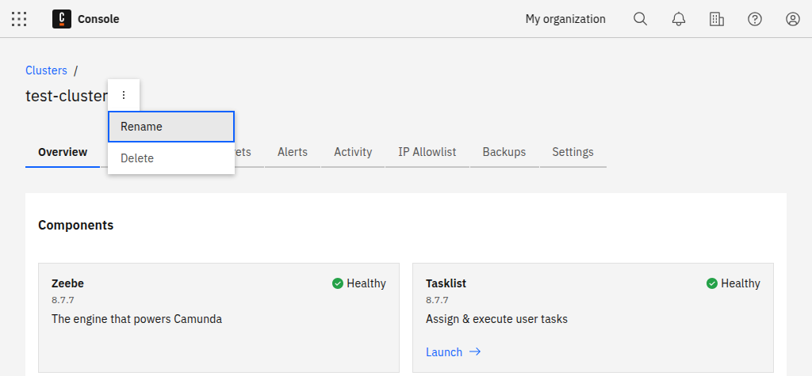
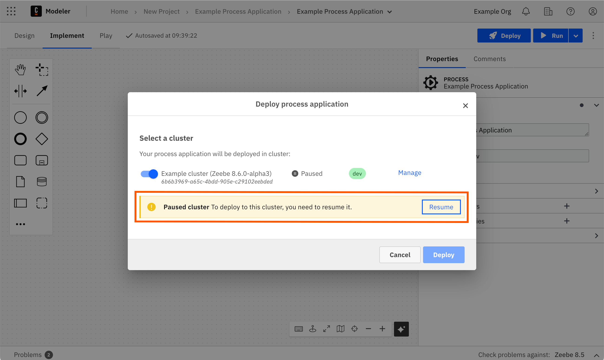
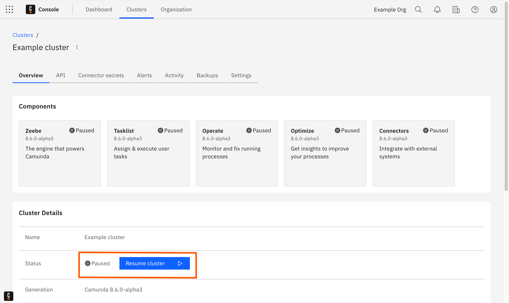

Learn how to rename, resume, update, resize, or delete your cluster.

## Rename a cluster

A cluster can be renamed at any time. To rename your cluster, follow the steps below:

1. Open the cluster details by clicking on the cluster name.
2. Select the three vertical dots next to the cluster name near the top of the page to open the cluster's menu.
3. Click **Rename**.

## Resume a cluster

You can resume your paused cluster during deployment, or from the **Console** at any time.

### Resume during deployment

During deployment, you can resume the selected cluster if it is paused.

1. Select your paused cluster during deployment.
1. Select **Resume** in the paused cluster notification.

### Resume from Console

You can resume your paused cluster from the **Console** at any time.

1. Navigate to **Console**, and select the **Clusters** tab.
1. The cluster **Status** shows “Paused” if a cluster is paused. Select the cluster that you want to resume.
1. On the cluster **Overview** tab, select **Resume cluster** in the **Status** row of the **Cluster Details**.

## Update a cluster

:::note
This action cannot be undone. Updated clusters cannot be reverted to the previous version.
:::

Clusters can be updated to new versions of Camunda 8 manually or automatically.

Clusters eligible for updates will show a button on the UI.

At this time, updates do not trigger backups, however, manual backups can be initiated through the Console Backups tab.

### Update a cluster manually

When an update is available, an **Update** button will appear. This button is not available for clusters enrolled in [automatic updates](/reference/auto-updates.md).

### Automated cluster updates

You can decide if you want to have [automated updates](/reference/auto-updates.md) to new versions of Camunda 8 activated. You can also toggle this feature anytime later in the **Settings** tab of your cluster.

## Resize a cluster

You can increase or decrease the [cluster size](/components/concepts/clusters.md#cluster-size) at any time. For example, increase the cluster size to improve performance and add capacity, or decrease the cluster size to free up reservations for another cluster.

1. Open the cluster details by clicking on the cluster name.
1. Select **Resize cluster** next to the cluster type.
1. Select the new cluster size from the available sizes.
1. Click **Confirm** to resize the cluster, or **Cancel** to close the modal without resizing the cluster.

:::note
Contact your Customer Success Manager to increase the cluster size beyond the maximum 4x size. This requires custom sizing and pricing.
:::

## Delete a cluster

:::caution
Deleting a cluster is **permanent** and cannot be undone.
:::

A cluster can be deleted at any time. To delete your cluster, navigate to the **Clusters** tab in the top navigation and click **Delete** to the far right of the cluster name.
