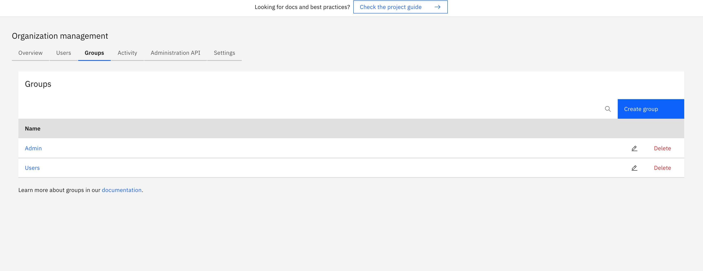
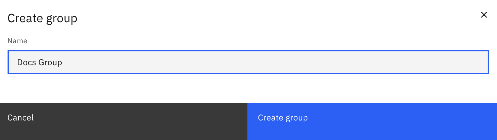
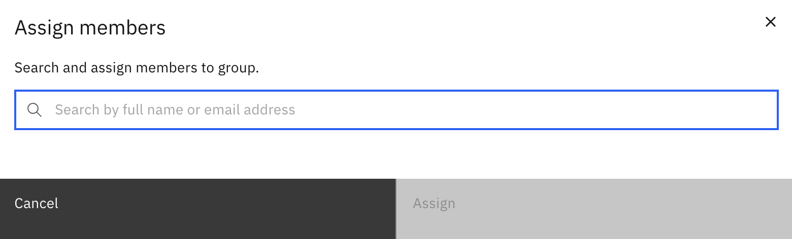

User groups are a way to organize users within your organization.

## Creating a group

To create a group, navigate to the **Organization** section of Console and click on the **Groups** tab.

Click **Create a group** and enter the name of the group.

## Adding users to a group

To add users to a group, navigate to the **Organization** section of Console and click **Users > Assign members**.

Select the user you want to add to a group and click **Assign**.

## User task access restrictions

:::info
User task access restrictions are only supported with the Tasklist v1 API. For more information, see the documentation on [Tasklist API versions](components/tasklist/api-versions.md#user-task-access-restrictions-and-the-tasklist-api).
:::

You can use user groups to manage access to user tasks in Tasklist via [user task access restrictions](components/tasklist/user-task-access-restrictions.md).

For example, if a task has a candidate group named `Team A` and a candidate user named `example`, only the users that belong to `Team A` and the user `example` will have access to the task.
