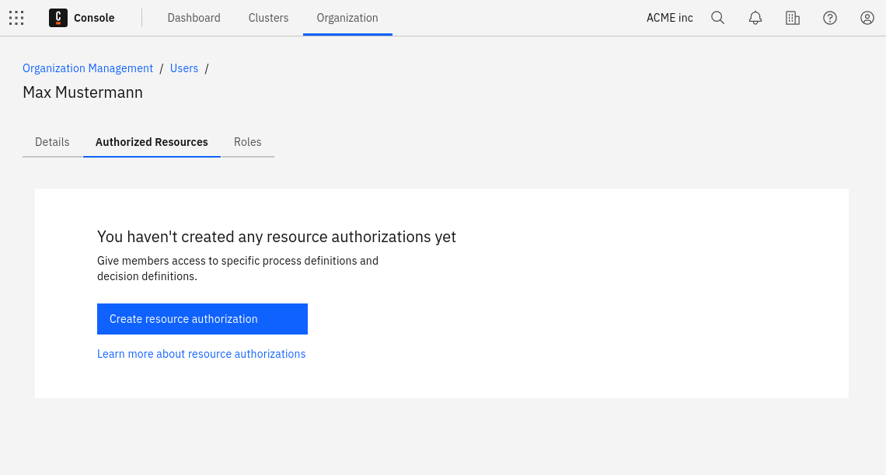
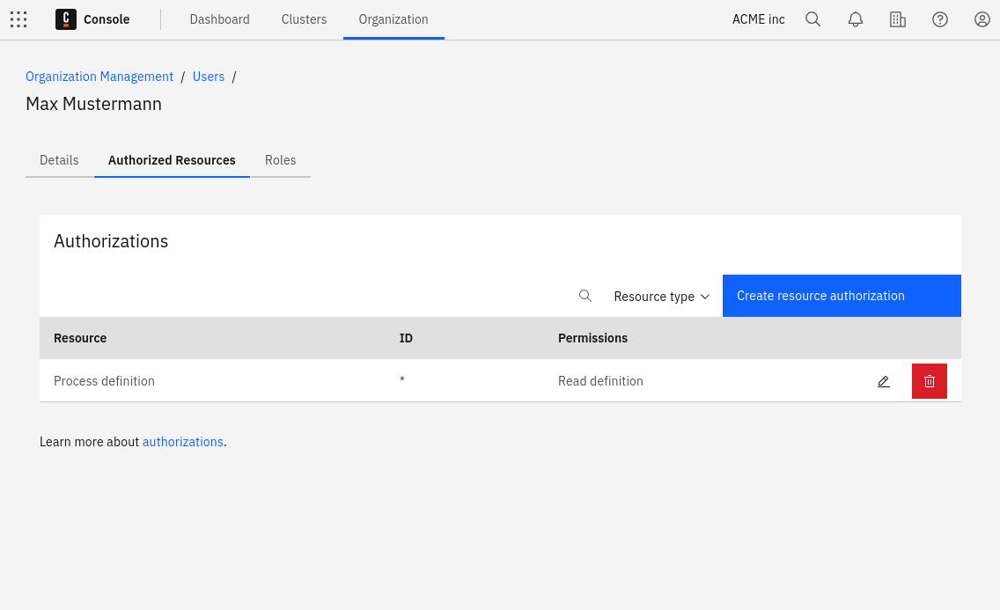

When a user signs up for Camunda 8 as the first user from their organization, company, or group, they become the owner of the Camunda organization. This organization owns Modeler files and Zeebe clusters. The owner and any admins they assign can control access to these resources through managing their organization.

## Users

An owner has all rights in an organization and can manage all settings accordingly. An organization cannot have more than one owner.

To change the owner of the organization, utilize the user administration. The current owner selects another member of the organization, and selects **Assign as owner** from the menu. In the dialog that appears, select which new roles are to be assigned to the current owner.

### Roles and permissions

In addition to the owner, the **Admin** role is available as a second role with comprehensive rights.

The admin role has full access to the platform, process resources, and clusters, but cannot manage other admins.

The following roles are additionally available, providing dedicated rights for specific elements in Camunda 8:

- **Modeler**: Access to Web Modeler for creating and collaborating on projects, except permissions to deploy and run processes. Read-only access to Console.
- **Analyst**: Includes Modeler permissions and has full access to Optimize to build process dashboards and reports.

Starting with version 8.8, user access to clusters is managed independently. To control what a user can access, define their authorizations in the cluster’s Identity. Learn more [here](/components/identity/authorization.md).

If cluster authorizations are disabled, the user will have full access to the cluster and its components.

Users can be assigned multiple roles. For example, a user can have both **Modeler** and **Analyst** roles, giving them access to Web Modeler and Optimize.

Users are invited to a Camunda 8 organization via their email address, which must be accepted by the user. The user remains in the `Pending` state until the invitation is accepted.

People who do not yet have a Camunda 8 account can also be invited to an organization. To access the organization, the invited individual must first create a Camunda 8 account by following the instructions in the invitation email.

## Resource-based authorizations

Resource authorizations allow you to control the level of access a user has to a particular resource in the system. To create, update, or delete the resource authorizations
assigned to a user, click on the respective row of the users table.

### Creation

To initiate the creation flow, click **Create resource authorization**.

### Updating and deleting

To update an existing authorization, click on the **pencil icon** of the relevant row. To delete an existing authorization, click the **trash can** icon.

## User task access restrictions

:::info
User task access restrictions are only supported with the Tasklist v1 API. For more information, see the documentation on [Tasklist API versions](components/tasklist/api-versions.md#user-task-access-restrictions-and-the-tasklist-api).
:::

You can control user access to user tasks in Tasklist via [user task access restrictions](components/tasklist/user-task-access-restrictions.md).

For example, if a task has a candidate group named `Team A` and a candidate user named `example`, only the users that belong to `Team A` and the user `example` will have access to the task.

## Limitations

Depending on the plan to be used, the number of users that can be part of an organization varies. If an organization is on a Starter plan, the number of users can be updated via the **Billing** page. There, under **General users**, the number can be increased or decreased.

:::caution Starter plans
The Starter plan is no longer available.

- Existing customers using a Starter plan will need to either upgrade to the Enterprise plan, or move to the Free plan.
- To compare plan features and contact Camunda for advice and an Enterprise plan quote, refer to [Camunda 8 pricing](https://camunda.com/pricing/?utm_source=docs.camunda.io&utm_medium=referral).

:::

## Restrictions

In Enterprise plans, the hostname section of the email address for invites can be restricted to meet your internal security policies. Contact your Customer Success Manager to get this configured according to your needs.
