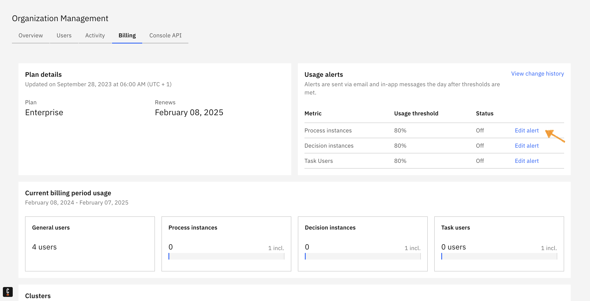
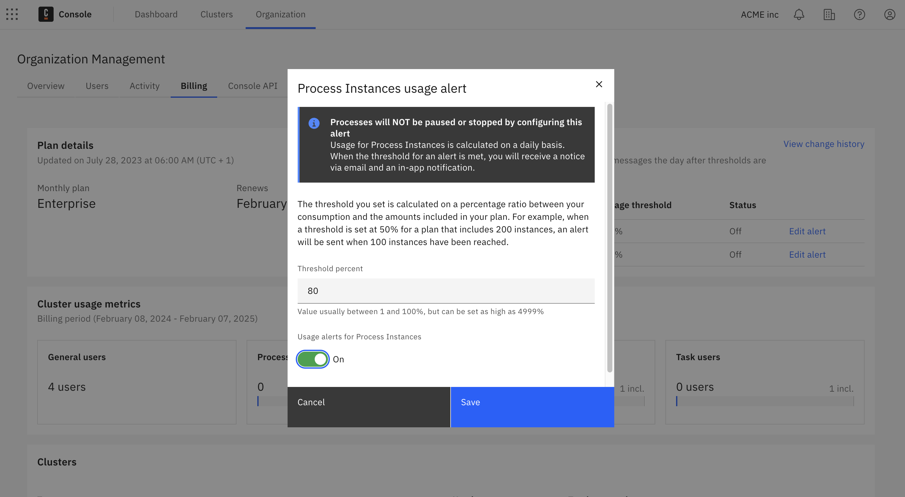
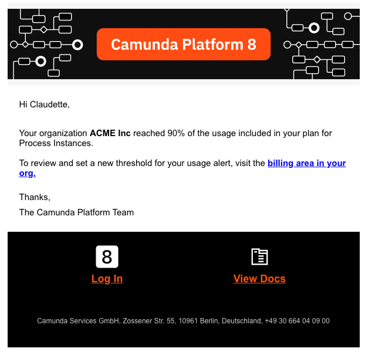
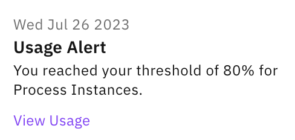
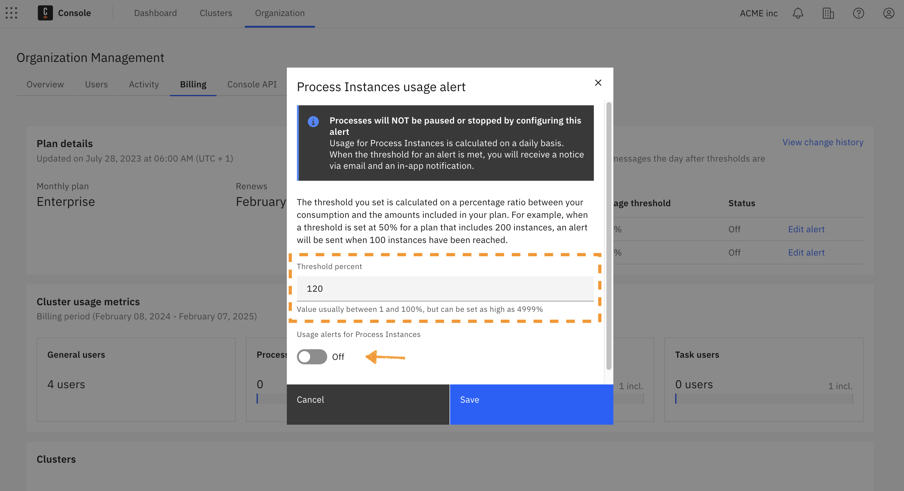
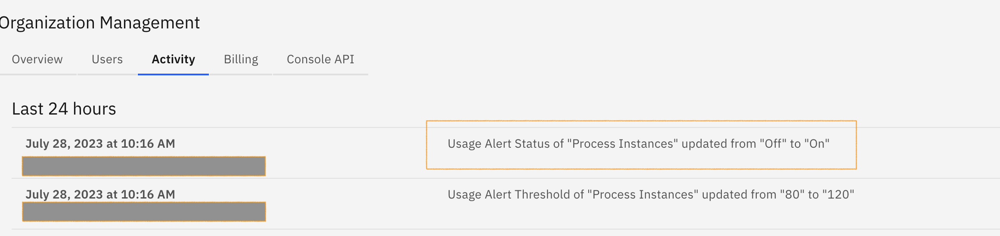

:::note
Usage alerts apply **only to production clusters** and are visible only to owners and admins in **Starter** and **Enterprise** organizations.
:::

Under the **Billing** tab, organization owners and admins can set up alerts for process instances, decision instances and task users.

Usage is calculated daily. When the threshold for an alert is met, all organization owners and admins are alerted via email and in-app notification.

## Creating a usage alert

To create a usage alert, take the following steps:

1. From the Console, click **Organization > Billing**.
2. On the **Billing** page, select **Edit alert** next to the metric you want to configure the usage alert for (e.g. process instances).
   
3. In the modal, define the percentage threshold (e.g. 80 for 80%), turn on the alert, and click **Save**. Note that the threshold can be between 1% and 4999%.
   

:::note
The threshold set is calculated on a percentage ratio between your consumption and the amounts included in your plan.
For example, when a threshold is set at 50% for a plan that includes 200 process instances, an alert is sent when 100 process instances are reached.
:::

Usage is calculated daily. When the threshold for an alert is met, all org owners and admins are alerted via email and in-app notification (examples below).

## Editing a usage alert

Usage alerts can be edited and turned on or off anytime by selecting **Edit alert** and updating the toggle.

## Viewing an alert change log

Users can track changes in the usage alerts under the logs of the **Activity** tab.

