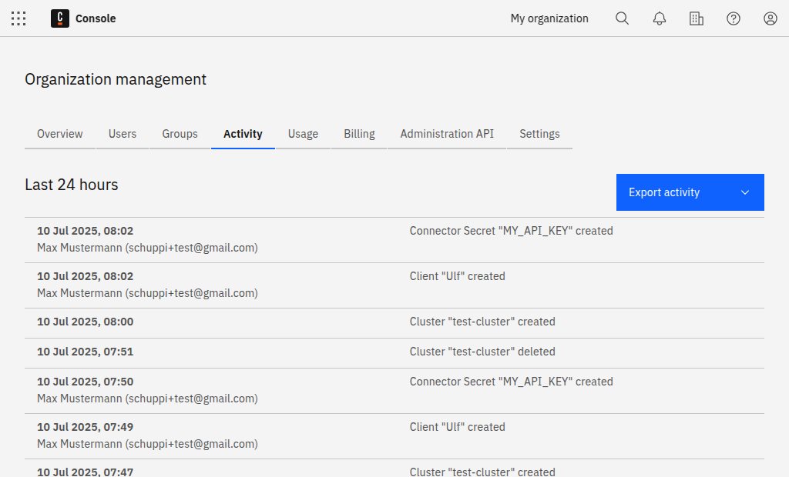

You can view all activity within an organization on the **Activity** tab.

For example, you can see details for cluster creation, deletion, updates, and user invitations.

## Export activity

Click **Export activity**, and select whether to export and download the activity list as a JSON or CSV file.
