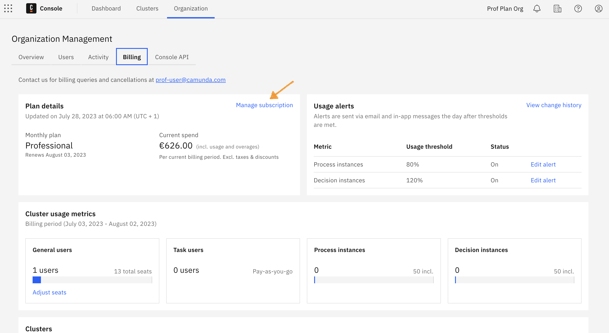
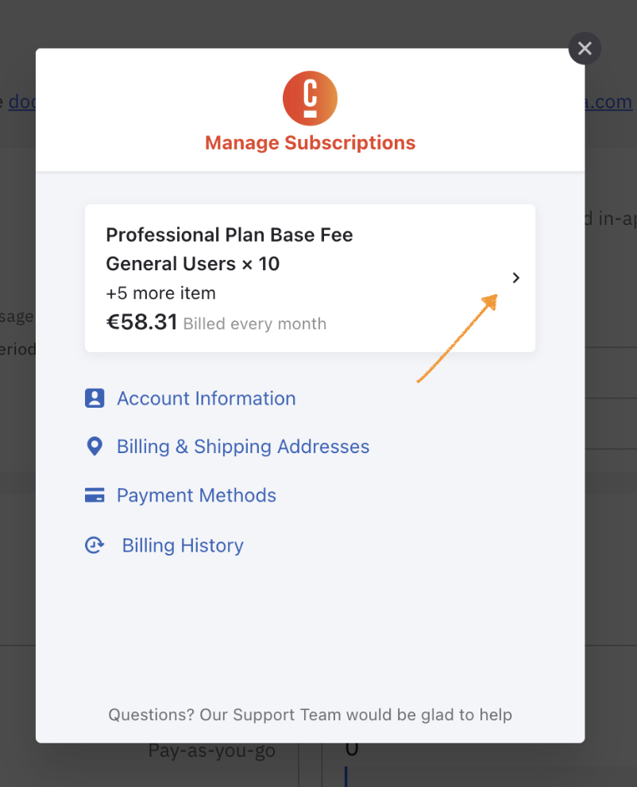
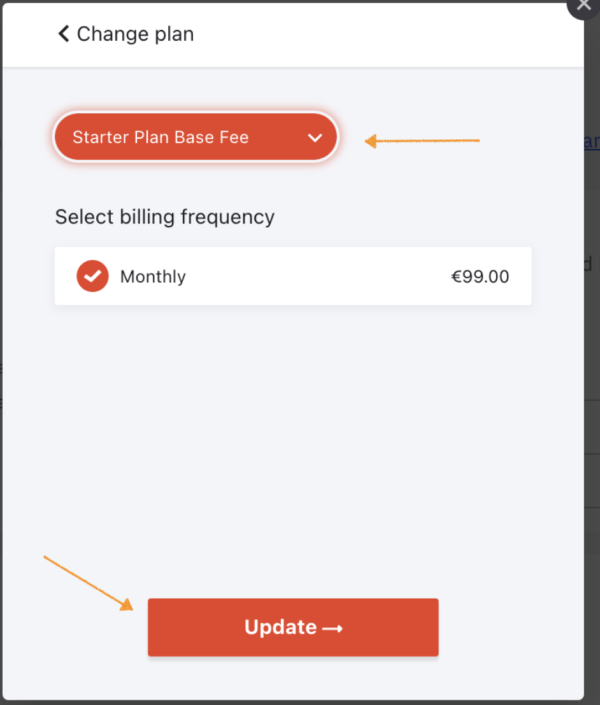
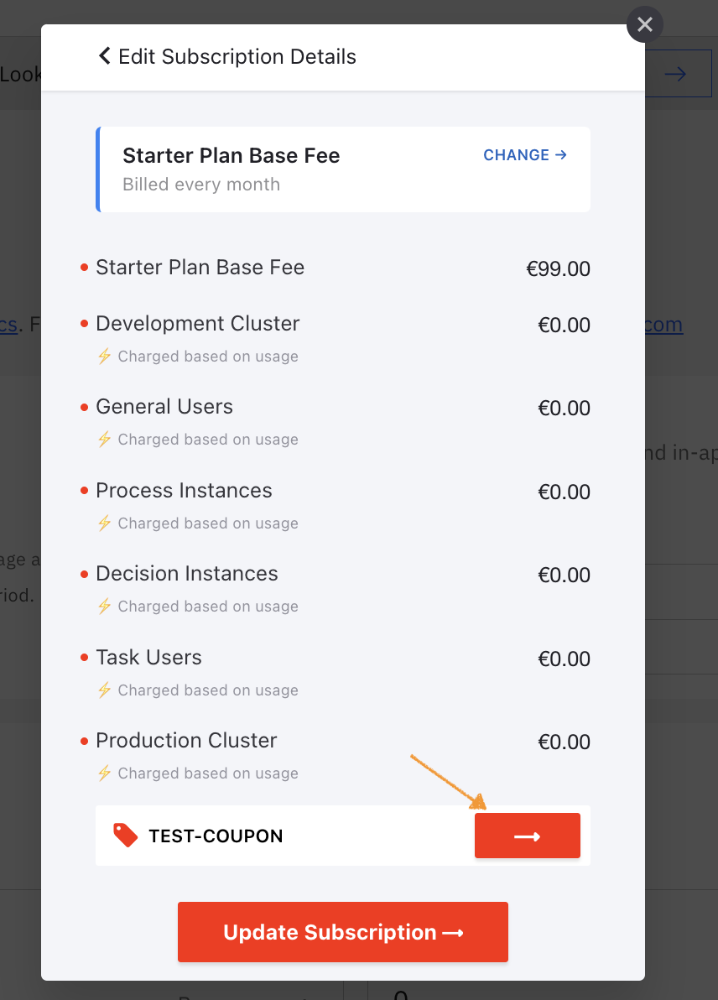

:::note
Here are a few important remarks to consider before completing the migration steps:

- The migration is one way and cannot be reversed. Once you migrate to Starter, you cannot migrate back to Professional.
- Since the two plans have different types of clusters included and fees for those, we recommend comparing the [Professional plan](https://camunda.com/blog/2023/05/camunda-professional-edition-accelerate-projects/) with the [Starter plan](https://camunda.com/blog/2023/09/camunda-starter/) to [understand your monthly costs](https://camunda.com/pricing/starter-plan-price-calculator/) before the migration.
- General users and development/production cluster reservations in the Professional plan are migrated “as is” to the Starter plan, which may result in overage costs (e.g. production clusters in Professional will be transferred to production clusters in the Starter plan). If you are not using your production cluster in the Professional plan, we recommend you delete it beforehand and create a new development cluster in the Starter plan afterward.
- Once you have edited the plan below, the changes will take effect on the first day of your next subscription period.
- If you have any questions, do not hesitate to [contact us](/reference/contact.md).

:::

## Migrate from Professional to Starter plan

To migrate to the Starter plan, take the following steps:

1. From the Console, click **Organization > Billing > Manage Subscription.**

2. Click on your current plan.

3. Under the **Subscription Details** modal, click **Edit Subscription**.

4. Next to **Professional Plan Base Fee**, click **Change**.

5. When in the **Change plan** modal, select **Starter Plan Base Fee** from the dropdown and click **Update**.

After completing the update, you will receive an email confirming the date when the change will take effect.

### Apply a coupon code

Upon switching plans, perform steps 1, 2, and 3 outlined above. After those, click **Apply Coupon**, enter your coupon code, and click the arrow next to the text area, before clicking **Update Subscription**.

