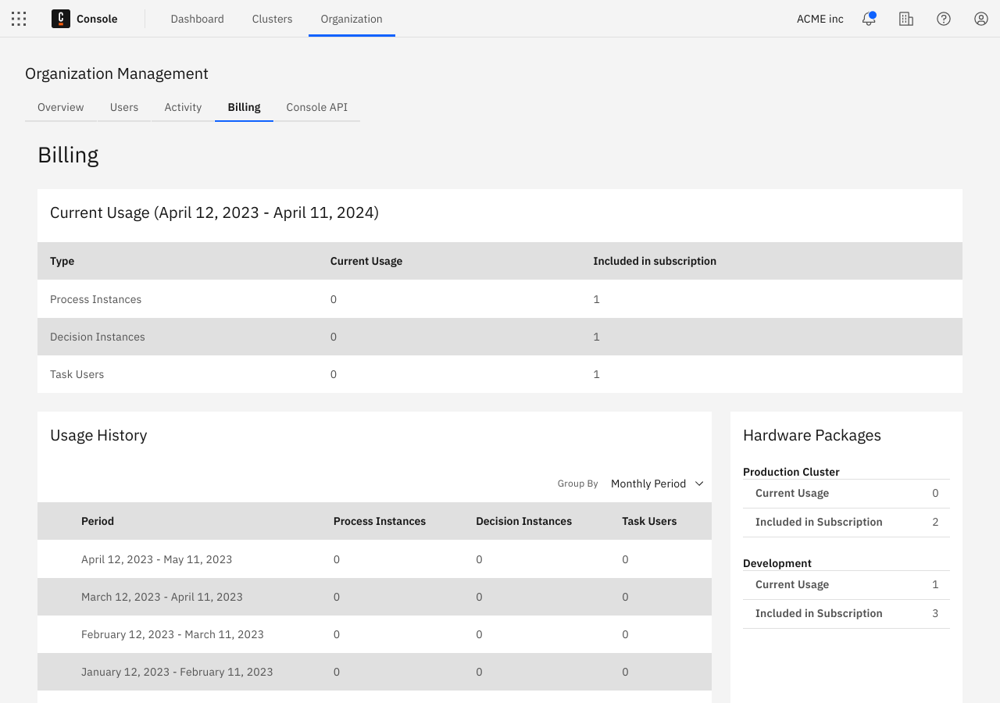

:::note
This setting is only visible in the **Starter plan** for owners and admins.
:::

:::caution Starter plans
The Starter plan is no longer available.

- Existing customers using a Starter plan will need to either upgrade to the Enterprise plan, or move to the Free plan.
- To compare plan features and contact Camunda for advice and an Enterprise plan quote, refer to [Camunda 8 pricing](https://camunda.com/pricing/?utm_source=docs.camunda.io&utm_medium=referral).

:::

Once signed up for the **Starter plan**, you have access to the **Billing** page.

You can access the **Billing** page by selecting **Organization management** in the Camunda Console navigation bar.

## Retrieve invoices

To retrieve your past invoices, click the **Manage subscription** button and then select **Billing history**. From that point onwards, you will be able to retrieve and download your invoices.

## Update billing information (e.g. billing address)

To update account information like billing address or company name, click the **Manage subscription** button and then select **Account information** or **Billing & shipping addresses** depending on what information you need to update.
