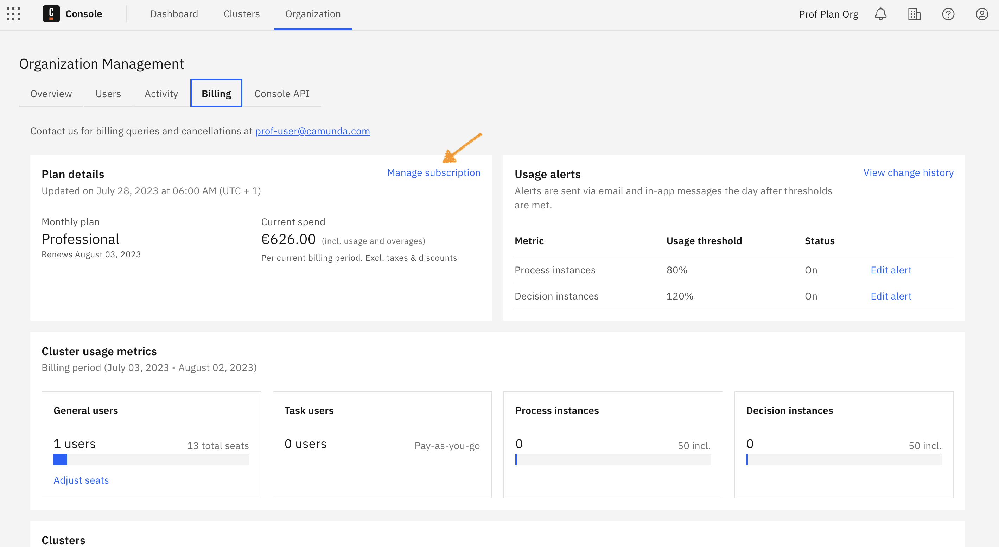
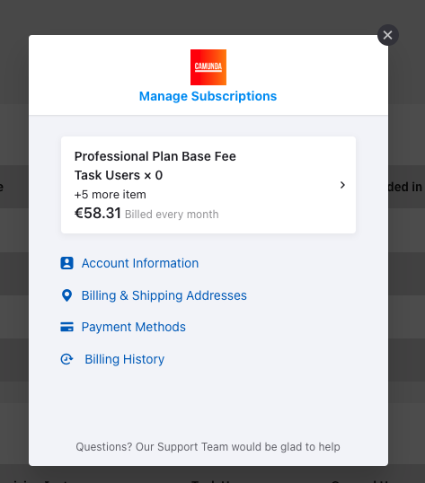
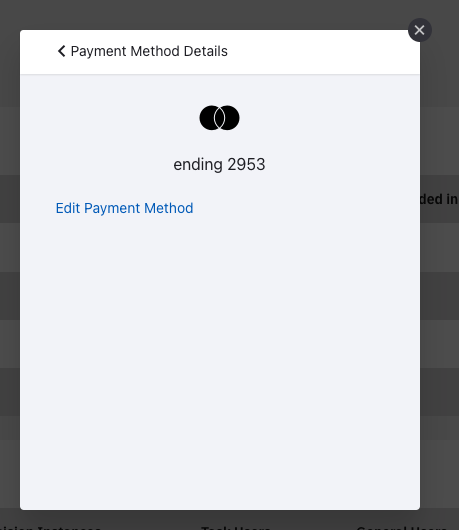
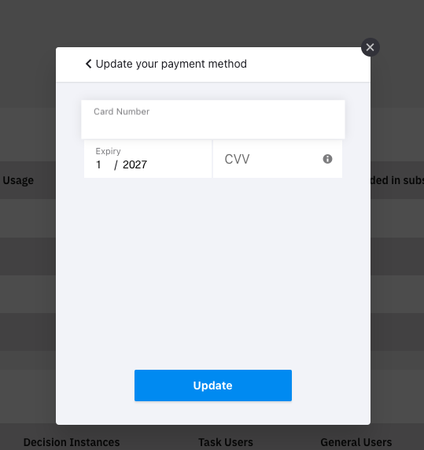

:::note
This setting is only visible in the **Starter plan** for owners and admins.
:::

:::caution Starter plans
The Starter plan is no longer available.

- Existing customers using a Starter plan will need to either upgrade to the Enterprise plan, or move to the Free plan.
- To compare plan features and contact Camunda for advice and an Enterprise plan quote, refer to [Camunda 8 pricing](https://camunda.com/pricing/?utm_source=docs.camunda.io&utm_medium=referral).

:::

When utilizing Camunda's Starter plan, you might need to update an expired or failing credit card.

The steps to update a payment method are as follows:

1. From the Console, click **Organization > Billing > Manage payment account**.

2. Click **Payment methods**.

3. Click **Edit payment method**.

4. Add the details of the new credit card and click **Update**.

