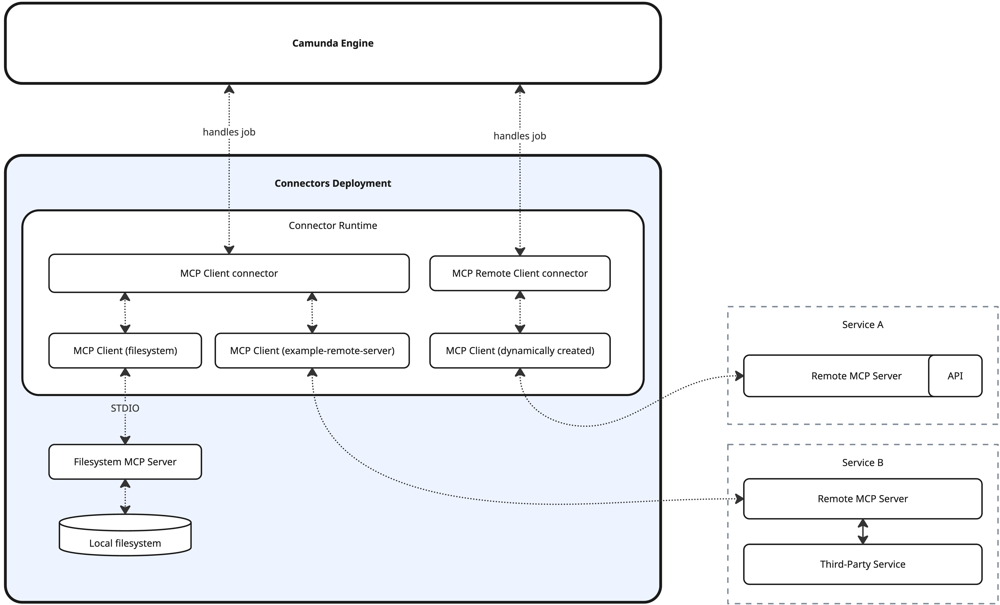

import AoGrid from '../../../react-components/\_ao-card';
import { fundamentalCards } from '../../../react-components/\_mcp-card-data';

Integrate [MCP (Model Context Protocol)](https://modelcontextprotocol.io/) clients with [agentic orchestration](../../../agentic-orchestration/agentic-orchestration-overview.md).

## About

Camunda's MCP Client enables you to use the [AI Agent connector](../../../connectors/out-of-the-box-connectors/agentic-ai-aiagent.md) together with MCP clients to access tools provided by MCP servers.

:::info
The MCP Client supports only tool-related functionality. Other MCP features, such as resources or prompts, are not currently supported.
:::

This includes:

- Locally started standard input/output servers [STDIO](https://modelcontextprotocol.io/specification/2025-11-25/basic/transports#stdio). These are operating system processes launched and managed by the connector runtime.
- Remote MCP servers using [Streamable HTTP](https://modelcontextprotocol.io/specification/2025-11-25/basic/transports#streamable-http) and [HTTP with SSE](https://modelcontextprotocol.io/specification/2024-11-05/basic/transports#http-with-sse) (deprecated).

See the MCP Client architecture below:

## MCP Client connectors

Camunda provides two MCP connectors with distinct purposes.

| Connector                                                       | STDIO       | Remote/HTTP | Configuration                        | Availability                                                                                                | Description                                                                                                            |
| :-------------------------------------------------------------- | :---------- | :---------- | :----------------------------------- | :---------------------------------------------------------------------------------------------------------- | :--------------------------------------------------------------------------------------------------------------------- |
| [MCP Remote Client connector](./mcp-remote-client-connector.md) | Unsupported | Supported   | Properties panel                     | Available on SaaS                                                                                           | Suitable for prototyping with remote MCP servers. Uses on-demand HTTP connections instead of persistent ones.          |
| [MCP Client connector](./mcp-client-connector.md)               | Supported   | Supported   | Connector runtime + properties panel | Not directly available on SaaS, but a custom runtime running the client connector can be connected to SaaS. | Flexible MCP integration based on persistent connections managed by the connector runtime. Supports STDIO MCP servers. |

:::info
The two connectors are not mutually exclusive and can be used together as long as your environment is configured accordingly.
:::

## Learn the fundamentals

Understand the fundamental concepts of the MCP Client.

<AoGrid ao={fundamentalCards} columns={3}/>

## Explore further resources

Dive into practical resources to see the MCP Client in action.

<a href="https://github.com/camunda/connectors/tree/main/connectors/agentic-ai/examples/ai-agent/ad-hoc-sub-process/ai-agent-chat-mcp#readme" class="link-arrow" target="_blank">Try out this example</a>

<a href="https://page.camunda.com/webinar-using-mcp-with-camunda-success" class="link-arrow" target="_blank"> Watch this webinar on using MCP with Camunda</a>

