Self-Managed only

Use Identity to manage Orchestration Cluster tenants and isolate data within a single cluster.

## About tenants

A tenant is a logical boundary for data within a Camunda 8 installation.

This enables multiple teams, departments, or clients to share a single environment while keeping data isolated.

:::tip
To learn more about tenants, see [multi-tenancy](../concepts/multi-tenancy.md).
:::

You can manage your Orchestration Cluster tenants directly in [Identity](identity-introduction.md).

- **Tenancy** is enabled by default.
- **Tenancy checks** are disabled by default. All data maps to the `<default>` tenant.

This allows administrators to set up tenants and assignments before enforcing tenancy checks.

To enable multi-tenancy checks, see [Self-Managed configuration properties](/self-managed/components/orchestration-cluster/core-settings/configuration/properties.md#multi-tenancy).

## Create a tenant

:::note
The `<default>` tenant is automatically created when Identity starts.
:::

1. Log in to Identity and open the **Tenants** tab.

   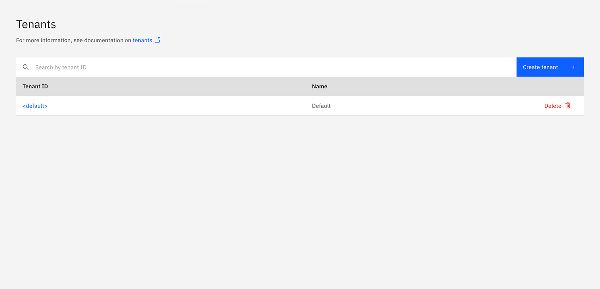

2. Click **Create tenant**. In the modal, provide the tenant **ID**, **name**, and optional **description**. Then click **Create tenant**.

   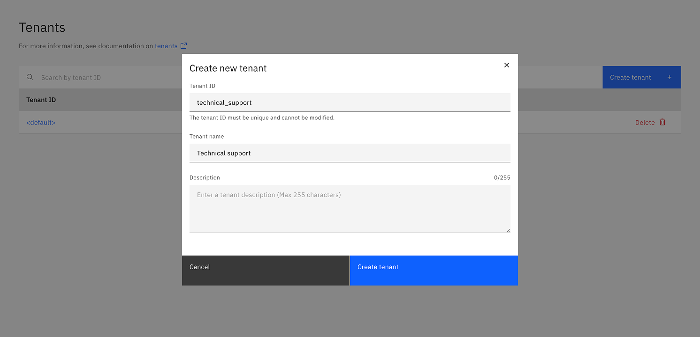

3. The tenant appears in the list. If not, refresh the page.

   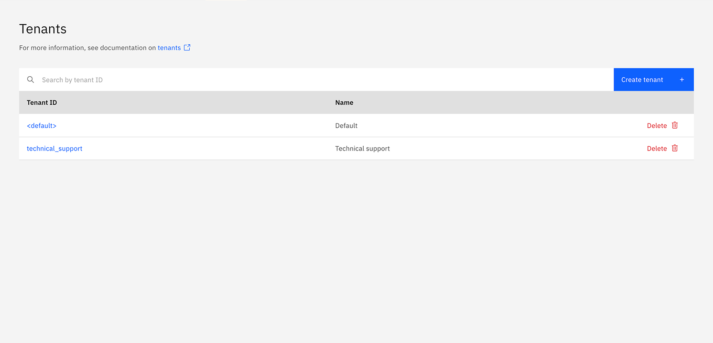

4. Click the tenant to open details and manage assignments.

   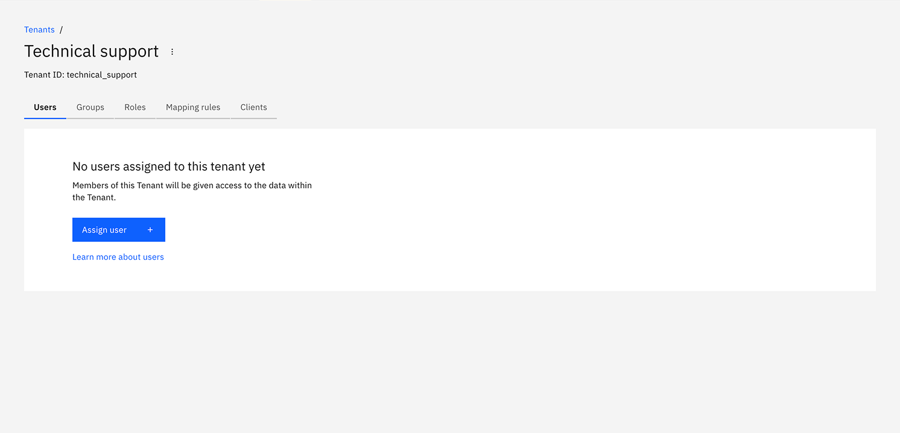

## Update and delete a tenant

Tenants cannot be updated after creation. To change a tenant's details, you must delete the tenant and then create a new tenant with the details you require.

To delete a tenant, click on the **Delete** option in the list of tenants, and confirm the deletion.

:::note
The `<default>` tenant is a system entity and cannot be deleted.
:::

## Tenant assignments

You can assign the following entities to a tenant:

- [Users](user.md)
- [Groups](group.md)
- [Roles](role.md)
- [Mapping rules](mapping-rules.md)
- [Clients](client.md)

You can manage these assignments by selecting the relevant tab on the tenant details page.

### Assign users to a tenant

1. Select the **Users** tab.
2. Click **Assign user**. In the modal, enter the username and confirm. For SaaS deployments, the username field refers to the email address of the user. For Self-Managed deployments, the username field has to match [the value of the claim configured as `username-claim`](/self-managed/components/orchestration-cluster/identity/connect-external-identity-provider.md#step-4-configure-the-oidc-connection-details).

   

3. The user appears in the list after assignment. Refresh the page if needed.

   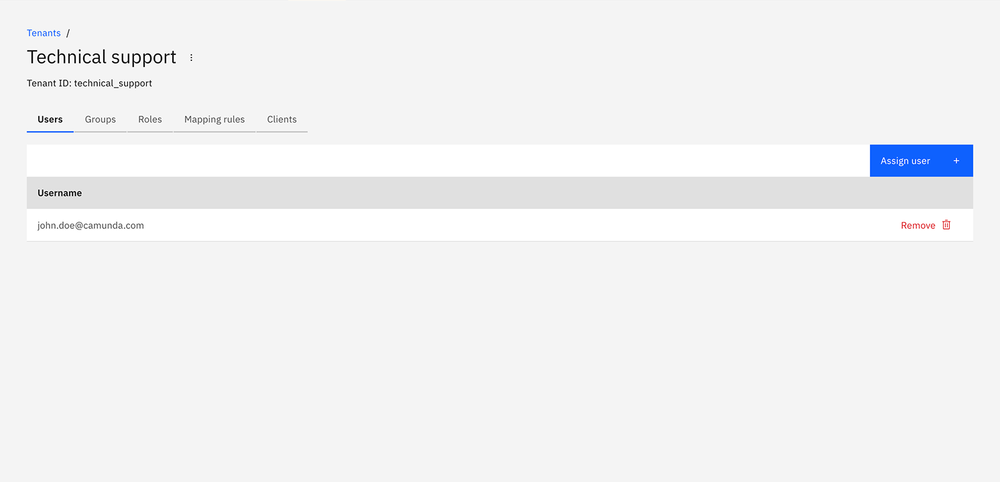

### Assign groups to a tenant

1. Select the **Groups** tab.
2. Click **Assign group**. Search for a group ID and confirm.

   

3. The group appears in the list after assignment. Refresh the page if needed.

   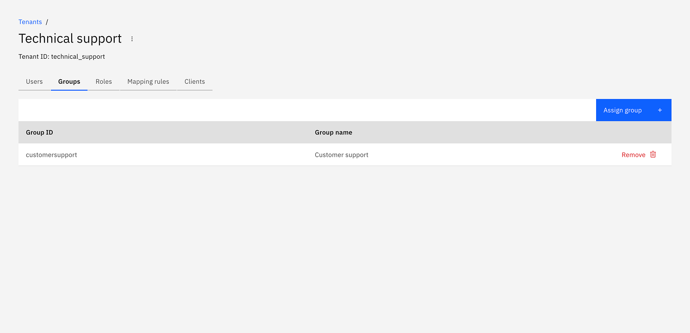

### Assign roles to a tenant

1. Select the **Roles** tab.
2. Click **Assign role**. Search for a role ID and confirm.

   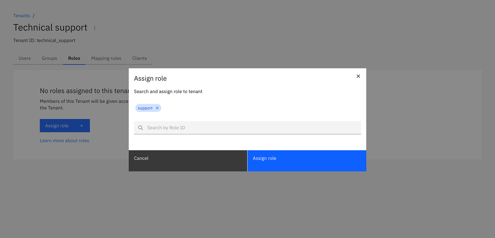

3. The role appears in the list after assignment. Refresh the page if needed.

   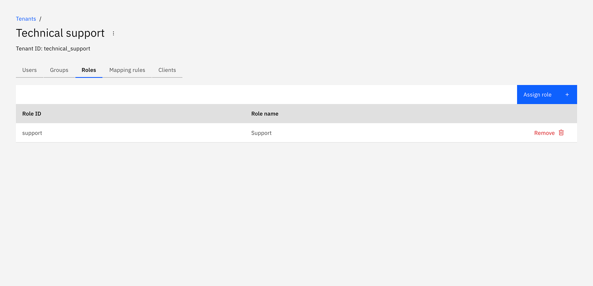

### Assign mapping rules to a tenant

:::note
Assignment of [mapping rules](../concepts/access-control/mapping-rules.md) is only available for [OIDC authentication in Self-Managed](../concepts/access-control/connect-to-identity-provider.md#self-managed).
:::

1. Select the **Mapping rules** tab.
2. Click **Assign mapping rule**. Search for a mapping rule ID and confirm.

   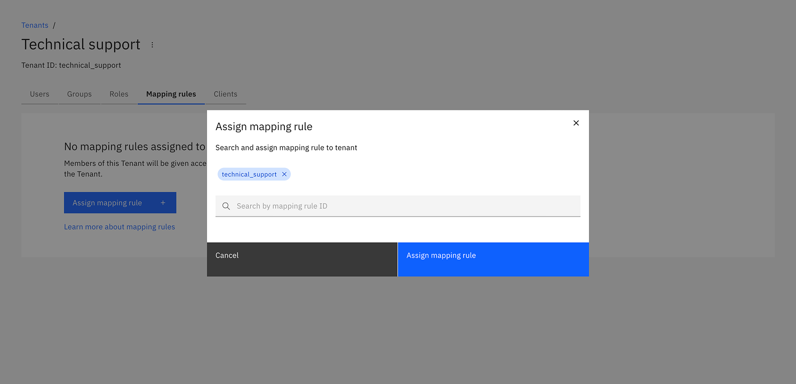

3. The mapping rule appears in the list after assignment. Refresh the page if needed.

   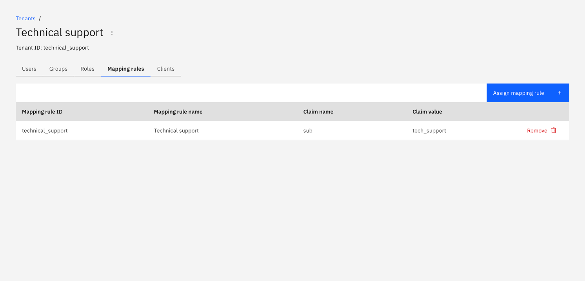

### Assign clients to a tenant

1. Select the **Clients** tab.
2. Click **Assign client**. Enter the client ID and confirm.

   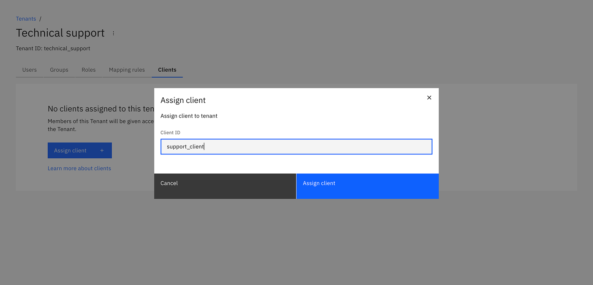

3. The client appears in the list after assignment. Refresh the page if needed.

   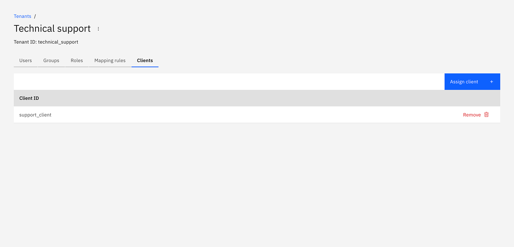
