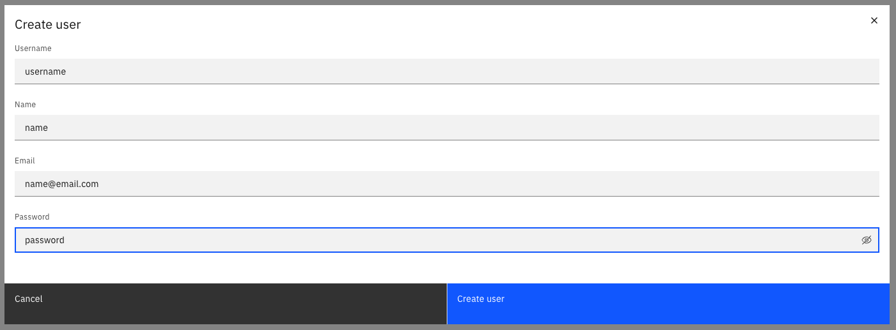
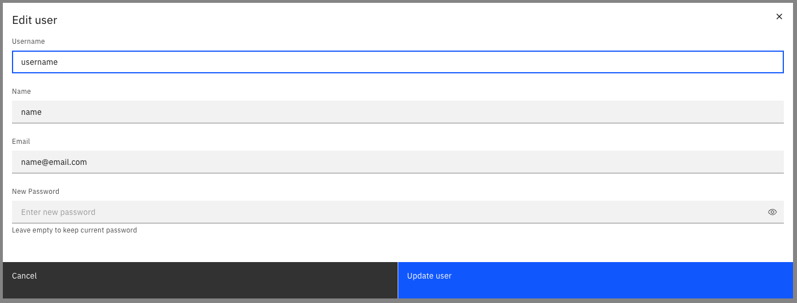

Users are individuals who are granted with access to an orchestration cluster and it's components like Operate, Tasklist and REST API. User management differs depending on whether you are using Camunda 8 SaaS or a Self-Managed installation.

## SaaS

In a SaaS environment, user management is handled through [Camunda 8 Console](/components/console/manage-organization/manage-users.md). From Console, you can invite new users to your organization and manage their roles. For more advanced user management, you can configure [single sign-on (SSO)](/components/console/manage-organization/external-sso.md) to integrate with your own identity provider.

## Self-Managed

For Self-Managed deployments, user management depends on your authentication setup:

- When using **basic authentication**, users are managed through Identity. This involves creating, updating, and deleting them directly in your cluster.
- If you have configured an external [OpenID Connect (OIDC) provider](/self-managed/components/orchestration-cluster/identity/connect-external-identity-provider.md), user management is handled by that provider.

The following sections describe how to manage users in a Self-Managed environment with **basic authentication** enabled.

### Create a user

To create a user:

1. Log in to Identity in your cluster, and click on the **Users** tab.
2. Click on the **Create user** button, and provide the following the user details:
   - **Username**: The username for the user.
   - **Name**: The name of the user.
   - **Email**: The email address of the user.
   - **Password**: The password for the user.
3. Click on the **Create user** button.

The user is created, and can now log in to the Camunda 8 web applications.

### Update a user

1. Log in to Identity in your cluster, and click on the **Users** tab.
2. Click on the **pencil icon** next to the user you want to update.
   :::note
   You can also select the user, and click the three vertical dots > **Update**.
   :::
3. Update the user details:
   - **Name**: The name of the user.
   - **Email**: The email address of the user.
   - **Password**: The password for the user.
4. Click on the **Save** button.

The user details are updated, and the user can now use these credentials to log in.

### Delete a user

1. Log in to Identity in your cluster, and click on the **Users** tab.
2. Click on the **Delete** button next to the user you want to delete.
   :::note
   You can also select the user, and click the three vertical dots > **Delete**.
   :::
3. Confirm the deletion by clicking on the **Delete** button in the confirmation dialog.

The user is deleted, and can no longer log in to the Camunda 8 web applications.

### Assign authorizations to a user

See the [authorization](./authorization.md) section to learn how to create authorizations for users.
