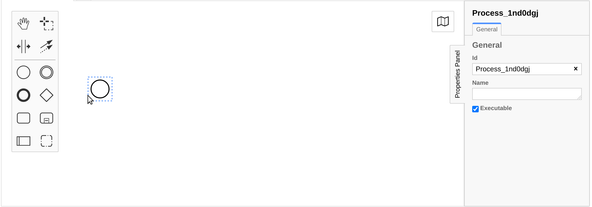
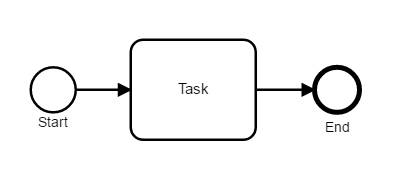
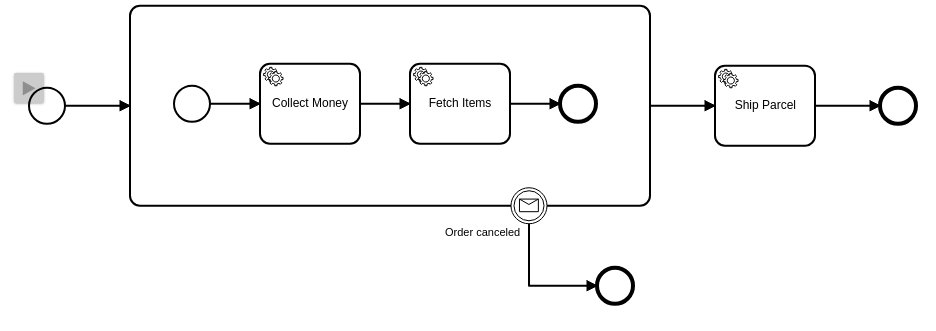

import ReactPlayer from 'react-player'

Business Process Model and Notation 2.0 (BPMN) is an industry standard for process modeling and execution. A BPMN process is an XML document that has a visual representation. For example, here is a BPMN process:


<details>
  <summary>The corresponding XML</summary>
  <p>

```xml
<?xml version="1.0" encoding="UTF-8"?>
<bpmn:definitions xmlns:bpmn="http://www.omg.org/spec/BPMN/20100524/MODEL" xmlns:bpmndi="http://www.omg.org/spec/BPMN/20100524/DI" xmlns:di="http://www.omg.org/spec/DD/20100524/DI" xmlns:dc="http://www.omg.org/spec/DD/20100524/DC" xmlns:xsi="http://www.w3.org/2001/XMLSchema-instance" xmlns:zeebe="http://camunda.org/schema/zeebe/1.0" id="Definitions_1" targetNamespace="http://bpmn.io/schema/bpmn" exporter="Camunda Modeler" exporterVersion="0.1.0">
  <bpmn:process id="Process_1" isExecutable="true">
    <bpmn:startEvent id="StartEvent_1" name="Order Placed">
      <bpmn:outgoing>SequenceFlow_1bq1azi</bpmn:outgoing>
    </bpmn:startEvent>
    <bpmn:sequenceFlow id="SequenceFlow_1bq1azi" sourceRef="StartEvent_1" targetRef="Task_1f47b9v" />
    <bpmn:sequenceFlow id="SequenceFlow_09hqjpg" sourceRef="Task_1f47b9v" targetRef="Task_1109y9g" />
    <bpmn:sequenceFlow id="SequenceFlow_1ea1mpb" sourceRef="Task_1109y9g" targetRef="Task_00moy91" />
    <bpmn:endEvent id="EndEvent_0a27csw" name="Order Delivered">
      <bpmn:incoming>SequenceFlow_0ojoaqz</bpmn:incoming>
    </bpmn:endEvent>
    <bpmn:sequenceFlow id="SequenceFlow_0ojoaqz" sourceRef="Task_00moy91" targetRef="EndEvent_0a27csw" />
    <bpmn:serviceTask id="Task_1f47b9v" name="Collect Money">
      <bpmn:extensionElements>
        <zeebe:taskDefinition type="collect-money" retries="3" />
      </bpmn:extensionElements>
      <bpmn:incoming>SequenceFlow_1bq1azi</bpmn:incoming>
      <bpmn:outgoing>SequenceFlow_09hqjpg</bpmn:outgoing>
    </bpmn:serviceTask>
    <bpmn:serviceTask id="Task_1109y9g" name="Fetch Items">
      <bpmn:extensionElements>
        <zeebe:taskDefinition type="fetch-items" retries="3" />
      </bpmn:extensionElements>
      <bpmn:incoming>SequenceFlow_09hqjpg</bpmn:incoming>
      <bpmn:outgoing>SequenceFlow_1ea1mpb</bpmn:outgoing>
    </bpmn:serviceTask>
    <bpmn:serviceTask id="Task_00moy91" name="Ship Parcel">
      <bpmn:extensionElements>
        <zeebe:taskDefinition type="ship-parcel" retries="3" />
      </bpmn:extensionElements>
      <bpmn:incoming>SequenceFlow_1ea1mpb</bpmn:incoming>
      <bpmn:outgoing>SequenceFlow_0ojoaqz</bpmn:outgoing>
    </bpmn:serviceTask>
  </bpmn:process>
  <bpmndi:BPMNDiagram id="BPMNDiagram_1">
    <bpmndi:BPMNPlane id="BPMNPlane_1" bpmnElement="Process_1">
      <bpmndi:BPMNShape id="_BPMNShape_StartEvent_2" bpmnElement="StartEvent_1">
        <dc:Bounds x="191" y="102" width="36" height="36" />
        <bpmndi:BPMNLabel>
          <dc:Bounds x="175" y="138" width="68" height="12" />
        </bpmndi:BPMNLabel>
      </bpmndi:BPMNShape>
      <bpmndi:BPMNEdge id="SequenceFlow_1bq1azi_di" bpmnElement="SequenceFlow_1bq1azi">
        <di:waypoint xsi:type="dc:Point" x="227" y="120" />
        <di:waypoint xsi:type="dc:Point" x="280" y="120" />
        <bpmndi:BPMNLabel>
          <dc:Bounds x="253.5" y="99" width="0" height="12" />
        </bpmndi:BPMNLabel>
      </bpmndi:BPMNEdge>
      <bpmndi:BPMNEdge id="SequenceFlow_09hqjpg_di" bpmnElement="SequenceFlow_09hqjpg">
        <di:waypoint xsi:type="dc:Point" x="380" y="120" />
        <di:waypoint xsi:type="dc:Point" x="440" y="120" />
        <bpmndi:BPMNLabel>
          <dc:Bounds x="410" y="99" width="0" height="12" />
        </bpmndi:BPMNLabel>
      </bpmndi:BPMNEdge>
      <bpmndi:BPMNEdge id="SequenceFlow_1ea1mpb_di" bpmnElement="SequenceFlow_1ea1mpb">
        <di:waypoint xsi:type="dc:Point" x="540" y="120" />
        <di:waypoint xsi:type="dc:Point" x="596" y="120" />
        <bpmndi:BPMNLabel>
          <dc:Bounds x="568" y="99" width="0" height="12" />
        </bpmndi:BPMNLabel>
      </bpmndi:BPMNEdge>
      <bpmndi:BPMNShape id="EndEvent_0a27csw_di" bpmnElement="EndEvent_0a27csw">
        <dc:Bounds x="756" y="102" width="36" height="36" />
        <bpmndi:BPMNLabel>
          <dc:Bounds x="734" y="142" width="81" height="12" />
        </bpmndi:BPMNLabel>
      </bpmndi:BPMNShape>
      <bpmndi:BPMNEdge id="SequenceFlow_0ojoaqz_di" bpmnElement="SequenceFlow_0ojoaqz">
        <di:waypoint xsi:type="dc:Point" x="696" y="120" />
        <di:waypoint xsi:type="dc:Point" x="756" y="120" />
        <bpmndi:BPMNLabel>
          <dc:Bounds x="726" y="99" width="0" height="12" />
        </bpmndi:BPMNLabel>
      </bpmndi:BPMNEdge>
      <bpmndi:BPMNShape id="ServiceTask_0lao700_di" bpmnElement="Task_1f47b9v">
        <dc:Bounds x="280" y="80" width="100" height="80" />
      </bpmndi:BPMNShape>
      <bpmndi:BPMNShape id="ServiceTask_0eetpqx_di" bpmnElement="Task_1109y9g">
        <dc:Bounds x="440" y="80" width="100" height="80" />
      </bpmndi:BPMNShape>
      <bpmndi:BPMNShape id="ServiceTask_09won99_di" bpmnElement="Task_00moy91">
        <dc:Bounds x="596" y="80" width="100" height="80" />
      </bpmndi:BPMNShape>
    </bpmndi:BPMNPlane>
  </bpmndi:BPMNDiagram>
</bpmn:definitions>
```

  </p>
</details>

This duality makes BPMN very powerful. The XML document contains all the necessary information to be interpreted by workflow engines and modeling tools like Zeebe. At the same time, the visual representation contains just enough information to be quickly understood by humans, even when they are non-technical people. The BPMN model is source code and documentation in one artifact.

The following is an introduction to BPMN 2.0, its elements, and their execution semantics. It tries to briefly provide an intuitive understanding of BPMN's power, but does not cover the entire feature set. For more exhaustive BPMN resources, refer to the [reference links](#additional-resources) at the end of this section.

## Modeling BPMN diagrams

The best tool for modeling BPMN diagrams for Zeebe is [Modeler](../about-modeler.md).



- [Download page](https://camunda.com/download/modeler/)
- [Source code repository](https://github.com/camunda/camunda-modeler)

## BPMN elements

### Sequence flow: Controlling the flow of execution

A core concept of BPMN is a **sequence flow** that defines the order in which steps in the process happen. In BPMN's visual representation, a sequence flow is an arrow connecting two elements. The direction of the arrow indicates their order of execution.



You can think of process execution as tokens running through the process model. When a process is started, a token is created at the beginning of the model and advances with every completed step. When the token reaches the end of the process, it is consumed and the process instance ends. Zeebe's task is to drive the token and to make sure the job workers are invoked whenever necessary.

<center>
<ReactPlayer
playing
loop
playsinline
height="200px"
url={[
{src: '/videos/sequenceflow.mp4', type: 'video/mp4'}
]}
/>
</center>

### Tasks: Units of work

The basic elements of BPMN processes are tasks; these are atomic units of work composed to create a meaningful result. Whenever a token reaches a task, the token stops and Zeebe creates a job and notifies a registered worker to perform work. When that handler signals completion, the token continues on the outgoing sequence flow.

<center>
<ReactPlayer
playing
loop
playsinline
height="300px"
url={[
{src: '/videos/tasks.mp4', type: 'video/mp4'}
]}
/>
</center>

Choosing the granularity of a task is up to the person modeling the process. For example, the activity of processing an order can be modeled as a single _Process Order_ task, or as three individual tasks _Collect Money_, _Fetch Items_, _Ship Parcel_. If you use Zeebe to orchestrate microservices, one task can represent one microservice invocation.

Refer to the [tasks](tasks.md) section on which types of tasks are currently supported and how to use them.

### Gateways: Steering flow

Gateways are elements that route tokens in more complex patterns than plain sequence flow.

BPMN's **exclusive gateway** chooses one sequence flow out of many based on data:

<center>
<ReactPlayer
playing
loop
playsinline
height="300px"
url={[
{src: '/videos/exclusive-gw.mp4', type: 'video/mp4'}
]}
/>
</center>

BPMN's **parallel gateway** generates new tokens by activating multiple sequence flows in parallel:

<center>
<ReactPlayer
playing
loop
playsinline
height="300px"
url={[
{src: '/videos/parallel-gw.mp4', type: 'video/mp4'}
]}
/>
</center>

Refer to the [gateways](gateways.md) section on which types of gateways are currently supported and how to use them.

### Events: Waiting for something to happen

**Events** in BPMN represent things that _happen_. A process can react to events (_catching_ event) as well as emit events (_throwing_ event). For example:

<center>
<ReactPlayer
playing
loop
playsinline
height="300px"
url={[
{src: '/videos/catch-event.mp4', type: 'video/mp4'}
]}
/>
</center>

The circle with the envelope symbol is a catching message event. It makes the token continue as soon as a message is received. The XML representation of the process contains the criteria for which kind of message triggers continuation.

Events can be added to the process in various ways. Not only can they be used to make a token wait at a certain point, but also for interrupting a token's progress.

Refer to the [events](events.md) section on which types of events are currently supported and how to use them.

### Subprocesses: Grouping elements

**Subprocesses** are element containers that allow defining common functionality. For example, we can attach an event to a subprocess's border:



When the event is triggered, the subprocess is interrupted, regardless which of its elements is currently active.

Refer to the [subprocesses](subprocesses.md) section on which types of subprocesses are currently supported and how to use them.

## Additional resources

- [BPMN specification](http://www.bpmn.org/)
- [BPMN tutorial](https://camunda.com/bpmn/)
- [Full BPMN reference](https://camunda.com/bpmn/reference/)
- [BPMN book](https://www.amazon.com/dp/1086302095/)
