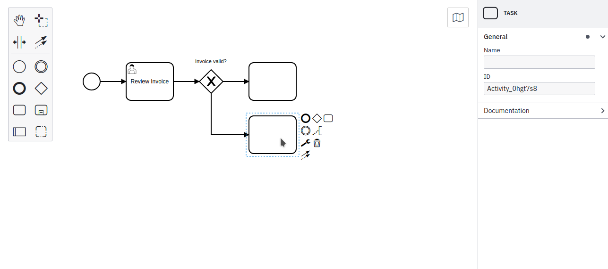
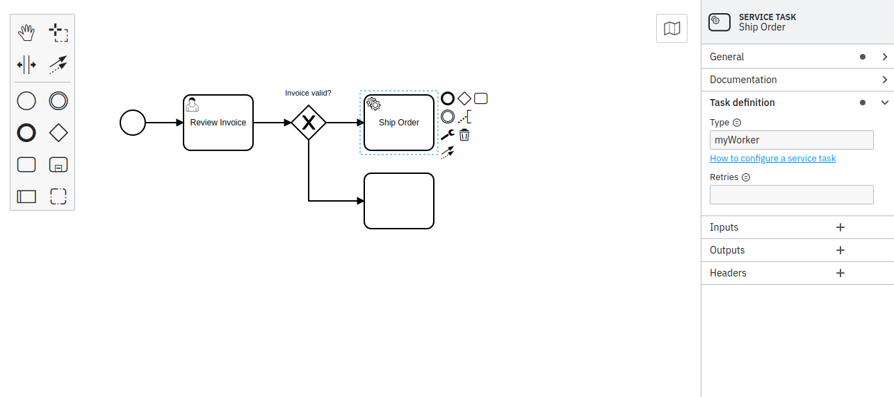

**Business Process Model and Notation (BPMN)** was developed as a graphical notation to represent complex processes. It is maintained by the non-profit [The Object Management Group (OMG)](https://www.omg.org/spec/BPMN/) and employed by numerous organizations globally. The visual nature of BPMN enables greater collaboration between different teams, particularly within Modeler.

:::note
BPMN diagrams must be created for the process engine they intend to be deployed on. You cannot run a BPMN diagram modeled for Camunda 7 in Camunda 8, or vice versa, at this time.
:::

## Start modeling

Web and Desktop Modeler both offer a similar core BPMN 2.0 Modeling experience:

- Add BPMN elements from the palette on the left side of the page by dragging and dropping them onto the diagram canvas.
- Change the type of element in place by clicking on an element to reveal the context menu. Then, click the wrench icon to change the type of element to a [service task](./service-tasks/service-tasks.md) or [user task](./user-tasks/user-tasks.md), for example.

## Creating BPMN elements

Using BPMN in Modeler, you can create more BPMN 2.0 elements like task types and event definitions.

For example, [service tasks](/components/modeler/bpmn/service-tasks/service-tasks.md) within Camunda 8 require you to set a task type and implement [job workers](/components/concepts/job-workers.md) to perform a particular task in a process.

Review [the BPMN 2.0 coverage documentation](docs/components/modeler/bpmn/bpmn-coverage.md) for a complete list of BPMN elements supported by our modeling tools.

Additionally, visit [creating readable process models](/components/best-practices/modeling/creating-readable-process-models.md) for general guidelines on modeling with BPMN.

## BPMN 2.0 properties for execution

In the properties panel on the right side, view and edit attributes that apply to the selected element.
