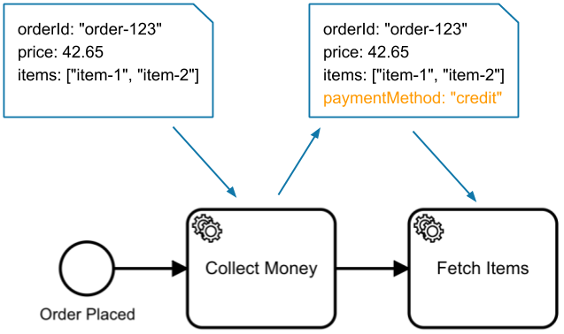
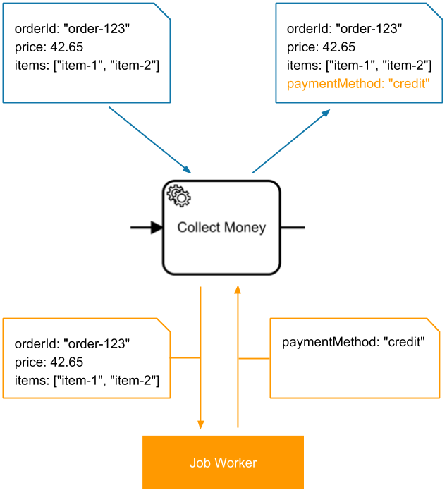
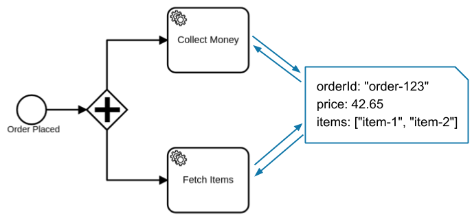

Every BPMN process instance can have one or more variables.

Variables are key-value-pairs and hold the contextual data of the process instance required by job workers to do their work, or to decide which sequence flows to take. They can be provided when a process instance is created, when a job is completed, and when a message is correlated.

## Job workers

By default, a job worker gets all variables of a process instance; it can limit the data by
providing a list of required variables as **fetchVariables**.

The worker uses the variables to do its work. When the work is done, it completes the job. If the
result of the work is needed by follow-up tasks, the worker sets the variables while completing
the job. These variables [merge](/components/concepts/variables.md#variable-propagation) into the
process instance.

If the job worker expects the variables in a different format or under different names, the variables can be transformed by defining **input mappings** in the process. **Output mappings** can be used to transform the job variables before merging them into the process instance.

## Variable scopes vs. token-based data

A process can have concurrent paths; for example, when using a parallel gateway. When the execution reaches the parallel gateway, new tokens are created which execute the following paths concurrently.

Since the variables are part of the process instance and not of the token, they can be read globally from any token. If a token adds a variable or modifies the value of a variable, the changes are also visible to concurrent tokens.

The visibility of variables is defined by the **variable scopes** of the process.

## Concurrency considerations

When multiple active activities exist in a process instance (i.e. there is a form of concurrent
execution like usage of a parallel gateway, multiple outgoing sequence flows, or a parallel
multi-instance marker), you may need to take extra care in dealing with variables. When variables
are altered by one activity, it might also be accessed and altered by another at the same time. Race
conditions can occur in such processes.

We recommend taking care when writing variables in a parallel flow. Make sure the variables are
written to the correct [variable scope](/components/concepts/variables.md#variable-scopes) using variable
mappings and make sure to complete jobs and publish messages only with the minimum required
variables.

These type of problems can be avoided by:

- Passing only updated variables
- Using output variable mappings to customize the variable propagation
- Using an embedded subprocess and input variable mappings to limit the visibility and propagation of variables

## Additional resources

- [Job handling](/components/concepts/job-workers.md)
- [Variables](/components/concepts/variables.md)
- [Input/output variable mappings](/components/concepts/variables.md#inputoutput-variable-mappings)
- [Variable scopes](/components/concepts/variables.md#variable-scopes)
