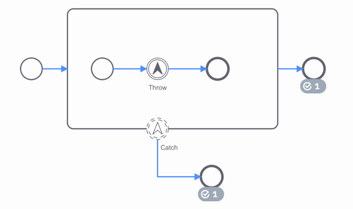

Escalation events are events which reference a named escalation, and are used to communicate to a higher flow scope.
Unlike an error, an escalation event is non-critical and execution continues at the location of throwing.



The example above shows the execution of an escalation event:

1. The process reaches the `Throw` event.
2. This throws an escalation to a higher flow scope.
3. The escalation is caught by the `Catch` event.
4. As escalation events are non-critical, the outgoing sequence flows of `Throw` and `Catch` are both taken.

## Defining an escalation

In BPMN, an `escalation event` references an `escalation`. Escalations can be referenced by one or more escalation events.

An escalation must define an `escalationCode`. The value of this `escalationCode` is used to determine which catch event can catch the thrown escalation.

For escalation throw events, it is possible to define the `escalationCode` as [an `expression` or a static value](/components/concepts/expressions.md#expressions-vs-static-values). If an `escalationCode` expression is configured then it will be evaluated once the event is reached, and used to throw the escalation.

For escalation catch events `escalationCode` must be [a static value](/components/concepts/expressions.md#expressions-vs-static-values).
Alternatively an escalation catch event may omit the escalation reference all together. In this case it catches **all** thrown escalations.

## Throwing the escalation

An escalation can be thrown by an escalation end event, or by an intermediate escalation throw event. Escalation events
are non-critical. This means that if the throwing event has any outgoing sequence flows, they will be taken.

## Catching the escalation

An escalation can be caught using a boundary event, or using an event subprocess. It is caught by one catch event at most, and this will be the catch event in the nearest parent flow scope.

It is not possible to define multiple escalation catch events with the same `escalationCode` in a single scope. It is also not permitted to have multiple escalation catch-all events in a single scope. However, it is possible to define both an escalation catch event referencing an escalation with a particular `escalationCode` and an escalation catch-all event within the same scope. When this happens, the escalation catch event
that matches the `escalationCode` is prioritized.

If there are no escalation catch events that match the `escalationCode`, the escalation will not be caught. Unlike with
[error events](../error-events/error-events.md), no incident is raised. The process will continue without escalating.

Even though escalations are non-critical, it is still possible make escalation catch events interrupting. This will
behave the same as other interrupting events. The catch event will terminate the scope it is attached to. In this case,
the outgoing sequence flows of the throwing escalation event are not taken.

## Additional resources

### XML representation

An intermediate escalation throw event with expression:

```xml
<bpmn:intermediateThrowEvent id="StartEvent_1">
    <bpmn:escalationEventDefinition id="EscalationEventDefinition_0sdm9od" escalationRef="Escalation_2alpsjo" />
</bpmn:intermediateThrowEvent>

<bpmn:escalation id="Escalation_2alpsjo" name="Escalation_2alpsjo" escalationCode="=escalationCode" />
```

An escalation boundary catch event:

```xml
<bpmn:boundaryEvent id="Event_1wpcmdz" cancelActivity="false" attachedToRef="Activity_1q7i1lv">
    <bpmn:escalationEventDefinition id="EscalationEventDefinition_1fpge5i" escalationRef="Escalation_2alpsjo" />
</bpmn:boundaryEvent>

<bpmn:escalation id="Escalation_2alpsjo" name="Escalation_2alpsjo" escalationCode="escalationCode" />
```

A escalation boundary catch-all event:

```xml
<bpmn:boundaryEvent id="Event_1wpcmdz" cancelActivity="false" attachedToRef="Activity_1q7i1lv">
    <bpmn:escalationEventDefinition id="EscalationEventDefinition_1fpge5i" />
</bpmn:boundaryEvent>
```
