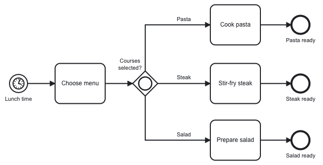
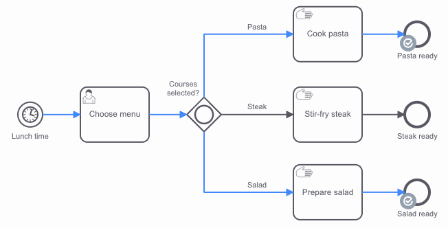
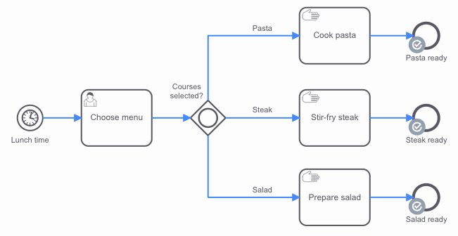
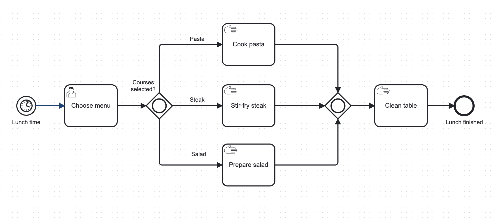

The inclusive gateway (or OR-gateway) allows for making multiple decisions based on data or process instance variables. Inclusive gateways can be diverging (a sequence flow is split into multiple paths) or converging (split paths are merged before continuing).



If an inclusive gateway has multiple outgoing sequence flows, all sequence flows must have a condition to define when the flow is taken. If the inclusive gateway only has one outgoing sequence flow, then it does not need to have a condition.

Optionally, one of the sequence flows can be marked as the default flow. This sequence flow should not have a condition, because its behavior depends on the other conditions.

When an inclusive gateway is entered, the conditions are evaluated. The process instance takes all sequence flows where the condition is fulfilled.

For example: Courses selected include `pasta` and `salad`.



For example: Courses selected include `steak`, `pasta` and `salad`.



If no condition is fulfilled, it takes the **default flow** of the gateway. Note that the default flow is not expected to have a condition, and is therefore not evaluated. If no condition is fulfilled and the gateway has no default flow, an [incident](/components/concepts/incidents.md) is created.

For example: No courses selected then the default flow is taken.


A converging inclusive gateway (also known as a merging or joining inclusive gateway) merges incoming paths before the sequence flow continues. A converging gateway is completed and merges incoming sequence flows if one of the following conditions is met:

- All incoming sequence flows have been taken at least once.
- No path exists from any active flow node to the inclusive gateway (excluding incoming paths to the inclusive gateway that have already been taken).

For example: Once all selected courses are complete, the table can be cleared.



## Conditions

A `conditionExpression` defines when a flow is taken. It is a [boolean expression](/components/modeler/feel/language-guide/feel-boolean-expressions.md) that can access the process instance variables and compare them with literals or other variables. The condition is fulfilled when the expression returns `true`.

Multiple boolean values or comparisons can be combined as disjunction (`and`) or conjunction (`or`).

For example:

```feel
= totalPrice > 100

= order.customer = "Paul"

= orderCount > 15 or totalPrice > 50

= valid and orderCount > 0

= list contains(courses, "salad")
```

## Additional resources

### XML representation

An inclusive gateway with three outgoing sequence flows and the default sequence flow is `Salad`:

```xml
<bpmn:inclusiveGateway id="Gateway_1dj8ts6" name="Courses selected?" default="Flow_05d0jjq">
      <bpmn:incoming>Flow_0mfam08</bpmn:incoming>
      <bpmn:outgoing>Flow_0d3xogt</bpmn:outgoing>
      <bpmn:outgoing>Flow_1le3l31</bpmn:outgoing>
      <bpmn:outgoing>Flow_05d0jjq</bpmn:outgoing>
</bpmn:inclusiveGateway>
<bpmn:sequenceFlow id="Flow_0d3xogt" name="Pasta"
    sourceRef="Gateway_1dj8ts6" targetRef="Activity_1orhxob">
    <bpmn:conditionExpression xsi:type="bpmn:tFormalExpression">
       = list contains(courses, "pasta")
    </bpmn:conditionExpression>
</bpmn:sequenceFlow>
<bpmn:sequenceFlow id="Flow_1le3l31" name="Steak"
    sourceRef="Gateway_1dj8ts6" targetRef="Activity_0rygy6z">
    <bpmn:conditionExpression xsi:type="bpmn:tFormalExpression">
      = list contains(courses, "steak")
    </bpmn:conditionExpression>
</bpmn:sequenceFlow>
<bpmn:sequenceFlow id="Flow_05d0jjq" name="Salad"
    sourceRef="Gateway_1dj8ts6" targetRef="Activity_06yrt1e" />
```

### References

- [Conditions](/components/modeler/bpmn/inclusive-gateways/inclusive-gateways.md#conditions)
- [Incidents](/components/concepts/incidents.md)
