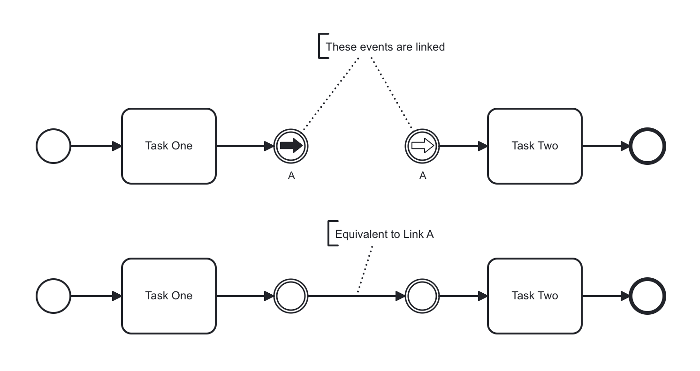
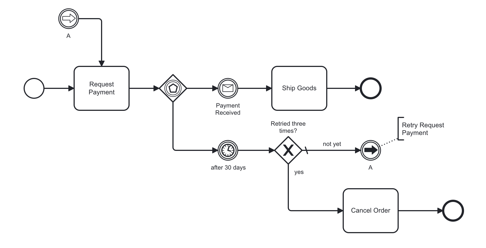

Link events are intermediate events that connect two sections of a process.

They have no significance related to content, but facilitate the diagram-creation process.

:::tip
You can use link events to create loops, to skip sections of a process, or to simplify the sequence flow lines in the diagram.
:::

Link events have a throwing link event as the "exit point", and a catching link event as the "re-entrance point".
They are linked together by their link name.
Multiple throwing link events can link to the same catching link event.
A throwing link event cannot link to multiple catching link events.

In practice, two paired link events function the same as two [intermediate none events] connected via a sequence flow.



Link events can be very useful if you draw comprehensive process diagrams with many sequence flows.
Links help avoid what otherwise might look like a “spaghetti” diagram.
In the example below, a retry loop is created using the link events pair `A`.



:::info Link events are limited to a single scope
Link events can only be used to link sections of a process within the same scope.
I.e., they can only exist together on the root process level or within the same subprocess.

Similarly, a sequence flow cannot be drawn between flow nodes at different scopes.
For example, a task in the root process level cannot connect to another task in a subprocess using a sequence flow.
Link events have the same limitation.
:::

## Additional resources

### XML representation

A manual task:

```xml
<bpmn:intermediateThrowEvent id="Throw_Link_Event_A" name="A">
  <bpmn:linkEventDefinition id="ThrowLinkEventDefinition" name="A" />
</bpmn:intermediateThrowEvent>
<bpmn:intermediateCatchEvent id="Catch_Link_Event_A" name="A">
  <bpmn:linkEventDefinition id="CatchLinkEventDefinition" name="A" />
</bpmn:intermediateCatchEvent>
```

### References

- [Intermediate none events]

[intermediate none events]: ../none-events/none-events.md#intermediate-none-events-throwing
