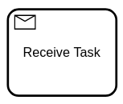

Receive tasks reference a message; these are used to wait until a proper message is received.



When a receive task is entered, a corresponding message subscription is created. The process instance stops at this point and waits until the message is correlated.

A message can be published using one of the Zeebe clients. When the message is correlated, the receive task is completed and the process instance continues.

:::note
An alternative to receive tasks is [a message intermediate catch event](../message-events/message-events.md), which behaves the same way but can be used together with event-based gateways.
:::

## Messages

A message can be referenced by one or more receive tasks; it must define the name of the message (e.g. `Money collected`) and the `correlationKey` expression (e.g. `= orderId`).

Usually, the name of the message is defined as a [static value](/components/concepts/expressions.md#expressions-vs-static-values) (e.g. `order canceled`), but it can also be defined as [expression](/components/concepts/expressions.md) (e.g. `= "order " + awaitingAction`). The expression is evaluated on activating the receive task and must result in a `string`.

The `correlationKey` is an expression that usually [accesses a variable](/components/modeler/feel/language-guide/feel-variables.md#access-variable) of the process instance that holds the correlation key of the message. The expression is evaluated on activating the receive task and must result either in a `string` or `number`.

To correlate a message to the receive task, the message is published with the defined name (e.g. `Money collected`) and the value of the `correlationKey` expression. For example, if the process instance has a variable `orderId` with value `"order-123"`, the message is published with the correlation key `"order-123"`.

## Variable mappings

Output variable mappings are used to customize how variables are merged into the process instance.
These can contain multiple elements that specify which variables should be mapped.
The `Process Variable Name` of an output denotes the variable name outside the activity.

Visit our documentation on [input and output variable mappings](/components/concepts/variables.md#inputoutput-variable-mappings) for more information on this topic.

## Additional resources

### XML representation

A receive task with message definition:

```xml
<bpmn:message id="Message_1iz5qtq" name="Money collected">
   <bpmn:extensionElements>
     <zeebe:subscription correlationKey="=orderId" />
   </bpmn:extensionElements>
</bpmn:message>

<bpmn:receiveTask id="money-collected" name="Money collected"
  messageRef="Message_1iz5qtq">
</bpmn:receiveTask>
```

### References

- [Message correlation](/components/concepts/messages.md)
- [Expressions](/components/concepts/expressions.md)
- [Variable mappings](/components/concepts/variables.md#inputoutput-variable-mappings)
- [Incidents](/components/concepts/incidents.md)
