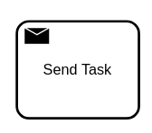

A send task is used to model the publication of a message to an external system; for example, to a
Kafka topic or a mail server.



Send tasks behave exactly like [service tasks](/components/modeler/bpmn/service-tasks/service-tasks.md). Both task
types are based on jobs and [job workers](/components/concepts/job-workers.md). The
differences between these task types are the visual representation (i.e. the task marker) and the
semantics for the model.

When a process instance enters a send task, it creates a corresponding job and waits for its
completion. A job worker should request jobs of this job type and process them. When the job is
complete, the process instance continues.

:::note

Jobs for send tasks are not processed by Zeebe itself. To process them, provide
a job worker.

:::

## Defining a task

A send task must define a [job type](/components/modeler/bpmn/service-tasks/service-tasks.md#task-definition) the same
way as a service task does. It specifies the type of job that workers should subscribe to (e.g. `kafka` or `mail`).

Use [task headers](/components/modeler/bpmn/service-tasks/service-tasks.md#task-headers) to pass static parameters to the job
worker (e.g. the name of the topic to publish the message to).

Define [variable mappings](/components/concepts/variables.md#inputoutput-variable-mappings)
the [same way as a service task does](/components/modeler/bpmn/service-tasks/service-tasks.md#variable-mappings)
to transform the variables passed to the job worker, or to customize how the variables of the job merge.

## Additional resources

:::tip Community Extension

Review the [Kafka Connect Zeebe](https://github.com/camunda-community-hub/kafka-connect-zeebe). This is a
community extension that provides a job worker to publish messages to a Kafka topic. You can run it,
or use it as a blueprint for your own job worker.

:::

### XML representation

A script task with a custom header:

```xml
<bpmn:sendTask id="publish-message" name="Publish message">
  <bpmn:extensionElements>
    <zeebe:taskDefinition type="kafka" />
    <zeebe:taskHeaders>
      <zeebe:header key="kafka-topic" value="payment" />
    </zeebe:taskHeaders>
  </bpmn:extensionElements>
</bpmn:sendTask>
```

### References

- [Job handling](/components/concepts/job-workers.md)
- [Variable mappings](/components/concepts/variables.md#inputoutput-variable-mappings)
