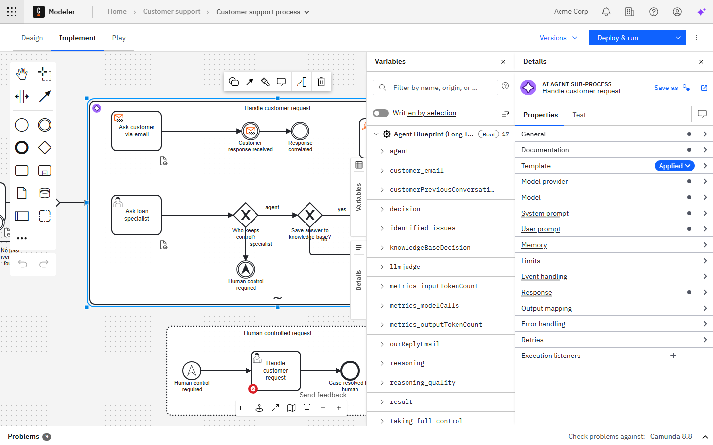
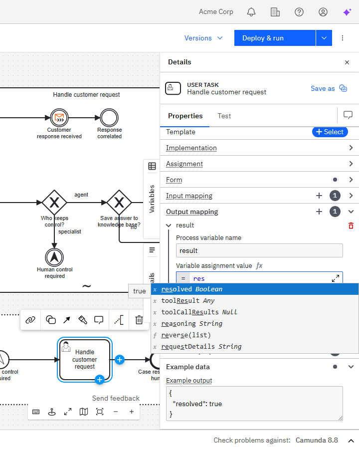

Process data in Camunda is represented by [variables](/components/concepts/variables.md). A variable has a name and a JSON value, and its visibility is determined by its [variable scope](/components/concepts/variables.md#variable-scopes).

BPMN processes do not have an explicit data model or schema. Instead, variables are created implicitly during process execution — for example, when a process instance is started with variables, when a [job worker](/components/concepts/job-workers.md) completes a job, when a message is correlated, or when [input/output variable mappings](/components/concepts/variables.md#inputoutput-variable-mappings) are applied.

Because there is no formal schema, the modeler infers the available variables by analyzing what is defined in the process diagram itself. This page explains how that works, and how you can help the modeler provide better editor support.

## How the modeler discovers variables

The modeler scans the process diagram and collects variables from the definitions it finds, such as:

- Input and output mappings defined on elements (the `target` expressions create variables).
- Result variables and result expressions on [service tasks](/components/modeler/bpmn/service-tasks/service-tasks.md), [business rule tasks](/components/modeler/bpmn/business-rule-tasks/business-rule-tasks.md), and [script tasks](/components/modeler/bpmn/script-tasks/script-tasks.md).
- Form field bindings on [user tasks](/components/modeler/bpmn/user-tasks/user-tasks.md) linked to [Camunda Forms](/components/modeler/forms/camunda-forms-reference.md).
- Example data added to elements (see [Defining example data](#defining-example-data) below).

The discovered variables are used in the following places:

- FEEL editor suggestions — when writing [expressions](/components/concepts/expressions.md), the FEEL editor suggests variables in scope for the current element.
- The **Variables** panel — an overview of all variables found in the diagram (see [Inspecting variables](#inspecting-variables)).

:::note
The modeler can only discover variables that are explicitly defined in the diagram. Variables created at runtime — for example, by [job workers](/components/concepts/job-workers.md), passed as process start variables, or set through the API — are **not** visible in the modeler unless you define them explicitly using [example data](#defining-example-data).
:::

## Inspecting variables

The **Variables** panel helps you explore the variables in your process. Use it to understand which variables are visible in a given scope, where they are written, and what values they hold.

### Selecting elements

The list of variables shown in the panel depends on the element or elements you have selected on the canvas. When you select one or more elements, the panel displays all variables in the scope of those elements, including variables from parent scopes (for example, a sub-process scope or the process scope).

If no element is selected, the panel shows variables at the process level.

### Filtering variables

Use the search bar at the top of the panel to filter the displayed list of variables by name.

To show only the variables written by the selected elements, enable the **Written by selection** toggle.

### Variable details

Expand a variable to see its details:

- **Written by** — lists all elements in the diagram that write to this variable.
- **Value** — shows the value of the variable, if it can be determined from the diagram.

## Defining example data

Camunda 8 only

To help with editor support, you can add example data to an element. Add a JSON return value in the **Data** section of the properties panel. The values are used to derive variable names and types in the FEEL editor. Nested objects are also supported.

Providing this data is optional, but it's recommended if you want to take full advantage of the FEEL editor's suggestions. It is especially useful for variables that the modeler cannot discover automatically, such as variables created by [job workers](/components/concepts/job-workers.md) or passed as process start variables.

This data will also be used while [playing your process](/components/modeler/web-modeler/collaboration/play-your-process.md) to set variables from the respective elements when performing the following actions:

- Starting a new instance
- Completing a job
- Publishing a message with variables

:::note
The provided example data is only used by the FEEL editor to provide variable suggestions while modeling, and by Play to prefill variables. It is not used during process execution.
:::

Data provided this way is added to the scope of the element. To use the data in other parts of your process, you can use [output mappings](/components/concepts/variables.md#output-mappings) to make the variables available in the parent scope.

## Next steps

- Learn about [variables](/components/concepts/variables.md), including variable scopes, propagation, and input/output variable mappings.
- Explore how to [access variables in expressions](/components/modeler/feel/language-guide/feel-variables.md).
