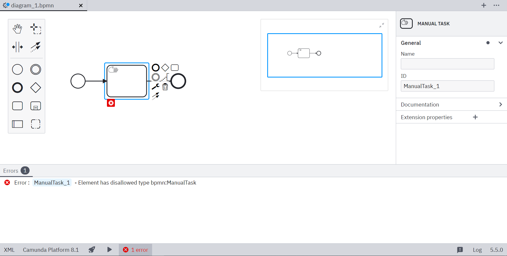

Through Camunda Modeler plugins, you can add custom lint rules and configure or disable existing rules. [`bpmnlint`](https://github.com/bpmn-io/bpmnlint) is used to validate BPMN diagrams, so the plugins have to be [`bpmnlint` plugins](https://github.com/bpmn-io/bpmnlint#writing--consuming-custom-rules) at the core.

## Getting started

Get started with the [custom-linter-rules-plugin template](https://github.com/camunda/camunda-modeler-custom-linter-rules-plugin) and take the following steps:

1. Clone or fork the repository:

```
git clone https://github.com/camunda/camunda-modeler-custom-linter-rules-plugin.git
```

The plugin starter project comes with a client folder referenced in the [plugin entry point](../plugins#plugin-entry-point). It contains the script that adds a `bpmnlint` plugin to the modeler. Since this is a [client plugin](../plugins#extend-the-modeler-and-its-bpmn-and-dmn-components), you must bundle it.

2. Install the dependencies with the following command:

```
npm install
```

3. Add a custom rule. To do this, add it to the [`bpmnlint-plugin-custom/rules`](https://github.com/camunda/camunda-modeler-custom-linter-rules-plugin/tree/master/bpmnlint-plugin-custom/rules) folder. The example project contains a [`no-manual-task.js`](https://github.com/camunda/camunda-modeler-custom-linter-rules-plugin/blob/master/bpmnlint-plugin-custom/rules/no-manual-task.js) file which implements a custom rule.

Every rule must export a function that returns an object with a `check` function:

```javascript
/**
 * Rule that reports manual tasks being used.
 */
module.exports = function () {
  function check(node, reporter) {
    if (is(node, "bpmn:ManualTask")) {
      reporter.report(node.id, "Element has disallowed type bpmn:ManualTask");
    }
  }

  return {
    check: check,
  };
};
```

This function is called for every node when `bpmnlint` traverses the [model](https://github.com/bpmn-io/bpmn-moddle/).

4. Change the configuration. Through the configuration in [.bpmnlintrc](https://github.com/camunda/camunda-modeler-custom-linter-rules-plugin/blob/master/.bpmnlintrc), you can add the custom rules you implemented in [`bpmnlint-plugin-custom/rules`](https://github.com/camunda/camunda-modeler-custom-linter-rules-plugin/tree/master/bpmnlint-plugin-custom/rules).

```javascript
{
  "extends": [
    "bpmnlint:recommended",
    "plugin:custom/recommended"
  ],
  "rules": {
    "label-required": "off",
    "custom/no-manual-task": "warn"
  }
}
```

The example configuration adds all rules specified in the [`recommended`](https://github.com/camunda/camunda-modeler-custom-linter-rules-plugin/blob/master/bpmnlint-plugin-custom/index.js) configuration of the `bpmnlint` plugin. It also adds [all the rules that come with `bpmnlint`](https://github.com/bpmn-io/bpmnlint/tree/master/rules) and configures two rules.

5. Bundle your plugin by running the following command:

```
npm run build
```

The custom lint rules and configuration will be used when validating a BPMN diagram.



## Additional resources

- [Example plugin](https://github.com/camunda/camunda-modeler-custom-linter-rules-plugin)
- [bpmnlint](https://github.com/bpmn-io/bpmnlint)
