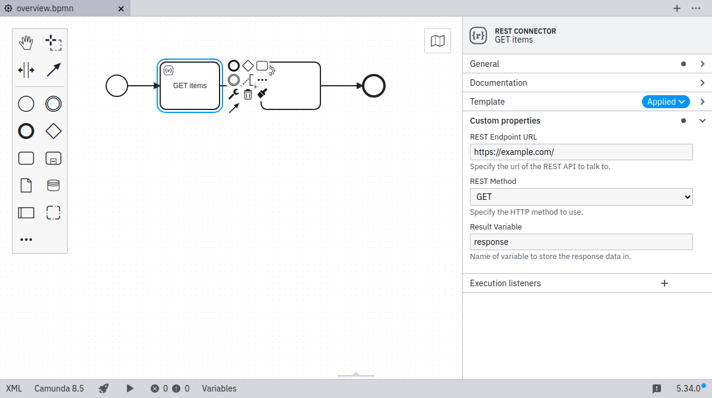

:::note
Element templates are currently available in BPMN diagrams only.
:::

Element templates are a way to extend the [modeler](https://camunda.org/bpmn/tool/) with domain-specific diagram elements, such as service and user tasks.

Applicable element templates can be assigned to a BPMN element via the properties panel on the right side of the screen and/or the replace menu.

Applying an element template configures the diagram element with pre-defined values for BPMN properties, input/output mappings, and extension properties.

As seen in the _REST Connector_ example above, it also provides custom editing UI, input validation, and assistance.

## Creating and editing element templates

You can edit element templates in any text editor. With the [JSON schema](defining-templates.md#json-schema-compatibility), you may get additional editing support like formatting, code completion, and error highlighting.

Connector templates are a specific kind of element template and get a visual preview and editing support in [Web Modeler](/components/connectors/manage-connector-templates.md).
